# 安全配置

<cite>
**本文档引用的文件**   
- [TokenManager.java](file://datavines-core/src/main/java/io/datavines/core/utils/TokenManager.java)
- [CryptionUtils.java](file://datavines-common/src/main/java/io/datavines/common/utils/CryptionUtils.java)
- [PasswordFilterUtils.java](file://datavines-common/src/main/java/io/datavines/common/utils/PasswordFilterUtils.java)
- [SensitiveDataConverter.java](file://datavines-common/src/main/java/io/datavines/common/log/SensitiveDataConverter.java)
- [application.yaml](file://datavines-server/src/main/resources/application.yaml)
- [server-logback.xml](file://datavines-server/src/main/resources/server-logback.xml)
- [AuthenticationInterceptor.java](file://datavines-server/src/main/java/io/datavines/server/api/inteceptor/AuthenticationInterceptor.java)
- [KaptchaConfig.java](file://datavines-server/src/main/java/io/datavines/server/api/config/KaptchaConfig.java)
- [VerificationUtil.java](file://datavines-server/src/main/java/io/datavines/server/utils/VerificationUtil.java)
- [AccessTokenService.java](file://datavines-server/src/main/java/io/datavines/server/repository/service/AccessTokenService.java)
- [AccessTokenController.java](file://datavines-server/src/main/java/io/datavines/server/api/controller/AccessTokenController.java)
- [DataVinesSwaggerConfig.java](file://datavines-server/src/main/java/io/datavines/server/api/config/DataVinesSwaggerConfig.java)
- [EmailSlasHandlerPlugin.java](file://datavines-notification/datavines-notification-plugins/datavines-notification-plugin-email/src/main/java/io/datavines/notification/plugin/email/EmailSlasHandlerPlugin.java)
- [EMailSender.java](file://datavines-notification/datavines-notification-plugins/datavines-notification-plugin-email/src/main/java/io/datavines/notification/plugin/email/EMailSender.java)
- [docker-compose.yaml](file://deploy/compose/docker-compose.yaml)
</cite>

## 目录
1. [简介](#简介)
2. [用户认证机制](#用户认证机制)
3. [权限控制](#权限控制)
4. [敏感数据加密与保护](#敏感数据加密与保护)
5. [API访问控制](#api访问控制)
6. [安全参数配置](#安全参数配置)
7. [敏感信息安全管理](#敏感信息安全管理)
8. [网络安全措施](#网络安全措施)
9. [安全审计与日志记录](#安全审计与日志记录)
10. [部署安全建议](#部署安全建议)

## 简介
DataVines是一个数据质量监控平台，提供了全面的安全机制来保护系统和数据安全。本文档详细说明了DataVines的安全配置选项，包括用户认证、权限控制、敏感数据加密、API访问控制等核心安全功能。系统采用JWT（JSON Web Token）作为主要的用户认证机制，结合验证码、密码策略等多重安全措施，确保系统的安全性。同时，平台提供了敏感数据加密存储、日志脱敏、SQL注入防护等安全特性，为用户提供了一个安全可靠的数据质量管理环境。

## 用户认证机制

DataVines采用基于JWT的用户认证机制，通过TokenManager类实现Token的生成、验证和管理。系统支持多种认证方式，包括用户名密码认证和访问令牌认证。

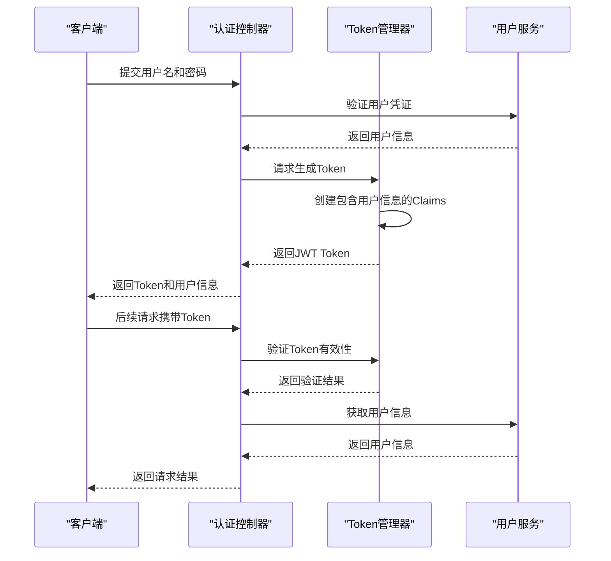

**图示来源**
- [TokenManager.java](file://datavines-core/src/main/java/io/datavines/core/utils/TokenManager.java#L42-L50)
- [AuthenticationInterceptor.java](file://datavines-server/src/main/java/io/datavines/server/api/inteceptor/AuthenticationInterceptor.java#L89-L98)

## 权限控制

DataVines实现了基于注解的权限控制机制，通过AuthIgnore和CheckTokenExist注解来管理API接口的访问权限。系统采用拦截器模式，在请求处理前进行权限验证。

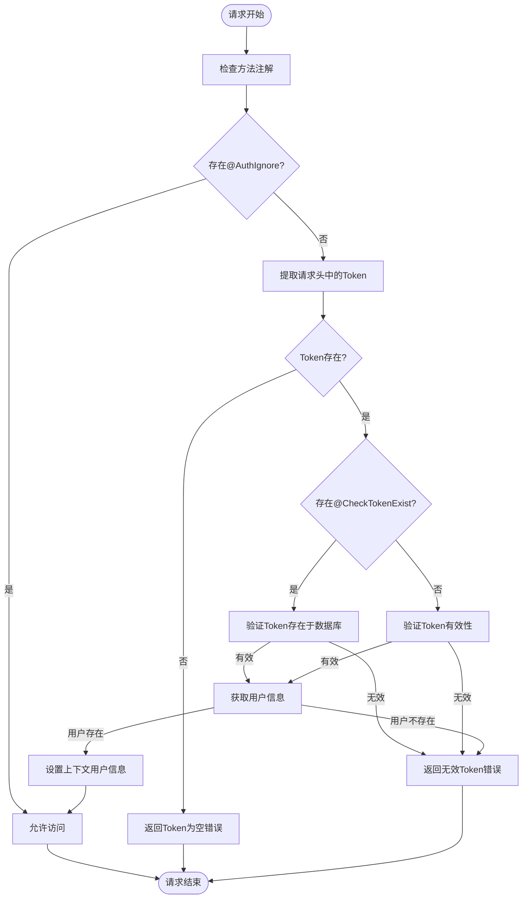

**图示来源**
- [AuthenticationInterceptor.java](file://datavines-server/src/main/java/io/datavines/server/api/inteceptor/AuthenticationInterceptor.java#L54-L104)
- [AuthIgnore.java](file://datavines-server/src/main/java/io/datavines/server/api/annotation/AuthIgnore.java)
- [CheckTokenExist.java](file://datavines-server/src/main/java/io/datavines/server/api/annotation/CheckTokenExist.java)

**本节来源**
- [AuthenticationInterceptor.java](file://datavines-server/src/main/java/io/datavines/server/api/inteceptor/AuthenticationInterceptor.java#L42-L116)
- [AuthIgnore.java](file://datavines-server/src/main/java/io/datavines/server/api/annotation/AuthIgnore.java)
- [CheckTokenExist.java](file://datavines-server/src/main/java/io/datavines/server/api/annotation/CheckTokenExist.java)

## 敏感数据加密与保护

DataVines提供了多层次的敏感数据保护机制，包括数据加密存储、日志脱敏和敏感参数过滤。

### 数据加密存储
系统使用AES加密算法对敏感数据进行加密存储，确保即使数据库被非法访问，敏感信息也不会泄露。

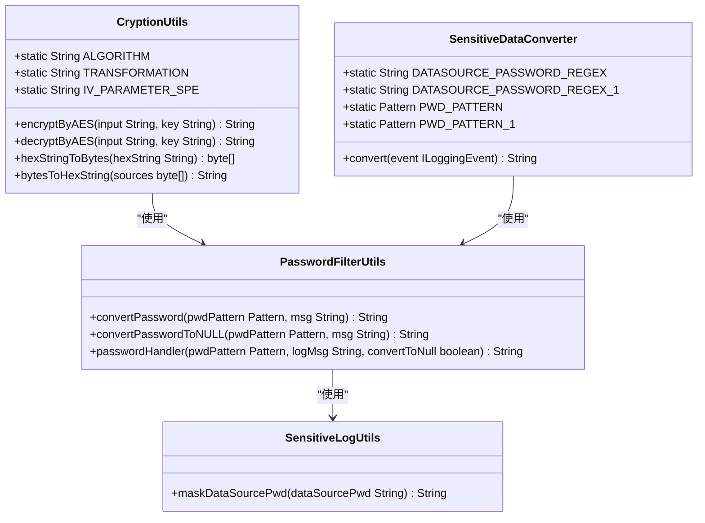

**图示来源**
- [CryptionUtils.java](file://datavines-common/src/main/java/io/datavines/common/utils/CryptionUtils.java#L27-L31)
- [PasswordFilterUtils.java](file://datavines-common/src/main/java/io/datavines/common/utils/PasswordFilterUtils.java#L25-L76)
- [SensitiveDataConverter.java](file://datavines-common/src/main/java/io/datavines/common/log/SensitiveDataConverter.java#L34-L49)
- [SensitiveLogUtils.java](file://datavines-common/src/main/java/io/datavines/common/utils/SensitiveLogUtils.java#L30-L35)

### 日志脱敏
系统通过Logback的自定义转换器实现日志脱敏，自动将日志中的密码等敏感信息替换为掩码。

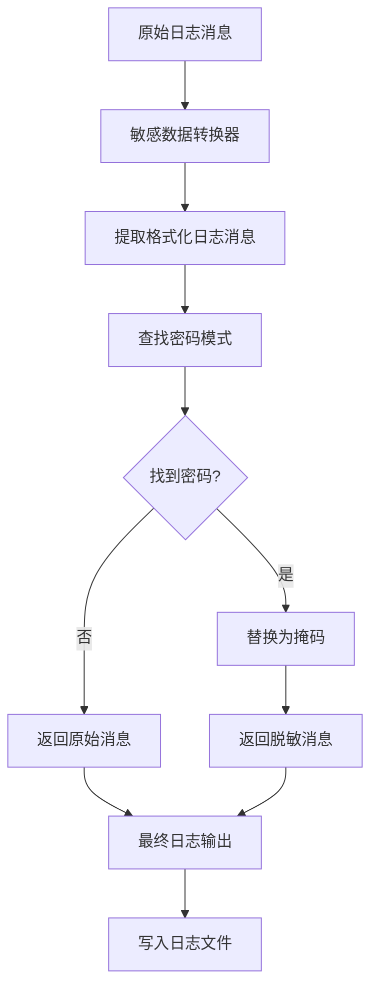

**图示来源**
- [SensitiveDataConverter.java](file://datavines-common/src/main/java/io/datavines/common/log/SensitiveDataConverter.java#L51-L58)
- [server-logback.xml](file://datavines-server/src/main/resources/server-logback.xml#L33-L34)

**本节来源**
- [CryptionUtils.java](file://datavines-common/src/main/java/io/datavines/common/utils/CryptionUtils.java#L26-L84)
- [PasswordFilterUtils.java](file://datavines-common/src/main/java/io/datavines/common/utils/PasswordFilterUtils.java#L25-L76)
- [SensitiveDataConverter.java](file://datavines-common/src/main/java/io/datavines/common/log/SensitiveDataConverter.java#L29-L60)
- [SensitiveLogUtils.java](file://datavines-common/src/main/java/io/datavines/common/utils/SensitiveLogUtils.java#L24-L38)

## API访问控制

DataVines通过Swagger集成和API网关模式实现API访问控制，确保只有授权用户才能访问特定的API接口。

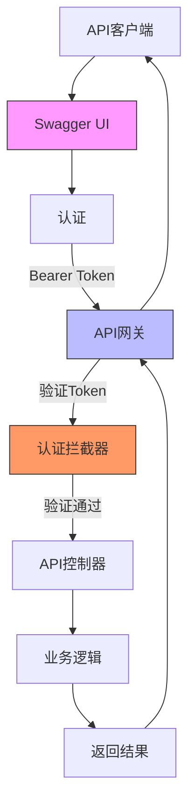

**图示来源**
- [DataVinesSwaggerConfig.java](file://datavines-server/src/main/java/io/datavines/server/api/config/DataVinesSwaggerConfig.java#L42-L50)
- [AuthenticationInterceptor.java](file://datavines-server/src/main/java/io/datavines/server/api/inteceptor/AuthenticationInterceptor.java)

**本节来源**
- [DataVinesSwaggerConfig.java](file://datavines-server/src/main/java/io/datavines/server/api/config/DataVinesSwaggerConfig.java#L19-L72)
- [AuthenticationInterceptor.java](file://datavines-server/src/main/java/io/datavines/server/api/inteceptor/AuthenticationInterceptor.java#L42-L116)

## 安全参数配置

DataVines提供了丰富的安全参数配置选项，允许管理员根据安全需求进行定制化配置。

### 验证码配置
系统支持图形验证码功能，通过Kaptcha库生成验证码图片，并使用JWT保护验证码的安全传输。

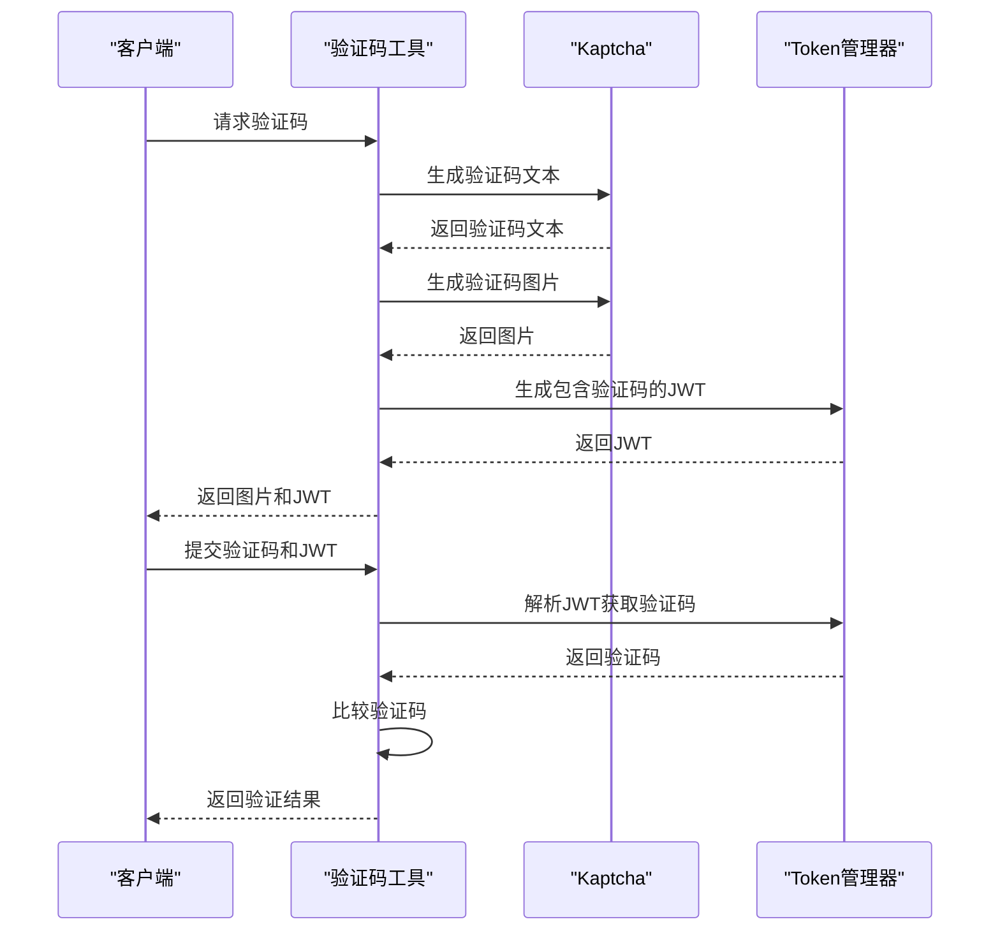

**图示来源**
- [VerificationUtil.java](file://datavines-server/src/main/java/io/datavines/server/utils/VerificationUtil.java#L52-L112)
- [KaptchaConfig.java](file://datavines-server/src/main/java/io/datavines/server/api/config/KaptchaConfig.java#L29-L36)

### 会话超时配置
系统通过JWT的过期时间机制实现会话超时控制，管理员可以在配置文件中设置Token的有效期。

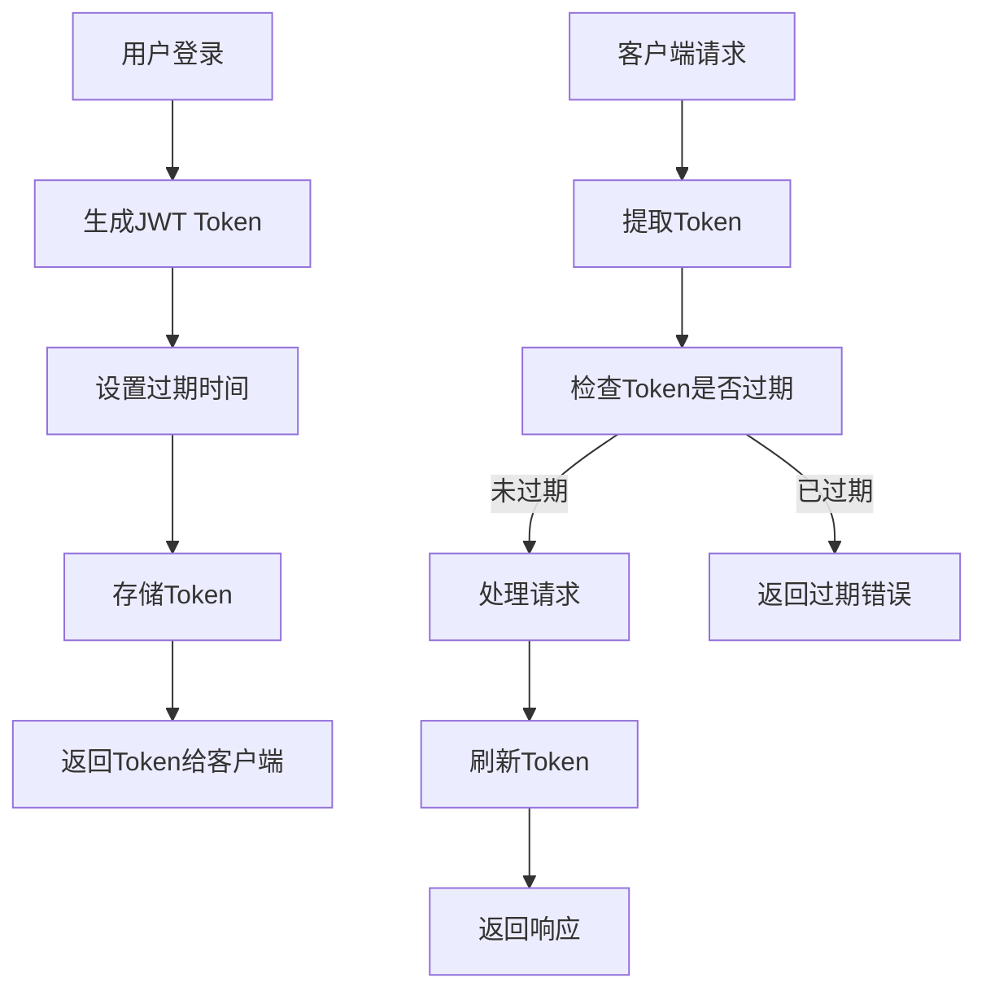

**图示来源**
- [TokenManager.java](file://datavines-core/src/main/java/io/datavines/core/utils/TokenManager.java#L45-L46)
- [RefreshTokenAop.java](file://datavines-core/src/main/java/io/datavines/core/aop/RefreshTokenAop.java#L57-L58)

**本节来源**
- [KaptchaConfig.java](file://datavines-server/src/main/java/io/datavines/server/api/config/KaptchaConfig.java#L29-L36)
- [VerificationUtil.java](file://datavines-server/src/main/java/io/datavines/server/utils/VerificationUtil.java#L52-L112)
- [TokenManager.java](file://datavines-core/src/main/java/io/datavines/core/utils/TokenManager.java#L42-L46)
- [application.yaml](file://datavines-server/src/main/resources/application.yaml#L42-L46)

## 敏感信息安全管理

DataVines提供了全面的敏感信息安全管理机制，确保数据库密码、API密钥等敏感信息的安全存储和管理。

### 访问令牌管理
系统支持创建和管理访问令牌，允许用户为不同的应用场景创建具有特定有效期的访问令牌。

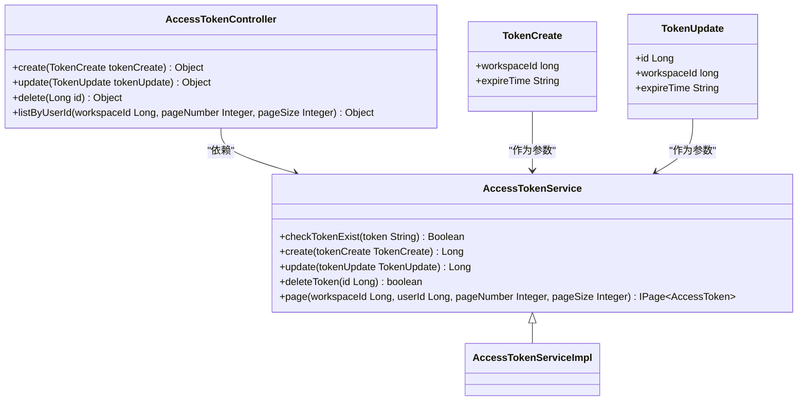

**图示来源**
- [AccessTokenService.java](file://datavines-server/src/main/java/io/datavines/server/repository/service/AccessTokenService.java#L28-L39)
- [AccessTokenController.java](file://datavines-server/src/main/java/io/datavines/server/api/controller/AccessTokenController.java#L59-L68)

### 数据库连接安全
系统对数据库连接参数进行特殊处理，过滤可能的安全风险参数，如autoDeserialize等。

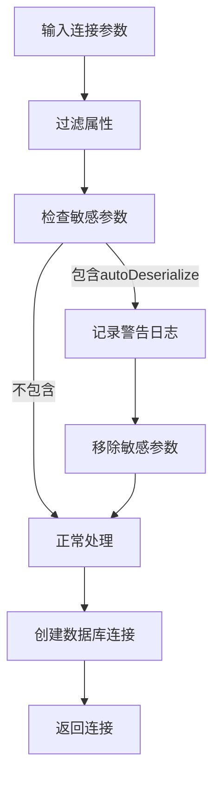

**图示来源**
- [PostgreSqlDataSourceInfo.java](file://datavines-connector/datavines-connector-plugins/datavines-connector-postgresql/src/main/java/io/datavines/connector/plugin/PostgreSqlDataSourceInfo.java#L60-L74)

**本节来源**
- [AccessTokenService.java](file://datavines-server/src/main/java/io/datavines/server/repository/service/AccessTokenService.java#L28-L39)
- [AccessTokenServiceImpl.java](file://datavines-server/src/main/java/io/datavines/server/repository/service/impl/AccessTokenServiceImpl.java#L116-L124)
- [AccessTokenController.java](file://datavines-server/src/main/java/io/datavines/server/api/controller/AccessTokenController.java#L59-L68)
- [PostgreSqlDataSourceInfo.java](file://datavines-connector/datavines-connector-plugins/datavines-connector-postgresql/src/main/java/io/datavines/connector/plugin/PostgreSqlDataSourceInfo.java#L60-L74)

## 网络安全措施

DataVines实施了多项网络安全措施，包括HTTPS配置、CSRF防护和SQL注入防护。

### HTTPS配置
虽然代码库中未直接显示HTTPS配置，但系统通过标准的Spring Boot配置方式支持HTTPS。

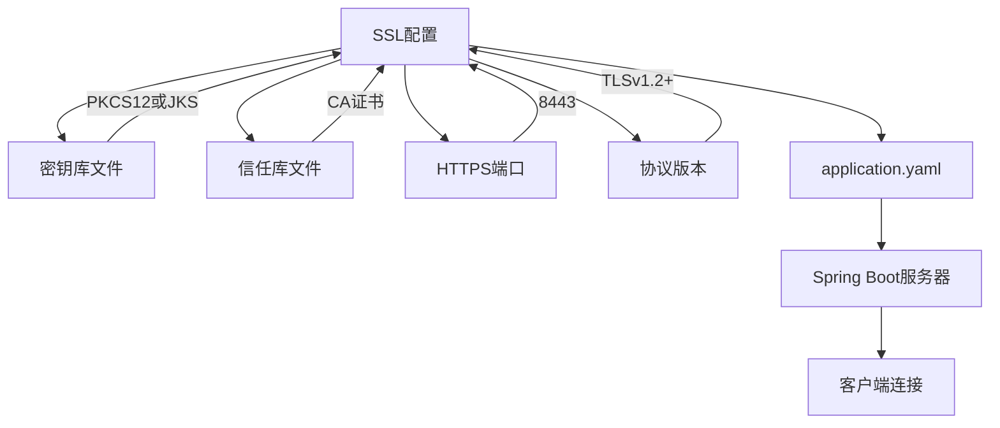

**本节来源**
- [application.yaml](file://datavines-server/src/main/resources/application.yaml)

### SQL注入防护
系统通过MyBatis Plus框架和参数化查询防止SQL注入攻击，同时对用户输入进行严格验证。

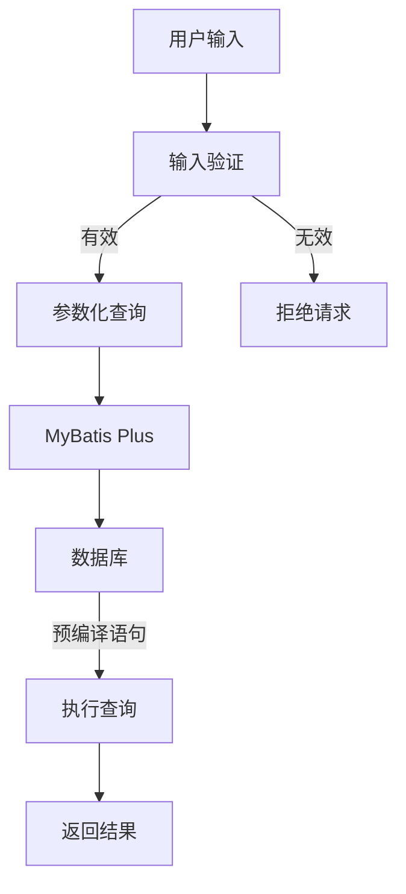

**本节来源**
- [mybatis-plus配置](file://datavines-server/src/main/resources/application.yaml#L64-L68)
- [输入验证逻辑](file://datavines-server/src/main/java/io/datavines/server/utils/VerificationUtil.java)

## 安全审计与日志记录

DataVines提供了完善的安全审计和日志记录功能，帮助管理员监控系统安全状态。

### 日志配置
系统使用Logback作为日志框架，配置了详细的日志记录策略和敏感数据脱敏。

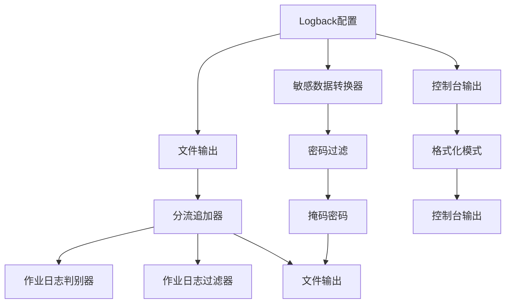

**图示来源**
- [server-logback.xml](file://datavines-server/src/main/resources/server-logback.xml#L24-L59)
- [SensitiveDataConverter.java](file://datavines-common/src/main/java/io/datavines/common/log/SensitiveDataConverter.java)

### 安全审计
系统记录所有关键操作的日志，包括用户登录、Token创建和删除等操作。

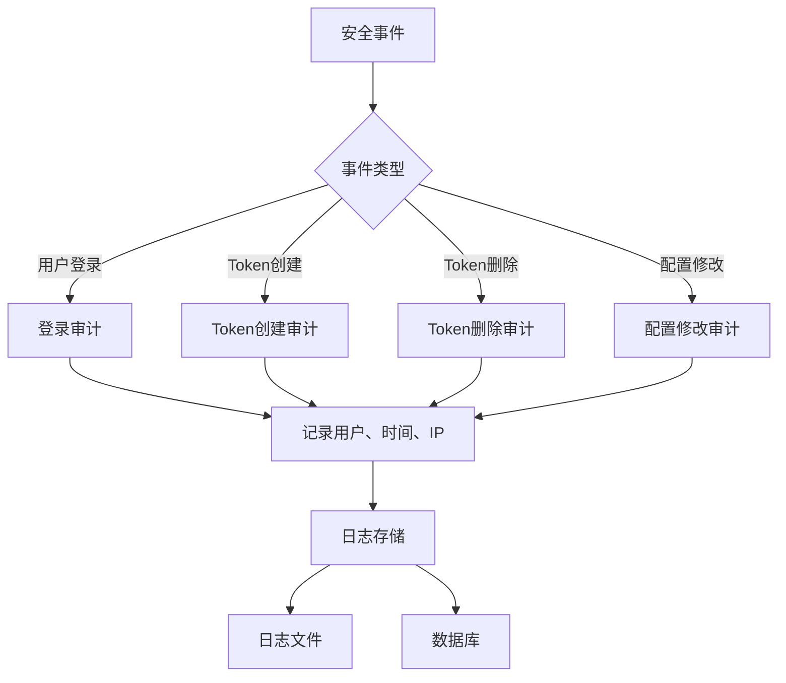

**本节来源**
- [server-logback.xml](file://datavines-server/src/main/resources/server-logback.xml)
- [SensitiveDataConverter.java](file://datavines-common/src/main/java/io/datavines/common/log/SensitiveDataConverter.java#L29-L60)
- [JobExecutionLogFilter.java](file://datavines-common/src/main/java/io/datavines/common/log/JobExecutionLogFilter.java)

## 部署安全建议

DataVines提供了多种部署方式，包括Docker Compose和Kubernetes，建议采取以下安全措施。

### Docker部署安全
使用Docker Compose部署时，应遵循最小权限原则，避免使用privileged模式。

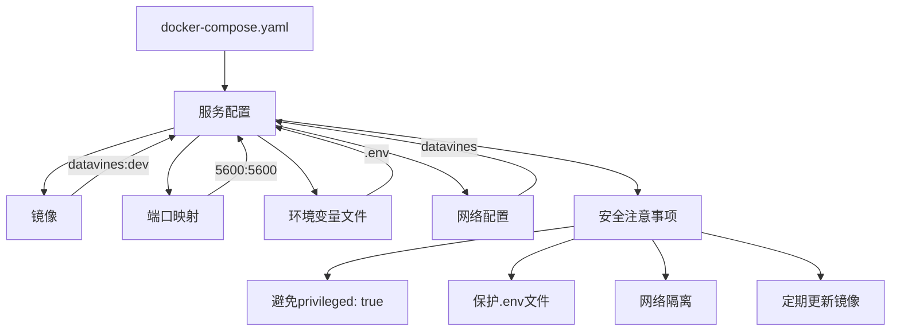

**图示来源**
- [docker-compose.yaml](file://deploy/compose/docker-compose.yaml)

### 邮件通知安全
系统支持通过邮件发送通知，配置时应使用安全的SMTP连接。

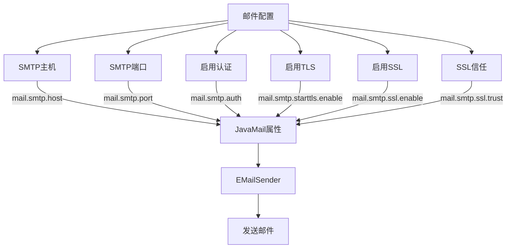

**图示来源**
- [EmailSlasHandlerPlugin.java](file://datavines-notification/datavines-notification-plugins/datavines-notification-plugin-email/src/main/java/io/datavines/notification/plugin/email/EmailSlasHandlerPlugin.java#L116-L143)
- [EMailSender.java](file://datavines-notification/datavines-notification-plugins/datavines-notification-plugin-email/src/main/java/io/datavines/notification/plugin/email/EMailSender.java#L158-L163)

**本节来源**
- [docker-compose.yaml](file://deploy/compose/docker-compose.yaml)
- [EmailSlasHandlerPlugin.java](file://datavines-notification/datavines-notification-plugins/datavines-notification-plugin-email/src/main/java/io/datavines/notification/plugin/email/EmailSlasHandlerPlugin.java#L108-L160)
- [EMailSender.java](file://datavines-notification/datavines-notification-plugins/datavines-notification-plugin-email/src/main/java/io/datavines/notification/plugin/email/EMailSender.java#L154-L163)