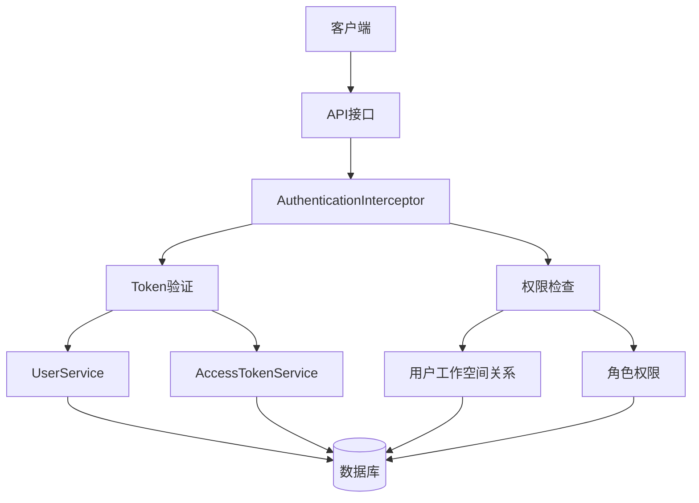
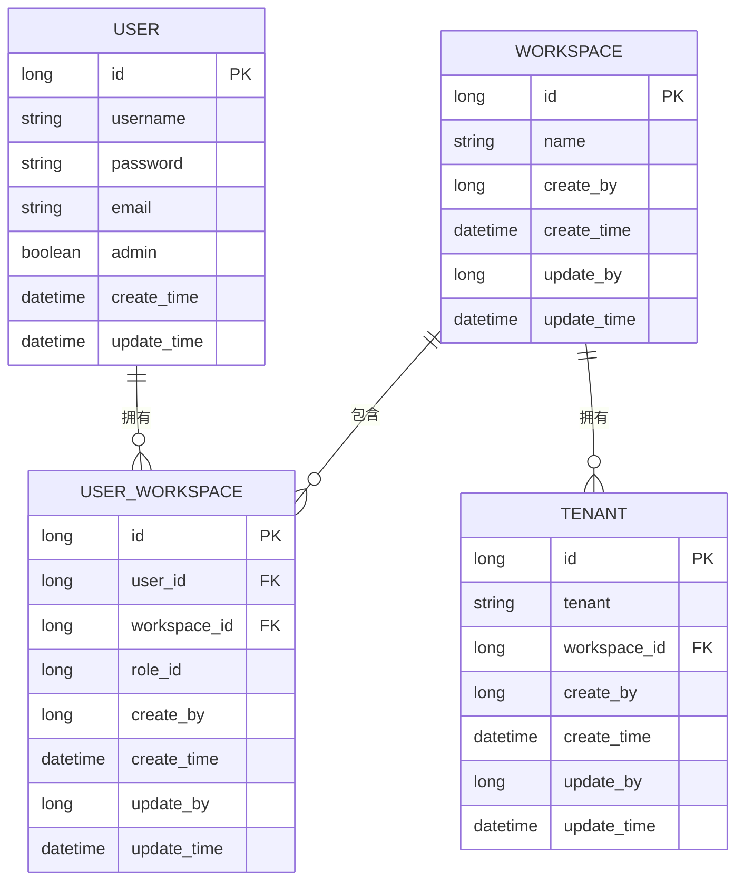
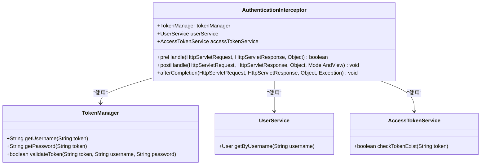
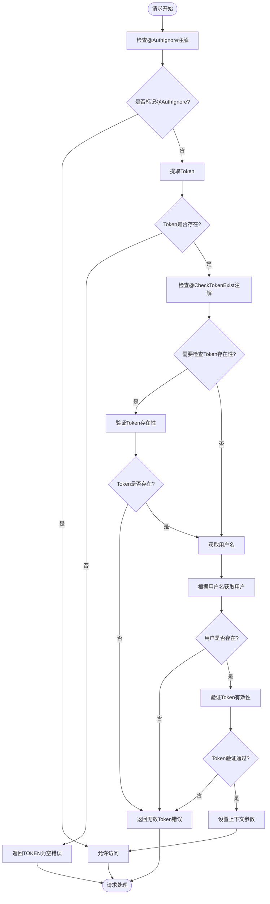

# 授权配置

<cite>
**本文档引用的文件**  
- [AuthenticationInterceptor.java](file://datavines-server/src/main/java/io/datavines/server/api/inteceptor/AuthenticationInterceptor.java)
- [AuthIgnore.java](file://datavines-server/src/main/java/io/datavines/server/api/annotation/AuthIgnore.java)
- [CheckTokenExist.java](file://datavines-server/src/main/java/io/datavines/server/api/annotation/CheckTokenExist.java)
- [WebMvcConfig.java](file://datavines-server/src/main/java/io/datavines/server/api/config/WebMvcConfig.java)
- [User.java](file://datavines-server/src/main/java/io/datavines/server/repository/entity/User.java)
- [WorkSpace.java](file://datavines-server/src/main/java/io/datavines/server/repository/entity/WorkSpace.java)
- [Tenant.java](file://datavines-server/src/main/java/io/datavines/server/repository/entity/Tenant.java)
- [UserWorkSpace.java](file://datavines-server/src/main/java/io/datavines/server/repository/entity/UserWorkSpace.java)
- [UserService.java](file://datavines-server/src/main/java/io/datavines/server/repository/service/UserService.java)
- [AccessTokenService.java](file://datavines-server/src/main/java/io/datavines/server/repository/service/AccessTokenService.java)
- [WorkSpaceServiceImpl.java](file://datavines-server/src/main/java/io/datavines/server/repository/service/impl/WorkSpaceServiceImpl.java)
</cite>

## 目录
1. [简介](#简介)
2. [权限控制架构](#权限控制架构)
3. [基于注解的访问控制](#基于注解的访问控制)
4. [API接口权限管理](#api接口权限管理)
5. [用户角色与工作空间权限模型](#用户角色与工作空间权限模型)
6. [AuthenticationInterceptor实现机制](#authenticationinterceptor实现机制)
7. [权限验证流程](#权限验证流程)
8. [用户、租户与工作空间权限关系](#用户租户与工作空间权限关系)
9. [配置示例](#配置示例)
10. [权限继承与性能优化](#权限继承与性能优化)
11. [常见授权问题解决方案](#常见授权问题解决方案)

## 简介
DataVines权限控制系统提供了一套完整的访问控制机制，包括基于注解的访问控制、API接口权限管理、用户角色和工作空间权限模型。系统通过AuthenticationInterceptor实现统一的权限验证流程，支持灵活的权限配置和管理。本文档详细说明了DataVines的权限控制机制，帮助用户理解和配置系统的授权功能。

## 权限控制架构
DataVines的权限控制架构基于Spring MVC拦截器模式，通过AuthenticationInterceptor实现全局的权限验证。系统采用基于Token的认证机制，结合用户、工作空间和租户的多层级权限模型，实现了细粒度的访问控制。



**图示来源**  
- [AuthenticationInterceptor.java](file://datavines-server/src/main/java/io/datavines/server/api/inteceptor/AuthenticationInterceptor.java)
- [WebMvcConfig.java](file://datavines-server/src/main/java/io/datavines/server/api/config/WebMvcConfig.java)

## 基于注解的访问控制
DataVines提供了基于注解的访问控制机制，通过自定义注解实现灵活的权限管理。

### AuthIgnore注解
`@AuthIgnore`注解用于标记不需要权限验证的API接口。当方法上标注了该注解时，AuthenticationInterceptor会跳过权限验证流程。

```java
@Target({ElementType.METHOD})
@Retention(RetentionPolicy.RUNTIME)
public @interface AuthIgnore {
}
```

**代码来源**  
- [AuthIgnore.java](file://datavines-server/src/main/java/io/datavines/server/api/annotation/AuthIgnore.java)

### CheckTokenExist注解
`@CheckTokenExist`注解用于标记需要检查Token存在性的API接口。该注解确保请求的Token在系统中存在且有效。

```java
@Target({ElementType.METHOD})
@Retention(RetentionPolicy.RUNTIME)
public @interface CheckTokenExist {
}
```

**代码来源**  
- [CheckTokenExist.java](file://datavines-server/src/main/java/io/datavines/server/api/annotation/CheckTokenExist.java)

## API接口权限管理
DataVines通过拦截器机制对API接口进行统一的权限管理，确保只有经过认证和授权的请求才能访问受保护的资源。

### 拦截器配置
系统在WebMvcConfig中配置了AuthenticationInterceptor，将其应用于所有API路径，但排除了登录接口。

```java
@Configuration
public class WebMvcConfig implements WebMvcConfigurer {

    @Bean
    public AuthenticationInterceptor loginRequiredInterceptor() {
        return new AuthenticationInterceptor();
    }

    @Override
    public void addInterceptors(InterceptorRegistry registry) {
        registry.addInterceptor(loginRequiredInterceptor())
                .addPathPatterns(DataVinesConstants.BASE_API_PATH + "/**")
                .excludePathPatterns(DataVinesConstants.BASE_API_PATH + "/login");
    }
}
```

**代码来源**  
- [WebMvcConfig.java](file://datavines-server/src/main/java/io/datavines/server/api/config/WebMvcConfig.java)

## 用户角色与工作空间权限模型
DataVines采用多层级的权限模型，包括用户、工作空间和租户三个核心概念，通过UserWorkSpace实体建立用户与工作空间的关系。

### 核心实体关系


**图示来源**  
- [User.java](file://datavines-server/src/main/java/io/datavines/server/repository/entity/User.java)
- [WorkSpace.java](file://datavines-server/src/main/java/io/datavines/server/repository/entity/WorkSpace.java)
- [Tenant.java](file://datavines-server/src/main/java/io/datavines/server/repository/entity/Tenant.java)
- [UserWorkSpace.java](file://datavines-server/src/main/java/io/datavines/server/repository/entity/UserWorkSpace.java)

## AuthenticationInterceptor实现机制
AuthenticationInterceptor是DataVines权限控制系统的核心组件，负责处理所有API请求的权限验证。

### 核心功能
- Token提取与验证
- 用户身份认证
- 权限检查
- 上下文设置

### 类结构


**图示来源**  
- [AuthenticationInterceptor.java](file://datavines-server/src/main/java/io/datavines/server/api/inteceptor/AuthenticationInterceptor.java)

## 权限验证流程
DataVines的权限验证流程遵循严格的步骤，确保每个请求都经过完整的认证和授权检查。

### 验证流程图


**图示来源**  
- [AuthenticationInterceptor.java](file://datavines-server/src/main/java/io/datavines/server/api/inteceptor/AuthenticationInterceptor.java)

## 用户租户与工作空间权限关系
DataVines通过用户、工作空间和租户的层级关系实现复杂的权限管理。

### 权限关系说明
- **用户(User)**：系统的基本身份单元，具有用户名、密码、邮箱等基本信息
- **工作空间(WorkSpace)**：用户工作的逻辑空间，一个用户可以属于多个工作空间
- **租户(Tenant)**：工作空间内的资源隔离单元，用于区分不同的执行环境
- **用户工作空间关系(UserWorkSpace)**：关联用户和工作空间，包含用户在工作空间中的角色信息

### 权限继承机制
权限在层级间具有继承特性：
1. 用户在工作空间中的角色决定了其在该工作空间内的基本权限
2. 工作空间的租户配置影响用户在该环境下的执行权限
3. API接口的注解配置可以覆盖默认的权限设置

**代码来源**  
- [WorkSpaceServiceImpl.java](file://datavines-server/src/main/java/io/datavines/server/repository/service/impl/WorkSpaceServiceImpl.java)
- [UserWorkSpace.java](file://datavines-server/src/main/java/io/datavines/server/repository/entity/UserWorkSpace.java)

## 配置示例
以下示例展示了如何配置不同用户角色的访问权限和API端点访问控制。

### API接口配置示例
```java
@RestController
@RequestMapping("/api/users")
public class UserController {
    
    // 登录接口不需要权限验证
    @PostMapping("/login")
    @AuthIgnore
    public Result login(@RequestBody UserLogin userLogin) {
        // 登录逻辑
    }
    
    // 获取用户信息需要Token验证
    @GetMapping("/{id}")
    public Result getUser(@PathVariable Long id) {
        // 获取用户信息逻辑
    }
    
    // 删除用户需要检查Token存在性
    @DeleteMapping("/{id}")
    @CheckTokenExist
    public Result deleteUser(@PathVariable Long id) {
        // 删除用户逻辑
    }
}
```

### 工作空间权限配置
```java
@Service
public class WorkSpaceService {
    
    // 邀请用户加入工作空间
    public Long inviteUserIntoWorkspace(InviteUserIntoWorkspace inviteUserIntoWorkspace) {
        // 检查用户是否已在工作空间中
        UserWorkSpace userWorkSpace = userWorkSpaceService.getOne(
            new QueryWrapper<UserWorkSpace>()
                .eq(UserWorkSpace::getUserId, user.getId())
                .eq(UserWorkSpace::getWorkspaceId, inviteUserIntoWorkspace.getWorkspaceId()));
        
        if (userWorkSpace != null) {
            throw new DataVinesServerException(Status.USER_IS_IN_WORKSPACE_ERROR);
        }
        
        // 创建用户工作空间关系
        userWorkSpace = new UserWorkSpace();
        userWorkSpace.setUserId(user.getId());
        userWorkSpace.setWorkspaceId(inviteUserIntoWorkspace.getWorkspaceId());
        userWorkSpace.setCreateBy(ContextHolder.getUserId());
        userWorkSpace.setCreateTime(LocalDateTime.now());
        userWorkSpace.setUpdateBy(ContextHolder.getUserId());
        userWorkSpace.setUpdateTime(LocalDateTime.now());
        
        userWorkSpaceService.save(userWorkSpace);
        
        return userWorkSpace.getId();
    }
}
```

**代码来源**  
- [AuthenticationInterceptor.java](file://datavines-server/src/main/java/io/datavines/server/api/inteceptor/AuthenticationInterceptor.java)
- [WorkSpaceServiceImpl.java](file://datavines-server/src/main/java/io/datavines/server/repository/service/impl/WorkSpaceServiceImpl.java)

## 权限继承与性能优化
DataVines在权限控制方面实现了有效的继承机制和性能优化策略。

### 权限继承规则
1. **默认继承**：用户在工作空间中的权限默认继承工作空间的配置
2. **角色覆盖**：特定角色可以拥有超出默认权限的特殊权限
3. **接口级覆盖**：API接口上的注解可以覆盖用户和角色的默认权限设置

### 性能优化措施
1. **Token缓存**：TokenManager对Token信息进行缓存，减少数据库查询
2. **批量验证**：对频繁访问的权限检查进行批量处理
3. **异步检查**：非关键权限检查采用异步方式进行
4. **连接池**：数据库连接使用连接池管理，提高访问效率

## 常见授权问题解决方案
### Token为空问题
**问题现象**：客户端请求时未提供Token，导致权限验证失败
**解决方案**：
1. 确保客户端在请求头中包含Token
2. 或在请求参数中传递Token
3. 检查AuthenticationInterceptor的配置是否正确

### 无效Token问题
**问题现象**：提供的Token无效或已过期
**解决方案**：
1. 检查Token是否在AccessTokenService中存在
2. 验证Token的格式和签名
3. 确认用户账户状态是否正常

### 权限不足问题
**问题现象**：用户有有效Token但无法访问特定资源
**解决方案**：
1. 检查用户是否属于目标工作空间
2. 验证用户在工作空间中的角色权限
3. 确认API接口的权限注解配置

### 多工作空间权限问题
**问题现象**：用户在多个工作空间间切换时权限混乱
**解决方案**：
1. 确保ContextHolder正确管理用户上下文
2. 在切换工作空间时清除旧的上下文信息
3. 验证UserWorkSpace关系的正确性