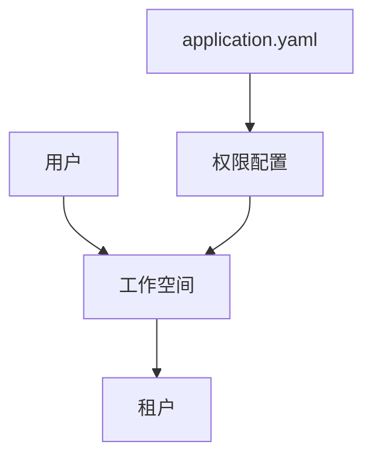
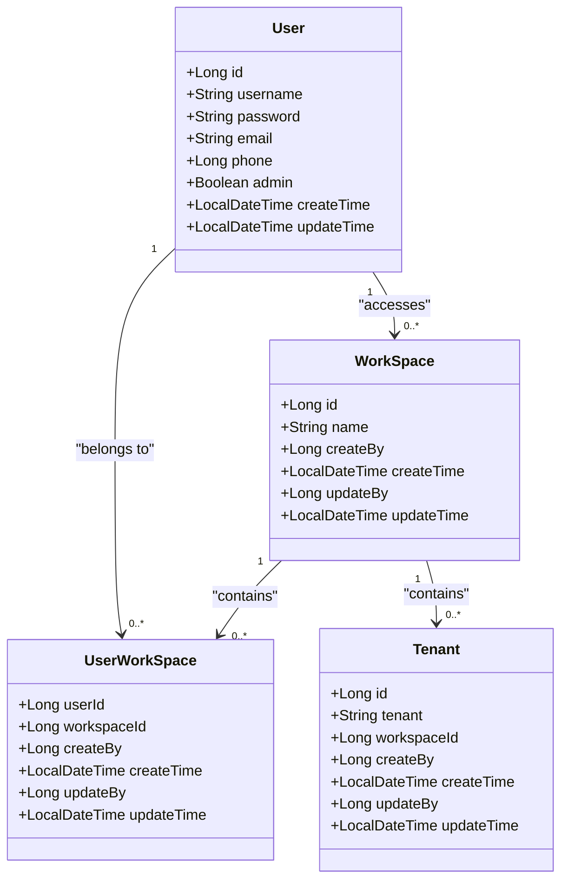
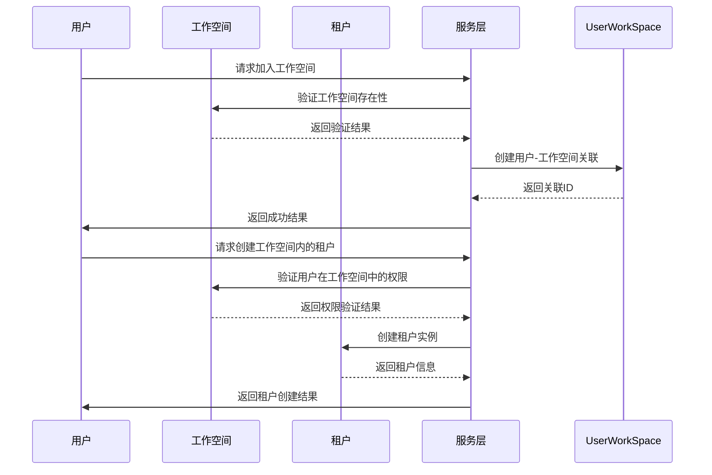
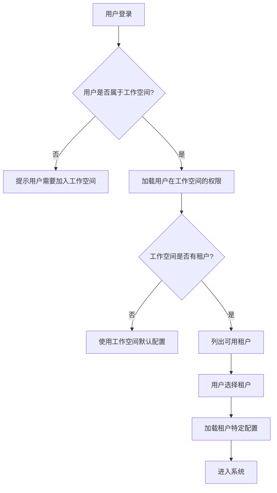
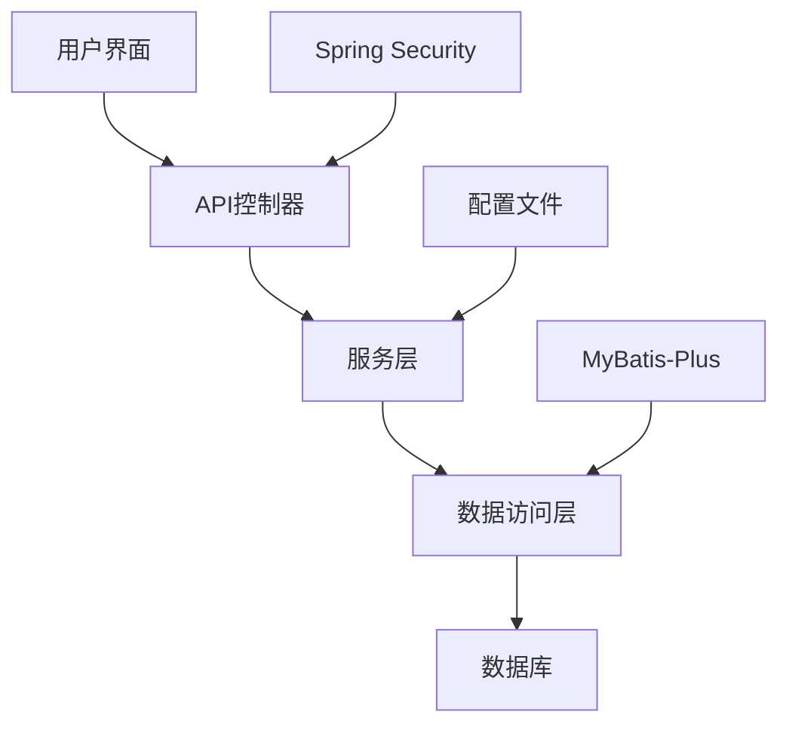

# 权限模型

<cite>
**本文档引用的文件**  
- [application.yaml](file://datavines-server/src/main/resources/application.yaml)
- [User.java](file://datavines-server/src/main/java/io/datavines/server/repository/entity/User.java)
- [WorkSpace.java](file://datavines-server/src/main/java/io/datavines/server/repository/entity/WorkSpace.java)
- [Tenant.java](file://datavines-server/src/main/java/io/datavines/server/repository/entity/Tenant.java)
- [UserWorkSpaceService.java](file://datavines-server/src/main/java/io/datavines/server/repository/service/UserWorkSpaceService.java)
- [TenantService.java](file://datavines-server/src/main/java/io/datavines/server/repository/service/TenantService.java)
- [WorkSpaceServiceImpl.java](file://datavines-server/src/main/java/io/datavines/server/repository/service/impl/WorkSpaceServiceImpl.java)
- [TenantController.java](file://datavines-server/src/main/java/io/datavines/server/api/controller/TenantController.java)
</cite>

## 目录
1. [引言](#引言)
2. [项目结构](#项目结构)
3. [核心组件](#核心组件)
4. [架构概述](#架构概述)
5. [详细组件分析](#详细组件分析)
6. [依赖分析](#依赖分析)
7. [性能考虑](#性能考虑)
8. [故障排除指南](#故障排除指南)
9. [结论](#结论)

## 引言
本文档深入解析DataVines的用户权限体系，详细描述用户、租户和工作空间之间的层级关系和权限继承机制。文档解释了基于角色的访问控制（RBAC）模型的实现方式，包括用户角色定义、权限分配和工作空间隔离策略。同时说明了多租户环境下的数据隔离实现方式，以及用户在不同工作空间间的权限切换机制。通过配置示例展示如何通过application.yaml配置默认权限策略，如何管理用户角色和权限组。最后探讨权限模型的扩展性设计和未来可能的权限精细化控制方向。

## 项目结构
DataVines的权限管理主要集中在`datavines-server`模块中，涉及用户、工作空间和租户三个核心实体。系统采用基于角色的访问控制（RBAC）模型，通过用户-工作空间-租户的层级结构实现权限隔离和继承。权限相关的实体类位于`datavines-server/src/main/java/io/datavines/server/repository/entity/`目录下，服务接口位于`datavines-server/src/main/java/io/datavines/server/repository/service/`目录下。

**图示来源**  
- [User.java](file://datavines-server/src/main/java/io/datavines/server/repository/entity/User.java)
- [WorkSpace.java](file://datavines-server/src/main/java/io/datavines/server/repository/entity/WorkSpace.java)
- [Tenant.java](file://datavines-server/src/main/java/io/datavines/server/repository/entity/Tenant.java)

**章节来源**  
- [User.java](file://datavines-server/src/main/java/io/datavines/server/repository/entity/User.java)
- [WorkSpace.java](file://datavines-server/src/main/java/io/datavines/server/repository/entity/WorkSpace.java)
- [Tenant.java](file://datavines-server/src/main/java/io/datavines/server/repository/entity/Tenant.java)

## 核心组件
DataVines权限模型的核心组件包括用户（User）、工作空间（WorkSpace）和租户（Tenant）三个实体类，以及对应的服务接口和控制器。用户是系统的基本访问主体，工作空间是用户组织和隔离资源的主要单元，租户则是在工作空间内进一步划分执行环境的逻辑单元。这种三层结构实现了灵活的权限管理和资源隔离。

**章节来源**  
- [User.java](file://datavines-server/src/main/java/io/datavines/server/repository/entity/User.java)
- [WorkSpace.java](file://datavines-server/src/main/java/io/datavines/server/repository/entity/WorkSpace.java)
- [Tenant.java](file://datavines-server/src/main/java/io/datavines/server/repository/entity/Tenant.java)

## 架构概述
DataVines的权限架构采用典型的RBAC（基于角色的访问控制）模型，通过用户、工作空间和租户的层级关系实现权限继承和隔离。用户首先被分配到一个或多个工作空间，每个工作空间可以包含多个租户。权限控制在工作空间级别进行隔离，确保不同工作空间之间的数据和资源配置相互独立。租户作为工作空间内的执行环境单元，继承工作空间的权限设置。

**图示来源**  
- [User.java](file://datavines-server/src/main/java/io/datavines/server/repository/entity/User.java)
- [WorkSpace.java](file://datavines-server/src/main/java/io/datavines/server/repository/entity/WorkSpace.java)
- [Tenant.java](file://datavines-server/src/main/java/io/datavines/server/repository/entity/Tenant.java)
- [UserWorkSpace.java](file://datavines-server/src/main/java/io/datavines/server/repository/entity/UserWorkSpace.java)

## 详细组件分析

### 用户、工作空间与租户关系分析
DataVines通过用户、工作空间和租户的层级关系实现复杂的权限管理。用户是系统的基本访问主体，可以加入一个或多个工作空间。工作空间是资源组织和权限隔离的主要单元，每个用户至少需要属于一个工作空间。租户是工作空间内的执行环境，用于隔离不同的运行时配置和资源分配。

**图示来源**  
- [WorkSpaceServiceImpl.java](file://datavines-server/src/main/java/io/datavines/server/repository/service/impl/WorkSpaceServiceImpl.java)
- [TenantService.java](file://datavines-server/src/main/java/io/datavines/server/repository/service/TenantService.java)
- [TenantController.java](file://datavines-server/src/main/java/io/datavines/server/api/controller/TenantController.java)

**章节来源**  
- [WorkSpaceServiceImpl.java](file://datavines-server/src/main/java/io/datavines/server/repository/service/impl/WorkSpaceServiceImpl.java)
- [TenantService.java](file://datavines-server/src/main/java/io/datavines/server/repository/service/TenantService.java)
- [TenantController.java](file://datavines-server/src/main/java/io/datavines/server/api/controller/TenantController.java)

### 权限继承与隔离机制
DataVines的权限继承机制基于工作空间和租户的层级结构。当用户被添加到工作空间时，自动继承该工作空间的基本访问权限。租户作为工作空间的子单元，继承工作空间的权限设置，同时可以进行更细粒度的权限配置。这种设计实现了权限的层级继承和有效隔离。

**图示来源**  
- [UserWorkSpaceService.java](file://datavines-server/src/main/java/io/datavines/server/repository/service/UserWorkSpaceService.java)
- [TenantService.java](file://datavines-server/src/main/java/io/datavines/server/repository/service/TenantService.java)

**章节来源**  
- [UserWorkSpaceService.java](file://datavines-server/src/main/java/io/datavines/server/repository/service/UserWorkSpaceService.java)
- [TenantService.java](file://datavines-server/src/main/java/io/datavines/server/repository/service/TenantService.java)

## 依赖分析
DataVines权限模型的实现依赖于多个核心组件和服务。用户管理依赖于Spring Security框架进行身份验证，工作空间和租户管理依赖于MyBatis-Plus进行数据持久化操作。权限配置的加载和刷新依赖于Spring的配置管理机制。各组件之间的依赖关系清晰，通过服务接口进行解耦。

**图示来源**  
- [TenantController.java](file://datavines-server/src/main/java/io/datavines/server/api/controller/TenantController.java)
- [TenantService.java](file://datavines-server/src/main/java/io/datavines/server/repository/service/TenantService.java)
- [Tenant.java](file://datavines-server/src/main/java/io/datavines/server/repository/entity/Tenant.java)

**章节来源**  
- [TenantController.java](file://datavines-server/src/main/java/io/datavines/server/api/controller/TenantController.java)
- [TenantService.java](file://datavines-server/src/main/java/io/datavines/server/repository/service/TenantService.java)

## 性能考虑
在权限模型设计中，DataVines考虑了性能优化的多个方面。通过缓存用户-工作空间关联关系，减少数据库查询次数。采用分页查询机制获取工作空间用户列表，避免一次性加载大量数据。权限验证过程尽量在内存中完成，减少对数据库的频繁访问。这些优化措施确保了系统在用户规模扩大时仍能保持良好的响应性能。

## 故障排除指南
当遇到权限相关问题时，可以按照以下步骤进行排查：首先检查用户是否已正确加入目标工作空间；其次验证工作空间是否存在且状态正常；然后确认租户配置是否正确；最后检查application.yaml中的权限相关配置是否符合预期。通过查看系统日志可以获取更详细的错误信息，帮助定位具体问题。

**章节来源**  
- [application.yaml](file://datavines-server/src/main/resources/application.yaml)
- [TenantController.java](file://datavines-server/src/main/java/io/datavines/server/api/controller/TenantController.java)

## 结论
DataVines的权限模型通过用户、工作空间和租户的三层架构，实现了灵活而安全的访问控制。基于RBAC的权限管理机制，结合工作空间级别的数据隔离，满足了多租户环境下的复杂权限需求。系统的扩展性设计允许未来引入更细粒度的权限控制，如基于属性的访问控制（ABAC）或动态权限策略。通过合理的配置和管理，可以有效保障系统的安全性和可用性。