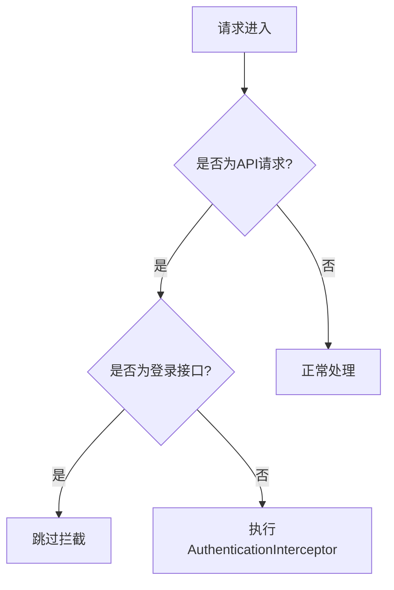
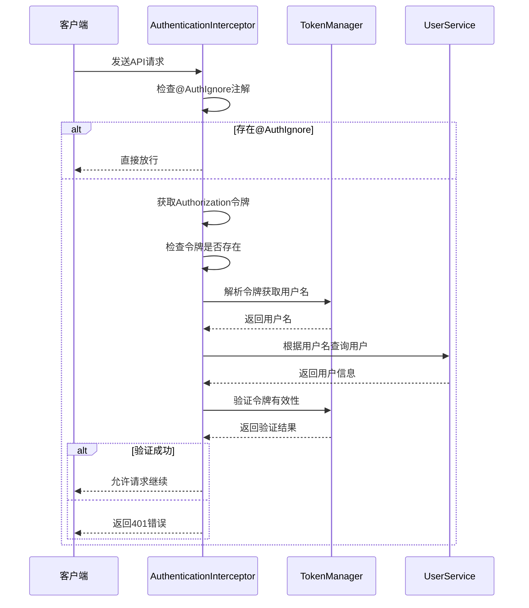
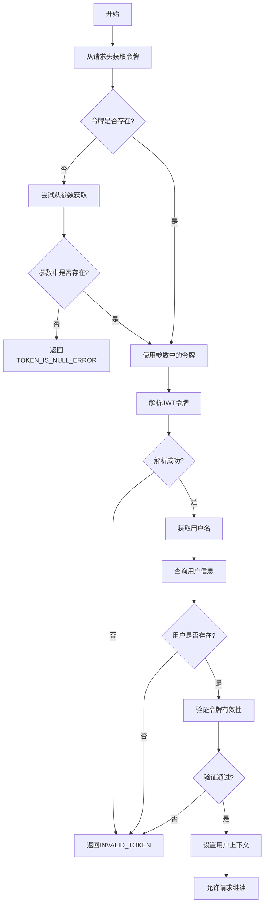
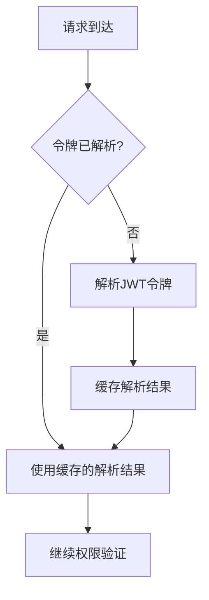

# 访问控制

<cite>
**本文档引用的文件**   
- [AuthenticationInterceptor.java](file://datavines-server/src/main/java/io/datavines/server/api/inteceptor/AuthenticationInterceptor.java)
- [AuthIgnore.java](file://datavines-server/src/main/java/io/datavines/server/api/annotation/AuthIgnore.java)
- [CheckTokenExist.java](file://datavines-server/src/main/java/io/datavines/server/api/annotation/CheckTokenExist.java)
- [TokenManager.java](file://datavines-core/src/main/java/io/datavines/core/utils/TokenManager.java)
- [WebMvcConfig.java](file://datavines-server/src/main/java/io/datavines/server/api/config/WebMvcConfig.java)
- [DataVinesConstants.java](file://datavines-core/src/main/java/io/datavines/core/constant/DataVinesConstants.java)
</cite>

## 目录
1. [引言](#引言)
2. [基于注解的访问控制机制](#基于注解的访问控制机制)
3. [认证拦截器实现原理](#认证拦截器实现原理)
4. [API请求权限验证流程](#api请求权限验证流程)
5. [代码示例与使用方法](#代码示例与使用方法)
6. [性能优化建议](#性能优化建议)
7. [安全漏洞防范措施](#安全漏洞防范措施)
8. [结论](#结论)

## 引言
DataVines平台采用基于注解的访问控制机制来保护其API接口的安全性。该机制通过JWT令牌验证和权限检查确保只有经过身份验证的用户才能访问受保护的资源。本文档详细介绍了@AuthIgnore注解的使用场景和实现原理，解释了AuthenticationInterceptor拦截器如何实现JWT令牌验证和权限检查，并描述了API请求的完整权限验证流程。

## 基于注解的访问控制机制

DataVines的访问控制机制主要依赖于自定义注解来实现灵活的权限管理。核心注解包括@AuthIgnore和@CheckTokenExist，它们被应用于控制器方法上以控制访问权限。

### @AuthIgnore注解

@AuthIgnore注解用于标记不需要进行身份验证的方法。当一个方法被@AuthIgnore注解修饰时，AuthenticationInterceptor会跳过对该方法的权限检查，允许匿名访问。

```java
@Target({ElementType.METHOD})
@Retention(RetentionPolicy.RUNTIME)
public @interface AuthIgnore {
}
```

**使用场景**：
- 登录接口：允许用户在未登录状态下进行身份验证
- 注册接口：新用户注册时无需提供有效令牌
- 公共API：提供给外部系统调用的开放接口

**实现原理**：
在AuthenticationInterceptor的preHandle方法中，首先检查目标方法是否包含@AuthIgnore注解。如果存在该注解，则直接返回true，跳过后续的权限验证流程。

**节来源**
- [AuthIgnore.java](file://datavines-server/src/main/java/io/datavines/server/api/annotation/AuthIgnore.java#L24-L27)

### @CheckTokenExist注解

@CheckTokenExist注解用于强制检查令牌在数据库中的存在性。与基本的JWT验证不同，此注解确保令牌不仅有效，而且在系统的访问令牌表中存在。

```java
@Target({ElementType.METHOD})
@Retention(RetentionPolicy.RUNTIME)
public @interface CheckTokenExist {
}
```

**使用场景**：
- 敏感操作：如用户信息修改、密码重置等高风险操作
- 管理员功能：后台管理相关的所有接口
- 数据删除：涉及数据删除或修改的重要操作

**实现原理**：
当方法被@CheckTokenExist注解修饰时，拦截器会调用AccessTokenService的checkTokenExist方法，验证令牌是否存在于数据库中。如果不存在，则抛出INVALID_TOKEN异常。

**节来源**
- [CheckTokenExist.java](file://datavines-server/src/main/java/io/datavines/server/api/annotation/CheckTokenExist.java#L24-L27)

## 认证拦截器实现原理

AuthenticationInterceptor是DataVines访问控制的核心组件，它实现了Spring MVC的HandlerInterceptor接口，在请求处理前进行权限验证。

### 拦截器注册与配置

在WebMvcConfig配置类中，AuthenticationInterceptor被注册为全局拦截器，并设置了拦截路径模式。



**图来源**
- [WebMvcConfig.java](file://datavines-server/src/main/java/io/datavines/server/api/config/WebMvcConfig.java#L43-L48)

**节来源**
- [WebMvcConfig.java](file://datavines-server/src/main/java/io/datavines/server/api/config/WebMvcConfig.java#L38-L48)

### 权限验证流程

AuthenticationInterceptor的preHandle方法实现了完整的权限验证流程：

1. **方法注解检查**：首先检查是否存在@AuthIgnore注解，如果有则直接放行
2. **令牌获取**：从请求头或参数中获取Authorization令牌
3. **令牌存在性检查**：根据@CheckTokenExist注解决定是否检查令牌在数据库中的存在性
4. **用户身份验证**：通过TokenManager解析令牌中的用户名，并从数据库中获取用户信息
5. **令牌有效性验证**：验证令牌的签名、过期时间以及用户名和密码的匹配性



**图来源**
- [AuthenticationInterceptor.java](file://datavines-server/src/main/java/io/datavines/server/api/inteceptor/AuthenticationInterceptor.java#L54-L104)

**节来源**
- [AuthenticationInterceptor.java](file://datavines-server/src/main/java/io/datavines/server/api/inteceptor/AuthenticationInterceptor.java#L42-L115)

## API请求权限验证流程

### 令牌解析与验证

DataVines使用JWT（JSON Web Token）作为身份验证机制。TokenManager类负责令牌的生成、解析和验证。

#### 令牌结构
DataVines的JWT令牌包含以下声明（claims）：
- `un` (TOKEN_USER_NAME): 用户名
- `up` (TOKEN_USER_PASSWORD): 用户密码
- `ct` (TOKEN_CREATE_TIME): 令牌创建时间

#### 令牌验证步骤
1. **提取令牌**：从Authorization请求头中提取Bearer令牌
2. **解析声明**：使用预共享密钥解码JWT令牌，获取其中的声明信息
3. **验证签名**：确保令牌未被篡改
4. **检查过期时间**：验证令牌是否在有效期内
5. **用户信息匹配**：确认令牌中的用户名和密码与数据库中的记录匹配



**图来源**
- [TokenManager.java](file://datavines-core/src/main/java/io/datavines/core/utils/TokenManager.java#L163-L167)
- [AuthenticationInterceptor.java](file://datavines-server/src/main/java/io/datavines/server/api/inteceptor/AuthenticationInterceptor.java#L89-L98)

**节来源**
- [TokenManager.java](file://datavines-core/src/main/java/io/datavines/core/utils/TokenManager.java#L132-L196)
- [AuthenticationInterceptor.java](file://datavines-server/src/main/java/io/datavines/server/api/inteceptor/AuthenticationInterceptor.java#L74-L98)

### 上下文管理

在权限验证成功后，系统会将用户信息存储在请求上下文中，以便后续的业务逻辑使用。

```java
request.setAttribute(DataVinesConstants.LOGIN_USER, user);
ContextHolder.setParam(DataVinesConstants.LOGIN_USER, user);
ContextHolder.setParam(DataVinesConstants.TOKEN, token);
```

ContextHolder使用ThreadLocal来存储当前线程的上下文信息，确保线程安全。在请求结束后，afterCompletion方法会清理这些上下文信息，防止内存泄漏。

**节来源**
- [AuthenticationInterceptor.java](file://datavines-server/src/main/java/io/datavines/server/api/inteceptor/AuthenticationInterceptor.java#L94-L102)

## 代码示例与使用方法

### 控制器方法示例

以下是一些典型的控制器方法使用示例：

```java
@RestController
@RequestMapping("/api/v1/user")
public class UserController {
    
    @PostMapping("/login")
    @AuthIgnore
    public Result<UserLoginResult> login(@RequestBody LoginRequest loginRequest) {
        // 登录逻辑，无需身份验证
    }
    
    @GetMapping("/profile")
    public Result<UserProfile> getProfile() {
        // 需要身份验证，但不检查令牌存在性
    }
    
    @PutMapping("/update")
    @CheckTokenExist
    public Result<UserLoginResult> update(@RequestBody UserUpdateRequest request) {
        // 需要身份验证，并检查令牌在数据库中的存在性
    }
}
```

**节来源**
- [AuthenticationInterceptor.java](file://datavines-server/src/main/java/io/datavines/server/api/inteceptor/AuthenticationInterceptor.java)

### 未授权访问处理

当权限验证失败时，系统会抛出DataVinesServerException异常，该异常会被全局异常处理器捕获并转换为适当的HTTP响应。

```java
throw new DataVinesServerException(Status.TOKEN_IS_NULL_ERROR);
throw new DataVinesServerException(Status.INVALID_TOKEN, token);
```

这些异常会返回相应的错误码和消息，客户端可以根据这些信息进行适当的错误处理。

**节来源**
- [AuthenticationInterceptor.java](file://datavines-server/src/main/java/io/datavines/server/api/inteceptor/AuthenticationInterceptor.java#L79-L86)

## 性能优化建议

### 权限缓存策略

为了提高权限验证的性能，可以实施以下缓存策略：

1. **用户信息缓存**：将频繁访问的用户信息缓存在Redis中，减少数据库查询次数
2. **令牌状态缓存**：对于@CheckTokenExist检查，可以缓存令牌的有效状态，避免重复的数据库查询
3. **JWT解析结果缓存**：在单个请求处理过程中，缓存JWT的解析结果，避免多次解析同一个令牌



**图来源**
- [TokenManager.java](file://datavines-core/src/main/java/io/datavines/core/utils/TokenManager.java)

### 减少数据库查询

通过以下方式减少数据库查询次数：
- 在TokenManager中缓存用户的密码信息
- 使用批量查询替代多次单个查询
- 实现连接池以提高数据库连接效率

## 安全漏洞防范措施

### JWT安全最佳实践

1. **使用强密钥**：确保jwt.token.secret配置项使用足够长且随机的密钥
2. **合理设置过期时间**：通过jwt.token.timeout配置合理的令牌过期时间
3. **HTTPS传输**：始终通过HTTPS传输JWT令牌，防止中间人攻击
4. **令牌刷新机制**：实现令牌刷新功能，定期更新令牌以降低泄露风险

### 防止常见攻击

1. **重放攻击防护**：通过检查令牌的创建时间，拒绝过期的请求
2. **暴力破解防护**：对登录接口实施失败次数限制
3. **令牌泄露防护**：提供令牌撤销功能，允许用户主动注销令牌
4. **输入验证**：对所有输入参数进行严格的验证和清理

## 结论

DataVines的基于注解的访问控制机制提供了一种灵活而强大的权限管理方案。通过@AuthIgnore和@CheckTokenExist注解，开发者可以精确控制每个API接口的访问权限。AuthenticationInterceptor拦截器实现了完整的JWT令牌验证流程，确保了系统的安全性。建议在实际使用中结合性能优化策略和安全防护措施，以构建既安全又高效的API服务。