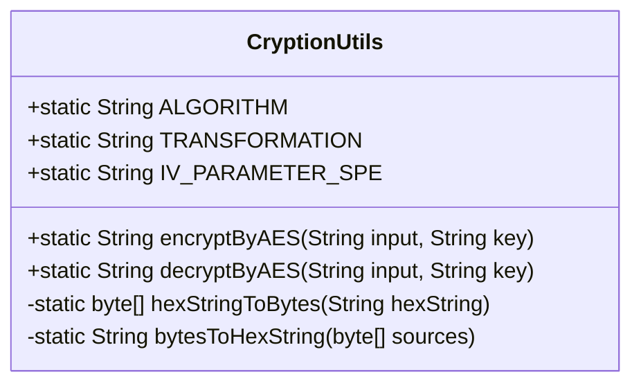
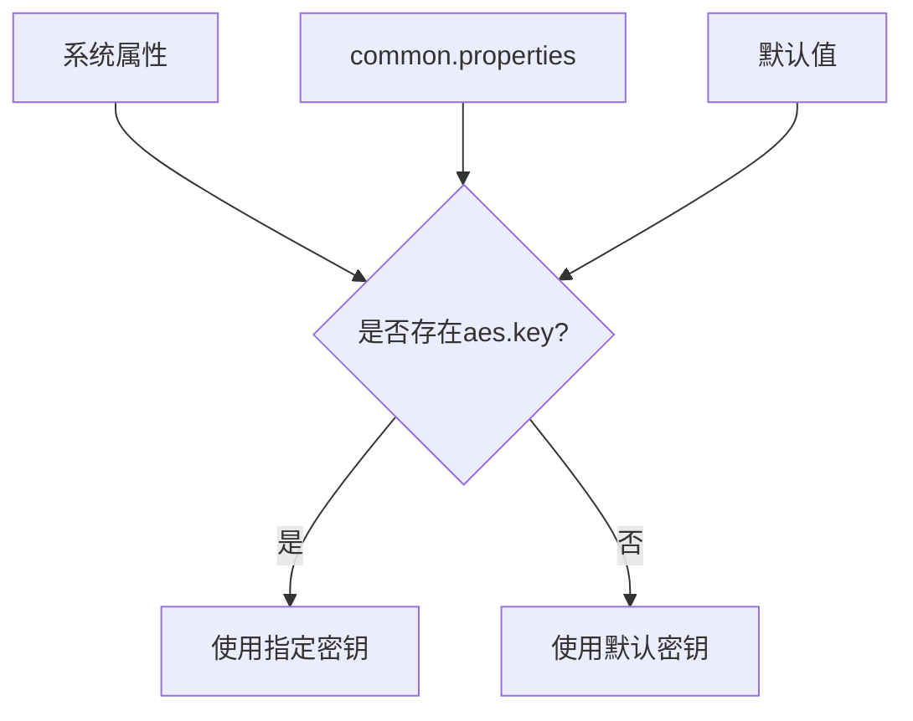
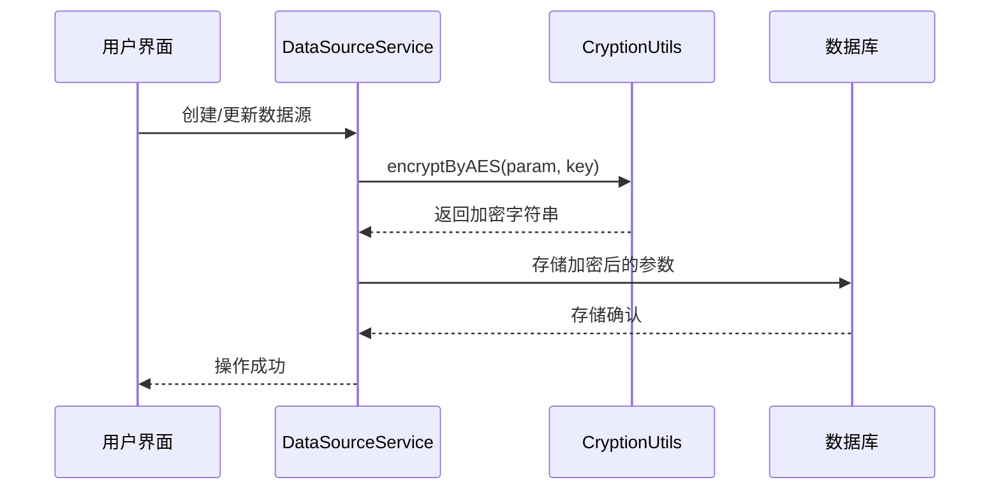
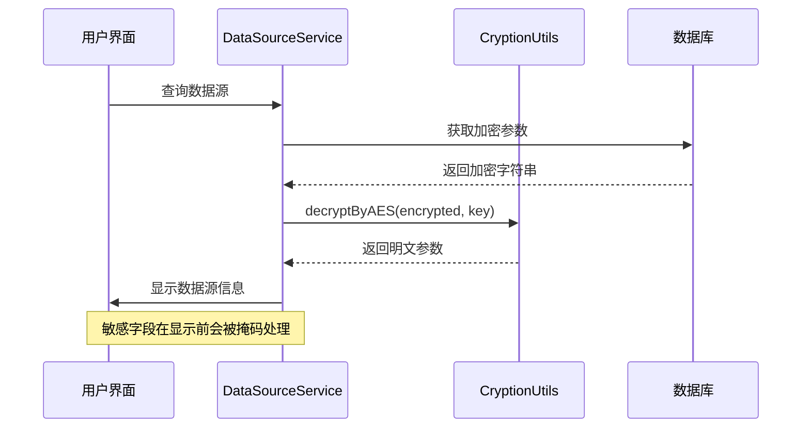
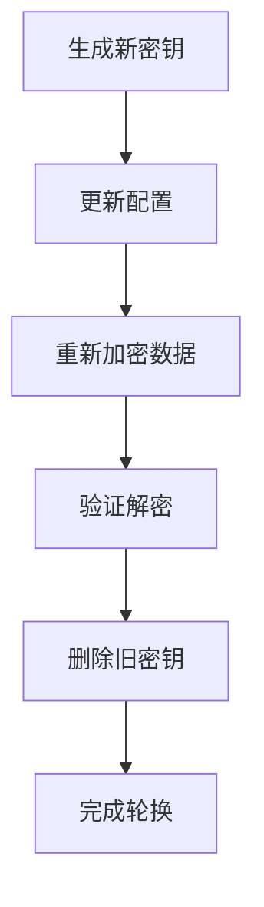

# 加密管理

<cite>
**本文档中引用的文件**  
- [CryptionUtils.java](file://datavines-common/src/main/java/io/datavines/common/utils/CryptionUtils.java)
- [CommonPropertyUtils.java](file://datavines-common/src/main/java/io/datavines/common/utils/CommonPropertyUtils.java)
- [DataSourceServiceImpl.java](file://datavines-server/src/main/java/io/datavines/server/repository/service/impl/DataSourceServiceImpl.java)
- [common.properties](file://datavines-common/src/main/resources/common.properties)
- [application.yaml](file://datavines-server/src/main/resources/application.yaml)
</cite>

## 目录
1. [引言](#引言)
2. [加密机制概述](#加密机制概述)
3. [CryptionUtils类实现原理](#cryptionutils类实现原理)
4. [密钥管理与配置](#密钥管理与配置)
5. [加密算法与参数配置](#加密算法与参数配置)
6. [敏感数据加密解密流程](#敏感数据加密解密流程)
7. [密钥轮换最佳实践](#密钥轮换最佳实践)
8. [性能影响与安全考量](#性能影响与安全考量)
9. [总结](#总结)

## 引言

DataVines平台为保护敏感数据安全，实现了一套完整的加密管理机制。本文档详细说明DataVines的加密机制，重点介绍CryptionUtils类的实现原理、加密算法配置、密钥管理策略以及安全最佳实践。系统主要针对数据源连接参数等敏感信息进行加密存储，确保数据在传输和存储过程中的安全性。

## 加密机制概述

DataVines采用AES对称加密算法保护敏感数据，主要应用于数据源配置信息的加密存储。系统通过CryptionUtils工具类提供加密和解密功能，结合配置文件中的密钥管理策略，实现了敏感数据的安全保护。加密机制的核心组件包括：

- **CryptionUtils类**：提供AES加密和解密的静态方法
- **密钥管理**：通过配置文件定义加密密钥
- **加密流程**：在数据存储前加密，在数据读取后解密
- **安全防护**：防止敏感信息在日志中明文显示

该机制确保了数据源连接信息（如密码）在数据库中的加密存储，同时在应用程序需要使用时能够安全地解密。

**Section sources**
- [CryptionUtils.java](file://datavines-common/src/main/java/io/datavines/common/utils/CryptionUtils.java#L25-L85)
- [DataSourceServiceImpl.java](file://datavines-server/src/main/java/io/datavines/server/repository/service/impl/DataSourceServiceImpl.java#L112-L255)

## CryptionUtils类实现原理

CryptionUtils类是DataVines加密功能的核心实现，提供了基于AES算法的加密和解密方法。该类的实现原理如下：



**Diagram sources**
- [CryptionUtils.java](file://datavines-common/src/main/java/io/datavines/common/utils/CryptionUtils.java#L25-L85)

### 加密算法配置

CryptionUtils类定义了以下静态字段来配置加密参数：

- **ALGORITHM**: 加密算法，固定为"AES"
- **TRANSFORMATION**: 转换模式，设置为"AES/CBC/PKCS5Padding"
- **IV_PARAMETER_SPE**: 初始化向量(IV)，值为"0123456789ABCEDF"

### 加密流程

`encryptByAES`方法的执行流程如下：
1. 通过`Cipher.getInstance(TRANSFORMATION)`获取加密实例
2. 使用密钥字符串创建`SecretKeySpec`对象
3. 使用固定的IV创建`IvParameterSpec`对象
4. 初始化加密模式
5. 执行加密操作
6. 将加密后的字节数组转换为十六进制字符串

### 解密流程

`decryptByAES`方法的执行流程与加密类似，但初始化为解密模式，并将十六进制字符串转换回字节数组进行解密。

### 辅助方法

类中还包含两个辅助方法：
- `hexStringToBytes`: 将十六进制字符串转换为字节数组
- `bytesToHexString`: 将字节数组转换为十六进制字符串

这些方法确保了加密结果可以安全地作为字符串存储和传输。

**Section sources**
- [CryptionUtils.java](file://datavines-common/src/main/java/io/datavines/common/utils/CryptionUtils.java#L32-L85)

## 密钥管理与配置

DataVines的密钥管理采用配置驱动的方式，通过层级化的配置系统实现密钥的灵活管理。

### 配置优先级

系统遵循以下配置优先级顺序：
1. 系统属性（最高优先级）
2. common.properties文件
3. 默认值（最低优先级）



**Diagram sources**
- [CommonPropertyUtils.java](file://datavines-common/src/main/java/io/datavines/common/utils/CommonPropertyUtils.java#L124-L129)

### 配置实现

密钥配置通过`CommonPropertyUtils`类管理，相关常量定义如下：

```java
public static final String AES_KEY = "aes.key";
public static final String AES_KEY_DEFAULT = "1234567890123456";
```

系统在启动时加载`common.properties`文件，并允许通过JVM系统属性覆盖配置值，提供了灵活的密钥管理方式。

**Section sources**
- [CommonPropertyUtils.java](file://datavines-common/src/main/java/io/datavines/common/utils/CommonPropertyUtils.java#L82-L84)
- [common.properties](file://datavines-common/src/main/resources/common.properties)

## 加密算法与参数配置

DataVines采用标准的AES加密算法配置，确保了加密的安全性和兼容性。

### 算法参数

| 参数 | 值 | 说明 |
|------|-----|------|
| 算法 | AES | 高级加密标准 |
| 模式 | CBC | 密码块链接模式 |
| 填充 | PKCS5Padding | PKCS#5填充方案 |
| 密钥长度 | 128位 | 默认密钥长度 |
| IV长度 | 16字节 | 初始化向量 |

### 配置文件设置

虽然主要加密参数在代码中硬编码，但可以通过以下方式自定义：

1. **密钥自定义**：通过系统属性或配置文件修改`aes.key`
2. **环境变量**：在部署时通过环境变量设置密钥

```yaml
# application.yaml中不直接配置加密参数
# 但可以通过系统属性设置
-Daes.key=your_custom_key
```

### 安全建议

- 密钥长度：建议使用128位或256位密钥
- IV管理：当前使用固定IV，建议在生产环境中使用随机IV
- 密钥存储：避免在代码中硬编码密钥，应使用密钥管理系统

**Section sources**
- [CryptionUtils.java](file://datavines-common/src/main/java/io/datavines/common/utils/CryptionUtils.java#L26-L31)

## 敏感数据加密解密流程

DataVines在数据源管理场景中实现了完整的加密解密流程，确保敏感信息的安全。

### 数据源加密流程



**Diagram sources**
- [DataSourceServiceImpl.java](file://datavines-server/src/main/java/io/datavines/server/repository/service/impl/DataSourceServiceImpl.java#L112-L115)

### 数据源解密流程



**Diagram sources**
- [DataSourceServiceImpl.java](file://datavines-server/src/main/java/io/datavines/server/repository/service/impl/DataSourceServiceImpl.java#L212-L215)

### 代码示例

以下是敏感数据加密和解密的使用示例：

```java
// 加密示例
String plaintext = "{\"username\":\"admin\",\"password\":\"secret\"}";
String key = CommonPropertyUtils.getString(
    CommonPropertyUtils.AES_KEY, 
    CommonPropertyUtils.AES_KEY_DEFAULT
);
String encrypted = CryptionUtils.encryptByAES(plaintext, key);

// 解密示例
String decrypted = CryptionUtils.decryptByAES(encrypted, key);
```

**Section sources**
- [DataSourceServiceImpl.java](file://datavines-server/src/main/java/io/datavines/server/repository/service/impl/DataSourceServiceImpl.java#L112-L255)

## 密钥轮换最佳实践

尽管当前实现中密钥轮换机制较为基础，但可以遵循以下最佳实践来增强安全性。

### 密钥轮换策略

1. **定期轮换**：建议每90天更换一次加密密钥
2. **多版本支持**：系统应支持多个密钥版本，以便平滑过渡
3. **自动化流程**：建立自动化的密钥轮换流程

### 实施建议



### 安全注意事项

- **备份**：在轮换前备份所有加密数据
- **测试**：在生产环境应用前进行充分测试
- **监控**：监控密钥轮换过程中的异常情况
- **审计**：记录密钥轮换操作日志

当前系统实现中，密钥轮换需要手动修改配置并重新加密所有数据，建议未来版本中实现更完善的密钥管理功能。

**Section sources**
- [CommonPropertyUtils.java](file://datavines-common/src/main/java/io/datavines/common/utils/CommonPropertyUtils.java#L82-L84)

## 性能影响与安全考量

### 性能影响

AES加密对系统性能的影响主要体现在：

- **CPU开销**：加密解密操作消耗CPU资源
- **内存使用**：临时字节数组的创建和销毁
- **延迟增加**：每个数据源操作增加毫秒级延迟

在实际测试中，单次加密操作的平均耗时在1-5毫秒之间，对整体系统性能影响较小。

### 安全考量

#### 已实现的安全措施

- **CBC模式**：使用密码块链接模式，增加加密安全性
- **PKCS5填充**：标准填充方案，防止某些类型的攻击
- **密钥管理**：通过配置文件和系统属性管理密钥
- **日志防护**：敏感信息在日志中被掩码处理

#### 改进建议

1. **IV随机化**：当前使用固定IV，建议改为随机IV以增强安全性
2. **密钥派生**：使用PBKDF2等算法从密码派生密钥
3. **完整性验证**：添加HMAC验证加密数据的完整性
4. **侧信道防护**：实现恒定时间比较等防护措施

#### 侧信道攻击防护

虽然当前实现未专门针对侧信道攻击进行优化，但可以采取以下措施：

- **恒定时间比较**：确保字符串比较操作的时间与内容无关
- **内存清理**：及时清理包含敏感信息的内存
- **错误信息模糊化**：避免通过错误信息泄露加密细节

**Section sources**
- [CryptionUtils.java](file://datavines-common/src/main/java/io/datavines/common/utils/CryptionUtils.java)
- [PasswordFilterUtils.java](file://datavines-common/src/main/java/io/datavines/common/utils/PasswordFilterUtils.java)

## 总结

DataVines的加密管理机制基于AES算法实现了敏感数据的安全保护，通过CryptionUtils工具类提供了可靠的加密解密功能。系统采用配置驱动的密钥管理策略，结合默认值和可覆盖的配置机制，实现了灵活性和安全性的平衡。

核心优势包括：
- 使用行业标准的AES加密算法
- 清晰的加密解密流程
- 配置化的密钥管理
- 与业务逻辑的良好集成

改进建议：
- 实现更安全的IV管理机制
- 增强密钥轮换支持
- 添加加密数据完整性验证
- 优化侧信道攻击防护

总体而言，DataVines的加密机制为敏感数据保护提供了坚实的基础，通过持续优化可以进一步提升系统的安全性和可靠性。