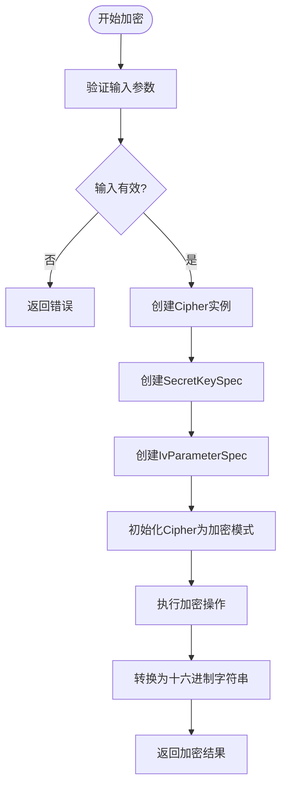
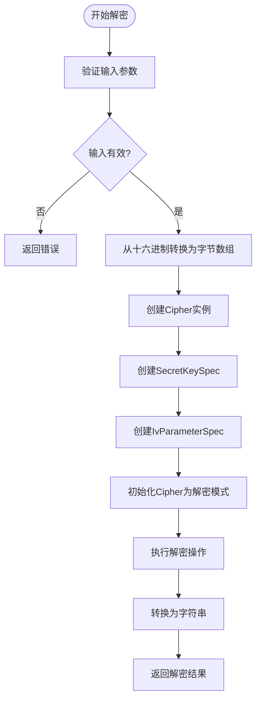
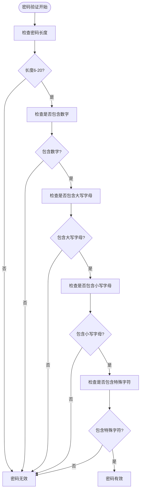
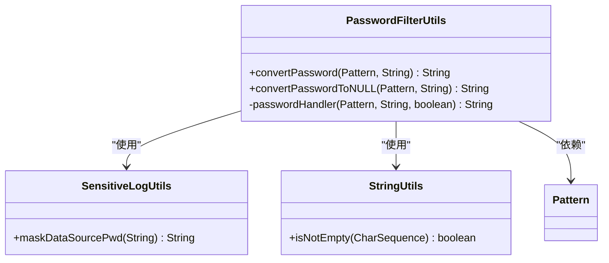
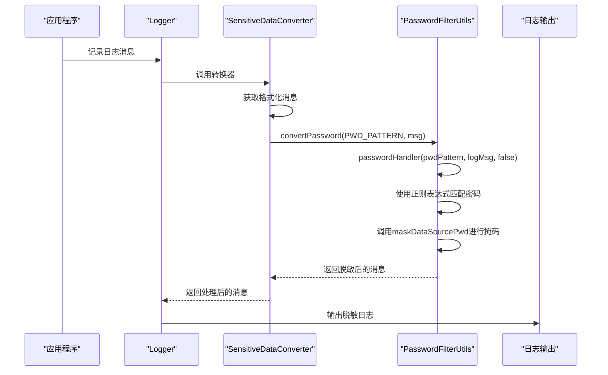
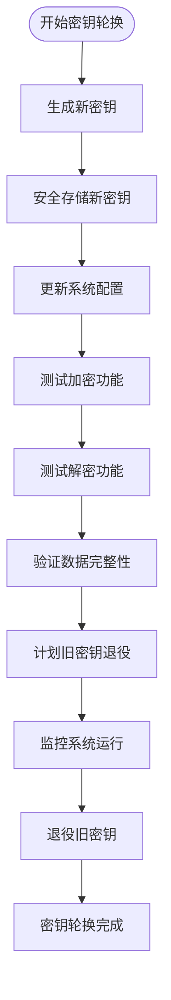

# 数据安全配置

<cite>
**本文档引用的文件**
- [CryptionUtils.java](file://datavines-common/src/main/java/io/datavines/common/utils/CryptionUtils.java)
- [PasswordFilterUtils.java](file://datavines-common/src/main/java/io/datavines/common/utils/PasswordFilterUtils.java)
- [SensitiveDataConverter.java](file://datavines-common/src/main/java/io/datavines/common/log/SensitiveDataConverter.java)
- [SensitiveLogUtils.java](file://datavines-common/src/main/java/io/datavines/common/utils/SensitiveLogUtils.java)
- [CommonConstants.java](file://datavines-common/src/main/java/io/datavines/common/CommonConstants.java)
- [server-logback.xml](file://datavines-server/src/main/resources/server-logback.xml)
- [application.yaml](file://datavines-server/src/main/resources/application.yaml)
- [constants.ts](file://datavines-ui/src/utils/constants.ts)
</cite>

## 目录
1. [引言](#引言)
2. [敏感数据加密机制](#敏感数据加密机制)
3. [密码存储与验证策略](#密码存储与验证策略)
4. [日志敏感信息过滤](#日志敏感信息过滤)
5. [配置示例](#配置示例)
6. [数据泄露防护建议](#数据泄露防护建议)
7. [加密性能考量](#加密性能考量)
8. [密钥轮换策略](#密钥轮换策略)

## 引言
DataVines提供了一套完整的数据安全保护机制，确保敏感数据在存储、传输和日志记录过程中的安全性。本文档详细说明了DataVines的数据保护机制，包括敏感数据加密（CryptionUtils）、密码存储策略、日志中的敏感信息过滤等核心安全功能。通过分析CryptionUtils的加密算法和密钥管理、PasswordFilterUtils的密码验证规则，以及SensitiveDataConverter的日志脱敏机制，为系统管理员和开发人员提供全面的安全配置指导。

**本文档引用的文件**
- [CryptionUtils.java](file://datavines-common/src/main/java/io/datavines/common/utils/CryptionUtils.java)
- [PasswordFilterUtils.java](file://datavines-common/src/main/java/io/datavines/common/utils/PasswordFilterUtils.java)
- [SensitiveDataConverter.java](file://datavines-common/src/main/java/io/datavines/common/log/SensitiveDataConverter.java)

## 敏感数据加密机制

DataVines使用CryptionUtils类实现敏感数据的加密和解密功能，采用行业标准的AES加密算法保护数据安全。

### 加密算法与实现
CryptionUtils实现了基于AES（Advanced Encryption Standard）的加密机制，具体配置如下：
- **加密算法**: AES
- **转换模式**: AES/CBC/PKCS5Padding
- **初始化向量(IV)**: "0123456789ABCEDF"
- **填充模式**: PKCS5Padding

该加密方案采用CBC（Cipher Block Chaining）模式，通过将前一个密文块与当前明文块进行异或操作，增强了加密的安全性，防止相同明文产生相同密文。

### 加密流程


**Diagram sources**
- [CryptionUtils.java](file://datavines-common/src/main/java/io/datavines/common/utils/CryptionUtils.java#L33-L41)

### 解密流程


**Diagram sources**
- [CryptionUtils.java](file://datavines-common/src/main/java/io/datavines/common/utils/CryptionUtils.java#L43-L52)

**Section sources**
- [CryptionUtils.java](file://datavines-common/src/main/java/io/datavines/common/utils/CryptionUtils.java#L25-L85)

## 密码存储与验证策略

DataVines实施了多层次的密码安全策略，包括密码复杂度验证和安全存储机制。

### 密码复杂度要求
系统对用户密码实施严格的复杂度要求，确保密码安全性：

| 验证规则 | 描述 | 实现位置 |
|---------|------|---------|
| 长度要求 | 密码长度必须在6-20个字符之间 | CommonConstants.java |
| 复杂度要求 | 必须包含数字、大写字母、小写字母和特殊字符 | constants.ts |
| 正则表达式 | `^.*(?=.{6,})(?=.*\d)(?=.*[A-Z])(?=.*[a-z])(?=.*[!@#$%^&*? ]).*$` | constants.ts |



**Diagram sources**
- [CommonConstants.java](file://datavines-common/src/main/java/io/datavines/common/CommonConstants.java#L171)
- [constants.ts](file://datavines-ui/src/utils/constants.ts#L2)

### 密码验证实现
PasswordFilterUtils类负责处理密码相关的安全操作，主要功能包括：

1. **密码模式匹配**: 使用正则表达式识别日志中的密码字段
2. **密码脱敏处理**: 将识别到的密码替换为掩码
3. **灵活的脱敏策略**: 支持替换为固定掩码或完全移除



**Diagram sources**
- [PasswordFilterUtils.java](file://datavines-common/src/main/java/io/datavines/common/utils/PasswordFilterUtils.java#L25-L77)
- [SensitiveLogUtils.java](file://datavines-common/src/main/java/io/datavines/common/utils/SensitiveLogUtils.java#L24-L39)

**Section sources**
- [PasswordFilterUtils.java](file://datavines-common/src/main/java/io/datavines/common/utils/PasswordFilterUtils.java#L25-L77)
- [CommonConstants.java](file://datavines-common/src/main/java/io/datavines/common/CommonConstants.java#L171)
- [constants.ts](file://datavines-ui/src/utils/constants.ts#L2)

## 日志敏感信息过滤

DataVines通过日志过滤机制防止敏感信息（如密码）被记录到日志文件中，确保日志的安全性。

### 日志脱敏架构
系统采用Logback框架的转换规则（conversionRule）机制，在日志输出前对敏感信息进行脱敏处理。



**Diagram sources**
- [SensitiveDataConverter.java](file://datavines-common/src/main/java/io/datavines/common/log/SensitiveDataConverter.java#L29-L60)
- [PasswordFilterUtils.java](file://datavines-common/src/main/java/io/datavines/common/utils/PasswordFilterUtils.java#L25-L77)

### 敏感数据转换器
SensitiveDataConverter继承自Logback的MessageConverter，实现了日志消息的转换功能：

- **正则表达式匹配**: 识别JSON格式中的密码字段
- **双模式匹配**: 支持转义和非转义的JSON字符串
- **实时脱敏**: 在日志输出前即时处理敏感信息

```java
// 正则表达式定义
public static final String DATASOURCE_PASSWORD_REGEX = "(?<=(\\\\\"password\\\\\":\\\\\")).*?(?=(\\\\\"))";
public static final String DATASOURCE_PASSWORD_REGEX_1 = "(?<=(\"password\":\")).*?(?=(\"))";
```

### 日志过滤配置
在server-logback.xml中配置了敏感数据转换器：

```xml
<conversionRule conversionWord="message"
                converterClass="io.datavines.common.log.SensitiveDataConverter"/>
```

此配置将"message"关键字映射到自定义的SensitiveDataConverter类，确保所有日志消息都经过脱敏处理。

**Section sources**
- [SensitiveDataConverter.java](file://datavines-common/src/main/java/io/datavines/common/log/SensitiveDataConverter.java#L29-L60)
- [server-logback.xml](file://datavines-server/src/main/resources/server-logback.xml#L33-L34)

## 配置示例

### 加密强度配置
虽然加密算法和模式在代码中硬编码，但可以通过外部配置管理加密密钥：

```yaml
# application.yaml - 数据源配置示例
spring:
  datasource:
    url: jdbc:postgresql://127.0.0.1:5432/datavines
    username: postgres
    password: ${ENCRYPTED_PASSWORD_KEY} # 使用加密的密码
```

### 密码复杂度配置
密码复杂度规则在多个位置定义，确保前后端一致性：

```properties
# common.properties - 后端密码规则
REG_USER_PASSWORD=. {6,20}
```

```typescript
// constants.ts - 前端密码规则
export const PWD_REG = /^.*(?=.{6,})(?=.*\d)(?=.*[A-Z])(?=.*[a-z])(?=.*[!@#$%^&*? ]). *$/;
```

### 敏感字段过滤规则
日志脱敏规则通过正则表达式定义，可扩展以支持更多敏感字段：

```java
// SensitiveDataConverter.java - 敏感字段正则表达式
public static final String DATASOURCE_PASSWORD_REGEX = "(?<=(\\\\\"password\\\\\":\\\\\")).*?(?=(\\\\\"))";
public static final String DATASOURCE_PASSWORD_REGEX_1 = "(?<=(\"password\":\")).*?(?=(\"))";
```

**Section sources**
- [application.yaml](file://datavines-server/src/main/resources/application.yaml#L23-L27)
- [common.properties](file://datavines-common/src/main/resources/common.properties#L18-L25)
- [constants.ts](file://datavines-ui/src/utils/constants.ts#L2)
- [SensitiveDataConverter.java](file://datavines-common/src/main/java/io/datavines/common/log/SensitiveDataConverter.java#L34-L39)

## 数据泄露防护建议

### 最佳实践
1. **密钥管理**: 将加密密钥存储在安全的密钥管理系统中，避免硬编码
2. **最小权限原则**: 为数据库用户分配最小必要权限
3. **定期审计**: 定期审查日志文件，确保没有敏感信息泄露
4. **网络加密**: 在传输敏感数据时使用SSL/TLS加密

### 安全配置检查清单
- [ ] 确保所有密码字段都经过加密存储
- [ ] 验证日志脱敏机制正常工作
- [ ] 检查密码复杂度策略是否强制执行
- [ ] 确认加密密钥的安全存储
- [ ] 定期轮换加密密钥

**Section sources**
- [CryptionUtils.java](file://datavines-common/src/main/java/io/datavines/common/utils/CryptionUtils.java)
- [SensitiveDataConverter.java](file://datavines-common/src/main/java/io/datavines/common/log/SensitiveDataConverter.java)

## 加密性能考量

### 性能影响分析
AES加密对系统性能的影响相对较小，但大规模数据加密仍需考虑：

| 操作 | 时间复杂度 | 空间复杂度 | 性能建议 |
|------|-----------|-----------|---------|
| 单次加密 | O(n) | O(n) | 适用于小数据量 |
| 批量加密 | O(n) | O(n) | 建议分批处理 |
| 密钥生成 | O(1) | O(1) | 可缓存重复使用 |

### 优化策略
1. **缓存加密结果**: 对于频繁访问的静态数据，可缓存加密结果
2. **异步加密**: 对于大数据量的加密操作，考虑使用异步处理
3. **批量处理**: 将多个小数据块合并为大数据块进行加密，减少加密开销
4. **硬件加速**: 在支持的环境中使用硬件加密加速

**Section sources**
- [CryptionUtils.java](file://datavines-common/src/main/java/io/datavines/common/utils/CryptionUtils.java)

## 密钥轮换策略

### 密钥管理建议
虽然当前实现中密钥作为参数传入，但建议采用以下密钥管理策略：

1. **定期轮换**: 每90天轮换一次加密密钥
2. **多版本支持**: 支持新旧密钥并存，确保平滑过渡
3. **安全存储**: 使用专门的密钥管理系统（如Hashicorp Vault）存储密钥
4. **访问控制**: 严格控制密钥的访问权限

### 密钥轮换流程


**Section sources**
- [CryptionUtils.java](file://datavines-common/src/main/java/io/datavines/common/utils/CryptionUtils.java)