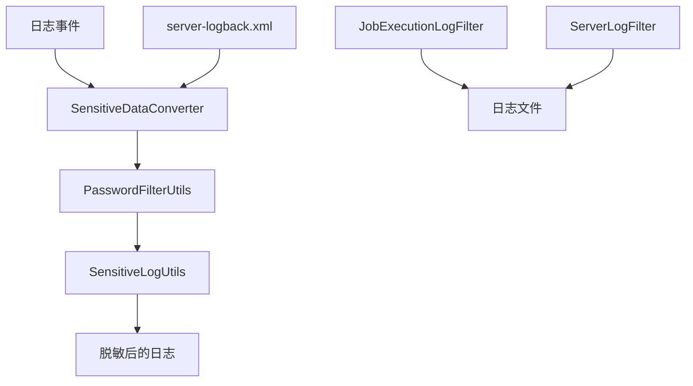
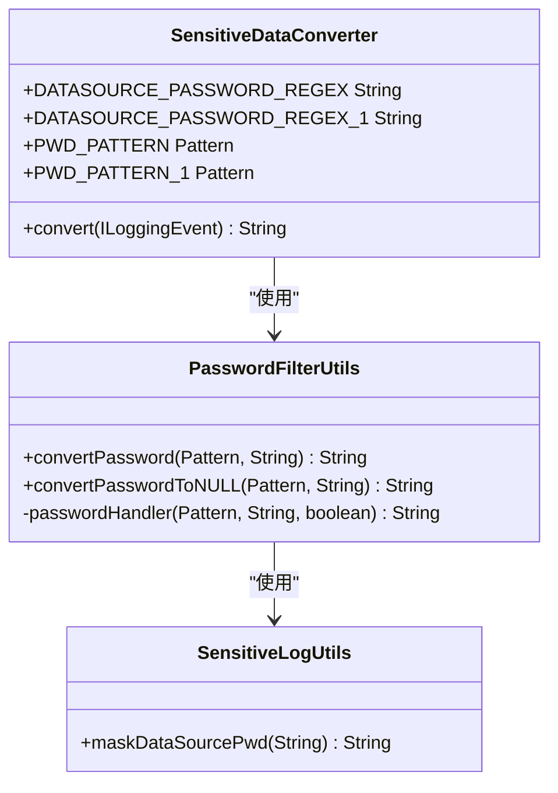
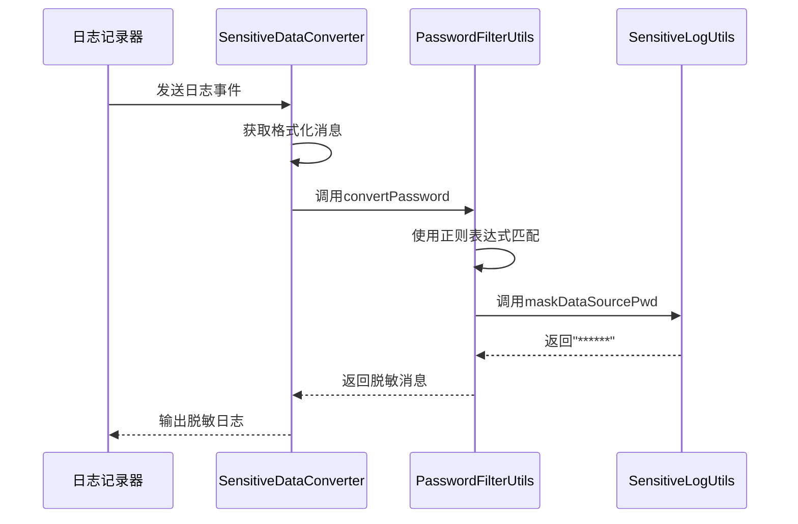
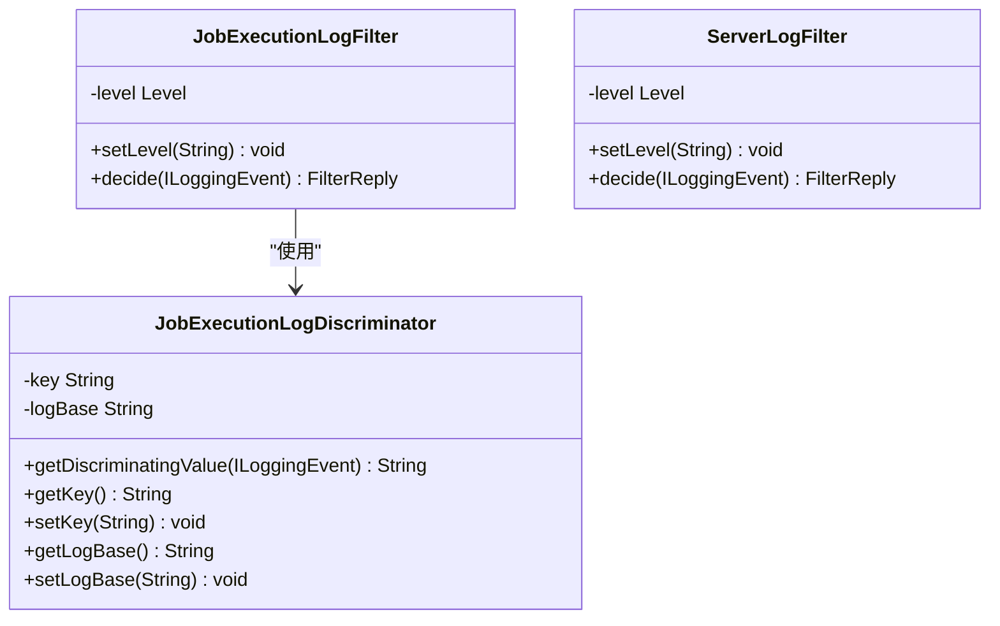

# 日志安全

<cite>
**本文档引用的文件**   
- [PasswordFilterUtils.java](file://datavines-common/src/main/java/io/datavines/common/utils/PasswordFilterUtils.java)
- [SensitiveDataConverter.java](file://datavines-common/src/main/java/io/datavines/common/log/SensitiveDataConverter.java)
- [SensitiveLogUtils.java](file://datavines-common/src/main/java/io/datavines/common/utils/SensitiveLogUtils.java)
- [server-logback.xml](file://datavines-server/src/main/resources/server-logback.xml)
- [JobExecutionLogFilter.java](file://datavines-common/src/main/java/io/datavines/common/log/JobExecutionLogFilter.java)
- [ServerLogFilter.java](file://datavines-common/src/main/java/io/datavines/common/log/ServerLogFilter.java)
- [LoggerUtils.java](file://datavines-common/src/main/java/io/datavines/common/utils/LoggerUtils.java)
- [JobExecutionLogDiscriminator.java](file://datavines-common/src/main/java/io/datavines/common/log/JobExecutionLogDiscriminator.java)
- [application.yaml](file://datavines-server/src/main/resources/application.yaml)
</cite>

## 目录
1. [引言](#引言)
2. [日志安全架构](#日志安全架构)
3. [敏感信息过滤机制](#敏感信息过滤机制)
4. [日志脱敏配置](#日志脱敏配置)
5. [日志安全最佳实践](#日志安全最佳实践)
6. [结论](#结论)

## 引言

DataVines平台通过多层次的日志安全机制来保护敏感信息，防止密码等机密数据在日志中明文显示。本文档详细说明了DataVines如何通过PasswordFilterUtils和SensitiveDataConverter等组件实现日志脱敏，以及如何配置敏感字段的识别规则和过滤策略。

**本节不包含具体文件分析，因此不提供来源**

## 日志安全架构

DataVines的日志安全架构基于Logback框架构建，通过自定义转换器和过滤器实现敏感信息的自动脱敏。系统在日志输出前对消息进行处理，确保敏感数据被正确屏蔽。



**图表来源**
- [SensitiveDataConverter.java](file://datavines-common/src/main/java/io/datavines/common/log/SensitiveDataConverter.java#L29-L60)
- [PasswordFilterUtils.java](file://datavines-common/src/main/java/io/datavines/common/utils/PasswordFilterUtils.java#L25-L76)
- [server-logback.xml](file://datavines-server/src/main/resources/server-logback.xml#L33-L59)

**本节来源**
- [SensitiveDataConverter.java](file://datavines-common/src/main/java/io/datavines/common/log/SensitiveDataConverter.java#L1-L60)
- [server-logback.xml](file://datavines-server/src/main/resources/server-logback.xml#L1-L85)

## 敏感信息过滤机制

### PasswordFilterUtils组件

PasswordFilterUtils是DataVines中负责处理敏感日志的核心工具类。它通过正则表达式匹配和替换机制，对包含密码等敏感信息的日志消息进行过滤。



**图表来源**
- [PasswordFilterUtils.java](file://datavines-common/src/main/java/io/datavines/common/utils/PasswordFilterUtils.java#L25-L76)
- [SensitiveDataConverter.java](file://datavines-common/src/main/java/io/datavines/common/log/SensitiveDataConverter.java#L29-L60)
- [SensitiveLogUtils.java](file://datavines-common/src/main/java/io/datavines/common/utils/SensitiveLogUtils.java#L24-L38)

**本节来源**
- [PasswordFilterUtils.java](file://datavines-common/src/main/java/io/datavines/common/utils/PasswordFilterUtils.java#L25-L76)
- [SensitiveLogUtils.java](file://datavines-common/src/main/java/io/datavines/common/utils/SensitiveLogUtils.java#L24-L38)

### SensitiveDataConverter实现

SensitiveDataConverter继承自Logback的MessageConverter，作为日志消息的转换器，在日志输出前对消息内容进行处理。它使用预定义的正则表达式来识别JSON格式中的密码字段。



**图表来源**
- [SensitiveDataConverter.java](file://datavines-common/src/main/java/io/datavines/common/log/SensitiveDataConverter.java#L51-L58)
- [PasswordFilterUtils.java](file://datavines-common/src/main/java/io/datavines/common/utils/PasswordFilterUtils.java#L32-L41)
- [SensitiveLogUtils.java](file://datavines-common/src/main/java/io/datavines/common/utils/SensitiveLogUtils.java#L30-L36)

**本节来源**
- [SensitiveDataConverter.java](file://datavines-common/src/main/java/io/datavines/common/log/SensitiveDataConverter.java#L29-L60)

## 日志脱敏配置

### 敏感字段识别规则

DataVines通过正则表达式来识别敏感字段，主要针对JSON格式中的密码字段。系统定义了两种正则表达式模式来匹配不同格式的JSON数据。

```mermaid
flowchart TD
A[原始日志消息] --> B{包含"password"字段?}
B --> |是| C[应用正则表达式匹配]
B --> |否| D[保持原样]
C --> E[提取密码值]
E --> F[替换为掩码]
F --> G[返回脱敏消息]
D --> G
```

**图表来源**
- [SensitiveDataConverter.java](file://datavines-common/src/main/java/io/datavines/common/log/SensitiveDataConverter.java#L34-L39)
- [PasswordFilterUtils.java](file://datavines-common/src/main/java/io/datavines/common/utils/PasswordFilterUtils.java#L59-L74)

**本节来源**
- [SensitiveDataConverter.java](file://datavines-common/src/main/java/io/datavines/common/log/SensitiveDataConverter.java#L31-L49)

### 日志脱敏级别配置

通过server-logback.xml配置文件，可以设置日志的脱敏级别和输出格式。DataVines使用自定义的转换规则来启用敏感数据转换器。

```xml
<conversionRule conversionWord="message"
                converterClass="io.datavines.common.log.SensitiveDataConverter"/>
```

此配置将"message"关键字映射到SensitiveDataConverter类，使得所有日志消息都会经过该转换器处理。

**本节来源**
- [server-logback.xml](file://datavines-server/src/main/resources/server-logback.xml#L33-L34)

### 敏感字段列表配置

DataVines目前主要针对数据源配置中的密码字段进行脱敏处理。系统通过以下正则表达式识别敏感字段：

- `(?<=(\\\"password\\\":\\\")) .*?(?=(\\\"))`：匹配转义引号的JSON格式
- `(?<=(\"password\": \")) .*?(?=(\"))`：匹配普通引号的JSON格式

这些规则在SensitiveDataConverter中作为静态常量定义，确保了敏感信息的一致性处理。

**本节来源**
- [SensitiveDataConverter.java](file://datavines-common/src/main/java/io/datavines/common/log/SensitiveDataConverter.java#L34-L39)

## 日志安全最佳实践

### 审计日志保护

DataVines通过JobExecutionLogFilter和ServerLogFilter等过滤器来保护审计日志。这些过滤器基于线程名称来决定是否记录日志，确保只有特定线程的日志被写入文件。



**图表来源**
- [JobExecutionLogFilter.java](file://datavines-common/src/main/java/io/datavines/common/log/JobExecutionLogFilter.java#L25-L45)
- [ServerLogFilter.java](file://datavines-common/src/main/java/io/datavines/common/log/ServerLogFilter.java#L27-L47)
- [JobExecutionLogDiscriminator.java](file://datavines-common/src/main/java/io/datavines/common/log/JobExecutionLogDiscriminator.java#L28-L69)

**本节来源**
- [JobExecutionLogFilter.java](file://datavines-common/src/main/java/io/datavines/common/log/JobExecutionLogFilter.java#L25-L45)
- [ServerLogFilter.java](file://datavines-common/src/main/java/io/datavines/common/log/ServerLogFilter.java#L27-L47)

### 日志访问控制

DataVines通过多层机制实现日志访问控制：

1. **文件权限控制**：日志文件存储在受保护的目录中，只有授权用户才能访问
2. **线程过滤**：通过自定义过滤器限制日志输出的线程
3. **日志分离**：使用SiftingAppender根据作业执行唯一ID分离日志文件

```mermaid
graph TD
A[日志事件] --> B{线程名称检查}
B --> |以"JobExecutionLogInfo"开头| C[接受]
B --> |否则| D[拒绝]
C --> E{级别>=阈值}
E --> |是| F[写入日志文件]
E --> |否| G[丢弃]
D --> G
```

**图表来源**
- [JobExecutionLogFilter.java](file://datavines-common/src/main/java/io/datavines/common/log/JobExecutionLogFilter.java#L39-L43)
- [server-logback.xml](file://datavines-server/src/main/resources/server-logback.xml#L36-L38)

**本节来源**
- [JobExecutionLogFilter.java](file://datavines-common/src/main/java/io/datavines/common/log/JobExecutionLogFilter.java#L25-L45)
- [server-logback.xml](file://datavines-server/src/main/resources/server-logback.xml#L35-L59)

## 结论

DataVines通过PasswordFilterUtils、SensitiveDataConverter和相关组件构建了一个完整的日志安全体系。该系统能够有效识别和脱敏敏感信息，特别是密码等关键数据，确保日志文件的安全性。通过合理的配置和最佳实践，可以进一步增强日志系统的安全性，保护系统的机密信息不被泄露。

**本节不包含具体文件分析，因此不提供来源**