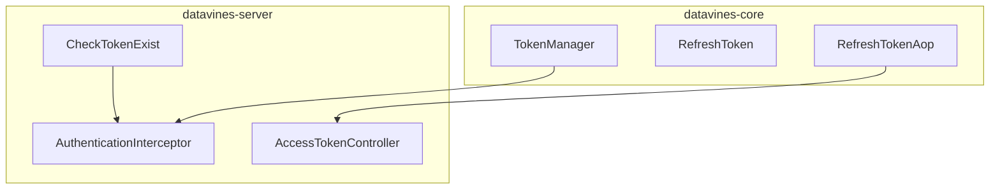
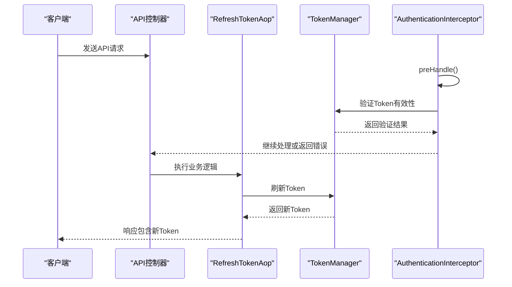
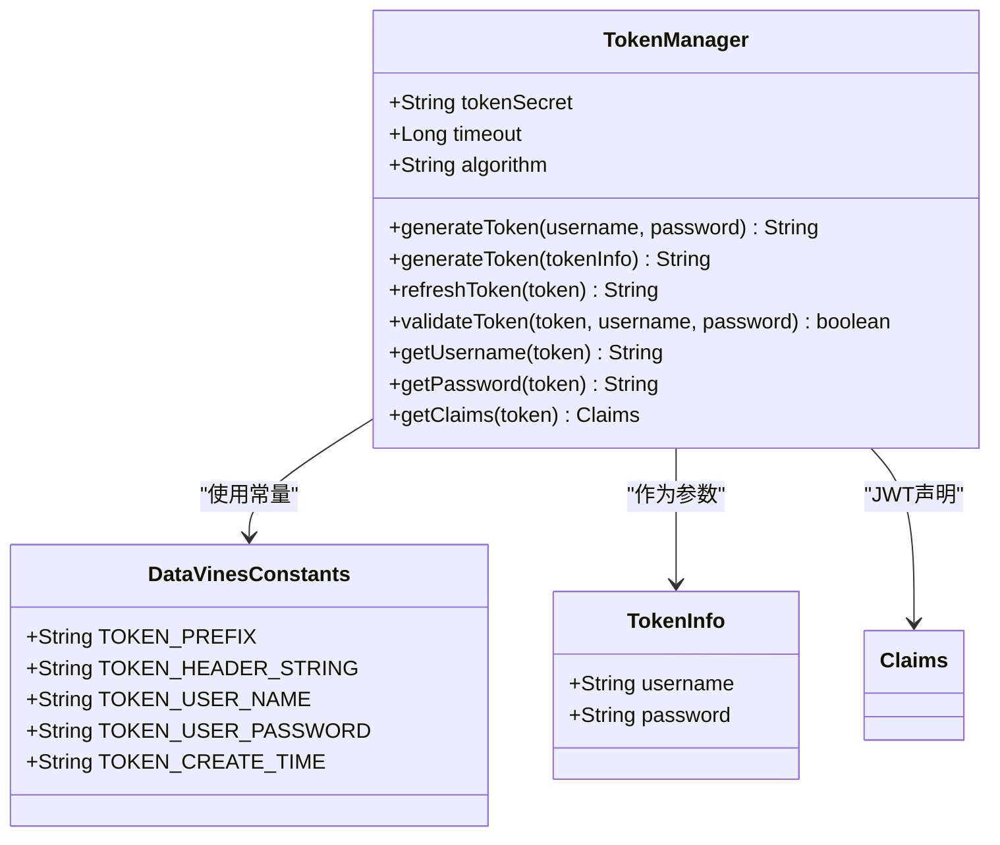
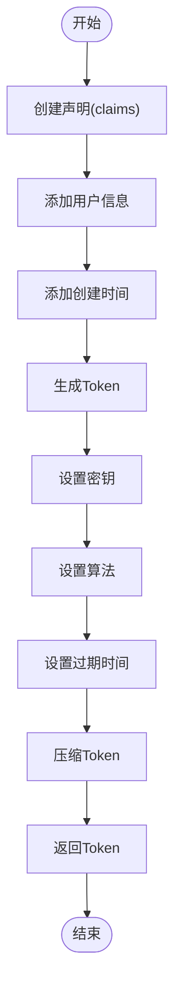
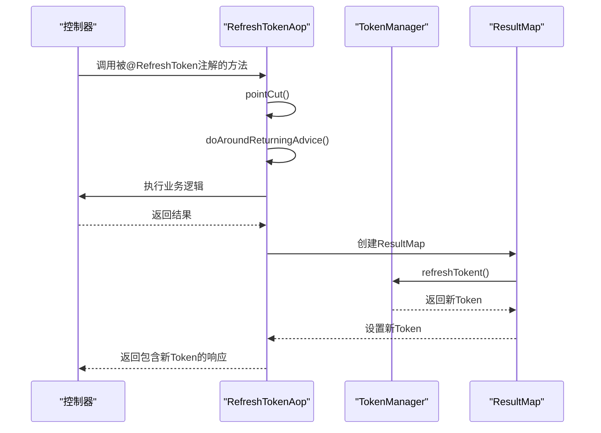
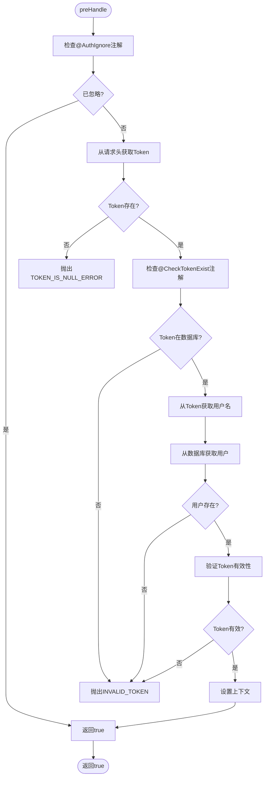
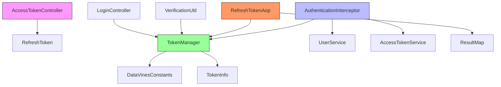

# Token管理

<cite>
**本文档引用的文件**  
- [TokenManager.java](file://datavines-core/src/main/java/io/datavines/core/utils/TokenManager.java)
- [DataVinesConstants.java](file://datavines-core/src/main/java/io/datavines/core/constant/DataVinesConstants.java)
- [TokenInfo.java](file://datavines-common/src/main/java/io/datavines/common/entity/TokenInfo.java)
- [RefreshTokenAop.java](file://datavines-core/src/main/java/io/datavines/core/aop/RefreshTokenAop.java)
- [RefreshToken.java](file://datavines-core/src/main/java/io/datavines/core/aop/RefreshToken.java)
- [AuthenticationInterceptor.java](file://datavines-server/src/main/java/io/datavines/server/api/inteceptor/AuthenticationInterceptor.java)
- [CheckTokenExist.java](file://datavines-server/src/main/java/io/datavines/server/api/annotation/CheckTokenExist.java)
- [application.yaml](file://datavines-server/src/main/resources/application.yaml)
</cite>

## 目录
1. [简介](#简介)
2. [项目结构](#项目结构)
3. [核心组件](#核心组件)
4. [架构概述](#架构概述)
5. [详细组件分析](#详细组件分析)
6. [依赖分析](#依赖分析)
7. [性能考虑](#性能考虑)
8. [故障排除指南](#故障排除指南)
9. [结论](#结论)

## 简介
本文档详细说明DataVines中JWT Token的生成、验证和刷新机制。文档解释了TokenManager类的实现原理，包括Token的创建、解析、验证和刷新流程。同时说明了如何在application.yaml中配置Token的密钥、有效期、刷新策略等参数。文档还提供了代码示例展示Token的生成和验证过程，以及如何通过CheckTokenExist注解保护API接口。最后包含Token安全性最佳实践、常见问题排查和性能优化建议。

## 项目结构
DataVines项目的Token管理功能主要分布在以下几个模块中：
- datavines-core：包含核心的TokenManager类和相关工具
- datavines-server：包含API控制器、拦截器和认证相关组件
- datavines-common：包含通用的实体类和工具

Token管理的核心功能集中在datavines-core模块的utils包中，通过Spring AOP和拦截器机制与datavines-server模块集成。

**图表来源**
- [TokenManager.java](file://datavines-core/src/main/java/io/datavines/core/utils/TokenManager.java)
- [RefreshTokenAop.java](file://datavines-core/src/main/java/io/datavines/core/aop/RefreshTokenAop.java)
- [AuthenticationInterceptor.java](file://datavines-server/src/main/java/io/datavines/server/api/inteceptor/AuthenticationInterceptor.java)
- [CheckTokenExist.java](file://datavines-server/src/main/java/io/datavines/server/api/annotation/CheckTokenExist.java)

**章节来源**
- [TokenManager.java](file://datavines-core/src/main/java/io/datavines/core/utils/TokenManager.java)
- [RefreshTokenAop.java](file://datavines-core/src/main/java/io/datavines/core/aop/RefreshTokenAop.java)
- [AuthenticationInterceptor.java](file://datavines-server/src/main/java/io/datavines/server/api/inteceptor/AuthenticationInterceptor.java)

## 核心组件
DataVines的Token管理核心组件包括TokenManager类、RefreshTokenAop切面、AuthenticationInterceptor拦截器和CheckTokenExist注解。这些组件协同工作，实现了完整的JWT Token生命周期管理。

TokenManager类负责Token的生成、解析、验证和刷新等核心功能。它使用JWT标准实现Token的安全管理，并通过Spring的@Value注解从配置文件中读取相关参数。

RefreshTokenAop切面用于自动刷新Token，确保用户会话的持续性。AuthenticationInterceptor拦截器负责在请求处理前验证Token的有效性，而CheckTokenExist注解则提供了细粒度的Token存在性检查。

**章节来源**
- [TokenManager.java](file://datavines-core/src/main/java/io/datavines/core/utils/TokenManager.java)
- [RefreshTokenAop.java](file://datavines-core/src/main/java/io/datavines/core/aop/RefreshTokenAop.java)
- [AuthenticationInterceptor.java](file://datavines-server/src/main/java/io/datavines/server/api/inteceptor/AuthenticationInterceptor.java)
- [CheckTokenExist.java](file://datavines-server/src/main/java/io/datavines/server/api/annotation/CheckTokenExist.java)

## 架构概述
DataVines的Token管理架构采用分层设计，将Token的生成、验证和刷新功能分离，同时通过AOP和拦截器机制实现非侵入式的安全控制。

**图表来源**
- [TokenManager.java](file://datavines-core/src/main/java/io/datavines/core/utils/TokenManager.java)
- [RefreshTokenAop.java](file://datavines-core/src/main/java/io/datavines/core/aop/RefreshTokenAop.java)
- [AuthenticationInterceptor.java](file://datavines-server/src/main/java/io/datavines/server/api/inteceptor/AuthenticationInterceptor.java)

## 详细组件分析

### TokenManager分析
TokenManager是DataVines中负责JWT Token管理的核心类，实现了Token的生成、解析、验证和刷新等关键功能。

#### 类图

**图表来源**
- [TokenManager.java](file://datavines-core/src/main/java/io/datavines/core/utils/TokenManager.java)
- [DataVinesConstants.java](file://datavines-core/src/main/java/io/datavines/core/constant/DataVinesConstants.java)
- [TokenInfo.java](file://datavines-common/src/main/java/io/datavines/common/entity/TokenInfo.java)

#### Token生成流程

**图表来源**
- [TokenManager.java](file://datavines-core/src/main/java/io/datavines/core/utils/TokenManager.java)

**章节来源**
- [TokenManager.java](file://datavines-core/src/main/java/io/datavines/core/utils/TokenManager.java)

### RefreshToken机制分析
RefreshToken机制通过AOP切面实现，自动为响应添加刷新后的Token，确保用户会话的持续性。

#### AOP流程

**图表来源**
- [RefreshTokenAop.java](file://datavines-core/src/main/java/io/datavines/core/aop/RefreshTokenAop.java)
- [TokenManager.java](file://datavines-core/src/main/java/io/datavines/core/utils/TokenManager.java)

**章节来源**
- [RefreshTokenAop.java](file://datavines-core/src/main/java/io/datavines/core/aop/RefreshTokenAop.java)

### 认证拦截器分析
AuthenticationInterceptor负责在请求处理前验证Token的有效性，是安全控制的关键组件。

#### 拦截器流程

**图表来源**
- [AuthenticationInterceptor.java](file://datavines-server/src/main/java/io/datavines/server/api/inteceptor/AuthenticationInterceptor.java)

**章节来源**
- [AuthenticationInterceptor.java](file://datavines-server/src/main/java/io/datavines/server/api/inteceptor/AuthenticationInterceptor.java)

## 依赖分析
DataVines的Token管理组件之间存在明确的依赖关系，形成了一个完整的安全控制链。

**图表来源**
- [AccessTokenController.java](file://datavines-server/src/main/java/io/datavines/server/api/controller/AccessTokenController.java)
- [AuthenticationInterceptor.java](file://datavines-server/src/main/java/io/datavines/server/api/inteceptor/AuthenticationInterceptor.java)
- [RefreshTokenAop.java](file://datavines-core/src/main/java/io/datavines/core/aop/RefreshTokenAop.java)
- [TokenManager.java](file://datavines-core/src/main/java/io/datavines/core/utils/TokenManager.java)

**章节来源**
- [AccessTokenController.java](file://datavines-server/src/main/java/io/datavines/server/api/controller/AccessTokenController.java)
- [AuthenticationInterceptor.java](file://datavines-server/src/main/java/io/datavines/server/api/inteceptor/AuthenticationInterceptor.java)
- [RefreshTokenAop.java](file://datavines-core/src/main/java/io/datavines/core/aop/RefreshTokenAop.java)
- [TokenManager.java](file://datavines-core/src/main/java/io/datavines/core/utils/TokenManager.java)

## 性能考虑
在Token管理方面，DataVines通过以下方式优化性能：

1. **缓存机制**：虽然当前实现中没有显式的缓存，但可以通过在UserService中添加缓存来减少数据库查询。
2. **JWT自包含特性**：JWT Token本身包含所有必要信息，避免了每次请求都需要查询数据库。
3. **异步处理**：Token刷新操作可以在后台异步执行，减少响应时间。
4. **连接池**：使用HikariCP连接池提高数据库访问效率。

建议在高并发场景下考虑引入Redis等缓存系统来存储Token黑名单和用户信息，进一步提升性能。

## 故障排除指南

### 常见问题及解决方案
| 问题 | 可能原因 | 解决方案 |
|------|---------|---------|
| Token为空 | 请求头中未包含Authorization字段 | 确保请求头包含"Authorization: Bearer <token>" |
| Token无效 | 密钥不匹配或Token被篡改 | 检查application.yaml中的jwt.token.secret配置 |
| Token过期 | 超过有效期 | 调用刷新Token接口或重新登录 |
| 用户不存在 | 用户名在数据库中不存在 | 检查用户名是否正确或用户是否被删除 |
| 算法不支持 | 配置的算法不受支持 | 检查jwt.token.algorithm配置是否正确 |

### 配置检查清单
- [ ] 确认application.yaml中jwt.token.secret已正确配置
- [ ] 确认jwt.token.timeout设置合理（单位：毫秒）
- [ ] 确认jwt.token.algorithm是JWT支持的算法（如HS256）
- [ ] 确认Token前缀为"Bearer"
- [ ] 确认Token请求头名称为"Authorization"

**章节来源**
- [application.yaml](file://datavines-server/src/main/resources/application.yaml)
- [TokenManager.java](file://datavines-core/src/main/java/io/datavines/core/utils/TokenManager.java)

## 结论
DataVines的Token管理机制基于JWT标准实现，提供了完整的Token生命周期管理功能。通过TokenManager类、AOP切面和拦截器的协同工作，实现了安全、高效的用户认证和授权机制。

系统的主要优势包括：
1. **安全性**：使用JWT标准，Token包含签名防止篡改
2. **可扩展性**：基于Spring框架，易于扩展和定制
3. **易用性**：通过注解简化了Token管理的使用
4. **灵活性**：支持多种配置选项，适应不同场景需求

建议在生产环境中：
1. 使用强密码作为token.secret
2. 设置合理的token.timeout值
3. 定期轮换密钥
4. 监控Token相关的安全事件
5. 考虑引入分布式缓存提升性能