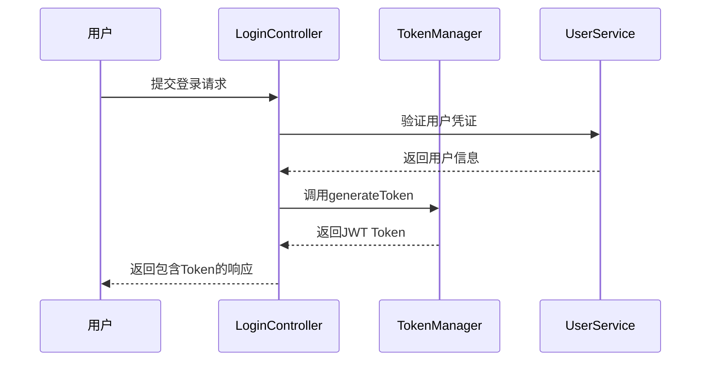
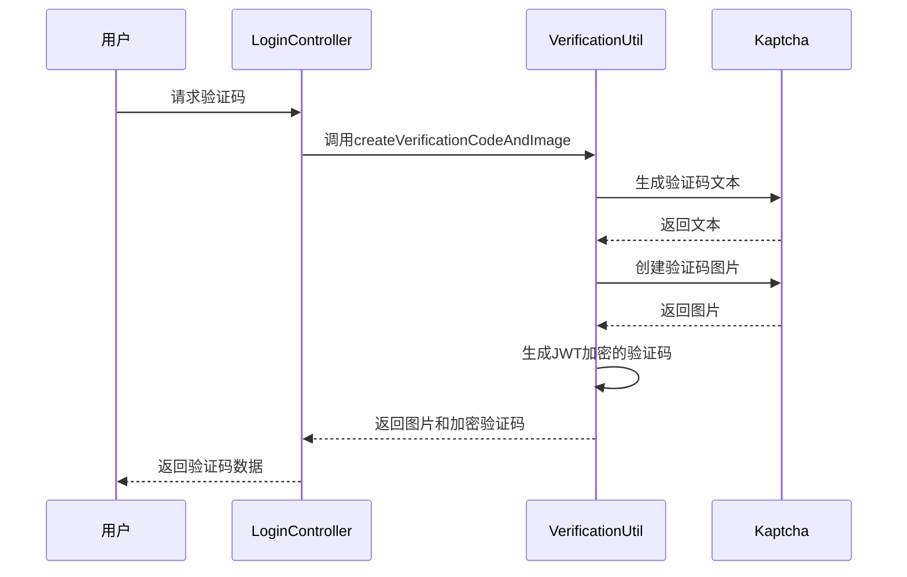
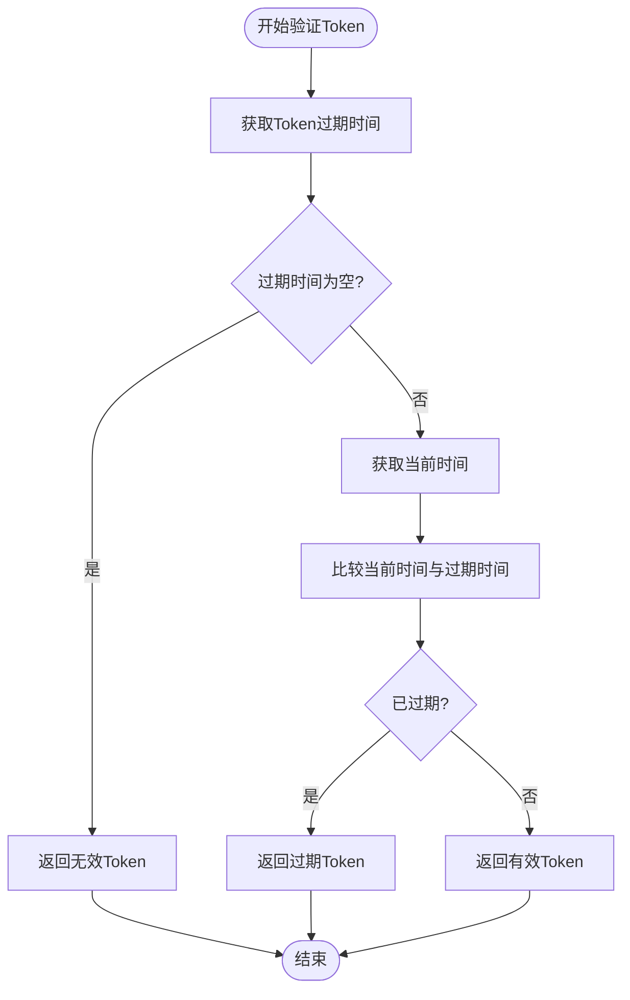
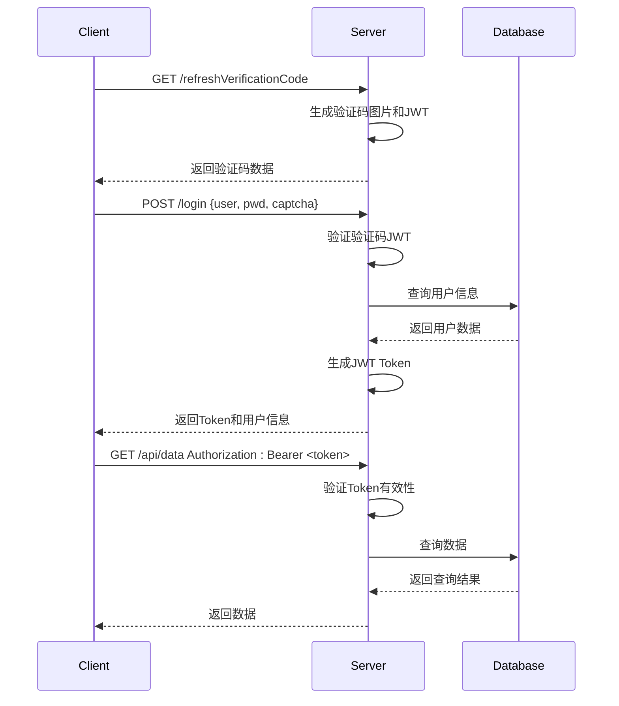

# 认证配置

<cite>
**本文档引用的文件**  
- [TokenManager.java](file://datavines-core/src/main/java/io/datavines/core/utils/TokenManager.java)
- [KaptchaConfig.java](file://datavines-server/src/main/java/io/datavines/server/api/config/KaptchaConfig.java)
- [VerificationUtil.java](file://datavines-server/src/main/java/io/datavines/server/utils/VerificationUtil.java)
- [LoginController.java](file://datavines-server/src/main/java/io/datavines/server/api/controller/LoginController.java)
- [AuthenticationInterceptor.java](file://datavines-server/src/main/java/io/datavines/server/api/inteceptor/AuthenticationInterceptor.java)
- [RefreshTokenAop.java](file://datavines-core/src/main/java/io/datavines/core/aop/RefreshTokenAop.java)
- [application.yaml](file://datavines-server/src/main/resources/application.yaml)
</cite>

## 目录
1. [简介](#简介)
2. [JWT Token管理](#jwt-token管理)
3. [验证码配置](#验证码配置)
4. [登录会话管理](#登录会话管理)
5. [Token过期策略](#token过期策略)
6. [TokenManager实现原理](#tokenmanager实现原理)
7. [认证流程示例](#认证流程示例)
8. [常见问题排查](#常见问题排查)
9. [性能优化建议](#性能优化建议)

## 简介
DataVines的用户认证机制基于JWT（JSON Web Token）实现，提供了安全的用户身份验证和授权功能。系统通过TokenManager组件管理JWT Token的生成、验证和刷新，同时集成了Kaptcha验证码系统来增强安全性。本文档详细说明了DataVines的认证配置机制，包括JWT Token的生命周期管理、验证码配置、登录会话处理以及Token过期策略。

**Section sources**
- [TokenManager.java](file://datavines-core/src/main/java/io/datavines/core/utils/TokenManager.java#L1-L197)
- [KaptchaConfig.java](file://datavines-server/src/main/java/io/datavines/server/api/config/KaptchaConfig.java#L1-L74)

## JWT Token管理

DataVines使用JWT Token进行用户认证，TokenManager是核心的Token管理组件，负责Token的生成、验证和刷新。JWT Token包含用户信息和创建时间，采用HS256算法进行签名。

### Token生成流程
当用户登录时，系统调用TokenManager的generateToken方法生成JWT Token。Token中包含用户名、密码和创建时间等声明（claims），并使用配置的密钥进行签名。



**Diagram sources**
- [LoginController.java](file://datavines-server/src/main/java/io/datavines/server/api/controller/LoginController.java#L54-L58)
- [TokenManager.java](file://datavines-core/src/main/java/io/datavines/core/utils/TokenManager.java#L51-L57)

### Token验证机制
系统通过AuthenticationInterceptor拦截器验证每个请求的Token。拦截器从请求头中提取Token，调用TokenManager的validateToken方法验证Token的有效性，包括签名验证和过期时间检查。

**Section sources**
- [TokenManager.java](file://datavines-core/src/main/java/io/datavines/core/utils/TokenManager.java#L163-L167)
- [AuthenticationInterceptor.java](file://datavines-server/src/main/java/io/datavines/server/api/inteceptor/AuthenticationInterceptor.java#L96-L98)

## 验证码配置

DataVines集成Kaptcha库实现图形验证码功能，用于注册和登录等敏感操作的安全验证。Kaptcha配置通过KaptchaConfig类进行管理，支持多种自定义选项。

### Kaptcha配置参数
Kaptcha的配置参数通过Spring的@Value注解从配置文件中读取，支持以下可配置项：

| 配置项 | 默认值 | 说明 |
|--------|-------|------|
| kaptcha.border | yes | 是否显示边框 |
| kaptcha.border.color | 105,179,90 | 边框颜色（RGB） |
| kaptcha.textproducer.font.color | blue | 字体颜色 |
| kaptcha.image.width | 125 | 图片宽度 |
| kaptcha.image.height | 65 | 图片高度 |
| kaptcha.textproducer.font.size | 45 | 字体大小 |
| kaptcha.session.key | code | Session键名 |
| kaptcha.textproducer.char.length | 4 | 验证码字符长度 |
| kaptcha.textproducer.font.names | cmr10 | 字体名称 |

**Section sources**
- [KaptchaConfig.java](file://datavines-server/src/main/java/io/datavines/server/api/config/KaptchaConfig.java#L29-L55)

### 验证码生成与验证
VerificationUtil工具类封装了验证码的生成和验证逻辑。系统生成验证码文本后，使用Kaptcha创建对应的图片，并将验证码文本通过JWT Token加密传输，确保安全性。



**Diagram sources**
- [VerificationUtil.java](file://datavines-server/src/main/java/io/datavines/server/utils/VerificationUtil.java#L52-L58)
- [LoginController.java](file://datavines-server/src/main/java/io/datavines/server/api/controller/LoginController.java#L70-L75)

## 登录会话管理

DataVines的登录会话管理采用无状态的JWT Token机制，不依赖服务器端的Session存储。每个请求都必须携带有效的JWT Token进行身份验证。

### Token刷新机制
系统通过RefreshTokenAop切面实现Token自动刷新功能。当带有@RefreshToken注解的控制器方法被调用时，AOP会自动更新Token的创建时间，延长其有效期。

```mermaid
classDiagram
class RefreshToken {
+@Target({ElementType.TYPE})
+@Retention(RetentionPolicy.RUNTIME)
}
class RefreshTokenAop {
-TokenManager tokenManager
+doAroundReturningAdvice(ProceedingJoinPoint)
}
class TokenManager {
+generateToken(String, String)
+refreshToken(String)
+validateToken(String, String, String)
}
RefreshTokenAop --> TokenManager : "使用"
RefreshTokenAop --> RefreshToken : "监听"
```

**Diagram sources**
- [RefreshToken.java](file://datavines-core/src/main/java/io/datavines/core/aop/RefreshToken.java#L24-L27)
- [RefreshTokenAop.java](file://datavines-core/src/main/java/io/datavines/core/aop/RefreshTokenAop.java#L39-L59)

### 认证拦截器
AuthenticationInterceptor是核心的认证拦截器，负责处理所有API请求的认证逻辑。拦截器通过以下步骤验证请求：

1. 检查方法是否标记为@AuthIgnore（无需认证）
2. 从请求头或参数中提取Token
3. 验证Token的有效性
4. 设置当前登录用户上下文

**Section sources**
- [AuthenticationInterceptor.java](file://datavines-server/src/main/java/io/datavines/server/api/inteceptor/AuthenticationInterceptor.java#L54-L98)
- [WebMvcConfig.java](file://datavines-server/src/main/java/io/datavines/server/api/config/WebMvcConfig.java#L44-L48)

## Token过期策略

DataVines实现了灵活的Token过期策略，通过配置文件和代码双重控制Token的有效期。

### 配置参数
Token的过期策略通过以下配置参数控制：

- **jwt.token.secret**: Token签名密钥，默认值为"asdqwe"
- **jwt.token.timeout**: Token超时时间（毫秒），默认值为8640000（2.4小时）
- **jwt.token.algorithm**: 签名算法，默认值为"HS256"

这些参数可以在application.yaml文件中进行配置：

```yaml
jwt:
  token:
    secret: your-secret-key
    timeout: 7200000  # 2小时
    algorithm: HS256
```

**Section sources**
- [TokenManager.java](file://datavines-core/src/main/java/io/datavines/core/utils/TokenManager.java#L42-L49)
- [application.yaml](file://datavines-server/src/main/resources/application.yaml#L1-L96)

### 过期时间验证
TokenManager通过isExpired方法检查Token是否过期。系统在每次验证Token时都会检查其过期时间，确保只有有效的Token才能通过认证。



**Diagram sources**
- [TokenManager.java](file://datavines-core/src/main/java/io/datavines/core/utils/TokenManager.java#L191-L194)

## TokenManager实现原理

TokenManager是DataVines认证系统的核心组件，基于Spring框架和JWT标准实现。其主要功能包括Token生成、解析、验证和刷新。

### 核心方法
TokenManager提供了以下核心方法：

- **generateToken**: 生成新的JWT Token
- **getClaims**: 解析Token获取声明信息
- **refreshToken**: 刷新Token有效期
- **validateToken**: 验证Token的有效性
- **getUsername**: 从Token中提取用户名
- **getPassword**: 从Token中提取密码

### 依赖关系
TokenManager依赖于Spring的@Value注解注入配置参数，并使用io.jsonwebtoken库进行JWT操作。系统通过@Component注解将其注册为Spring Bean，便于其他组件注入使用。

**Section sources**
- [TokenManager.java](file://datavines-core/src/main/java/io/datavines/core/utils/TokenManager.java#L40-L196)

## 认证流程示例

以下是一个完整的用户登录认证流程示例：

### 登录流程
1. 用户访问登录页面
2. 系统生成验证码并显示
3. 用户输入用户名、密码和验证码
4. 前端将数据提交到/login API
5. 后端验证验证码和用户凭证
6. 生成JWT Token并返回给客户端

### API调用流程
1. 客户端在请求头中添加Authorization字段
2. 服务器拦截请求并验证Token
3. 执行业务逻辑
4. 返回响应结果



**Diagram sources**
- [LoginController.java](file://datavines-server/src/main/java/io/datavines/server/api/controller/LoginController.java#L54-L75)
- [AuthenticationInterceptor.java](file://datavines-server/src/main/java/io/datavines/server/api/inteceptor/AuthenticationInterceptor.java#L54-L98)

## 常见问题排查

### Token相关问题
- **Token无效**: 检查Token签名密钥是否匹配，确认算法配置正确
- **Token过期**: 检查jwt.token.timeout配置，确认客户端时间同步
- **Token解析失败**: 确认Token格式正确，检查是否包含Bearer前缀

### 验证码问题
- **验证码不显示**: 检查Kaptcha配置，确认图片生成参数正确
- **验证码验证失败**: 确认JWT加密的验证码未过期（默认5分钟）
- **验证码刷新异常**: 检查VerificationUtil的buildJwtVerification方法

### 配置问题
- **配置不生效**: 确认application.yaml中的配置路径正确
- **环境变量覆盖**: 检查是否有环境变量覆盖了配置文件的值
- **配置文件加载顺序**: 确认Spring Profile的激活状态

**Section sources**
- [TokenManager.java](file://datavines-core/src/main/java/io/datavines/core/utils/TokenManager.java#L132-L152)
- [VerificationUtil.java](file://datavines-server/src/main/java/io/datavines/server/utils/VerificationUtil.java#L60-L75)

## 性能优化建议

### Token管理优化
- **合理设置Token有效期**: 根据业务需求平衡安全性和用户体验
- **使用缓存**: 对频繁验证的Token进行缓存，减少JWT解析开销
- **批量操作**: 在需要多次验证的场景中，考虑批量验证机制

### 验证码优化
- **调整验证码复杂度**: 根据安全需求调整字符长度和字体复杂度
- **异步生成**: 对于高并发场景，考虑异步生成验证码图片
- **CDN加速**: 将验证码图片托管到CDN，提高加载速度

### 系统配置优化
- **监控Token使用情况**: 记录Token生成和验证的日志，便于问题排查
- **定期轮换密钥**: 定期更新jwt.token.secret以增强安全性
- **压力测试**: 对认证系统进行压力测试，确保高并发下的稳定性

**Section sources**
- [TokenManager.java](file://datavines-core/src/main/java/io/datavines/core/utils/TokenManager.java#L42-L49)
- [KaptchaConfig.java](file://datavines-server/src/main/java/io/datavines/server/api/config/KaptchaConfig.java#L29-L55)