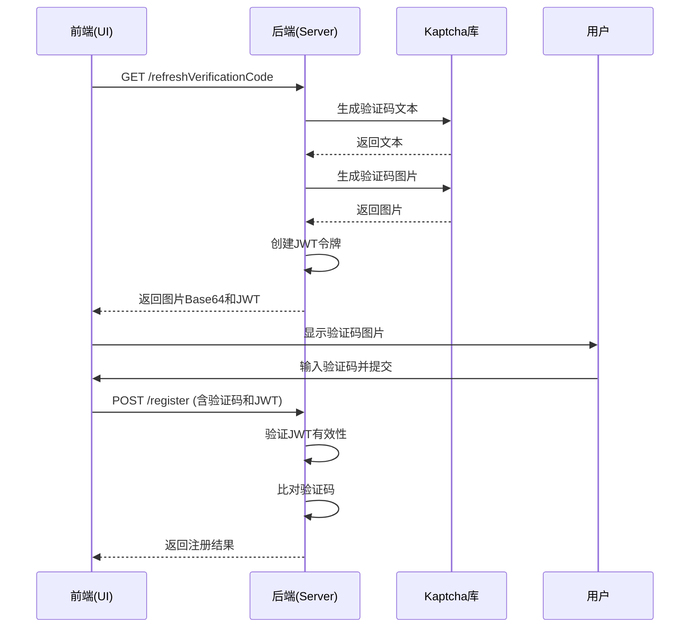
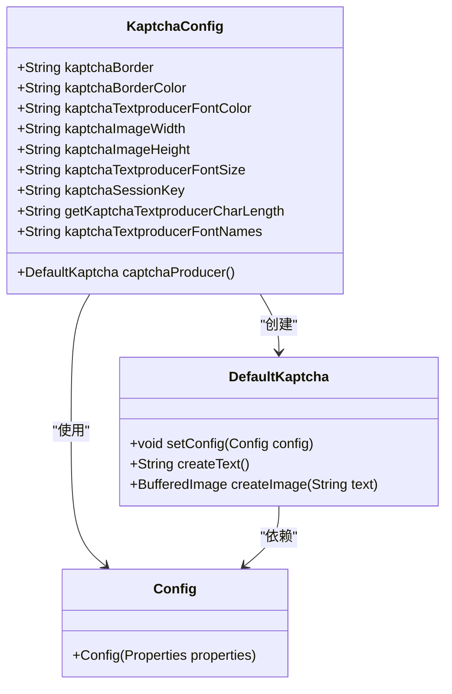
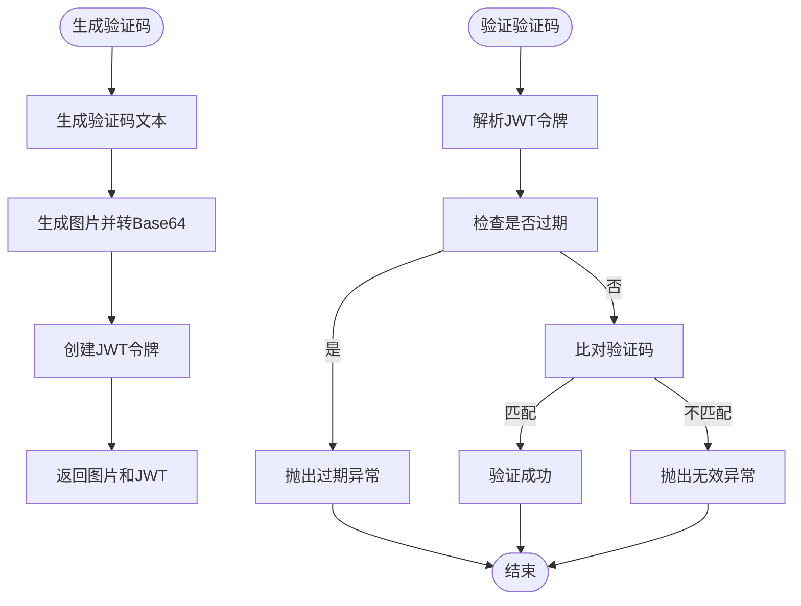
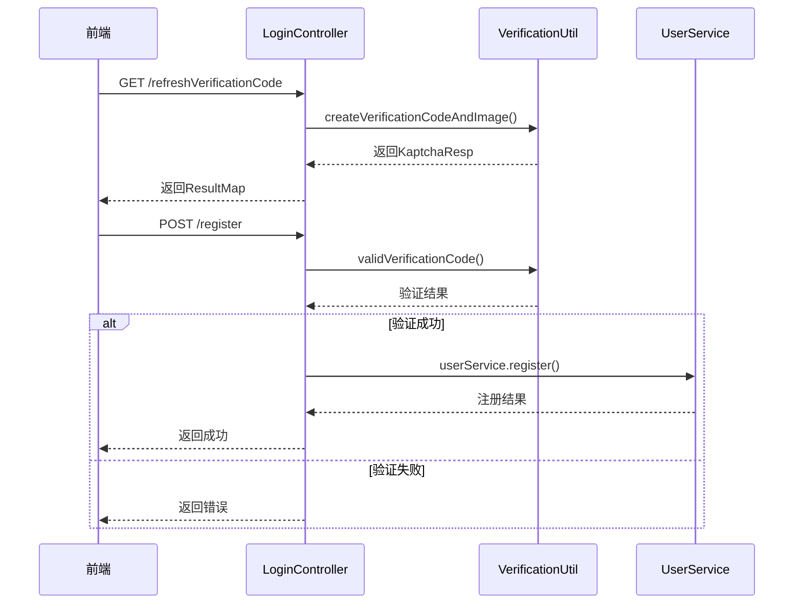
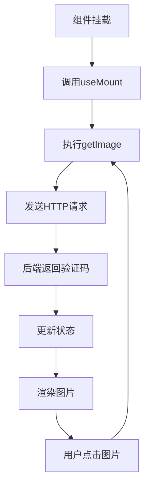
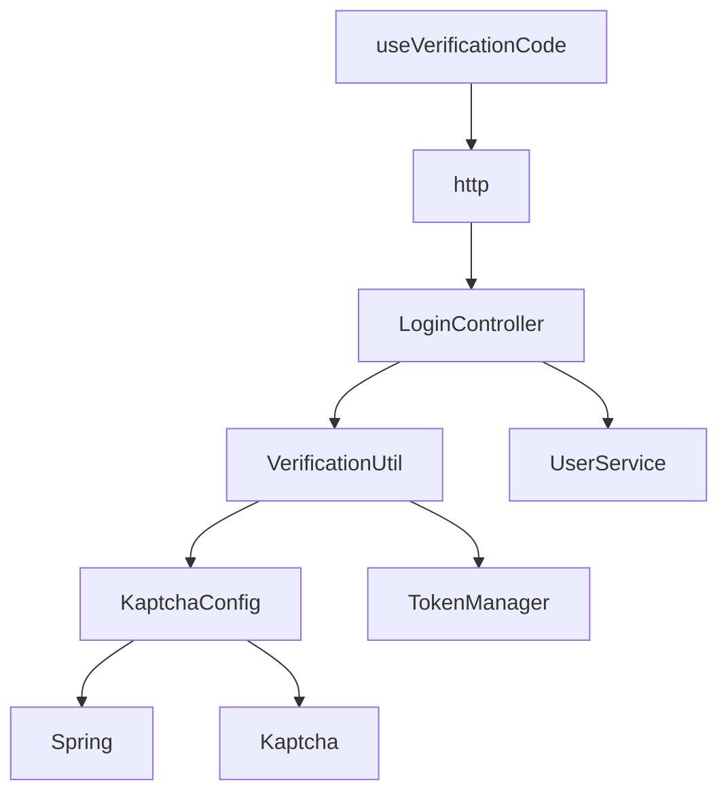

# 验证码配置

<cite>
**本文档引用的文件**  
- [KaptchaConfig.java](file://datavines-server/src/main/java/io/datavines/server/api/config/KaptchaConfig.java)
- [VerificationUtil.java](file://datavines-server/src/main/java/io/datavines/server/utils/VerificationUtil.java)
- [LoginController.java](file://datavines-server/src/main/java/io/datavines/server/api/controller/LoginController.java)
- [KaptchaResp.java](file://datavines-server/src/main/java/io/datavines/server/api/dto/vo/KaptchaResp.java)
- [application.yaml](file://datavines-server/src/main/resources/application.yaml)
- [useVerificationCode/index.tsx](file://datavines-ui/src/hooks/useVerificationCode/index.tsx)
</cite>

## 目录
1. [简介](#简介)
2. [项目结构](#项目结构)
3. [核心组件](#核心组件)
4. [架构概述](#架构概述)
5. [详细组件分析](#详细组件分析)
6. [依赖分析](#依赖分析)
7. [性能考虑](#性能考虑)
8. [故障排除指南](#故障排除指南)
9. [结论](#结论)

## 简介
DataVines系统集成了Kaptcha验证码功能，用于增强系统的安全性，特别是在用户注册和登录等关键操作中。本文档详细说明了Kaptcha验证码的配置和使用方法，包括验证码的视觉属性配置、长度、有效期、存储策略以及在登录接口中的集成方式。通过application.yaml文件中的配置项，可以灵活地自定义验证码的外观和行为。验证码的验证过程结合了JWT令牌机制，确保了验证码的安全性和时效性。前端通过调用后端API获取验证码图片和JWT令牌，并在用户提交表单时进行验证。整个流程设计考虑了安全性、性能和用户体验，为系统提供了可靠的防自动化攻击保护。

## 项目结构
DataVines项目的验证码功能主要集中在datavines-server模块中，相关的配置和工具类位于特定的包路径下。前端实现位于datavines-ui模块中，通过React Hooks进行封装和调用。整体结构体现了前后端分离的设计模式，后端提供RESTful API接口，前端通过HTTP请求与后端交互。

```mermaid
graph TD
subgraph "后端模块"
datavines-server[datavines-server]
KaptchaConfig[KaptchaConfig.java]
VerificationUtil[VerificationUtil.java]
LoginController[LoginController.java]
end
subgraph "前端模块"
datavines-ui[datavines-ui]
useVerificationCode[useVerificationCode/index.tsx]
end
subgraph "配置文件"
application-yaml[application.yaml]
end
datavines-server --> KaptchaConfig
datavines-server --> VerificationUtil
datavines-server --> LoginController
datavines-ui --> useVerificationCode
application-yaml --> KaptchaConfig
LoginController < --> useVerificationCode
```

**图表来源**  
- [KaptchaConfig.java](file://datavines-server/src/main/java/io/datavines/server/api/config/KaptchaConfig.java)
- [VerificationUtil.java](file://datavines-server/src/main/java/io/datavines/server/utils/VerificationUtil.java)
- [LoginController.java](file://datavines-server/src/main/java/io/datavines/server/api/controller/LoginController.java)
- [useVerificationCode/index.tsx](file://datavines-ui/src/hooks/useVerificationCode/index.tsx)
- [application.yaml](file://datavines-server/src/main/resources/application.yaml)

**章节来源**  
- [KaptchaConfig.java](file://datavines-server/src/main/java/io/datavines/server/api/config/KaptchaConfig.java)
- [VerificationUtil.java](file://datavines-server/src/main/java/io/datavines/server/utils/VerificationUtil.java)
- [LoginController.java](file://datavines-server/src/main/java/io/datavines/server/api/controller/LoginController.java)
- [useVerificationCode/index.tsx](file://datavines-ui/src/hooks/useVerificationCode/index.tsx)
- [application.yaml](file://datavines-server/src/main/resources/application.yaml)

## 核心组件
DataVines的验证码系统由多个核心组件构成，包括KaptchaConfig配置类、VerificationUtil工具类、LoginController控制器以及前端的useVerificationCode Hook。KaptchaConfig类负责初始化和配置Kaptcha验证码生成器，通过Spring的@Value注解从application.yaml文件中读取配置参数。VerificationUtil类提供了生成验证码图片和验证用户输入的核心方法，利用Kaptcha的API生成文本和图片，并通过JWT令牌机制确保验证码的安全传输和验证。LoginController暴露了获取验证码和用户注册的RESTful接口，其中注册接口会调用VerificationUtil进行验证码验证。前端的useVerificationCode Hook封装了获取验证码的逻辑，通过HTTP请求调用后端接口，并在组件挂载时自动获取初始验证码。这些组件协同工作，形成了一个完整的验证码解决方案。

**章节来源**  
- [KaptchaConfig.java](file://datavines-server/src/main/java/io/datavines/server/api/config/KaptchaConfig.java)
- [VerificationUtil.java](file://datavines-server/src/main/java/io/datavines/server/utils/VerificationUtil.java)
- [LoginController.java](file://datavines-server/src/main/java/io/datavines/server/api/controller/LoginController.java)
- [useVerificationCode/index.tsx](file://datavines-ui/src/hooks/useVerificationCode/index.tsx)

## 架构概述
DataVines验证码系统的架构采用了典型的前后端分离模式，后端基于Spring Boot框架提供RESTful API，前端基于React框架进行UI渲染和交互。验证码的生成和验证逻辑完全在后端实现，前端仅负责展示和提交。系统通过JWT令牌机制在客户端和服务器之间安全地传递验证码信息，避免了在服务器端存储验证码带来的状态管理复杂性。这种无状态的设计提高了系统的可扩展性和可靠性。



**图表来源**  
- [KaptchaConfig.java](file://datavines-server/src/main/java/io/datavines/server/api/config/KaptchaConfig.java)
- [VerificationUtil.java](file://datavines-server/src/main/java/io/datavines/server/utils/VerificationUtil.java)
- [LoginController.java](file://datavines-server/src/main/java/io/datavines/server/api/controller/LoginController.java)
- [useVerificationCode/index.tsx](file://datavines-ui/src/hooks/useVerificationCode/index.tsx)

## 详细组件分析

### KaptchaConfig配置类分析
KaptchaConfig类是验证码系统的核心配置组件，它通过Spring的@Configuration注解声明为一个配置类，并使用@Bean注解定义了一个DefaultKaptcha的Bean。该类通过@Value注解从application.yaml文件中注入各种配置参数，然后将这些参数设置到Kaptcha的Properties对象中，最终创建并返回一个配置好的DefaultKaptcha实例。这种设计使得验证码的配置完全外部化，无需修改代码即可调整验证码的外观和行为。



**图表来源**  
- [KaptchaConfig.java](file://datavines-server/src/main/java/io/datavines/server/api/config/KaptchaConfig.java)

**章节来源**  
- [KaptchaConfig.java](file://datavines-server/src/main/java/io/datavines/server/api/config/KaptchaConfig.java)

### VerificationUtil工具类分析
VerificationUtil类是验证码系统的核心工具类，提供了生成验证码图片和验证用户输入的静态方法。该类在静态代码块中通过SpringApplicationContext获取DefaultKaptcha和TokenManager的实例，确保了在整个应用生命周期内使用同一个验证码生成器和令牌管理器。createVerificationCodeAndImage方法生成验证码文本，然后调用buildImageByte64方法将文本转换为Base64编码的图片数据，同时调用buildJwtVerification方法创建包含验证码信息的JWT令牌。validVerificationCode方法则负责验证用户提交的验证码是否与JWT令牌中的信息匹配，并检查令牌是否过期。



**图表来源**  
- [VerificationUtil.java](file://datavines-server/src/main/java/io/datavines/server/utils/VerificationUtil.java)

**章节来源**  
- [VerificationUtil.java](file://datavines-server/src/main/java/io/datavines/server/utils/VerificationUtil.java)

### LoginController控制器分析
LoginController类是验证码系统的API入口，它暴露了两个关键接口：/refreshVerificationCode用于获取新的验证码，/register用于用户注册。refreshVerificationCode接口调用VerificationUtil.createVerificationCodeAndImage方法生成验证码，并将结果封装在ResultMap中返回。register接口在处理用户注册请求时，首先调用VerificationUtil.validVerificationCode方法验证用户提交的验证码，只有验证通过才会继续执行注册逻辑。这种设计确保了注册操作的安全性，防止了自动化脚本的滥用。



**图表来源**  
- [LoginController.java](file://datavines-server/src/main/java/io/datavines/server/api/controller/LoginController.java)
- [VerificationUtil.java](file://datavines-server/src/main/java/io/datavines/server/utils/VerificationUtil.java)

**章节来源**  
- [LoginController.java](file://datavines-server/src/main/java/io/datavines/server/api/controller/LoginController.java)

### 前端useVerificationCode Hook分析
useVerificationCode是一个React Hook，用于在前端组件中管理验证码的状态和获取逻辑。它使用useState来存储验证码的图片数据和JWT令牌，使用useRef来保持对当前验证码的引用。getImage函数通过$http.get请求调用后端的/refreshVerificationCode接口获取新的验证码，并更新状态。useMount Hook确保在组件挂载时自动获取初始验证码。返回的RenderImage是一个不可变的函数组件，用于渲染验证码图片，并在点击时刷新验证码，实现了良好的用户体验。



**图表来源**  
- [useVerificationCode/index.tsx](file://datavines-ui/src/hooks/useVerificationCode/index.tsx)

**章节来源**  
- [useVerificationCode/index.tsx](file://datavines-ui/src/hooks/useVerificationCode/index.tsx)

## 依赖分析
DataVines验证码系统的组件之间存在清晰的依赖关系。后端的KaptchaConfig依赖于Spring框架的配置机制和Kaptcha库；VerificationUtil依赖于KaptchaConfig创建的DefaultKaptcha实例和TokenManager进行JWT操作；LoginController依赖于VerificationUtil进行验证码验证和UserService处理业务逻辑。前端的useVerificationCode依赖于$http服务进行HTTP通信。整个系统的依赖关系简单明了，各组件职责单一，易于维护和扩展。



**图表来源**  
- [KaptchaConfig.java](file://datavines-server/src/main/java/io/datavines/server/api/config/KaptchaConfig.java)
- [VerificationUtil.java](file://datavines-server/src/main/java/io/datavines/server/utils/VerificationUtil.java)
- [LoginController.java](file://datavines-server/src/main/java/io/datavines/server/api/controller/LoginController.java)
- [useVerificationCode/index.tsx](file://datavines-ui/src/hooks/useVerificationCode/index.tsx)

**章节来源**  
- [KaptchaConfig.java](file://datavines-server/src/main/java/io/datavines/server/api/config/KaptchaConfig.java)
- [VerificationUtil.java](file://datavines-server/src/main/java/io/datavines/server/utils/VerificationUtil.java)
- [LoginController.java](file://datavines-server/src/main/java/io/datavines/server/api/controller/LoginController.java)
- [useVerificationCode/index.tsx](file://datavines-ui/src/hooks/useVerificationCode/index.tsx)

## 性能考虑
DataVines验证码系统在设计时充分考虑了性能因素。首先，验证码的生成和验证都是内存操作，不涉及数据库访问，保证了高并发下的响应速度。其次，通过JWT令牌机制实现了无状态验证，避免了在服务器端存储验证码带来的内存开销和分布式环境下的会话同步问题。验证码的有效期设置为5分钟（300000毫秒），平衡了安全性和用户体验。前端通过点击刷新验证码，减少了不必要的请求。整体设计确保了系统在高负载下仍能稳定运行。

## 故障排除指南
当验证码功能出现问题时，可以按照以下步骤进行排查：首先检查application.yaml中的kaptcha配置项是否正确；其次确认KaptchaConfig类是否被Spring正确加载；然后检查VerificationUtil中的静态代码块是否成功获取了DefaultKaptcha和TokenManager的实例；最后验证LoginController的接口是否能正常访问。常见的错误包括配置项拼写错误、依赖库缺失、JWT密钥不匹配等。通过查看日志文件可以快速定位问题根源。

**章节来源**  
- [KaptchaConfig.java](file://datavines-server/src/main/java/io/datavines/server/api/config/KaptchaConfig.java)
- [VerificationUtil.java](file://datavines-server/src/main/java/io/datavines/server/utils/VerificationUtil.java)
- [LoginController.java](file://datavines-server/src/main/java/io/datavines/server/api/controller/LoginController.java)

## 结论
DataVines的验证码系统通过Kaptcha库和JWT令牌的结合，实现了一个安全、高效、可配置的验证码解决方案。系统设计合理，组件职责清晰，前后端分离明确。通过外部化配置，管理员可以轻松调整验证码的外观和行为。无状态的验证机制提高了系统的可扩展性和可靠性。整体方案为DataVines系统提供了有效的安全防护，防止了自动化攻击，同时保证了良好的用户体验。