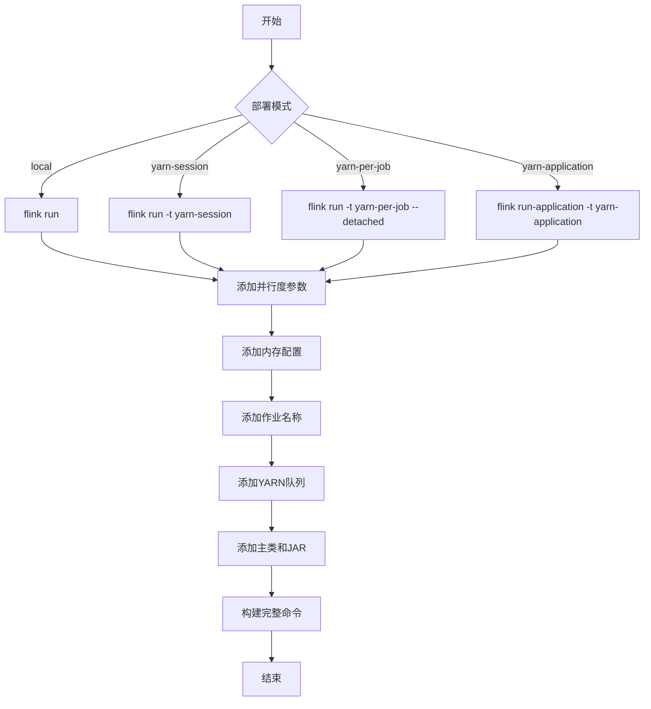
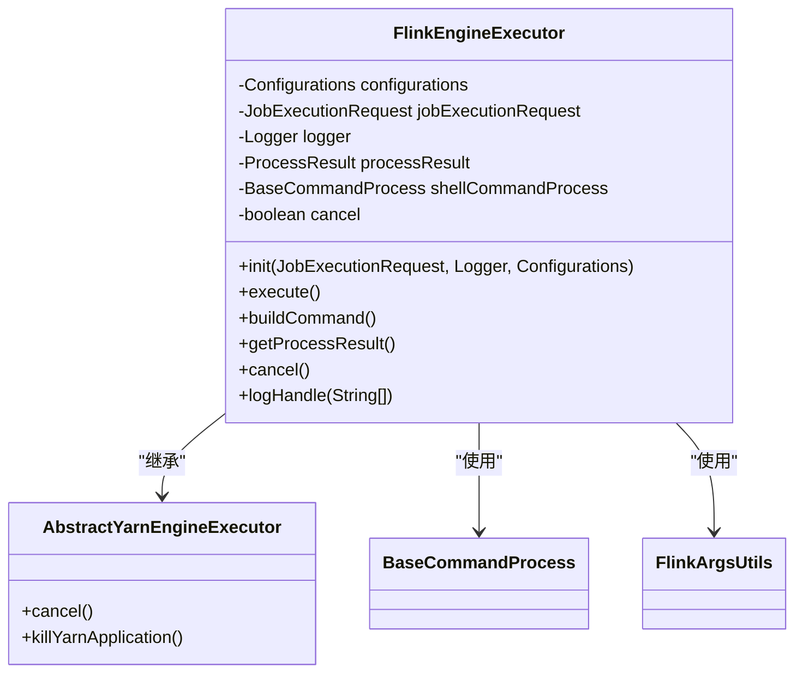
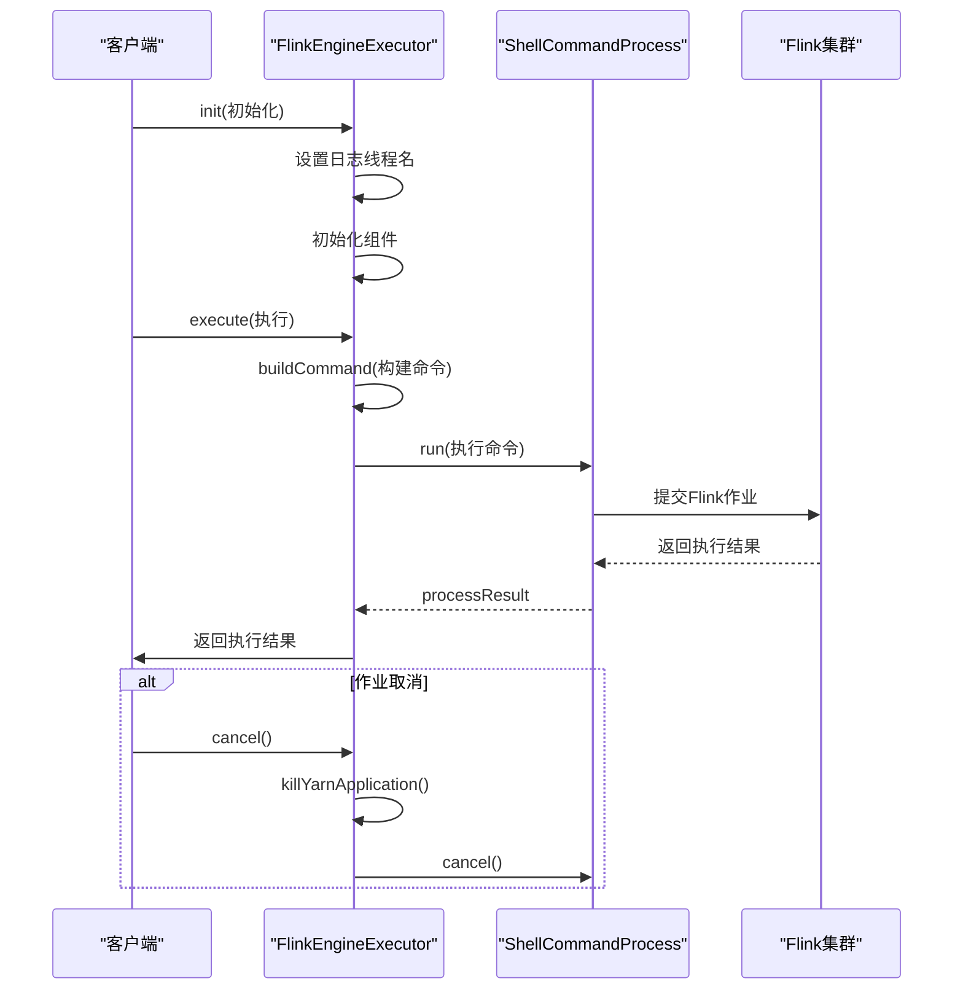

# Flink执行配置

<cite>
**本文档引用的文件**  
- [BaseFlinkConfigurationBuilder.java](file://datavines-engine\datavines-engine-plugins\datavines-engine-flink\datavines-engine-flink-config\src\main\java\io\datavines\engine\flink\config\BaseFlinkConfigurationBuilder.java)
- [FlinkEngineExecutor.java](file://datavines-engine\datavines-engine-plugins\datavines-engine-flink\datavines-engine-flink-executor\src\main\java\io\datavines\engine\flink\executor\FlinkEngineExecutor.java)
- [FlinkParameters.java](file://datavines-engine\datavines-engine-plugins\datavines-engine-flink\datavines-engine-flink-executor\src\main\java\io\datavines\engine\flink\executor\parameter\FlinkParameters.java)
- [FlinkArgsUtils.java](file://datavines-engine\datavines-engine-plugins\datavines-engine-flink\datavines-engine-flink-executor\src\main\java\io\datavines\engine\flink\executor\parameter\FlinkArgsUtils.java)
- [FlinkRuntimeEnvironment.java](file://datavines-engine\datavines-engine-plugins\datavines-engine-flink\datavines-engine-flink-api\src\main\java\io\datavines\engine\flink\api\FlinkRuntimeEnvironment.java)
- [FlinkDataVinesBootstrap.java](file://datavines-engine\datavines-engine-plugins\datavines-engine-flink\datavines-engine-flink-core\src\main\java\io\datavines\engine\flink\core\FlinkDataVinesBootstrap.java)
- [FlinkConfiguration.tsx](file://datavines-ui\src\view\Main\Config\FlinkConfiguration.tsx)
</cite>

## 目录
1. [Flink配置构建器](#flink配置构建器)
2. [Flink作业参数设置](#flink作业参数设置)
3. [Flink集群连接配置](#flink集群连接配置)
4. [FlinkEngineExecutor作业提交与管理](#flinkengineexecutor作业提交与管理)
5. [Flink执行模式与性能调优](#flink执行模式与性能调优)
6. [常见问题解决方案](#常见问题解决方案)

## Flink配置构建器

DataVines通过`BaseFlinkConfigurationBuilder`类实现Flink执行配置的构建。该类继承自`BaseJobConfigurationBuilder`，负责构建Flink作业所需的环境配置、数据源配置和结果输出配置。

`BaseFlinkConfigurationBuilder`的主要功能包括：
- 构建环境配置（EnvConfig），设置引擎类型
- 构建数据源配置（SourceConfig），处理连接参数和SQL语句
- 构建结果输出配置（SinkConfig），定义验证结果的存储方式
- 处理多数据源连接，支持源表和目标表的对比验证

具体实现中，该构建器通过插件加载机制（PluginLoader）动态加载不同类型的连接器工厂（ConnectorFactory）和SQL指标（SqlMetric），并根据配置参数生成相应的Flink作业配置。

**Section sources**
- [BaseFlinkConfigurationBuilder.java](file://datavines-engine\datavines-engine-plugins\datavines-engine-flink\datavines-engine-flink-config\src\main\java\io\datavines\engine\flink\config\BaseFlinkConfigurationBuilder.java#L47-L330)

## Flink作业参数设置

Flink作业的参数通过`FlinkParameters`类进行定义和管理。该类包含了Flink作业执行所需的各种配置参数：

```java
@Data
public class FlinkParameters {
    private String mainJar;
    private String mainClass;
    private String deployMode;
    private String taskManagerCount;
    private String taskManagerMemory;
    private String jobManagerMemory;
    private String mainArgs;
    private String yarnQueue;
    private String jobName;
    private int parallelism = 1;
    private String flinkOthers;
    private String jars;
    private String tags;
}
```

关键参数说明：
- **deployMode**: 部署模式，支持local、yarn-session、yarn-per-job、yarn-application
- **parallelism**: 作业并行度，默认为1
- **taskManagerMemory**: TaskManager内存大小
- **jobManagerMemory**: JobManager内存大小
- **yarnQueue**: YARN队列名称
- **jobName**: 作业名称
- **mainArgs**: 主程序参数，以Base64编码传递作业配置

这些参数通过`FlinkArgsUtils.buildArgs()`方法转换为实际的Flink命令行参数。

**Section sources**
- [FlinkParameters.java](file://datavines-engine\datavines-engine-plugins\datavines-engine-flink\datavines-engine-flink-executor\src\main\java\io\datavines\engine\flink\executor\parameter\FlinkParameters.java#L22-L49)
- [FlinkArgsUtils.java](file://datavines-engine\datavines-engine-plugins\datavines-engine-flink\datavines-engine-flink-executor\src\main\java\io\datavines\engine\flink\executor\parameter\FlinkArgsUtils.java#L24-L124)

## Flink集群连接配置

Flink集群的连接配置主要通过前端UI和后端参数传递实现。前端配置界面提供了直观的参数输入表单，后端通过参数解析和命令构建实现与Flink集群的连接。

### 前端配置参数

前端`FlinkConfiguration.tsx`组件定义了Flink配置的UI表单，包含以下主要参数：

```typescript
const schema: IFormRender = {
    meta: [
        {
            label: '部署模式',
            name: 'deployMode',
            widget: (
                <Select>
                    <Option value="local">本地模式</Option>
                    <Option value="yarn_session">YARN会话模式</Option>
                    <Option value="yarn_per_job">YARN单作业模式</Option>
                    <Option value="yarn_application">YARN应用模式</Option>
                </Select>
            ),
        },
        {
            label: 'Flink主目录',
            name: 'flinkHome',
            widget: <Input autoComplete="off" />,
        },
        {
            label: 'JobManager内存',
            name: 'jobmanagerMemory',
            widget: <Input autoComplete="off" type="number" />,
        },
        {
            label: 'TaskManager内存',
            name: 'taskmanagerMemory',
            widget: <Input autoComplete="off" type="number" />,
        },
    ],
};
```

### 后端命令构建

后端通过`FlinkArgsUtils.buildArgs()`方法将配置参数转换为Flink命令行参数。不同部署模式对应的命令如下：



**Diagram sources**
- [FlinkConfiguration.tsx](file://datavines-ui\src\view\Main\Config\FlinkConfiguration.tsx#L23-L78)
- [FlinkArgsUtils.java](file://datavines-engine\datavines-engine-plugins\datavines-engine-flink\datavines-engine-flink-executor\src\main\java\io\datavines\engine\flink\executor\parameter\FlinkArgsUtils.java#L44-L64)

**Section sources**
- [FlinkConfiguration.tsx](file://datavines-ui\src\view\Main\Config\FlinkConfiguration.tsx#L1-L84)
- [FlinkArgsUtils.java](file://datavines-engine\datavines-engine-plugins\datavines-engine-flink\datavines-engine-flink-executor\src\main\java\io\datavines\engine\flink\executor\parameter\FlinkArgsUtils.java#L35-L124)

## FlinkEngineExecutor作业提交与管理

`FlinkEngineExecutor`是DataVines中负责Flink作业提交和管理的核心类。它继承自`AbstractYarnEngineExecutor`，实现了Flink作业的初始化、执行、监控和取消功能。

### 类结构与主要组件



**Diagram sources**
- [FlinkEngineExecutor.java](file://datavines-engine\datavines-engine-plugins\datavines-engine-flink\datavines-engine-flink-executor\src\main\java\io\datavines\engine\flink\executor\FlinkEngineExecutor.java#L38-L182)

### 作业提交流程

Flink作业的提交流程通过`execute()`方法实现，主要步骤如下：



**Diagram sources**
- [FlinkEngineExecutor.java](file://datavines-engine\datavines-engine-plugins\datavines-engine-flink\datavines-engine-flink-executor\src\main\java\io\datavines\engine\flink\executor\FlinkEngineExecutor.java#L71-L82)

### 命令构建逻辑

`buildCommand()`方法负责构建完整的Flink命令行，其核心逻辑包括：

1. 解析Flink参数（FlinkParameters）
2. 设置主JAR包路径
3. 编码作业配置参数（Base64编码）
4. 设置主类名称
5. 生成唯一标签
6. 调用FlinkArgsUtils构建命令参数
7. 组装完整命令字符串

```java
@Override
protected String buildCommand() {
    FlinkParameters flinkParameters = JSONUtils.parseObject(jobExecutionRequest.getEngineParameter(), FlinkParameters.class);
    
    String basePath = System.getProperty("user.dir").replace(File.separator + "bin", File.separator + "libs");
    flinkParameters.setMainJar(basePath + File.separator + configurations.getString("data.quality.flink.jar.name"));
    
    DataVinesJobConfig configuration = JSONUtils.parseObject(jobExecutionRequest.getApplicationParameter(), DataVinesJobConfig.class);
    flinkParameters.setMainArgs("\"" + Base64.getEncoder().encodeToString(JSONUtils.toJsonString(configuration).getBytes()) + "\"");
    
    flinkParameters.setMainClass("io.datavines.engine.flink.core.FlinkDataVinesBootstrap");
    flinkParameters.setTags(jobExecutionRequest.getJobExecutionUniqueId());
    
    List<String> args = new ArrayList<>();
    args.add(FLINK_COMMAND);
    args.addAll(FlinkArgsUtils.buildArgs(flinkParameters));
    
    return String.join(" ", args);
}
```

**Section sources**
- [FlinkEngineExecutor.java](file://datavines-engine\datavines-engine-plugins\datavines-engine-flink\datavines-engine-flink-executor\src\main\java\io\datavines\engine\flink\executor\FlinkEngineExecutor.java#L84-L125)

## Flink执行模式与性能调优

### Flink执行模式

DataVines支持多种Flink执行模式，每种模式适用于不同的应用场景：

| 执行模式 | 描述 | 适用场景 |
|--------|------|--------|
| local | 本地模式，在本地JVM中运行 | 开发测试、小规模数据验证 |
| yarn-session | YARN会话模式，复用已有的YARN会话 | 频繁提交的小作业，快速响应 |
| yarn-per-job | YARN单作业模式，每个作业独立的YARN应用 | 生产环境，资源隔离 |
| yarn-application | YARN应用模式，Flink作为YARN应用运行 | 长期运行的流处理作业 |

### 并行度设置

并行度（parallelism）是影响Flink作业性能的关键参数。DataVines通过`FlinkParameters.parallelism`属性进行设置：

- **默认值**: 1
- **推荐设置**: 根据数据量和集群资源调整
- **最佳实践**: 
  - 批处理作业：设置为CPU核心数的2-4倍
  - 流处理作业：根据数据吞吐量动态调整
  - 资源充足时，适当提高并行度以提升处理速度

### Checkpoint配置

虽然代码中未直接体现Checkpoint配置，但可以通过`flinkOthers`参数传递自定义的Flink配置：

```java
// 通过flinkOthers参数设置Checkpoint相关配置
flinkParameters.setFlinkOthers("--conf state.checkpoints.dir=hdfs://namenode:8020/flink/checkpoints " +
                              "--conf state.savepoints.dir=hdfs://namenode:8020/flink/savepoints " +
                              "--conf state.checkpoint.interval=5min");
```

### StateBackend配置

StateBackend配置同样可以通过`flinkOthers`参数进行设置：

```java
// 设置StateBackend为RocksDB
flinkParameters.setFlinkOthers("--conf state.backend=rocksdb " +
                              "--conf state.backend.rocksdb.localdir=/tmp/flink/rocksdb");
```

### 性能调优建议

1. **内存配置优化**:
   - 合理设置JobManager和TaskManager内存
   - 根据作业复杂度调整堆内存和堆外内存比例

2. **资源分配策略**:
   - YARN模式下合理分配队列资源
   - 避免资源过度分配导致的浪费

3. **网络缓冲区调优**:
   - 根据网络环境调整网络缓冲区大小
   - 平衡延迟和吞吐量

4. **序列化优化**:
   - 使用高效的序列化框架
   - 减少序列化开销

**Section sources**
- [FlinkParameters.java](file://datavines-engine\datavines-engine-plugins\datavines-engine-flink\datavines-engine-flink-executor\src\main\java\io\datavines\engine\flink\executor\parameter\FlinkParameters.java#L42-L44)
- [FlinkArgsUtils.java](file://datavines-engine\datavines-engine-plugins\datavines-engine-flink\datavines-engine-flink-executor\src\main\java\io\datavines\engine\flink\executor\parameter\FlinkArgsUtils.java#L85-L91)

## 常见问题解决方案

### 作业提交失败

**问题现象**: Flink作业提交失败，无具体错误信息

**解决方案**:
1. 检查Flink_HOME环境变量是否正确设置
2. 确认Flink集群处于正常运行状态
3. 验证YARN队列资源是否充足
4. 检查作业JAR包路径是否正确

### 内存不足错误

**问题现象**: TaskManager或JobManager内存溢出

**解决方案**:
1. 增加`jobManagerMemory`和`taskManagerMemory`配置值
2. 优化作业逻辑，减少状态大小
3. 调整并行度，平衡资源使用
4. 考虑使用RocksDB作为StateBackend

### 作业卡住或无响应

**问题现象**: 作业长时间运行无进展

**解决方案**:
1. 检查数据源连接是否正常
2. 验证SQL查询是否过于复杂
3. 增加Checkpoint间隔，减少检查点开销
4. 调整网络缓冲区大小

### YARN应用无法启动

**问题现象**: YARN应用提交后立即失败

**解决方案**:
1. 检查YARN队列权限
2. 确认集群资源是否充足
3. 验证用户代理设置
4. 检查Flink版本与Hadoop版本兼容性

### 数据源连接问题

**问题现象**: 无法连接到数据源

**解决方案**:
1. 验证连接参数（URL、用户名、密码）
2. 检查网络连通性
3. 确认数据库驱动是否正确
4. 验证数据库连接池配置

**Section sources**
- [FlinkEngineExecutor.java](file://datavines-engine\datavines-engine-plugins\datavines-engine-flink\datavines-engine-flink-executor\src\main\java\io\datavines\engine\flink\executor\FlinkEngineExecutor.java#L78-L81)
- [FlinkArgsUtils.java](file://datavines-engine\datavines-engine-plugins\datavines-engine-flink\datavines-engine-flink-executor\src\main\java\io\datavines\engine\flink\executor\parameter\FlinkArgsUtils.java#L74-L83)