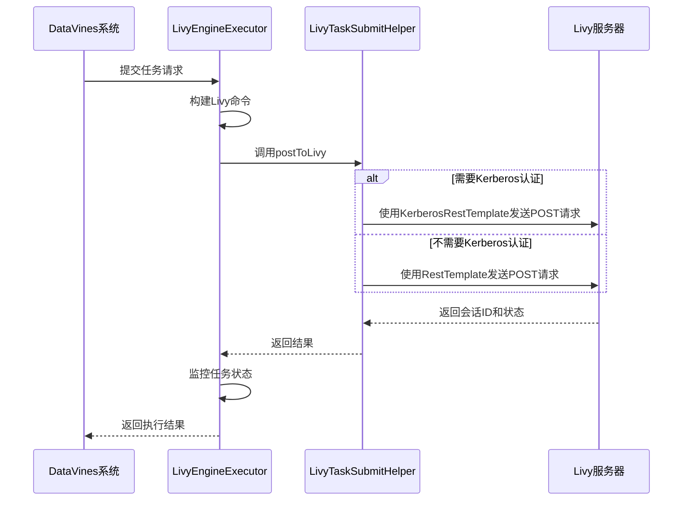
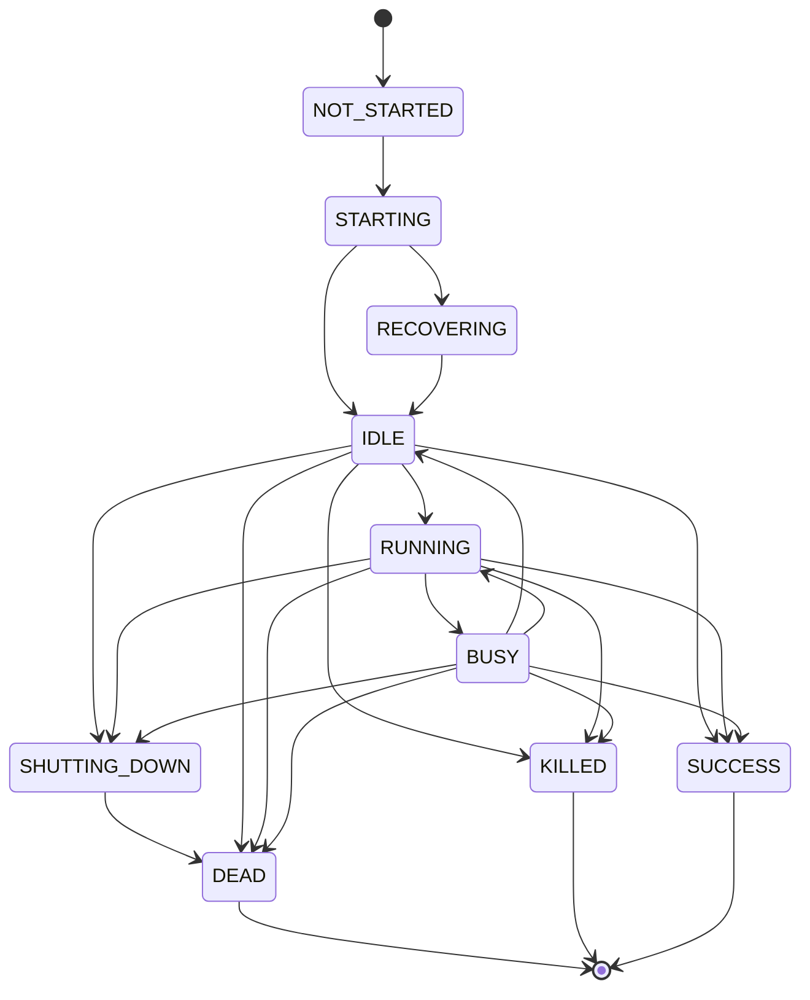
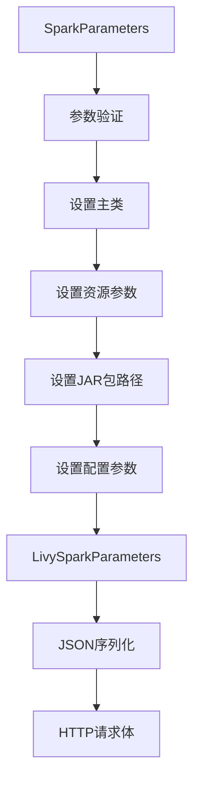
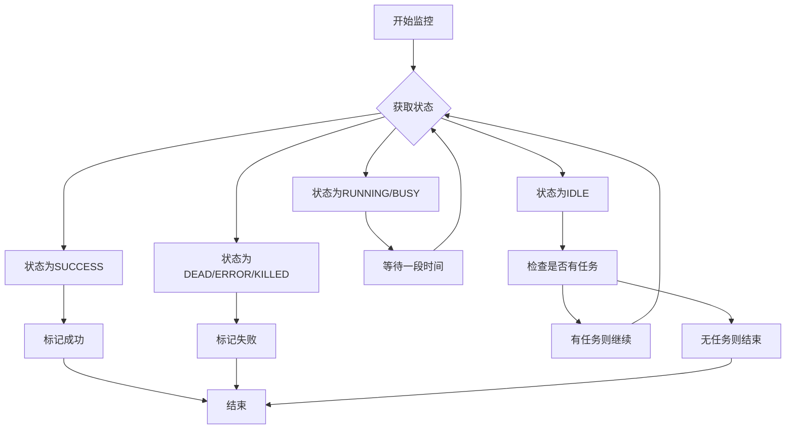

# Spark Livy配置

<cite>
**本文档引用的文件**  
- [LivyEngineExecutor.java](file://datavines-engine\datavines-engine-plugins\datavines-engine-livy\datavines-engine-livy-executor\src\main\java\io\datavines\engine\livy\executor\LivyEngineExecutor.java)
- [LivySparkParameters.java](file://datavines-engine\datavines-engine-plugins\datavines-engine-livy\datavines-engine-livy-executor\src\main\java\io\datavines\engine\livy\executor\parameter\LivySparkParameters.java)
- [SparkParameters.java](file://datavines-engine\datavines-engine-plugins\datavines-engine-livy\datavines-engine-livy-executor\src\main\java\io\datavines\engine\livy\executor\parameter\SparkParameters.java)
- [LivyTaskSubmitHelper.java](file://datavines-engine\datavines-engine-executor\src\main\java\io\datavines\engine\executor\core\helper\LivyTaskSubmitHelper.java)
- [LivyStates.java](file://datavines-engine\datavines-engine-executor\src\main\java\io\datavines\engine\executor\core\enums\LivyStates.java)
- [ResourceSchedulePlatformType.java](file://datavines-engine\datavines-engine-executor\src\main\java\io\datavines\engine\executor\core\enums\ResourceSchedulePlatformType.java)
- [application.yaml](file://datavines-server\src\main\resources\application.yaml)
</cite>

## 目录
1. [简介](#简介)
2. [LivyEngineExecutor工作机制](#livyengineexecutor工作机制)
3. [Livy服务器连接配置](#livy服务器连接配置)
4. [会话管理与资源调度平台](#会话管理与资源调度平台)
5. [Spark参数配置](#spark参数配置)
6. [Livy状态监控](#livy状态监控)
7. [配置示例](#配置示例)
8. [性能优化建议](#性能优化建议)
9. [故障排查指南](#故障排查指南)

## 简介

DataVines通过Livy引擎提交Spark任务，实现对Spark作业的远程提交和管理。Livy作为REST服务接口，允许用户通过HTTP请求与Spark集群交互，提交作业、监控状态和获取结果。本文档详细说明了在DataVines中配置和使用Livy提交Spark任务的方法，涵盖LivyEngineExecutor的工作机制、连接配置、会话管理、资源调度平台设置、状态监控以及相关参数配置。

## LivyEngineExecutor工作机制

LivyEngineExecutor是DataVines中负责通过Livy提交Spark任务的核心执行器。它继承自AbstractLivyEngineExecutor，实现了EngineExecutor接口，负责构建Livy REST API请求、提交任务、监控执行状态和处理结果。

LivyEngineExecutor的主要工作流程如下：
1. 初始化时设置日志记录器和任务请求信息
2. 通过buildCommand()方法构建Livy REST API请求体
3. 调用LivyCommandProcess向Livy服务器提交任务
4. 监控任务执行状态直到完成或失败
5. 返回执行结果

**Section sources**
- [LivyEngineExecutor.java](file://datavines-engine\datavines-engine-plugins\datavines-engine-livy\datavines-engine-livy-executor\src\main\java\io\datavines\engine\livy\executor\LivyEngineExecutor.java#L42-L236)

## Livy服务器连接配置

要通过Livy提交Spark任务，需要正确配置Livy服务器的连接信息。主要配置参数包括Livy服务器地址、Kerberos认证设置等。

关键配置项：
- `livy.uri`：Livy服务器的REST API地址，格式为`http://<host>:<port>/batches`
- `livy.need.kerberos`：是否需要Kerberos认证，值为"true"或"false"
- `livy.server.auth.kerberos.principal`：Kerberos认证的主体名称
- `livy.server.auth.kerberos.keytab`：Kerberos密钥表文件路径

当Livy服务器启用了Kerberos认证时，需要提供相应的principal和keytab文件来完成认证。LivyTaskSubmitHelper类负责处理与Livy服务器的HTTP通信，根据配置决定是否使用KerberosRestTemplate进行认证。



**Diagram sources**
- [LivyTaskSubmitHelper.java](file://datavines-engine\datavines-engine-executor\src\main\java\io\datavines\engine\executor\core\helper\LivyTaskSubmitHelper.java#L39-L257)
- [LivyEngineExecutor.java](file://datavines-engine\datavines-engine-plugins\datavines-engine-livy\datavines-engine-livy-executor\src\main\java\io\datavines\engine\livy\executor\LivyEngineExecutor.java#L42-L236)

**Section sources**
- [LivyTaskSubmitHelper.java](file://datavines-engine\datavines-engine-executor\src\main\java\io\datavines\engine\executor\core\helper\LivyTaskSubmitHelper.java#L39-L257)

## 会话管理与资源调度平台

Livy通过会话（Session）机制管理Spark任务。每个提交的任务都会创建一个独立的会话，Livy服务器负责维护会话状态并提供REST API进行状态查询和管理。

### 会话生命周期管理

Livy支持多种会话状态，包括：
- NOT_STARTED：会话未开始
- STARTING：会话正在启动
- IDLE：会话空闲，可以接收任务
- RUNNING：会话正在执行任务
- BUSY：会话正忙
- SHUTTING_DOWN：会话正在关闭
- DEAD：会话已死亡
- SUCCESS：会话成功完成
- KILLED：会话被终止

LivyEngineExecutor通过轮询机制监控会话状态，直到任务完成或失败。

### 资源调度平台类型

DataVines支持多种资源调度平台，通过ResourceSchedulePlatformType枚举定义：

```java
public enum ResourceSchedulePlatformType {
    LOCAL(0,"local"),
    YARN(1,"yarn"),
    K8S(2,"k8s");
}
```

用户可以根据部署环境选择合适的资源调度平台。不同的平台可能需要不同的配置参数和连接方式。



**Diagram sources**
- [LivyStates.java](file://datavines-engine\datavines-engine-executor\src\main\java\io\datavines\engine\executor\core\enums\LivyStates.java#L1-L47)
- [ResourceSchedulePlatformType.java](file://datavines-engine\datavines-engine-executor\src\main\java\io\datavines\engine\executor\core\enums\ResourceSchedulePlatformType.java#L1-L61)

**Section sources**
- [LivyStates.java](file://datavines-engine\datavines-engine-executor\src\main\java\io\datavines\engine\executor\core\enums\LivyStates.java#L1-L47)
- [ResourceSchedulePlatformType.java](file://datavines-engine\datavines-engine-executor\src\main\java\io\datavines\engine\executor\core\enums\ResourceSchedulePlatformType.java#L1-L61)

## Spark参数配置

通过Livy提交Spark任务时，需要配置一系列Spark相关参数。这些参数通过SparkParameters和LivySparkParameters类进行定义和管理。

### 核心参数配置

#### SparkParameters类
- `mainJar`：主JAR包路径
- `mainClass`：主类名称
- `deployMode`：部署模式（client/cluster）
- `driverCores`：Driver核心数
- `driverMemory`：Driver内存
- `numExecutors`：Executor数量
- `executorCores`：每个Executor的核心数
- `executorMemory`：每个Executor的内存
- `appName`：应用名称
- `queue`：YARN队列名称
- `programType`：程序类型（JAVA/SCALA/PYTHON）
- `sparkVersion`：Spark版本
- `jars`：依赖JAR包列表

#### LivySparkParameters类
- `className`：主类名称
- `file`：主文件路径
- `args`：命令行参数
- `jars`：依赖JAR包列表
- `conf`：Spark配置
- `name`：应用名称
- `queue`：队列名称
- `proxyUser`：代理用户

### 参数映射关系

LivyEngineExecutor在buildCommand()方法中将SparkParameters转换为LivySparkParameters，实现参数的映射和转换：



**Section sources**
- [SparkParameters.java](file://datavines-engine\datavines-engine-plugins\datavines-engine-livy\datavines-engine-livy-executor\src\main\java\io\datavines\engine\livy\executor\parameter\SparkParameters.java#L1-L223)
- [LivySparkParameters.java](file://datavines-engine\datavines-engine-plugins\datavines-engine-livy\datavines-engine-livy-executor\src\main\java\io\datavines\engine\livy\executor\parameter\LivySparkParameters.java#L1-L194)
- [LivyEngineExecutor.java](file://datavines-engine\datavines-engine-plugins\datavines-engine-livy\datavines-engine-livy-executor\src\main\java\io\datavines\engine\livy\executor\LivyEngineExecutor.java#L97-L236)

## Livy状态监控

LivyEngineExecutor通过轮询机制监控任务执行状态，确保能够及时获取任务完成或失败的通知。

### 状态监控流程

1. 提交任务后获取会话ID
2. 定期调用Livy REST API查询会话状态
3. 根据状态码判断任务执行情况
4. 当任务完成（SUCCESS）或失败（DEAD/ERROR/KILLED）时停止轮询
5. 返回执行结果

### 状态转换逻辑



LivyTaskSubmitHelper的processResultOfLivyState方法实现了状态监控的核心逻辑，使用Stopper.isRunning()作为循环条件，通过Thread.sleep()实现轮询间隔。

**Section sources**
- [LivyCommandProcess.java](file://datavines-engine\datavines-engine-executor\src\main\java\io\datavines\engine\executor\core\executor\LivyCommandProcess.java#L38-L143)
- [LivyTaskSubmitHelper.java](file://datavines-engine\datavines-engine-executor\src\main\java\io\datavines\engine\executor\core\helper\LivyTaskSubmitHelper.java#L39-L257)

## 配置示例

以下是在DataVines中配置Livy提交Spark任务的完整示例：

### application.yaml配置

```yaml
# Livy服务器配置
livy:
  uri: http://livy-server:8998/batches
  need.kerberos: false
  task:
    jar:
      lib:
        path: hdfs:///datavines/lib
    jars: datavines-engine-spark-1.0.0-SNAPSHOT.jar,datavines-connector-jdbc-1.0.0-SNAPSHOT.jar
    proxyUser: livy
  task:
    appId:
      retry:
        count: 2

# 资源调度平台
resource:
  schedule:
    platform:
      type: yarn

# YARN配置
yarn:
  uri: http://yarn-resourcemanager:8088/
```

### 任务参数配置

```json
{
  "engineParameter": {
    "mainJar": "/lib/datavines-core-1.0.0-SNAPSHOT.jar",
    "mainClass": "io.datavines.engine.spark.core.SparkDataVinesBootstrap",
    "deployMode": "cluster",
    "driverCores": 2,
    "driverMemory": "2g",
    "numExecutors": 4,
    "executorCores": 4,
    "executorMemory": "8g",
    "appName": "DataVines-Quality-Job",
    "queue": "default",
    "programType": "JAVA",
    "sparkVersion": "SPARK3",
    "jars": "--jars hdfs:///lib/dependency1.jar,hdfs:///lib/dependency2.jar"
  },
  "applicationParameter": {
    "jobConfig": {
      "jobType": "DATA_QUALITY",
      "source": {
        "type": "JDBC",
        "parameters": {
          "jdbcUrl": "jdbc:mysql://localhost:3306/test",
          "username": "user",
          "password": "pass"
        }
      },
      "sink": {
        "type": "JDBC",
        "parameters": {
          "jdbcUrl": "jdbc:mysql://localhost:3306/report",
          "username": "user",
          "password": "pass"
        }
      }
    }
  }
}
```

**Section sources**
- [application.yaml](file://datavines-server\src\main\resources\application.yaml#L1-L96)

## 性能优化建议

为了确保通过Livy提交Spark任务的性能和稳定性，建议遵循以下优化策略：

### 资源配置优化
- 合理设置Executor数量和资源：根据数据量和计算复杂度调整numExecutors、executorCores和executorMemory参数
- 优化Driver资源配置：确保Driver有足够的内存处理元数据和协调任务
- 使用合适的队列：将任务提交到适当的YARN队列，避免资源争用

### 连接与通信优化
- 调整轮询间隔：根据任务执行时间调整状态查询的轮询间隔，避免过于频繁的请求
- 配置重试机制：设置适当的重试次数和间隔，应对网络波动
- 使用连接池：对于频繁的任务提交，考虑使用HTTP连接池提高效率

### JAR包管理优化
- 预上传依赖JAR包：将常用的依赖JAR包预先上传到HDFS，避免每次提交时重复上传
- 使用本地缓存：在Livy服务器端配置JAR包缓存，减少网络传输
- 优化JAR包大小：精简依赖，减少不必要的库文件

### 监控与日志优化
- 启用详细日志：在调试阶段启用详细的日志记录，便于问题排查
- 设置合理的日志级别：生产环境中使用适当的日志级别，避免日志文件过大
- 集成监控系统：将Livy任务状态集成到统一的监控平台

## 故障排查指南

当通过Livy提交Spark任务遇到问题时，可以按照以下步骤进行排查：

### 常见问题及解决方案

#### 连接问题
- **症状**：无法连接到Livy服务器
- **排查步骤**：
  1. 检查livy.uri配置是否正确
  2. 验证网络连通性
  3. 检查Livy服务器是否正常运行
  4. 如果使用Kerberos，验证认证配置是否正确

#### 认证问题
- **症状**：认证失败，返回401错误
- **排查步骤**：
  1. 检查livy.need.kerberos配置
  2. 验证principal和keytab文件路径
  3. 确认Kerberos票据是否有效

#### 资源不足
- **症状**：任务提交后长时间处于STARTING状态
- **排查步骤**：
  1. 检查集群资源使用情况
  2. 验证YARN队列配置
  3. 调整资源请求参数

#### 任务失败
- **症状**：任务状态变为DEAD或ERROR
- **排查步骤**：
  1. 查看Livy服务器日志
  2. 检查Spark应用日志
  3. 验证JAR包路径和依赖

### 日志分析
- 查看DataVines系统的执行日志
- 检查Livy服务器的REST API访问日志
- 分析Spark应用的执行日志
- 关注关键错误信息和堆栈跟踪

### 监控指标
- 监控Livy会话创建成功率
- 跟踪任务执行时间分布
- 记录资源使用情况
- 设置异常告警

**Section sources**
- [LivyTaskSubmitHelper.java](file://datavines-engine\datavines-engine-executor\src\main\java\io\datavines\engine\executor\core\helper\LivyTaskSubmitHelper.java#L39-L257)
- [LivyCommandProcess.java](file://datavines-engine\datavines-engine-executor\src\main\java\io\datavines\engine\executor\core\executor\LivyCommandProcess.java#L38-L143)