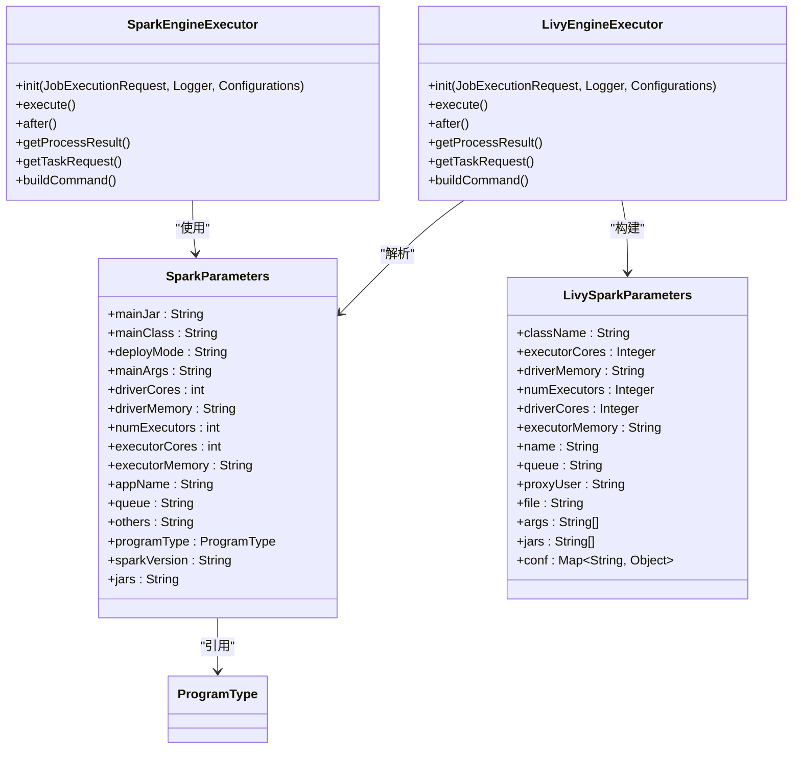
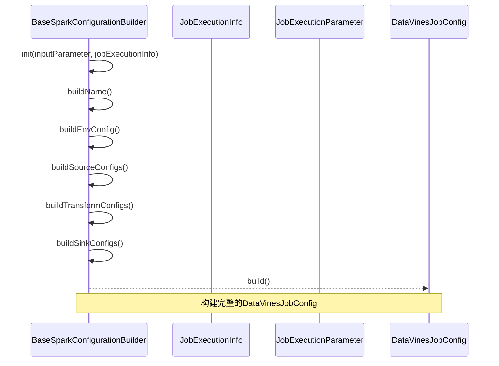
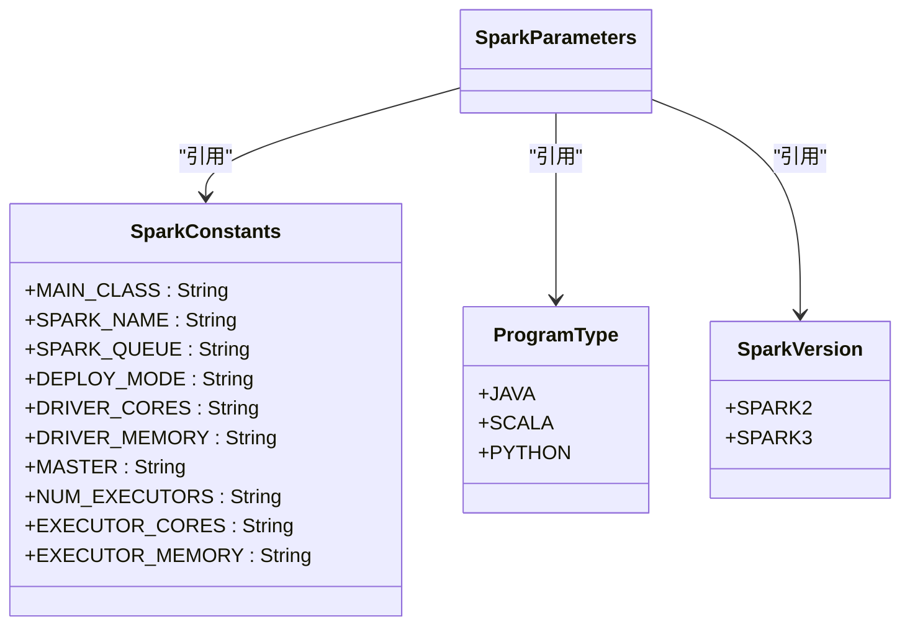
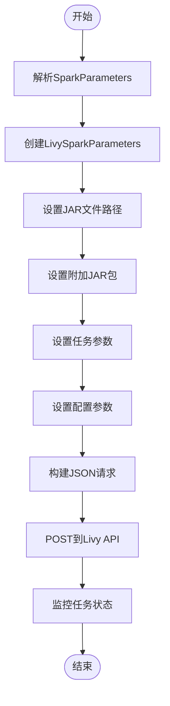
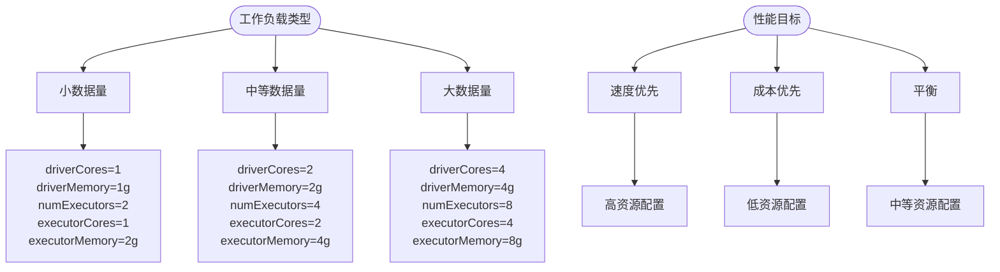
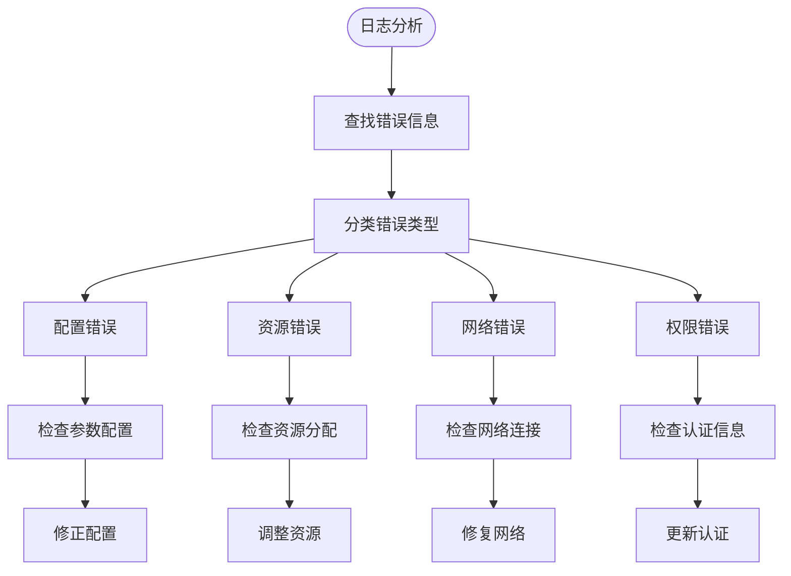

# Spark执行配置

<cite>
**本文档引用的文件**   
- [SparkEngineExecutor.java](file://datavines-engine/datavines-engine-plugins/datavines-engine-spark/datavines-engine-spark-executor/src/main/java/io/datavines/engine/spark/executor/SparkEngineExecutor.java)
- [LivyEngineExecutor.java](file://datavines-engine/datavines-engine-plugins/datavines-engine-livy/datavines-engine-livy-executor/src/main/java/io/datavines/engine/livy/executor/LivyEngineExecutor.java)
- [SparkParameters.java](file://datavines-engine/datavines-engine-plugins/datavines-engine-spark/datavines-engine-spark-executor/src/main/java/io/datavines/engine/spark/executor/parameter/SparkParameters.java)
- [LivySparkParameters.java](file://datavines-engine/datavines-engine-plugins/datavines-engine-livy/datavines-engine-livy-executor/src/main/java/io/datavines/engine/livy/executor/parameter/LivySparkParameters.java)
- [SparkConstants.java](file://datavines-engine/datavines-engine-plugins/datavines-engine-spark/datavines-engine-spark-executor/src/main/java/io/datavines/engine/spark/executor/parameter/SparkConstants.java)
- [BaseSparkConfigurationBuilder.java](file://datavines-engine/datavines-engine-plugins/datavines-engine-spark/datavines-engine-spark-config/src/main/java/io/datavines/engine/spark/config/BaseSparkConfigurationBuilder.java)
- [SparkVersion.java](file://datavines-engine/datavines-engine-plugins/datavines-engine-spark/datavines-engine-spark-executor/src/main/java/io/datavines/engine/spark/executor/parameter/SparkVersion.java)
- [SparkArgsUtils.java](file://datavines-engine/datavines-engine-plugins/datavines-engine-spark/datavines-engine-spark-executor/src/main/java/io/datavines/engine/spark/executor/parameter/SparkArgsUtils.java)
- [SparkRuntimeEnvironment.java](file://datavines-engine/datavines-engine-plugins/datavines-engine-spark/datavines-engine-spark-api/src/main/java/io/datavines/engine/spark/api/SparkRuntimeEnvironment.java)
- [SparkEngineParameter.java](file://datavines-common/src/main/java/io/datavines/common/entity/SparkEngineParameter.java)
</cite>

## 目录
1. [简介](#简介)
2. [核心组件](#核心组件)
3. [配置构建器工作原理](#配置构建器工作原理)
4. [Spark参数设置](#spark参数设置)
5. [执行模式配置](#执行模式配置)
6. [Spark与Livy执行器配置差异](#spark与livy执行器配置差异)
7. [性能优化建议](#性能优化建议)
8. [故障排查指南](#故障排查指南)

## 简介
DataVines通过Spark执行引擎提供数据质量检测功能，支持直接提交和Livy两种执行模式。本文档详细说明Spark执行配置方法，包括配置构建器工作原理、Spark参数设置、执行模式配置以及性能优化和故障排查。

**本文档引用的文件**   
- [SparkEngineExecutor.java](file://datavines-engine/datavines-engine-plugins/datavines-engine-spark/datavines-engine-spark-executor/src/main/java/io/datavines/engine/spark/executor/SparkEngineExecutor.java)
- [LivyEngineExecutor.java](file://datavines-engine/datavines-engine-plugins/datavines-engine-livy/datavines-engine-livy-executor/src/main/java/io/datavines/engine/livy/executor/LivyEngineExecutor.java)

## 核心组件

DataVines的Spark执行配置涉及多个核心组件，包括SparkEngineExecutor、LivyEngineExecutor、SparkParameters等。这些组件协同工作，实现Spark任务的配置、提交和执行。



**图源**  
- [SparkEngineExecutor.java](file://datavines-engine/datavines-engine-plugins/datavines-engine-spark/datavines-engine-spark-executor/src/main/java/io/datavines/engine/spark/executor/SparkEngineExecutor.java)
- [LivyEngineExecutor.java](file://datavines-engine/datavines-engine-plugins/datavines-engine-livy/datavines-engine-livy-executor/src/main/java/io/datavines/engine/livy/executor/LivyEngineExecutor.java)
- [SparkParameters.java](file://datavines-engine/datavines-engine-plugins/datavines-engine-spark/datavines-engine-spark-executor/src/main/java/io/datavines/engine/spark/executor/parameter/SparkParameters.java)
- [LivySparkParameters.java](file://datavines-engine/datavines-engine-plugins/datavines-engine-livy/datavines-engine-livy-executor/src/main/java/io/datavines/engine/livy/executor/parameter/LivySparkParameters.java)

**本文档引用的文件**  
- [SparkEngineExecutor.java](file://datavines-engine/datavines-engine-plugins/datavines-engine-spark/datavines-engine-spark-executor/src/main/java/io/datavines/engine/spark/executor/SparkEngineExecutor.java)
- [LivyEngineExecutor.java](file://datavines-engine/datavines-engine-plugins/datavines-engine-livy/datavines-engine-livy-executor/src/main/java/io/datavines/engine/livy/executor/LivyEngineExecutor.java)
- [SparkParameters.java](file://datavines-engine/datavines-engine-plugins/datavines-engine-spark/datavines-engine-spark-executor/src/main/java/io/datavines/engine/spark/executor/parameter/SparkParameters.java)
- [LivySparkParameters.java](file://datavines-engine/datavines-engine-plugins/datavines-engine-livy/datavines-engine-livy-executor/src/main/java/io/datavines/engine/livy/executor/parameter/LivySparkParameters.java)

## 配置构建器工作原理

BaseSparkConfigurationBuilder是Spark配置构建的核心类，负责构建Spark任务所需的环境配置、数据源配置和目标配置。它通过继承JobConfigurationBuilder接口，实现了配置的初始化和构建过程。



**图源**  
- [BaseSparkConfigurationBuilder.java](file://datavines-engine/datavines-engine-plugins/datavines-engine-spark/datavines-engine-spark-config/src/main/java/io/datavines/engine/spark/config/BaseSparkConfigurationBuilder.java)

**本文档引用的文件**  
- [BaseSparkConfigurationBuilder.java](file://datavines-engine/datavines-engine-plugins/datavines-engine-spark/datavines-engine-spark-config/src/main/java/io/datavines/engine/spark/config/BaseSparkConfigurationBuilder.java)

## Spark参数设置

Spark参数设置是通过SparkParameters类实现的，该类包含了Spark任务执行所需的所有参数。参数设置分为基本参数、资源参数、队列参数和高级参数。

### 基本参数
| 参数 | 描述 | 示例 |
|------|------|------|
| **mainJar** | 主JAR包路径 | /path/to/data-quality.jar |
| **mainClass** | 主类名 | io.datavines.engine.spark.core.SparkDataVinesBootstrap |
| **deployMode** | 部署模式 | cluster/client |
| **programType** | 程序类型 | JAVA/SCALA/PYTHON |
| **sparkVersion** | Spark版本 | SPARK2/SPARK3 |

### 资源参数
| 参数 | 描述 | 示例 |
|------|------|------|
| **driverCores** | Driver核心数 | 2 |
| **driverMemory** | Driver内存 | 2g |
| **numExecutors** | Executor数量 | 4 |
| **executorCores** | 每个Executor核心数 | 2 |
| **executorMemory** | 每个Executor内存 | 4g |

### 队列参数
| 参数 | 描述 | 示例 |
|------|------|------|
| **appName** | 应用名称 | data-quality-job |
| **queue** | YARN队列 | default |
| **jars** | 附加JAR包 | --jars /path/to/lib1.jar,/path/to/lib2.jar |

### 高级参数
| 参数 | 描述 | 示例 |
|------|------|------|
| **others** | 其他参数 | --conf spark.sql.adaptive.enabled=true |
| **mainArgs** | 主程序参数 | JSON格式的配置参数 |



**图源**  
- [SparkConstants.java](file://datavines-engine/datavines-engine-plugins/datavines-engine-spark/datavines-engine-spark-executor/src/main/java/io/datavines/engine/spark/executor/parameter/SparkConstants.java)
- [ProgramType.java](file://datavines-engine/datavines-engine-plugins/datavines-engine-spark/datavines-engine-spark-executor/src/main/java/io/datavines/engine/spark/executor/parameter/ProgramType.java)
- [SparkVersion.java](file://datavines-engine/datavines-engine-plugins/datavines-engine-spark/datavines-engine-spark-executor/src/main/java/io/datavines/engine/spark/executor/parameter/SparkVersion.java)

**本文档引用的文件**  
- [SparkParameters.java](file://datavines-engine/datavines-engine-plugins/datavines-engine-spark/datavines-engine-spark-executor/src/main/java/io/datavines/engine/spark/executor/parameter/SparkParameters.java)
- [SparkConstants.java](file://datavines-engine/datavines-engine-plugins/datavines-engine-spark/datavines-engine-spark-executor/src/main/java/io/datavines/engine/spark/executor/parameter/SparkConstants.java)
- [ProgramType.java](file://datavines-engine/datavines-engine-plugins/datavines-engine-spark/datavines-engine-spark-executor/src/main/java/io/datavines/engine/spark/executor/parameter/ProgramType.java)
- [SparkVersion.java](file://datavines-engine/datavines-engine-plugins/datavines-engine-spark/datavines-engine-spark-executor/src/main/java/io/datavines/engine/spark/executor/parameter/SparkVersion.java)

## 执行模式配置

DataVines支持两种Spark执行模式：直接提交模式和Livy模式。两种模式的配置方式有所不同，但都基于相同的参数体系。

### 直接提交模式
直接提交模式通过SparkEngineExecutor实现，使用spark-submit命令直接提交任务到YARN集群。

```mermaid
flowchart TD
Start([开始]) --> BuildConfig["构建Spark配置"]
BuildConfig --> CreateArgs["创建Spark参数"]
CreateArgs --> BuildCommand["构建spark-submit命令"]
BuildCommand --> Execute["执行命令"]
Execute --> Monitor["监控任务状态"]
Monitor --> End([结束])
subgraph "命令构建"
BuildCommand --> SPARK2_COMMAND["SPARK2_COMMAND"]
BuildCommand --> ARGS["SparkArgsUtils.buildArgs()"]
BuildCommand --> JOIN["String.join(\" \", args)"]
end
```

**图源**  
- [SparkEngineExecutor.java](file://datavines-engine/datavines-engine-plugins/datavines-engine-spark/datavines-engine-spark-executor/src/main/java/io/datavines/engine/spark/executor/SparkEngineExecutor.java)
- [SparkArgsUtils.java](file://datavines-engine/datavines-engine-plugins/datavines-engine-spark/datavines-engine-spark-executor/src/main/java/io/datavines/engine/spark/executor/parameter/SparkArgsUtils.java)

### Livy模式
Livy模式通过LivyEngineExecutor实现，使用REST API将任务提交到Livy服务器。



**图源**  
- [LivyEngineExecutor.java](file://datavines-engine/datavines-engine-plugins/datavines-engine-livy/datavines-engine-livy-executor/src/main/java/io/datavines/engine/livy/executor/LivyEngineExecutor.java)

**本文档引用的文件**  
- [SparkEngineExecutor.java](file://datavines-engine/datavines-engine-plugins/datavines-engine-spark/datavines-engine-spark-executor/src/main/java/io/datavines/engine/spark/executor/SparkEngineExecutor.java)
- [LivyEngineExecutor.java](file://datavines-engine/datavines-engine-plugins/datavines-engine-livy/datavines-engine-livy-executor/src/main/java/io/datavines/engine/livy/executor/LivyEngineExecutor.java)
- [SparkArgsUtils.java](file://datavines-engine/datavines-engine-plugins/datavines-engine-spark/datavines-engine-spark-executor/src/main/java/io/datavines/engine/spark/executor/parameter/SparkArgsUtils.java)

## Spark与Livy执行器配置差异

SparkEngineExecutor和LivyEngineExecutor在配置上有显著差异，主要体现在参数格式、JAR包管理和提交方式上。

### 参数格式差异
| 特性 | SparkEngineExecutor | LivyEngineExecutor |
|------|-------------------|-------------------|
| **参数格式** | 命令行参数列表 | JSON格式 |
| **主类设置** | --class参数 | className字段 |
| **JAR包设置** | --jars参数 | jars列表 |
| **配置设置** | --conf参数 | conf映射 |
| **参数传递** | mainArgs字符串 | args列表 |

### JAR包管理差异
SparkEngineExecutor从本地文件系统加载JAR包，而LivyEngineExecutor从HDFS加载JAR包。

```mermaid
classDiagram
class SparkEngineExecutor {
+buildCommand()
+basePath : String
+pluginDir : String
+FileUtils.getFileList()
}
class LivyEngineExecutor {
+buildCommand()
+jarLibPath : String
+taskJars : String
+splitToList()
}
SparkEngineExecutor --> "本地文件系统" : "读取"
LivyEngineExecutor --> "HDFS" : "读取"
note right of SparkEngineExecutor
从本地libs目录和plugins目录
加载JAR包
end note
note right of LivyEngineExecutor
从HDFS指定路径加载
JAR包
end note
```

**图源**  
- [SparkEngineExecutor.java](file://datavines-engine/datavines-engine-plugins/datavines-engine-spark/datavines-engine-spark-executor/src/main/java/io/datavines/engine/spark/executor/SparkEngineExecutor.java)
- [LivyEngineExecutor.java](file://datavines-engine/datavines-engine-plugins/datavines-engine-livy/datavines-engine-livy-executor/src/main/java/io/datavines/engine/livy/executor/LivyEngineExecutor.java)

### 提交方式差异
| 特性 | SparkEngineExecutor | LivyEngineExecutor |
|------|-------------------|-------------------|
| **提交方式** | shell命令执行 | REST API调用 |
| **执行过程** | ShellCommandProcess | LivyCommandProcess |
| **状态监控** | 进程状态 | Livy REST API |
| **错误处理** | 异常捕获 | HTTP状态码 |
| **超时处理** | 超时机制 | 重试机制 |

**本文档引用的文件**  
- [SparkEngineExecutor.java](file://datavines-engine/datavines-engine-plugins/datavines-engine-spark/datavines-engine-spark-executor/src/main/java/io/datavines/engine/spark/executor/SparkEngineExecutor.java)
- [LivyEngineExecutor.java](file://datavines-engine/datavines-engine-plugins/datavines-engine-livy/datavines-engine-livy-executor/src/main/java/io/datavines/engine/livy/executor/LivyEngineExecutor.java)

## 性能优化建议

### 资源分配优化
合理的资源分配是性能优化的关键。根据工作负载特征调整资源参数：



### 配置优化策略
1. **Executor优化**：确保Executor内存和核心数的合理比例，通常内存:核心数为4:1到8:1
2. **并行度优化**：设置合理的num-executors和executor-cores，充分利用集群资源
3. **内存优化**：合理分配Driver和Executor内存，避免OOM
4. **队列优化**：选择合适的YARN队列，避免资源争用

### Spark特定优化
```mermaid
classDiagram
class SparkRuntimeEnvironment {
+createSparkConf()
+createStreamingContext()
+sparkSession()
+streamingContext()
+enableSparkHiveSupport()
+getExecution()
}
class SparkConf {
+set(key, value)
+set("spark.sql.crossJoin.enabled", "true")
}
SparkRuntimeEnvironment --> SparkConf : "创建"
note right of SparkRuntimeEnvironment
启用跨连接支持
配置流式处理上下文
支持Spark Hive
end note
```

**图源**  
- [SparkRuntimeEnvironment.java](file://datavines-engine/datavines-engine-plugins/datavines-engine-spark/datavines-engine-spark-api/src/main/java/io/datavines/engine/spark/api/SparkRuntimeEnvironment.java)

**本文档引用的文件**  
- [SparkEngineParameter.java](file://datavines-common/src/main/java/io/datavines/common/entity/SparkEngineParameter.java)

## 故障排查指南

### 常见问题及解决方案
| 问题现象 | 可能原因 | 解决方案 |
|---------|--------|---------|
| **任务提交失败** | 参数配置错误 | 检查SparkParameters必填字段 |
| **资源不足** | 资源配置过高 | 降低executor-memory或num-executors |
| **连接超时** | 网络问题或Livy服务不可用 | 检查网络连接和Livy服务状态 |
| **JAR包找不到** | JAR路径配置错误 | 检查mainJar路径和HDFS路径 |
| **权限不足** | 用户权限不足 | 检查用户权限和proxyUser配置 |

### 日志分析
通过日志分析可以快速定位问题：



### 参数验证
在提交任务前，应验证关键参数：

```java
// SparkParameters.checkParameters()
public boolean checkParameters() {
    return mainJar != null && programType != null;
}
```

确保mainJar和programType等必填参数已正确设置。

**本文档引用的文件**  
- [SparkParameters.java](file://datavines-engine/datavines-engine-plugins/datavines-engine-spark/datavines-engine-spark-executor/src/main/java/io/datavines/engine/spark/executor/parameter/SparkParameters.java)
- [LivyEngineExecutor.java](file://datavines-engine/datavines-engine-plugins/datavines-engine-livy/datavines-engine-livy-executor/src/main/java/io/datavines/engine/livy/executor/LivyEngineExecutor.java)