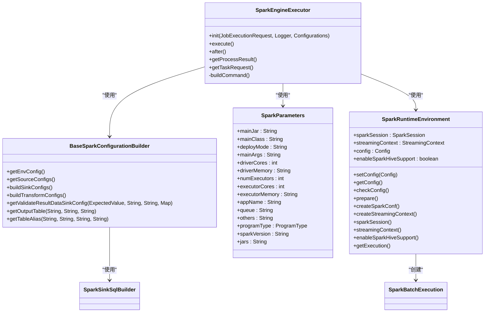
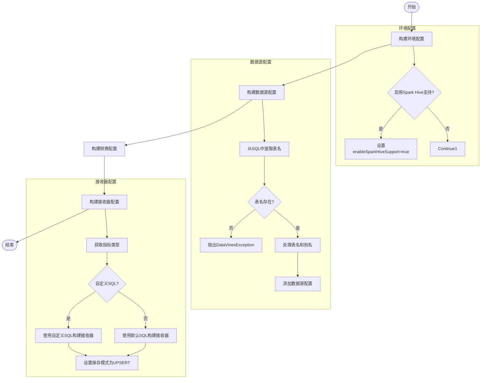
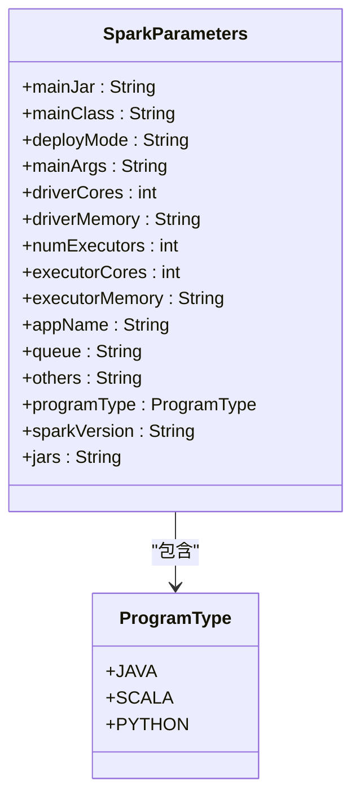
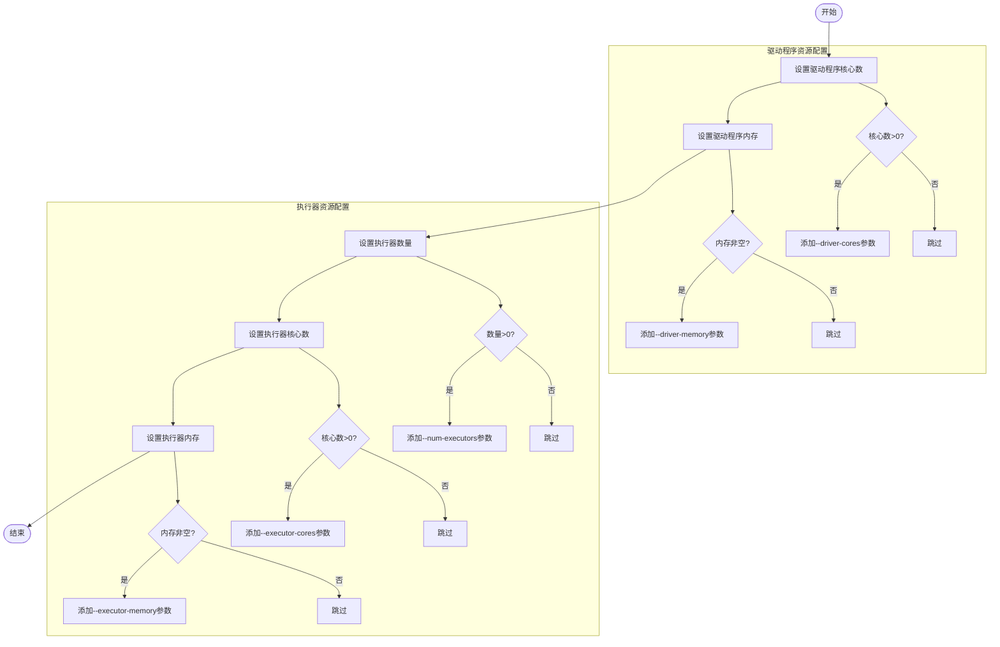
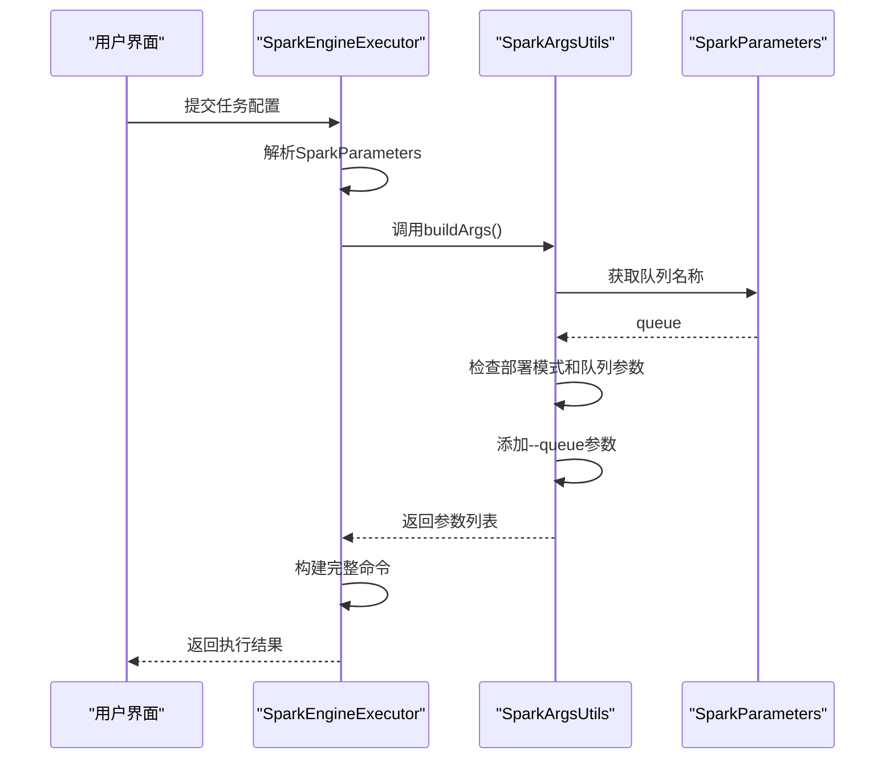
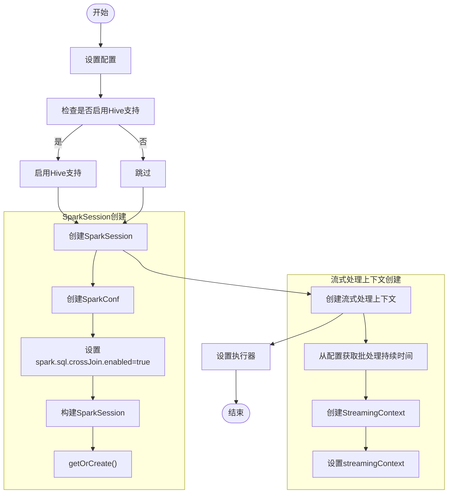
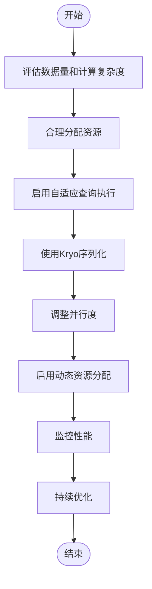
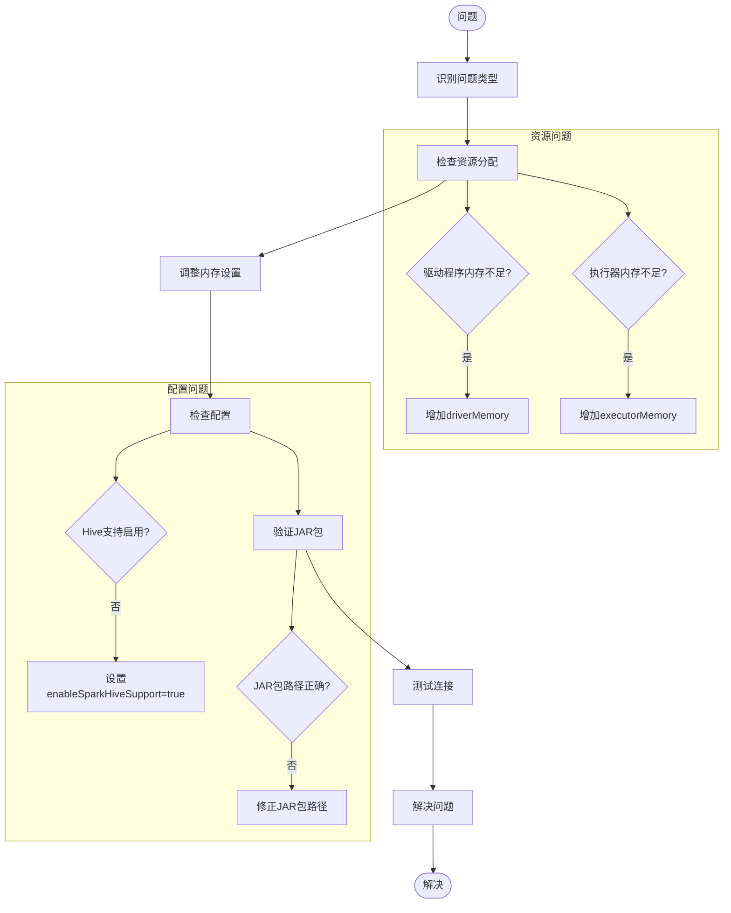

# Spark直接执行配置

<cite>
**本文档引用文件**   
- [SparkEngineExecutor.java](file://datavines-engine\datavines-engine-plugins\datavines-engine-spark\datavines-engine-spark-executor\src\main\java\io\datavines\engine\spark\executor\SparkEngineExecutor.java)
- [BaseSparkConfigurationBuilder.java](file://datavines-engine\datavines-engine-plugins\datavines-engine-spark\datavines-engine-spark-config\src\main\java\io\datavines\engine\spark\config\BaseSparkConfigurationBuilder.java)
- [SparkParameters.java](file://datavines-engine\datavines-engine-plugins\datavines-engine-spark\datavines-engine-spark-executor\src\main\java\io\datavines\engine\spark\executor\parameter\SparkParameters.java)
- [SparkConstants.java](file://datavines-engine\datavines-engine-plugins\datavines-engine-spark\datavines-engine-spark-executor\src\main\java\io\datavines\engine\spark\executor\parameter\SparkConstants.java)
- [SparkArgsUtils.java](file://datavines-engine\datavines-engine-plugins\datavines-engine-spark\datavines-engine-spark-executor\src\main\java\io\datavines\engine\spark\executor\parameter\SparkArgsUtils.java)
- [SparkRuntimeEnvironment.java](file://datavines-engine\datavines-engine-plugins\datavines-engine-spark\datavines-engine-spark-api\src\main\java\io\datavines\engine\spark\api\SparkRuntimeEnvironment.java)
- [SparkDataVinesBootstrap.java](file://datavines-engine\datavines-engine-plugins\datavines-engine-spark\datavines-engine-spark-core\src\main\java\io\datavines\engine\spark\core\SparkDataVinesBootstrap.java)
- [SparkDataProfileMetricBuilder.java](file://datavines-engine\datavines-engine-plugins\datavines-engine-spark\datavines-engine-spark-config\src\main\java\io\datavines\engine\spark\config\SparkDataProfileMetricBuilder.java)
- [SparkSingleTableMetricBuilder.java](file://datavines-engine\datavines-engine-plugins\datavines-engine-spark\datavines-engine-spark-config\src\main\java\io\datavines\engine\spark\config\SparkSingleTableMetricBuilder.java)
- [SparkMultiTableValueComparisonMetricBuilder.java](file://datavines-engine\datavines-engine-plugins\datavines-engine-spark\datavines-engine-spark-config\src\main\java\io\datavines\engine\spark\config\SparkMultiTableValueComparisonMetricBuilder.java)
- [ProgramType.java](file://datavines-engine\datavines-engine-plugins\datavines-engine-spark\datavines-engine-spark-executor\src\main\java\io\datavines\engine\spark\executor\parameter\ProgramType.java)
- [SparkSinkSqlBuilder.java](file://datavines-engine\datavines-engine-plugins\datavines-engine-spark\datavines-engine-spark-config\src\main\java\io\datavines\engine\spark\config\SparkSinkSqlBuilder.java)
- [CommonConstants.java](file://datavines-common\src\main\java\io\datavines\common\CommonConstants.java)
- [SparkEngineParameter.java](file://datavines-common\src\main\java\io\datavines\common\entity\SparkEngineParameter.java)
</cite>

## 目录
1. [简介](#简介)
2. [核心组件](#核心组件)
3. [配置构建流程](#配置构建流程)
4. [Spark参数设置](#spark参数设置)
5. [资源分配策略](#资源分配策略)
6. [队列配置](#队列配置)
7. [执行环境初始化](#执行环境初始化)
8. [配置示例](#配置示例)
9. [性能调优建议](#性能调优建议)
10. [常见问题解决方案](#常见问题解决方案)

## 简介
DataVines通过SparkEngineExecutor直接提交Spark任务，实现数据质量检查和数据剖析等功能。本配置文档详细说明了如何通过BaseSparkConfigurationBuilder构建配置，设置Spark参数，分配资源，配置队列以及初始化执行环境。文档涵盖了从配置构建到任务执行的完整流程，并提供配置示例、性能调优建议和常见问题解决方案，确保用户能够正确配置和优化Spark直接执行模式。

## 核心组件

DataVines中Spark直接执行的核心组件包括SparkEngineExecutor、BaseSparkConfigurationBuilder、SparkParameters和SparkRuntimeEnvironment。SparkEngineExecutor负责构建和执行Spark命令，BaseSparkConfigurationBuilder负责构建任务配置，SparkParameters定义了Spark任务的参数，而SparkRuntimeEnvironment则负责初始化Spark执行环境。



**图表来源**
- [SparkEngineExecutor.java](file://datavines-engine\datavines-engine-plugins\datavines-engine-spark\datavines-engine-spark-executor\src\main\java\io\datavines\engine\spark\executor\SparkEngineExecutor.java)
- [BaseSparkConfigurationBuilder.java](file://datavines-engine\datavines-engine-plugins\datavines-engine-spark\datavines-engine-spark-config\src\main\java\io\datavines\engine\spark\config\BaseSparkConfigurationBuilder.java)
- [SparkParameters.java](file://datavines-engine\datavines-engine-plugins\datavines-engine-spark\datavines-engine-spark-executor\src\main\java\io\datavines\engine\spark\executor\parameter\SparkParameters.java)
- [SparkRuntimeEnvironment.java](file://datavines-engine\datavines-engine-plugins\datavines-engine-spark\datavines-engine-spark-api\src\main\java\io\datavines\engine\spark\api\SparkRuntimeEnvironment.java)
- [SparkSinkSqlBuilder.java](file://datavines-engine\datavines-engine-plugins\datavines-engine-spark\datavines-engine-spark-config\src\main\java\io\datavines\engine\spark\config\SparkSinkSqlBuilder.java)

**章节来源**
- [SparkEngineExecutor.java](file://datavines-engine\datavines-engine-plugins\datavines-engine-spark\datavines-engine-spark-executor\src\main\java\io\datavines\engine\spark\executor\SparkEngineExecutor.java)
- [BaseSparkConfigurationBuilder.java](file://datavines-engine\datavines-engine-plugins\datavines-engine-spark\datavines-engine-spark-config\src\main\java\io\datavines\engine\spark\config\BaseSparkConfigurationBuilder.java)
- [SparkParameters.java](file://datavines-engine\datavines-engine-plugins\datavines-engine-spark\datavines-engine-spark-executor\src\main\java\io\datavines\engine\spark\executor\parameter\SparkParameters.java)
- [SparkRuntimeEnvironment.java](file://datavines-engine\datavines-engine-plugins\datavines-engine-spark\datavines-engine-spark-api\src\main\java\io\datavines\engine\spark\api\SparkRuntimeEnvironment.java)

## 配置构建流程

DataVines中的Spark任务配置构建流程由BaseSparkConfigurationBuilder及其子类负责。配置构建器根据任务类型（如数据剖析、单表质量检查、多表值比较等）构建相应的配置。配置构建流程包括环境配置、数据源配置、转换配置和接收器配置的构建。



**图表来源**
- [BaseSparkConfigurationBuilder.java](file://datavines-engine\datavines-engine-plugins\datavines-engine-spark\datavines-engine-spark-config\src\main\java\io\datavines\engine\spark\config\BaseSparkConfigurationBuilder.java)
- [SparkDataProfileMetricBuilder.java](file://datavines-engine\datavines-engine-plugins\datavines-engine-spark\datavines-engine-spark-config\src\main\java\io\datavines\engine\spark\config\SparkDataProfileMetricBuilder.java)
- [SparkSingleTableMetricBuilder.java](file://datavines-engine\datavines-engine-plugins\datavines-engine-spark\datavines-engine-spark-config\src\main\java\io\datavines\engine\spark\config\SparkSingleTableMetricBuilder.java)
- [SparkMultiTableValueComparisonMetricBuilder.java](file://datavines-engine\datavines-engine-plugins\datavines-engine-spark\datavines-engine-spark-config\src\main\java\io\datavines\engine\spark\config\SparkMultiTableValueComparisonMetricBuilder.java)

**章节来源**
- [BaseSparkConfigurationBuilder.java](file://datavines-engine\datavines-engine-plugins\datavines-engine-spark\datavines-engine-spark-config\src\main\java\io\datavines\engine\spark\config\BaseSparkConfigurationBuilder.java)
- [SparkDataProfileMetricBuilder.java](file://datavines-engine\datavines-engine-plugins\datavines-engine-spark\datavines-engine-spark-config\src\main\java\io\datavines\engine\spark\config\SparkDataProfileMetricBuilder.java)
- [SparkSingleTableMetricBuilder.java](file://datavines-engine\datavines-engine-plugins\datavines-engine-spark\datavines-engine-spark-config\src\main\java\io\datavines\engine\spark\config\SparkSingleTableMetricBuilder.java)
- [SparkMultiTableValueComparisonMetricBuilder.java](file://datavines-engine\datavines-engine-plugins\datavines-engine-spark\datavines-engine-spark-config\src\main\java\io\datavines\engine\spark\config\SparkMultiTableValueComparisonMetricBuilder.java)

## Spark参数设置

Spark参数设置通过SparkParameters类进行，该类定义了Spark任务的所有参数。参数设置包括程序类型、Spark版本、主类、JAR包路径、部署模式、驱动程序和执行器的资源配置等。



**图表来源**
- [SparkParameters.java](file://datavines-engine\datavines-engine-plugins\datavines-engine-spark\datavines-engine-spark-executor\src\main\java\io\datavines\engine\spark\executor\parameter\SparkParameters.java)
- [ProgramType.java](file://datavines-engine\datavines-engine-plugins\datavines-engine-spark\datavines-engine-spark-executor\src\main\java\io\datavines\engine\spark\executor\parameter\ProgramType.java)

**章节来源**
- [SparkParameters.java](file://datavines-engine\datavines-engine-plugins\datavines-engine-spark\datavines-engine-spark-executor\src\main\java\io\datavines\engine\spark\executor\parameter\SparkParameters.java)
- [ProgramType.java](file://datavines-engine\datavines-engine-plugins\datavines-engine-spark\datavines-engine-spark-executor\src\main\java\io\datavines\engine\spark\executor\parameter\ProgramType.java)

## 资源分配策略

DataVines中的资源分配策略通过Spark参数进行配置，包括驱动程序和执行器的CPU核心数和内存大小。资源分配策略直接影响任务的性能和稳定性。



**图表来源**
- [SparkParameters.java](file://datavines-engine\datavines-engine-plugins\datavines-engine-spark\datavines-engine-spark-executor\src\main\java\io\datavines\engine\spark\executor\parameter\SparkParameters.java)
- [SparkArgsUtils.java](file://datavines-engine\datavines-engine-plugins\datavines-engine-spark\datavines-engine-spark-executor\src\main\java\io\datavines\engine\spark\executor\parameter\SparkArgsUtils.java)
- [SparkConstants.java](file://datavines-engine\datavines-engine-plugins\datavines-engine-spark\datavines-engine-spark-executor\src\main\java\io\datavines\engine\spark\executor\parameter\SparkConstants.java)

**章节来源**
- [SparkParameters.java](file://datavines-engine\datavines-engine-plugins\datavines-engine-spark\datavines-engine-spark-executor\src\main\java\io\datavines\engine\spark\executor\parameter\SparkParameters.java)
- [SparkArgsUtils.java](file://datavines-engine\datavines-engine-plugins\datavines-engine-spark\datavines-engine-spark-executor\src\main\java\io\datavines\engine\spark\executor\parameter\SparkArgsUtils.java)
- [SparkConstants.java](file://datavines-engine\datavines-engine-plugins\datavines-engine-spark\datavines-engine-spark-executor\src\main\java\io\datavines\engine\spark\executor\parameter\SparkConstants.java)

## 队列配置

队列配置用于指定Spark任务提交到YARN的哪个队列。队列配置有助于资源管理和任务调度。



**图表来源**
- [SparkEngineExecutor.java](file://datavines-engine\datavines-engine-plugins\datavines-engine-spark\datavines-engine-spark-executor\src\main\java\io\datavines\engine\spark\executor\SparkEngineExecutor.java)
- [SparkArgsUtils.java](file://datavines-engine\datavines-engine-plugins\datavines-engine-spark\datavines-engine-spark-executor\src\main\java\io\datavines\engine\spark\executor\parameter\SparkArgsUtils.java)
- [SparkParameters.java](file://datavines-engine\datavines-engine-plugins\datavines-engine-spark\datavines-engine-spark-executor\src\main\java\io\datavines\engine\spark\executor\parameter\SparkParameters.java)

**章节来源**
- [SparkEngineExecutor.java](file://datavines-engine\datavines-engine-plugins\datavines-engine-spark\datavines-engine-spark-executor\src\main\java\io\datavines\engine\spark\executor\SparkEngineExecutor.java)
- [SparkArgsUtils.java](file://datavines-engine\datavines-engine-plugins\datavines-engine-spark\datavines-engine-spark-executor\src\main\java\io\datavines\engine\spark\executor\parameter\SparkArgsUtils.java)
- [SparkParameters.java](file://datavines-engine\datavines-engine-plugins\datavines-engine-spark\datavines-engine-spark-executor\src\main\java\io\datavines\engine\spark\executor\parameter\SparkParameters.java)

## 执行环境初始化

执行环境初始化由SparkRuntimeEnvironment负责，包括SparkSession的创建、Hive支持的启用、流式处理上下文的创建等。



**图表来源**
- [SparkRuntimeEnvironment.java](file://datavines-engine\datavines-engine-plugins\datavines-engine-spark\datavines-engine-spark-api\src\main\java\io\datavines\engine\spark\api\SparkRuntimeEnvironment.java)
- [SparkBatchExecution.java](file://datavines-engine\datavines-engine-plugins\datavines-engine-spark\datavines-engine-spark-api\src\main\java\io\datavines\engine\spark\api\batch\SparkBatchExecution.java)

**章节来源**
- [SparkRuntimeEnvironment.java](file://datavines-engine\datavines-engine-plugins\datavines-engine-spark\datavines-engine-spark-api\src\main\java\io\datavines\engine\spark\api\SparkRuntimeEnvironment.java)
- [SparkBatchExecution.java](file://datavines-engine\datavines-engine-plugins\datavines-engine-spark\datavines-engine-spark-api\src\main\java\io\datavines\engine\spark\api\batch\SparkBatchExecution.java)

## 配置示例

以下是一个完整的Spark任务配置示例，展示了如何设置各种参数：

```json
{
  "programType": "JAVA",
  "deployMode": "cluster",
  "driverCores": 2,
  "driverMemory": "4g",
  "numExecutors": 5,
  "executorCores": 4,
  "executorMemory": "8g",
  "appName": "DataVines-Quality-Check",
  "queue": "default",
  "others": "--conf spark.serializer=org.apache.spark.serializer.KryoSerializer --conf spark.sql.adaptive.enabled=true",
  "sparkVersion": "2.4",
  "jars": "--jars hdfs://path/to/dependency1.jar,hdfs://path/to/dependency2.jar"
}
```

**章节来源**
- [SparkParameters.java](file://datavines-engine\datavines-engine-plugins\datavines-engine-spark\datavines-engine-spark-executor\src\main\java\io\datavines\engine\spark\executor\parameter\SparkParameters.java)
- [SparkEngineParameter.java](file://datavines-common\src\main\java\io\datavines\common\entity\SparkEngineParameter.java)

## 性能调优建议

为了优化Spark任务的性能，建议采取以下措施：

1. **合理分配资源**：根据数据量和计算复杂度合理设置执行器数量、核心数和内存大小。
2. **启用自适应查询执行**：通过`spark.sql.adaptive.enabled=true`启用自适应查询执行，优化查询计划。
3. **使用Kryo序列化**：通过`spark.serializer=org.apache.spark.serializer.KryoSerializer`使用Kryo序列化，提高序列化性能。
4. **调整并行度**：根据集群资源和数据量调整`spark.sql.shuffle.partitions`参数。
5. **启用动态资源分配**：通过`spark.dynamicAllocation.enabled=true`启用动态资源分配，提高资源利用率。



**图表来源**
- [SparkArgsUtils.java](file://datavines-engine\datavines-engine-plugins\datavines-engine-spark\datavines-engine-spark-executor\src\main\java\io\datavines\engine\spark\executor\parameter\SparkArgsUtils.java)
- [SparkConstants.java](file://datavines-engine\datavines-engine-plugins\datavines-engine-spark\datavines-engine-spark-executor\src\main\java\io\datavines\engine\spark\executor\parameter\SparkConstants.java)

**章节来源**
- [SparkArgsUtils.java](file://datavines-engine\datavines-engine-plugins\datavines-engine-spark\datavines-engine-spark-executor\src\main\java\io\datavines\engine\spark\executor\parameter\SparkArgsUtils.java)
- [SparkConstants.java](file://datavines-engine\datavines-engine-plugins\datavines-engine-spark\datavines-engine-spark-executor\src\main\java\io\datavines\engine\spark\executor\parameter\SparkConstants.java)

## 常见问题解决方案

### 问题1：任务提交失败，提示"Application application_XXXXXX failed 2 times due to AM Container for X failed"
**解决方案**：检查驱动程序内存是否足够，增加`driverMemory`参数的值。

### 问题2：执行器频繁失败
**解决方案**：检查执行器内存是否足够，增加`executorMemory`参数的值，或减少`executorCores`以降低内存压力。

### 问题3：任务执行缓慢
**解决方案**：增加执行器数量(`numExecutors`)和核心数(`executorCores`)，或优化SQL查询。

### 问题4：无法连接到Hive metastore
**解决方案**：确保`enableSparkHiveSupport`设置为`true`，并检查Hive配置是否正确。

### 问题5：自定义JAR包未生效
**解决方案**：确保`jars`参数正确指定了JAR包路径，并使用`--jars`前缀。



**图表来源**
- [SparkEngineExecutor.java](file://datavines-engine\datavines-engine-plugins\datavines-engine-spark\datavines-engine-spark-executor\src\main\java\io\datavines\engine\spark\executor\SparkEngineExecutor.java)
- [SparkParameters.java](file://datavines-engine\datavines-engine-plugins\datavines-engine-spark\datavines-engine-spark-executor\src\main\java\io\datavines\engine\spark\executor\parameter\SparkParameters.java)
- [BaseSparkConfigurationBuilder.java](file://datavines-engine\datavines-engine-plugins\datavines-engine-spark\datavines-engine-spark-config\src\main\java\io\datavines\engine\spark\config\BaseSparkConfigurationBuilder.java)

**章节来源**
- [SparkEngineExecutor.java](file://datavines-engine\datavines-engine-plugins\datavines-engine-spark\datavines-engine-spark-executor\src\main\java\io\datavines\engine\spark\executor\SparkEngineExecutor.java)
- [SparkParameters.java](file://datavines-engine\datavines-engine-plugins\datavines-engine-spark\datavines-engine-spark-executor\src\main\java\io\datavines\engine\spark\executor\parameter\SparkParameters.java)
- [BaseSparkConfigurationBuilder.java](file://datavines-engine\datavines-engine-plugins\datavines-engine-spark\datavines-engine-spark-config\src\main\java\io\datavines\engine\spark\config\BaseSparkConfigurationBuilder.java)