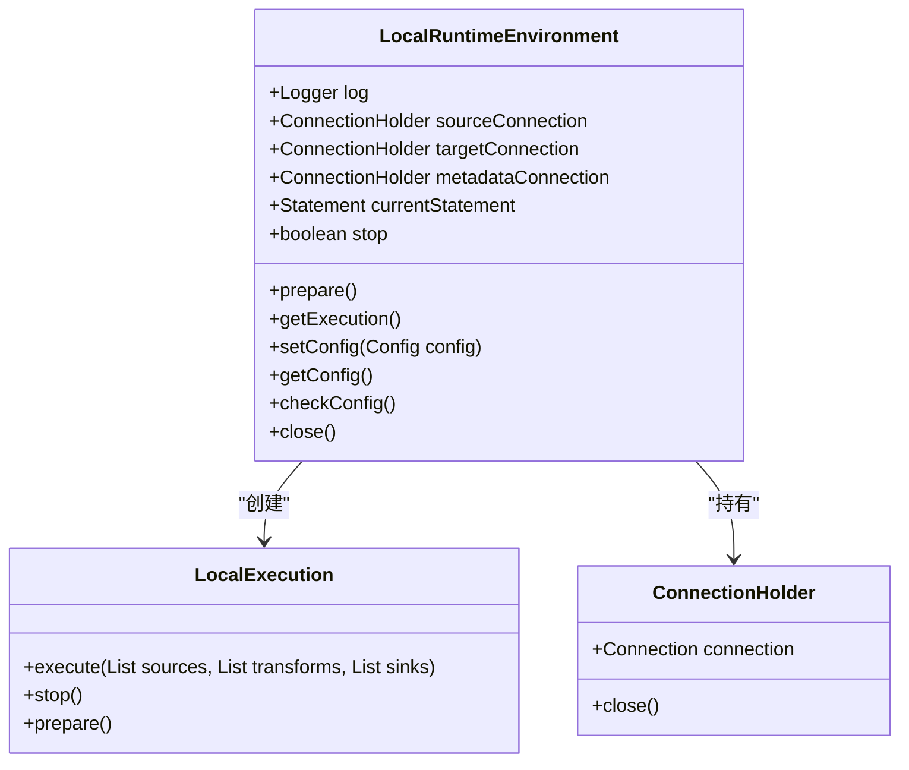
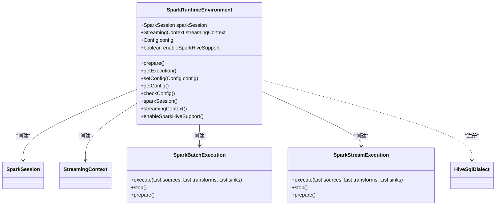
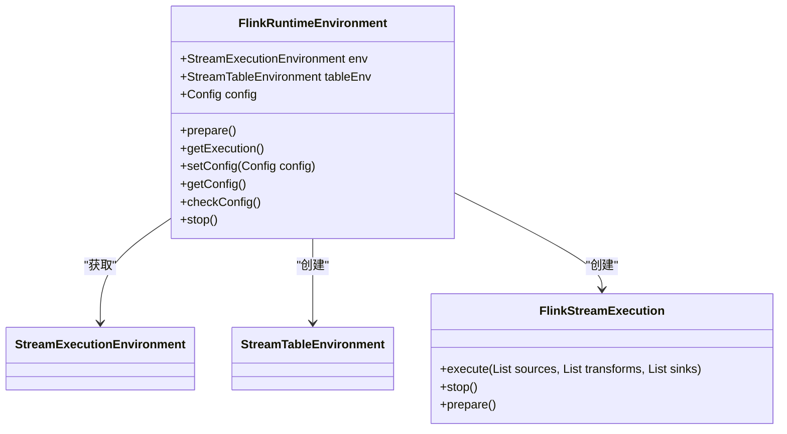
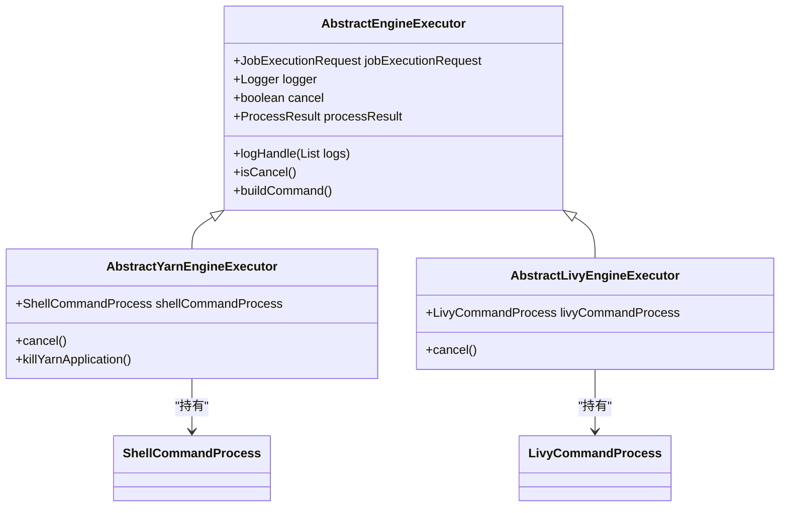
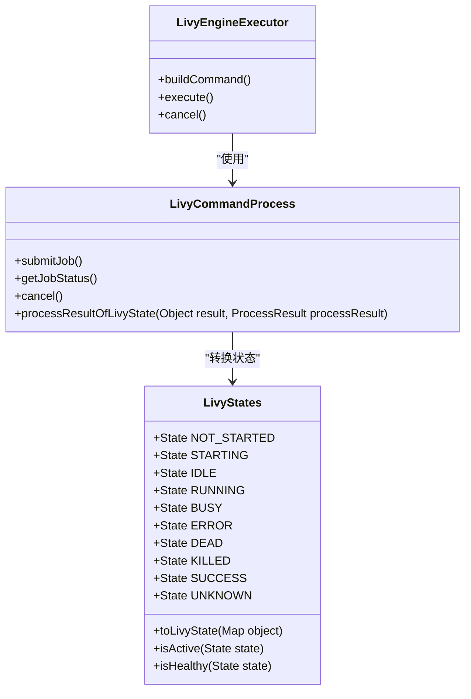
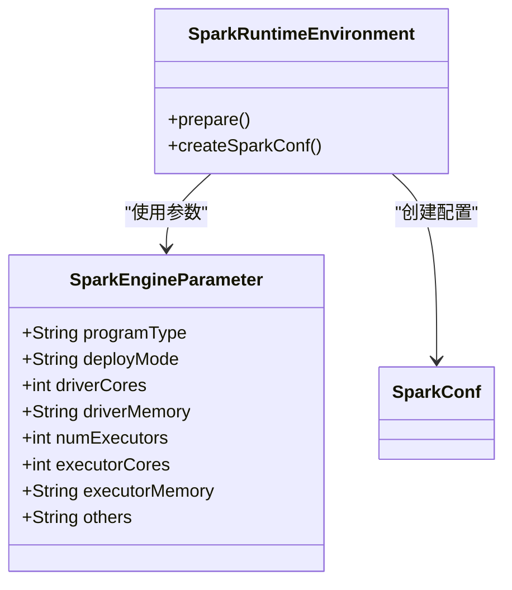

# 执行引擎配置

<cite>
**本文档引用的文件**  
- [ResourceSchedulePlatformType.java](file://datavines-engine/datavines-engine-executor/src/main/java/io/datavines/engine/executor/core/enums/ResourceSchedulePlatformType.java)
- [LivyStates.java](file://datavines-engine/datavines-engine-executor/src/main/java/io/datavines/engine/executor/core/enums/LivyStates.java)
- [RuntimeEnvironment.java](file://datavines-engine/datavines-engine-api/src/main/java/io/datavines/engine/api/env/RuntimeEnvironment.java)
- [Execution.java](file://datavines-engine/datavines-engine-api/src/main/java/io/datavines/engine/api/env/Execution.java)
- [SparkEngineParameter.java](file://datavines-common/src/main/java/io/datavines/common/entity/SparkEngineParameter.java)
- [AbstractEngineExecutor.java](file://datavines-engine/datavines-engine-executor/src/main/java/io/datavines/engine/executor/core/base/AbstractEngineExecutor.java)
- [AbstractLivyEngineExecutor.java](file://datavines-engine/datavines-engine-executor/src/main/java/io/datavines/engine/executor/core/base/AbstractLivyEngineExecutor.java)
- [AbstractYarnEngineExecutor.java](file://datavines-engine/datavines-engine-executor/src/main/java/io/datavines/engine/executor/core/base/AbstractYarnEngineExecutor.java)
- [SparkRuntimeEnvironment.java](file://datavines-engine/datavines-engine-plugins/datavines-engine-spark/datavines-engine-spark-api/src/main/java/io/datavines/engine/spark/api/SparkRuntimeEnvironment.java)
- [FlinkRuntimeEnvironment.java](file://datavines-engine/datavines-engine-plugins/datavines-engine-flink/datavines-engine-flink-api/src/main/java/io/datavines/engine/flink/api/FlinkRuntimeEnvironment.java)
- [LocalRuntimeEnvironment.java](file://datavines-engine/datavines-engine-plugins/datavines-engine-local/datavines-engine-local-api/src/main/java/io/datavines/engine/local/api/LocalRuntimeEnvironment.java)
</cite>

## 目录
1. [简介](#简介)
2. [执行引擎类型](#执行引擎类型)
3. [本地执行引擎配置](#本地执行引擎配置)
4. [Spark执行引擎配置](#spark执行引擎配置)
5. [Flink执行引擎配置](#flink执行引擎配置)
6. [资源调度平台配置](#资源调度平台配置)
7. [Livy集成配置](#livy集成配置)
8. [执行参数与资源分配](#执行参数与资源分配)
9. [执行模式与超时设置](#执行模式与超时设置)
10. [JVM参数与内存配置](#jvm参数与内存配置)
11. [执行状态监控](#执行状态监控)

## 简介
DataVines支持多种执行引擎，包括本地执行、Spark和Flink等分布式计算框架。本文档详细说明了各种执行引擎的配置方法，涵盖连接参数、资源分配、执行模式、超时设置等方面。同时，文档还解释了如何配置Livy、Yarn等资源调度平台，提供不同执行引擎的性能对比和适用场景建议，并说明如何配置执行环境的JVM参数、内存分配和GC策略，以及如何监控执行引擎的运行状态。

## 执行引擎类型
DataVines支持以下几种执行引擎类型：
- **Local**：本地执行模式，适用于小规模数据处理和开发测试
- **Spark**：基于Apache Spark的分布式计算引擎，适用于大规模批处理任务
- **Flink**：基于Apache Flink的流处理引擎，适用于实时数据处理和流式计算

这些执行引擎通过统一的接口进行管理，用户可以根据具体需求选择合适的执行引擎。

**Section sources**
- [ResourceSchedulePlatformType.java](file://datavines-engine/datavines-engine-executor/src/main/java/io/datavines/engine/executor/core/enums/ResourceSchedulePlatformType.java)

## 本地执行引擎配置
本地执行引擎是最简单的执行模式，直接在当前JVM进程中执行任务。本地执行引擎不需要额外的集群资源，适合开发和测试环境。

本地执行引擎的核心是`LocalRuntimeEnvironment`类，它实现了`RuntimeEnvironment`接口，负责准备执行环境和获取执行器。本地执行环境主要管理数据库连接和SQL执行状态。

**Diagram sources**
- [LocalRuntimeEnvironment.java](file://datavines-engine/datavines-engine-plugins/datavines-engine-local/datavines-engine-local-api/src/main/java/io/datavines/engine/local/api/LocalRuntimeEnvironment.java)

**Section sources**
- [LocalRuntimeEnvironment.java](file://datavines-engine/datavines-engine-plugins/datavines-engine-local/datavines-engine-local-api/src/main/java/io/datavines/engine/local/api/LocalRuntimeEnvironment.java)

## Spark执行引擎配置
Spark执行引擎基于Apache Spark框架，支持大规模数据处理。Spark执行环境通过`SparkRuntimeEnvironment`类实现，该类负责创建和管理SparkSession和StreamingContext。

Spark执行环境支持批处理和流处理两种模式，可以通过配置参数进行切换。执行环境还支持Hive集成，可以访问Hive元数据和表。

**Diagram sources**
- [SparkRuntimeEnvironment.java](file://datavines-engine/datavines-engine-plugins/datavines-engine-spark/datavines-engine-spark-api/src/main/java/io/datavines/engine/spark/api/SparkRuntimeEnvironment.java)

**Section sources**
- [SparkRuntimeEnvironment.java](file://datavines-engine/datavines-engine-plugins/datavines-engine-spark/datavines-engine-spark-api/src/main/java/io/datavines/engine/spark/api/SparkRuntimeEnvironment.java)

## Flink执行引擎配置
Flink执行引擎基于Apache Flink框架，专注于流式数据处理。Flink执行环境通过`FlinkRuntimeEnvironment`类实现，该类负责创建和管理StreamExecutionEnvironment和StreamTableEnvironment。

Flink执行环境支持批处理和流处理两种运行模式，可以通过配置参数进行切换。执行环境还提供了对Flink SQL的支持，可以执行复杂的流式SQL查询。

**Diagram sources**
- [FlinkRuntimeEnvironment.java](file://datavines-engine/datavines-engine-plugins/datavines-engine-flink/datavines-engine-flink-api/src/main/java/io/datavines/engine/flink/api/FlinkRuntimeEnvironment.java)

**Section sources**
- [FlinkRuntimeEnvironment.java](file://datavines-engine/datavines-engine-plugins/datavines-engine-flink/datavines-engine-flink-api/src/main/java/io/datavines/engine/flink/api/FlinkRuntimeEnvironment.java)

## 资源调度平台配置
DataVines支持多种资源调度平台，包括本地、Yarn和K8S。资源调度平台类型通过`ResourceSchedulePlatformType`枚举定义。

不同的资源调度平台有不同的执行器实现：
- **LOCAL**：使用本地执行器，直接在当前进程中执行任务
- **YARN**：使用Yarn执行器，通过Yarn集群管理资源
- **K8S**：使用K8S执行器，通过Kubernetes集群管理资源

Yarn执行器继承自`AbstractYarnEngineExecutor`，该类提供了Yarn应用的管理和终止功能。执行器通过YarnUtils工具类获取应用ID，并使用sudo命令终止Yarn应用。

**Diagram sources**
- [AbstractEngineExecutor.java](file://datavines-engine/datavines-engine-executor/src/main/java/io/datavines/engine/executor/core/base/AbstractEngineExecutor.java)
- [AbstractYarnEngineExecutor.java](file://datavines-engine/datavines-engine-executor/src/main/java/io/datavines/engine/executor/core/base/AbstractYarnEngineExecutor.java)
- [AbstractLivyEngineExecutor.java](file://datavines-engine/datavines-engine-executor/src/main/java/io/datavines/engine/executor/core/base/AbstractLivyEngineExecutor.java)

**Section sources**
- [ResourceSchedulePlatformType.java](file://datavines-engine/datavines-engine-executor/src/main/java/io/datavines/engine/executor/core/enums/ResourceSchedulePlatformType.java)
- [AbstractYarnEngineExecutor.java](file://datavines-engine/datavines-engine-executor/src/main/java/io/datavines/engine/executor/core/base/AbstractYarnEngineExecutor.java)

## Livy集成配置
Livy是Spark的REST接口服务，允许通过HTTP请求提交和管理Spark作业。DataVines通过`AbstractLivyEngineExecutor`类集成Livy，实现对Spark作业的远程提交和管理。

Livy状态管理通过`LivyStates`类实现，该类定义了Livy会话的各种状态，包括NOT_STARTED、STARTING、IDLE、RUNNING、BUSY、ERROR、DEAD、KILLED、SUCCESS等。执行器通过查询Livy REST API获取作业状态，并根据状态进行相应的处理。

**Diagram sources**
- [LivyStates.java](file://datavines-engine/datavines-engine-executor/src/main/java/io/datavines/engine/executor/core/enums/LivyStates.java)

**Section sources**
- [LivyStates.java](file://datavines-engine/datavines-engine-executor/src/main/java/io/datavines/engine/executor/core/enums/LivyStates.java)
- [AbstractLivyEngineExecutor.java](file://datavines-engine/datavines-engine-executor/src/main/java/io/datavines/engine/executor/core/base/AbstractLivyEngineExecutor.java)

## 执行参数与资源分配
执行参数和资源分配通过`SparkEngineParameter`类进行配置。该类定义了Spark作业的各种参数，包括程序类型、部署模式、驱动程序核心数、驱动程序内存、执行器数量、每个执行器的核心数、每个执行器的内存等。

这些参数在提交Spark作业时作为命令行参数传递给Spark-submit脚本，用于控制作业的资源分配和执行行为。

**Diagram sources**
- [SparkEngineParameter.java](file://datavines-common/src/main/java/io/datavines/common/entity/SparkEngineParameter.java)

**Section sources**
- [SparkEngineParameter.java](file://datavines-common/src/main/java/io/datavines/common/entity/SparkEngineParameter.java)

## 执行模式与超时设置
执行模式通过配置参数进行设置，支持批处理和流处理两种模式。批处理模式适用于一次性处理大量数据，而流处理模式适用于持续处理实时数据流。

超时设置通过作业配置中的超时策略进行管理。系统提供了多种超时策略，包括固定超时、动态超时等。当作业执行时间超过设定的超时阈值时，系统会自动终止作业并记录超时信息。

执行模式和超时设置在`RuntimeEnvironment`接口中定义，具体的执行器实现类根据配置创建相应的执行环境。

**Section sources**
- [RuntimeEnvironment.java](file://datavines-engine/datavines-engine-api/src/main/java/io/datavines/engine/api/env/RuntimeEnvironment.java)
- [Execution.java](file://datavines-engine/datavines-engine-api/src/main/java/io/datavines/engine/api/env/Execution.java)

## JVM参数与内存配置
JVM参数和内存配置通过Spark和Flink的配置系统进行管理。对于Spark执行引擎，JVM参数通过SparkConf进行设置；对于Flink执行引擎，JVM参数通过StreamExecutionEnvironment进行设置。

内存配置包括堆内存和非堆内存的分配。系统建议根据数据规模和处理需求合理配置内存，避免内存溢出或资源浪费。对于大规模数据处理，建议增加堆内存大小，并配置适当的GC策略。

JVM参数和内存配置还可以通过环境变量或配置文件进行设置，以便在不同环境中灵活调整。

**Section sources**
- [SparkRuntimeEnvironment.java](file://datavines-engine/datavines-engine-plugins/datavines-engine-spark/datavines-engine-spark-api/src/main/java/io/datavines/engine/spark/api/SparkRuntimeEnvironment.java)
- [FlinkRuntimeEnvironment.java](file://datavines-engine/datavines-engine-plugins/datavines-engine-flink/datavines-engine-flink-api/src/main/java/io/datavines/engine/flink/api/FlinkRuntimeEnvironment.java)

## 执行状态监控
执行状态监控通过日志和状态查询两种方式实现。系统会记录详细的执行日志，包括作业提交、执行进度、完成状态等信息。同时，系统还提供了状态查询接口，可以实时获取作业的执行状态。

对于分布式执行引擎，系统通过查询资源调度平台（如Yarn、Livy）的REST API获取作业状态。监控信息包括作业ID、应用ID、执行状态、资源使用情况等。

执行状态监控还支持告警功能，当作业执行失败或超时时，系统会触发告警并通知相关人员。

**Section sources**
- [AbstractEngineExecutor.java](file://datavines-engine/datavines-engine-executor/src/main/java/io/datavines/engine/executor/core/base/AbstractEngineExecutor.java)
- [LivyStates.java](file://datavines-engine/datavines-engine-executor/src/main/java/io/datavines/engine/executor/core/enums/LivyStates.java)