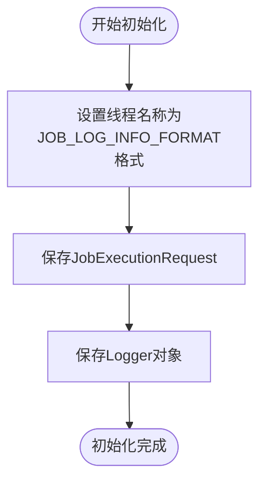
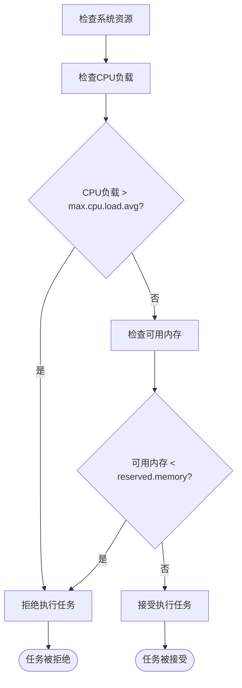
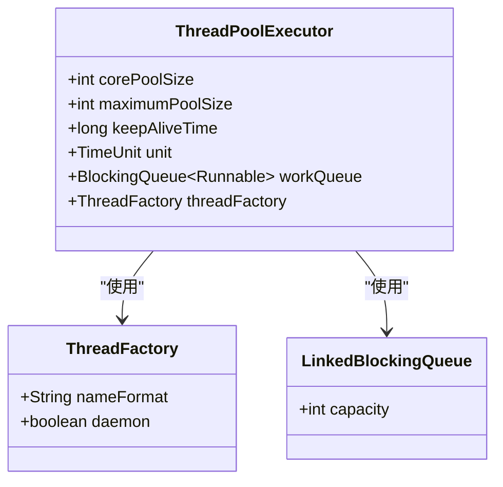
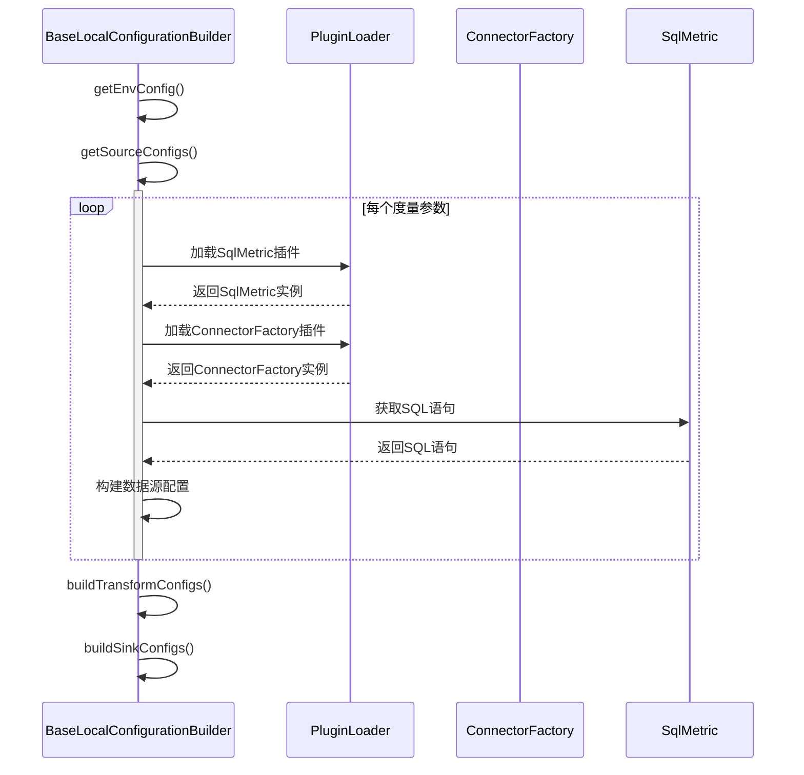
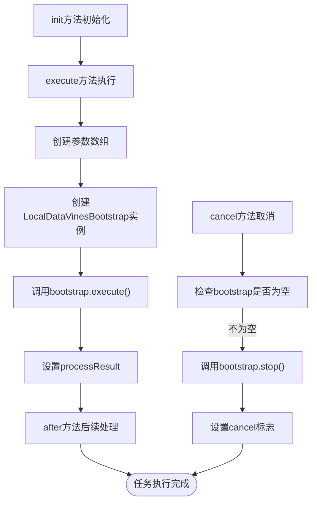
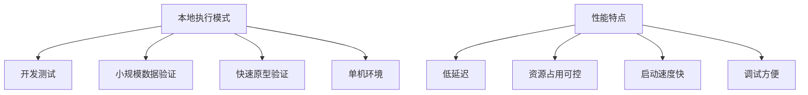
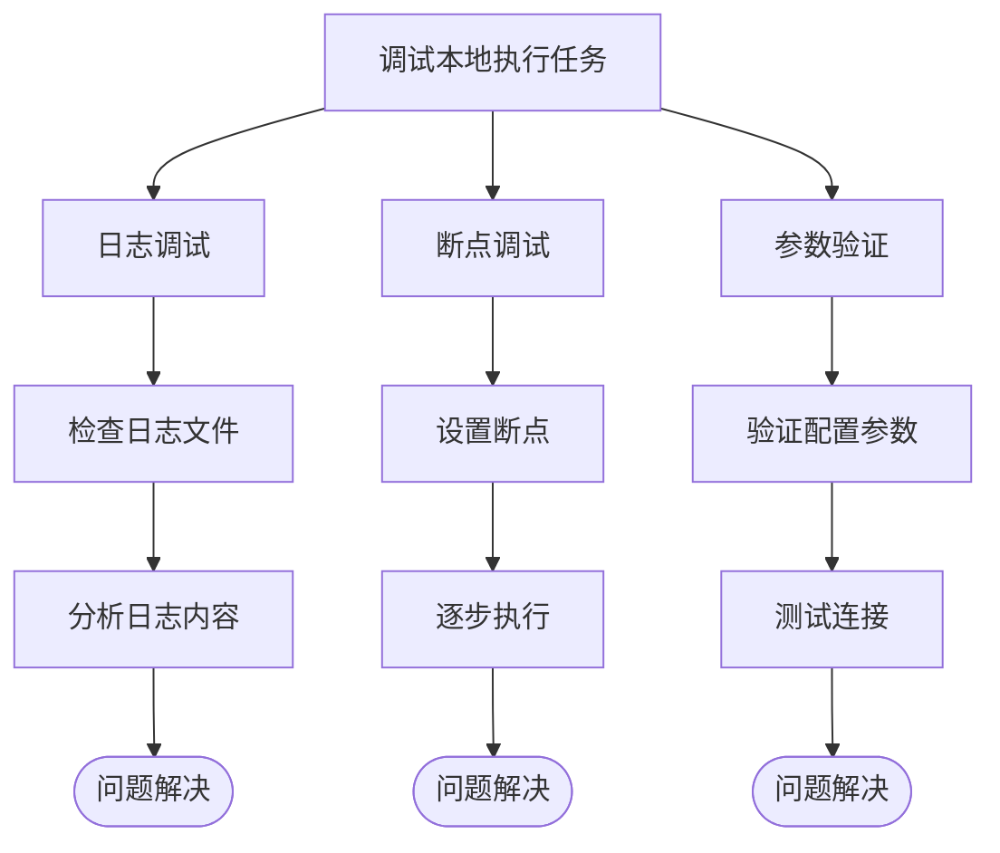

# 本地执行配置

<cite>
**本文档引用的文件**   
- [BaseLocalConfigurationBuilder.java](file://datavines-engine/datavines-engine-plugins/datavines-engine-local/datavines-engine-local-config/src/main/java/io/datavines/engine/local/config/BaseLocalConfigurationBuilder.java)
- [LocalEngineExecutor.java](file://datavines-engine/datavines-engine-plugins/datavines-engine-local/datavines-engine-local-executor/src/main/java/io/datavines/engine/local/executor/LocalEngineExecutor.java)
- [LocalDataVinesBootstrap.java](file://datavines-engine/datavines-engine-plugins/datavines-engine-local/datavines-engine-local-core/src/main/java/io/datavines/engine/local/core/LocalDataVinesBootstrap.java)
- [BaseDataVinesBootstrap.java](file://datavines-engine/datavines-engine-core/src/main/java/io/datavines/engine/core/BaseDataVinesBootstrap.java)
- [LocalRuntimeEnvironment.java](file://datavines-engine/datavines-engine-plugins/datavines-engine-local/datavines-engine-local-api/src/main/java/io/datavines/engine/local/api/LocalRuntimeEnvironment.java)
- [LocalExecution.java](file://datavines-engine/datavines-engine-plugins/datavines-engine-local/datavines-engine-local-api/src/main/java/io/datavines/engine/local/api/LocalExecution.java)
- [CommonPropertyUtils.java](file://datavines-common/src/main/java/io/datavines/common/utils/CommonPropertyUtils.java)
- [ThreadUtils.java](file://datavines-common/src/main/java/io/datavines/common/utils/ThreadUtils.java)
</cite>

## 目录
1. [简介](#简介)
2. [本地执行环境初始化](#本地执行环境初始化)
3. [JVM配置与内存管理](#jvm配置与内存管理)
4. [线程池设置](#线程池设置)
5. [BaseLocalConfigurationBuilder配置构建](#baselocalconfigurationbuilder配置构建)
6. [LocalEngineExecutor任务执行](#localengineexecutor任务执行)
7. [适用场景与性能特点](#适用场景与性能特点)
8. [配置最佳实践](#配置最佳实践)
9. [本地执行任务调试](#本地执行任务调试)
10. [总结](#总结)

## 简介
DataVines本地执行模式是一种在单机环境中运行数据质量验证任务的执行方式。该模式适用于开发测试、小规模数据验证和快速原型验证等场景。本地执行模式通过BaseLocalConfigurationBuilder类构建执行配置，并由LocalEngineExecutor处理任务的执行。本文档将详细介绍本地执行模式的配置方法，包括环境初始化参数、JVM配置、内存管理、线程池设置等关键配置项，以及如何调试本地执行任务。

## 本地执行环境初始化
本地执行环境的初始化主要通过LocalEngineExecutor类的init方法完成。该方法接收JobExecutionRequest、Logger和Configurations三个参数，用于初始化本地执行环境。

初始化过程包括：
1. 记录本地引擎初始化日志
2. 设置当前线程名称，便于日志追踪
3. 保存任务执行请求和日志对象



**本地执行环境初始化流程图**

**Diagram sources**
- [LocalEngineExecutor.java](file://datavines-engine/datavines-engine-plugins/datavines-engine-local/datavines-engine-local-executor/src/main/java/io/datavines/engine/local/executor/LocalEngineExecutor.java#L31-L38)

**Section sources**
- [LocalEngineExecutor.java](file://datavines-engine/datavines-engine-plugins/datavines-engine-local/datavines-engine-local-executor/src/main/java/io/datavines/engine/local/executor/LocalEngineExecutor.java#L31-L38)

## JVM配置与内存管理
DataVines本地执行模式的JVM配置主要通过系统属性和配置文件进行管理。关键的内存管理参数包括：

- **最大CPU负载平均值**：通过`max.cpu.load.avg`配置项设置，默认值为0.5
- **保留内存**：通过`reserved.memory`配置项设置，默认值为0.3G

这些配置在CommonPropertyUtils类中定义，用于控制本地执行环境的资源使用：

```java
public static final String MAX_CPU_LOAD_AVG = "max.cpu.load.avg";
public static final Double MAX_CPU_LOAD_AVG_DEFAULT = 0.5;

public static final String RESERVED_MEMORY = "reserved.memory";
public static final Double RESERVED_MEMORY_DEFAULT = 0.3;
```

当系统检测到CPU负载过高或可用内存不足时，会拒绝执行任务以保护系统稳定性。



**资源检查流程图**

**Diagram sources**
- [CommonPropertyUtils.java](file://datavines-common/src/main/java/io/datavines/common/utils/CommonPropertyUtils.java#L38-L42)
- [OSUtils.java](file://datavines-common/src/main/java/io/datavines/common/utils/OSUtils.java#L429-L434)

**Section sources**
- [CommonPropertyUtils.java](file://datavines-common/src/main/java/io/datavines/common/utils/CommonPropertyUtils.java#L38-L42)

## 线程池设置
DataVines本地执行模式使用线程池来管理并发执行的任务。线程池的配置主要通过ThreadUtils类实现，提供了创建守护线程池的方法。

关键的线程池配置方法包括：
- `newDaemonCachedThreadPool(String prefix)`：创建带前缀的守护线程池
- `newDaemonCachedThreadPool(String prefix, int maxThreadNumber, int keepAliveSeconds)`：创建带最大线程数和存活时间的守护线程池

线程池配置参数：
- **核心线程池大小**：等于最大线程数
- **最大线程池大小**：等于最大线程数
- **线程存活时间**：可配置的秒数
- **工作队列**：使用LinkedBlockingQueue
- **线程工厂**：使用命名线程工厂，线程名称格式为"prefix-ID"



**线程池组件关系图**

**Diagram sources**
- [ThreadUtils.java](file://datavines-common/src/main/java/io/datavines/common/utils/ThreadUtils.java#L49-L87)

**Section sources**
- [ThreadUtils.java](file://datavines-common/src/main/java/io/datavines/common/utils/ThreadUtils.java#L49-L87)

## BaseLocalConfigurationBuilder配置构建
BaseLocalConfigurationBuilder是本地执行配置的核心构建类，负责构建本地执行所需的环境配置、数据源配置、转换配置和接收器配置。

### 配置构建流程
1. **环境配置构建**：通过getEnvConfig方法构建环境配置
2. **数据源配置构建**：通过getSourceConfigs方法构建数据源配置
3. **转换配置构建**：通过buildTransformConfigs方法构建转换配置
4. **接收器配置构建**：通过buildSinkConfigs方法构建接收器配置



**配置构建序列图**

**Diagram sources**
- [BaseLocalConfigurationBuilder.java](file://datavines-engine/datavines-engine-plugins/datavines-engine-local/datavines-engine-local-config/src/main/java/io/datavines/engine/local/config/BaseLocalConfigurationBuilder.java#L47-L333)

**Section sources**
- [BaseLocalConfigurationBuilder.java](file://datavines-engine/datavines-engine-plugins/datavines-engine-local/datavines-engine-local-config/src/main/java/io/datavines/engine/local/config/BaseLocalConfigurationBuilder.java#L47-L333)

## LocalEngineExecutor任务执行
LocalEngineExecutor是本地执行模式的核心执行器，负责执行本地任务。它继承自AbstractEngineExecutor，实现了execute方法来执行任务。

### 任务执行流程
1. **初始化**：调用init方法初始化执行环境
2. **执行**：调用execute方法执行任务
3. **后续处理**：调用after方法进行后续处理
4. **取消**：调用cancel方法取消任务



**任务执行流程图**

**Diagram sources**
- [LocalEngineExecutor.java](file://datavines-engine/datavines-engine-plugins/datavines-engine-local/datavines-engine-local-executor/src/main/java/io/datavines/engine/local/executor/LocalEngineExecutor.java#L31-L77)

**Section sources**
- [LocalEngineExecutor.java](file://datavines-engine/datavines-engine-plugins/datavines-engine-local/datavines-engine-local-executor/src/main/java/io/datavines/engine/local/executor/LocalEngineExecutor.java#L31-L77)

## 适用场景与性能特点
### 适用场景
1. **开发测试**：在开发环境中快速验证数据质量规则
2. **小规模数据验证**：处理数据量较小的验证任务
3. **快速原型验证**：快速验证新的数据质量规则或配置
4. **单机环境**：在没有分布式集群的环境中运行

### 性能特点
1. **低延迟**：由于在单机上运行，避免了网络通信开销
2. **资源占用可控**：可以通过配置限制CPU和内存使用
3. **启动速度快**：无需启动分布式集群，启动时间短
4. **调试方便**：可以直接在开发环境中调试和查看日志



**适用场景与性能特点关系图**

**Diagram sources**
- [LocalEngineExecutor.java](file://datavines-engine/datavines-engine-plugins/datavines-engine-local/datavines-engine-local-executor/src/main/java/io/datavines/engine/local/executor/LocalEngineExecutor.java)
- [BaseLocalConfigurationBuilder.java](file://datavines-engine/datavines-engine-plugins/datavines-engine-local/datavines-engine-local-config/src/main/java/io/datavines/engine/local/config/BaseLocalConfigurationBuilder.java)

## 配置最佳实践
### JVM配置最佳实践
1. **合理设置最大CPU负载**：根据服务器性能调整`max.cpu.load.avg`值
2. **预留足够内存**：根据系统总内存设置`reserved.memory`值
3. **监控系统资源**：定期检查CPU和内存使用情况

### 线程池配置最佳实践
1. **合理设置线程数**：根据任务并发需求设置最大线程数
2. **设置适当的存活时间**：避免线程长时间空闲占用资源
3. **使用有意义的线程名称前缀**：便于日志追踪和问题排查

### 本地执行配置最佳实践
1. **使用合适的配置构建器**：根据任务类型选择相应的配置构建器
2. **正确配置数据源**：确保数据源连接信息正确无误
3. **合理设置超时策略**：避免任务长时间运行影响系统稳定性
4. **启用日志记录**：便于问题排查和性能分析

## 本地执行任务调试
### 调试方法
1. **日志调试**：通过日志文件查看任务执行过程
2. **断点调试**：在开发环境中设置断点进行调试
3. **参数验证**：验证配置参数的正确性

### 调试工具
1. **日志系统**：使用Logback进行日志记录
2. **线程监控**：使用ThreadMXBean监控线程状态
3. **性能分析**：使用JVM工具分析性能瓶颈



**本地执行任务调试流程图**

**Diagram sources**
- [LocalEngineExecutor.java](file://datavines-engine/datavines-engine-plugins/datavines-engine-local/datavines-engine-local-executor/src/main/java/io/datavines/engine/local/executor/LocalEngineExecutor.java)
- [BaseDataVinesBootstrap.java](file://datavines-engine/datavines-engine-core/src/main/java/io/datavines/engine/core/BaseDataVinesBootstrap.java)

**Section sources**
- [LocalEngineExecutor.java](file://datavines-engine/datavines-engine-plugins/datavines-engine-local/datavines-engine-local-executor/src/main/java/io/datavines/engine/local/executor/LocalEngineExecutor.java)
- [BaseDataVinesBootstrap.java](file://datavines-engine/datavines-engine-core/src/main/java/io/datavines/engine/core/BaseDataVinesBootstrap.java)

## 总结
DataVines本地执行模式提供了一种简单高效的本地数据质量验证方式。通过BaseLocalConfigurationBuilder类构建执行配置，由LocalEngineExecutor处理任务执行。本地执行模式适用于开发测试、小规模数据验证等场景，具有低延迟、资源占用可控、启动速度快和调试方便等优点。

关键配置要点包括：
1. 合理设置JVM参数，控制CPU和内存使用
2. 正确配置线程池，管理并发执行
3. 使用合适的配置构建器，确保配置正确性
4. 启用详细的日志记录，便于问题排查

通过遵循最佳实践和使用适当的调试方法，可以有效提高本地执行任务的稳定性和性能。