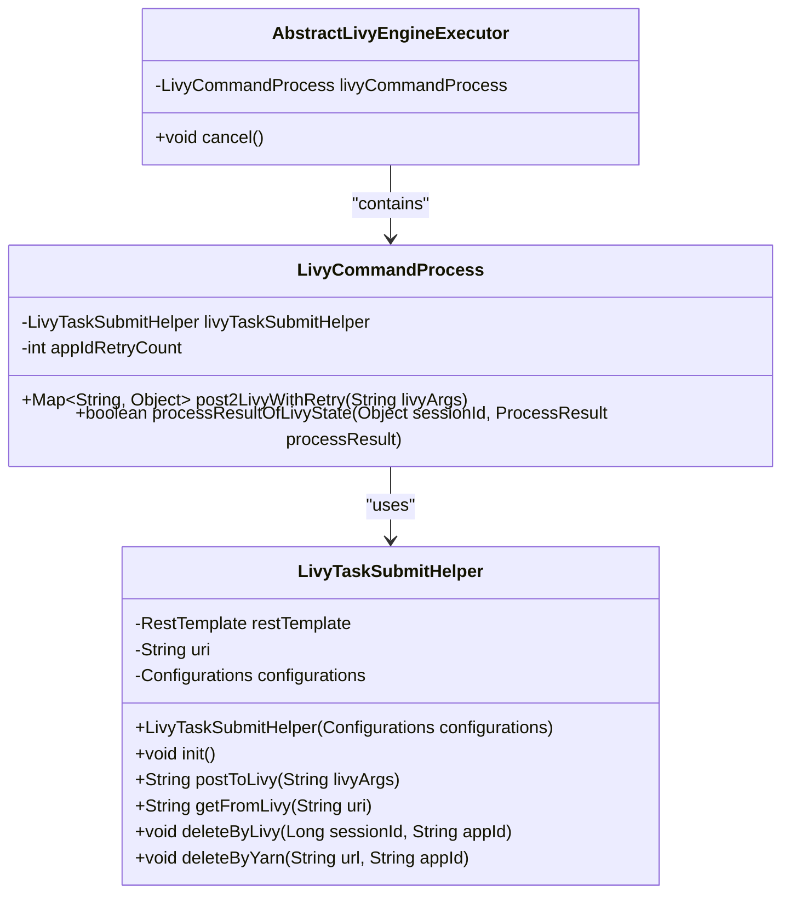

# Livy资源配置

<cite>
**本文档引用文件**   
- [AbstractLivyEngineExecutor.java](file://datavines-engine\datavines-engine-executor\src\main\java\io\datavines\engine\executor\core\base\AbstractLivyEngineExecutor.java)
- [LivyTaskSubmitHelper.java](file://datavines-engine\datavines-engine-executor\src\main\java\io\datavines\engine\executor\core\helper\LivyTaskSubmitHelper.java)
- [LivyCommandProcess.java](file://datavines-engine\datavines-engine-executor\src\main\java\io\datavines\engine\executor\core\executor\LivyCommandProcess.java)
- [application.yaml](file://datavines-server\src\main\resources\application.yaml)
- [datavines-mysql.sql](file://scripts\sql\datavines-mysql.sql)
- [common.properties](file://datavines-common\src\main\resources\common.properties)
</cite>

## 目录
1. [引言](#引言)
2. [Livy服务器配置](#livy服务器配置)
3. [会话参数与资源配额](#会话参数与资源配额)
4. [认证机制配置](#认证机制配置)
5. [Spark任务提交与状态跟踪](#spark任务提交与状态跟踪)
6. [最佳实践](#最佳实践)
7. [结论](#结论)

## 引言

DataVines是一个数据质量平台，通过集成Livy服务实现Spark任务的远程提交和管理。Livy作为Apache Spark的REST接口服务，允许用户通过HTTP请求与Spark集群进行交互。本文档详细说明DataVines与Livy服务集成的配置方法，包括Livy服务器地址配置、会话参数设置、资源配额管理、认证机制等。同时，解释AbstractLivyEngineExecutor和LivyTaskSubmitHelper如何实现Spark任务在Livy上的提交和状态跟踪。

## Livy服务器配置

DataVines通过配置Livy服务器地址来实现与Livy服务的集成。Livy服务器地址配置是集成的基础，决定了DataVines与Livy服务的通信路径。

Livy服务器地址通过`livy.uri`配置项进行设置，该配置项指定了Livy服务的REST API端点。在DataVines中，该配置可以在数据库的`dv_config`表中进行设置，如`datavines-mysql.sql`文件中的示例所示：

```sql
INSERT INTO `dv_config` VALUES ('14', '-1', 'livy.uri', 'http://localhost:8998/batches', '1', '1', '2023-09-05 21:02:38', '1', '2023-09-05 21:02:38');
```

此配置将Livy服务器地址设置为`http://localhost:8998/batches`，这是Livy服务的默认端点。在生产环境中，应根据实际的Livy服务部署情况进行相应的配置。

**Section sources**
- [datavines-mysql.sql](file://scripts\sql\datavines-mysql.sql#L865)

## 会话参数与资源配额

Livy会话参数和资源配额的配置对于优化Spark任务的执行至关重要。这些参数决定了Spark应用的资源分配和执行行为。

### 会话超时设置

会话超时设置是管理Livy会话生命周期的重要配置。虽然在当前代码中未直接体现会话超时的配置，但通过`LivyTaskSubmitHelper`类中的`SLEEP_TIME`常量（值为1000毫秒），可以推断出在轮询Livy会话状态时的等待时间。合理的会话超时设置可以避免资源的长时间占用，提高资源利用率。

### 资源监控

资源监控是确保Spark任务稳定运行的关键。通过配置合理的资源配额，可以防止单个任务占用过多资源，影响其他任务的执行。在Livy中，可以通过会话创建时的JSON配置来指定资源配额，如executor的数量、内存大小等。

**Section sources**
- [LivyTaskSubmitHelper.java](file://datavines-engine\datavines-engine-executor\src\main\java\io\datavines\engine\executor\core\helper\LivyTaskSubmitHelper.java#L45)

## 认证机制配置

DataVines支持多种认证机制来确保与Livy服务通信的安全性，包括Basic Auth和Kerberos认证。

### Basic Auth

Basic Auth是一种简单的认证机制，通过用户名和密码进行身份验证。在DataVines中，虽然没有直接体现Basic Auth的配置，但通过`LivyTaskSubmitHelper`类中的`REQUEST_BY_HEADER`常量（值为"X-Requested-By"）和请求头设置，可以推断出支持通过HTTP头进行基本的身份验证。

### Kerberos认证

Kerberos认证是一种更安全的网络认证协议，广泛应用于企业级大数据平台。DataVines通过配置`livy.need.kerberos`、`livy.server.auth.kerberos.principal`和`livy.server.auth.kerberos.keytab`等参数来支持Kerberos认证。

```java
if (needKerberos.equalsIgnoreCase("false")) {
    logger.info("The livy server doesn't need Kerberos Authentication");
    // Basic authentication or no authentication
} else {
    logger.info("The livy server needs Kerberos Authentication");
    String userPrincipal = configurations.getString("livy.server.auth.kerberos.principal");
    String keyTabLocation = configurations.getString("livy.server.auth.kerberos.keytab");
    KerberosRestTemplate restTemplate = new KerberosRestTemplate(keyTabLocation, userPrincipal);
    // Kerberos authentication
}
```

此代码片段展示了如何根据`livy.need.kerberos`配置项的值来决定是否启用Kerberos认证，并使用指定的principal和keytab文件进行认证。

**Section sources**
- [LivyTaskSubmitHelper.java](file://datavines-engine\datavines-engine-executor\src\main\java\io\datavines\engine\executor\core\helper\LivyTaskSubmitHelper.java#L127-L164)

## Spark任务提交与状态跟踪

DataVines通过`AbstractLivyEngineExecutor`和`LivyTaskSubmitHelper`类实现Spark任务在Livy上的提交和状态跟踪。

### AbstractLivyEngineExecutor

`AbstractLivyEngineExecutor`是Livy引擎执行器的抽象基类，继承自`AbstractEngineExecutor`。它定义了Livy任务执行的基本框架，包括任务取消等操作。

```java
public abstract class AbstractLivyEngineExecutor extends AbstractEngineExecutor {
    protected LivyCommandProcess livyCommandProcess;

    @Override
    public void cancel() throws Exception {
        livyCommandProcess.cancel();
        cancel = true;
    }
}
```

此抽象类通过`livyCommandProcess`字段与具体的命令处理逻辑进行交互，实现了任务取消的功能。

### LivyTaskSubmitHelper

`LivyTaskSubmitHelper`类是Livy任务提交的核心辅助类，负责与Livy REST API进行交互，实现任务的提交、状态查询和删除等操作。



**Diagram sources **
- [AbstractLivyEngineExecutor.java](file://datavines-engine\datavines-engine-executor\src\main\java\io\datavines\engine\executor\core\base\AbstractLivyEngineExecutor.java#L23-L36)
- [LivyTaskSubmitHelper.java](file://datavines-engine\datavines-engine-executor\src\main\java\io\datavines\engine\executor\core\helper\LivyTaskSubmitHelper.java#L39-L257)
- [LivyCommandProcess.java](file://datavines-engine\datavines-engine-executor\src\main\java\io\datavines\engine\executor\core\executor\LivyCommandProcess.java#L38-L143)

**Section sources**
- [AbstractLivyEngineExecutor.java](file://datavines-engine\datavines-engine-executor\src\main\java\io\datavines\engine\executor\core\base\AbstractLivyEngineExecutor.java#L23-L36)
- [LivyTaskSubmitHelper.java](file://datavines-engine\datavines-engine-executor\src\main\java\io\datavines\engine\executor\core\helper\LivyTaskSubmitHelper.java#L39-L257)
- [LivyCommandProcess.java](file://datavines-engine\datavines-engine-executor\src\main\java\io\datavines\engine\executor\core\executor\LivyCommandProcess.java#L38-L143)

## 最佳实践

### 高可用部署方案

为了确保Livy服务的高可用性，建议采用以下部署方案：

1. **集群部署**：将Livy服务部署在多个节点上，通过负载均衡器分发请求，避免单点故障。
2. **ZooKeeper集成**：利用ZooKeeper实现Livy服务的注册与发现，自动处理节点故障和恢复。
3. **定期健康检查**：配置定期的健康检查机制，及时发现并处理故障节点。

### 资源管理

1. **合理设置资源配额**：根据集群资源情况和任务需求，合理设置每个Spark应用的资源配额，避免资源浪费或不足。
2. **动态资源分配**：启用Spark的动态资源分配功能，根据任务负载自动调整executor的数量，提高资源利用率。

### 安全性

1. **启用Kerberos认证**：在生产环境中，建议启用Kerberos认证，确保通信安全。
2. **定期更新密钥**：定期更新Kerberos的keytab文件和principal，降低安全风险。

## 结论

DataVines通过集成Livy服务，实现了Spark任务的远程提交和管理。通过合理的配置，可以确保任务的高效、安全执行。本文档详细介绍了Livy资源配置的各个方面，包括服务器配置、会话参数、认证机制等，并解释了核心组件的工作原理。遵循本文档的最佳实践，可以构建一个稳定、高效的DataVines与Livy集成环境。