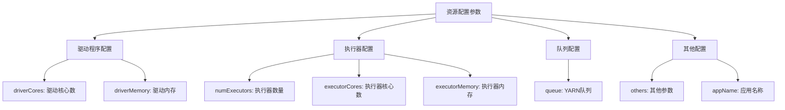
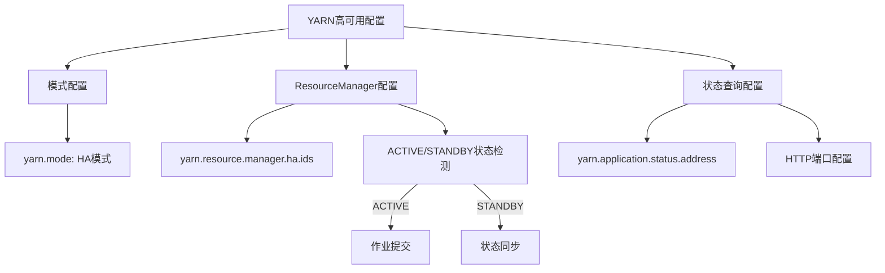
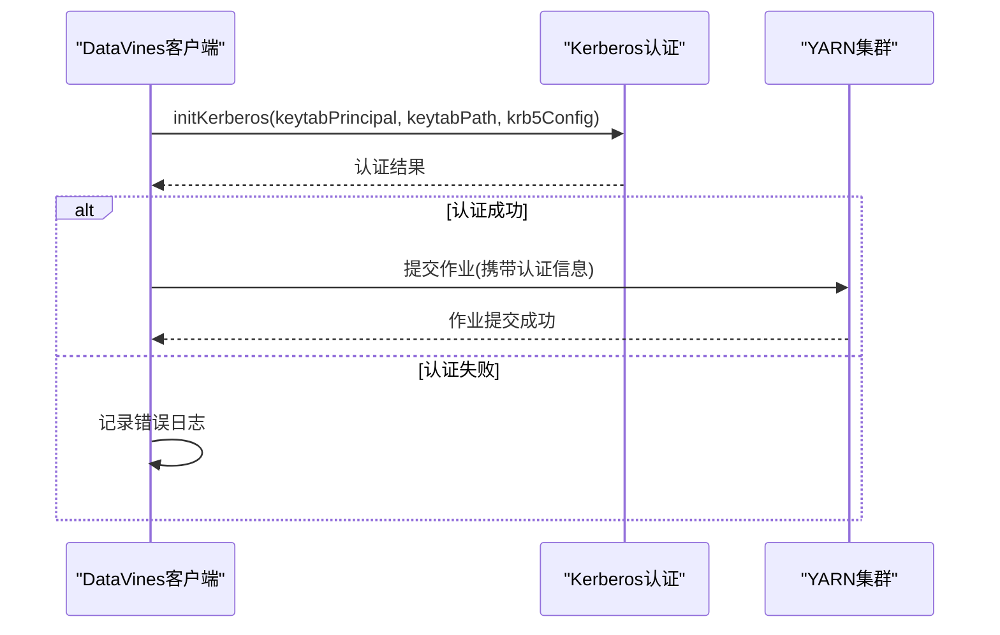
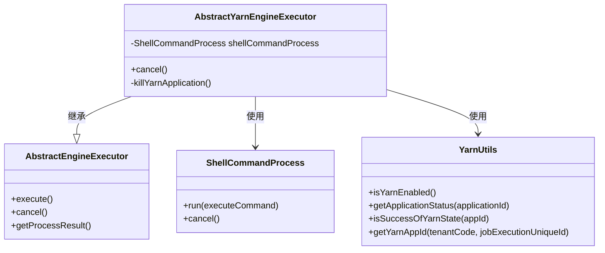
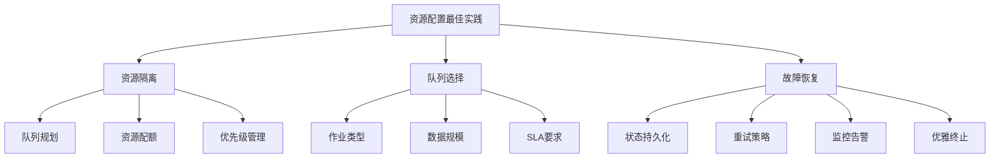

# YARN资源配置

<cite>
**本文档引用的文件**
- [AbstractYarnEngineExecutor.java](file://datavines-engine/datavines-engine-executor/src/main/java/io/datavines/engine/executor/core/base/AbstractYarnEngineExecutor.java)
- [YarnUtils.java](file://datavines-common/src/main/java/io/datavines/common/utils/YarnUtils.java)
- [SparkParameters.java](file://datavines-engine/datavines-engine-plugins/datavines-engine-spark/datavines-engine-spark-executor/src/main/java/io/datavines/engine/spark/executor/parameter/SparkParameters.java)
- [KerberosUtils.java](file://datavines-connector/datavines-connector-plugins/datavines-connector-hive/src/main/java/io/datavines/connector/plugin/KerberosUtils.java)
- [LivyTaskSubmitHelper.java](file://datavines-engine/datavines-engine-executor/src/main/java/io/datavines/engine/executor/core/helper/LivyTaskSubmitHelper.java)
</cite>

## 目录
1. [YARN资源配置](#yarn资源配置)
2. [YARN队列配置](#yarn队列配置)
3. [资源申请参数配置](#资源申请参数配置)
4. [高可用配置](#高可用配置)
5. [安全认证配置](#安全认证配置)
6. [AbstractYarnEngineExecutor实现分析](#abstractyarnengineexecutor实现分析)
7. [最佳实践](#最佳实践)

## YARN队列配置

DataVines支持通过配置参数指定YARN队列，实现资源隔离和优先级管理。在Spark执行参数中，`queue`字段用于指定提交作业的目标队列。

通过合理配置YARN队列，可以实现不同租户、不同业务类型作业的资源隔离，避免资源争用。队列配置支持动态设置，可根据作业优先级、资源需求等因素选择合适的队列。

**Section sources**
- [SparkParameters.java](file://datavines-engine/datavines-engine-plugins/datavines-engine-spark/datavines-engine-spark-executor/src/main/java/io/datavines/engine/spark/executor/parameter/SparkParameters.java#L75-L80)

## 资源申请参数配置

DataVines提供了全面的资源申请参数配置，支持精细化的资源管理。主要资源配置参数包括：

- **驱动程序资源**：`driverCores`和`driverMemory`参数用于配置驱动程序的核心数和内存
- **执行器资源**：`numExecutors`、`executorCores`和`executorMemory`参数用于配置执行器的数量、核心数和内存
- **应用程序名称**：`appName`参数用于设置应用程序名称，便于在YARN管理界面识别
- **其他参数**：`others`参数用于传递额外的Spark配置参数

这些参数允许用户根据作业的计算复杂度和数据规模，精确配置所需的计算资源，优化资源利用率。

**Diagram sources**
- [SparkParameters.java](file://datavines-engine/datavines-engine-plugins/datavines-engine-spark/datavines-engine-spark-executor/src/main/java/io/datavines/engine/spark/executor/parameter/SparkParameters.java#L50-L75)

**Section sources**
- [SparkParameters.java](file://datavines-engine/datavines-engine-plugins/datavines-engine-spark/datavines-engine-spark-executor/src/main/java/io/datavines/engine/spark/executor/parameter/SparkParameters.java#L50-L80)

## 高可用配置

DataVines支持YARN高可用配置，确保在ResourceManager故障时作业能够继续运行。高可用配置主要通过以下参数实现：

- `yarn.mode`：配置YARN模式，支持"none"、"ha"和"standalone"三种模式
- `yarn.resource.manager.ha.ids`：在HA模式下，配置ResourceManager的ID列表
- `yarn.application.status.address`：配置应用程序状态查询地址
- `yarn.resource.manager.http.address.port`：配置ResourceManager HTTP服务端口

当配置为HA模式时，系统会自动检测Active状态的ResourceManager，并向其提交作业，实现故障自动转移。

**Diagram sources**
- [YarnUtils.java](file://datavines-common/src/main/java/io/datavines/common/utils/YarnUtils.java#L33-L44)

**Section sources**
- [YarnUtils.java](file://datavines-common/src/main/java/io/datavines/common/utils/YarnUtils.java#L33-L47)

## 安全认证配置

DataVines支持Kerberos安全认证，确保与YARN集群的安全通信。Kerberos认证配置主要涉及以下方面：

- **Kerberos初始化**：通过`initKerberos`方法使用keytab文件和principal进行认证
- **配置检查**：验证keytab principal、keytab文件路径和krb5配置文件的完整性
- **Principal提取**：从keytab文件中提取可用的principal列表

在Livy集成场景中，系统会根据配置自动选择是否启用Kerberos认证，并使用相应的RestTemplate进行安全通信。

**Diagram sources**
- [KerberosUtils.java](file://datavines-connector/datavines-connector-plugins/datavines-connector-hive/src/main/java/io/datavines/connector/plugin/KerberosUtils.java#L39-L76)
- [LivyTaskSubmitHelper.java](file://datavines-engine/datavines-engine-executor/src/main/java/io/datavines/engine/executor/core/helper/LivyTaskSubmitHelper.java#L127-L190)

**Section sources**
- [KerberosUtils.java](file://datavines-connector/datavines-connector-plugins/datavines-connector-hive/src/main/java/io/datavines/connector/plugin/KerberosUtils.java#L39-L76)

## AbstractYarnEngineExecutor实现分析

`AbstractYarnEngineExecutor`是DataVines中YARN任务提交和状态监控的核心实现类。该类继承自`AbstractEngineExecutor`，提供了YARN特定的功能实现。

### 任务提交与取消

`AbstractYarnEngineExecutor`通过`ShellCommandProcess`执行YARN命令来提交和管理作业。当需要取消作业时，会调用`cancel`方法，该方法会：

1. 设置取消标志
2. 取消底层进程
3. 调用`killYarnApplication`方法终止YARN应用程序

### 状态监控机制

系统通过`YarnUtils`工具类实现YARN应用程序的状态监控。主要方法包括：

- `getApplicationStatus`：通过HTTP接口查询应用程序的最终状态
- `isSuccessOfYarnState`：轮询检查应用程序状态，直到完成或失败
- `getYarnAppId`：根据租户代码和作业执行唯一ID生成YARN应用ID

状态监控采用轮询机制，在作业执行期间定期检查YARN应用程序状态，并将状态更新反馈给作业管理系统。

**Diagram sources**
- [AbstractYarnEngineExecutor.java](file://datavines-engine/datavines-engine-executor/src/main/java/io/datavines/engine/executor/core/base/AbstractYarnEngineExecutor.java#L25-L40)
- [YarnUtils.java](file://datavines-common/src/main/java/io/datavines/common/utils/YarnUtils.java#L194-L269)
- [BaseCommandProcess.java](file://datavines-engine/datavines-engine-executor/src/main/java/io/datavines/engine/executor/core/executor/BaseCommandProcess.java#L76-L109)

**Section sources**
- [AbstractYarnEngineExecutor.java](file://datavines-engine/datavines-engine-executor/src/main/java/io/datavines/engine/executor/core/base/AbstractYarnEngineExecutor.java#L25-L40)
- [YarnUtils.java](file://datavines-common/src/main/java/io/datavines/common/utils/YarnUtils.java#L194-L269)

## 最佳实践

### 资源隔离策略

1. **队列规划**：根据业务重要性、作业类型和资源需求，合理规划YARN队列
2. **资源配额**：为不同队列设置适当的资源配额，避免资源过度集中
3. **优先级管理**：通过队列优先级配置，确保关键作业获得足够的资源

### 队列选择策略

1. **基于作业类型**：将批处理作业、实时作业和交互式查询分配到不同的队列
2. **基于数据规模**：根据处理数据量大小选择合适的队列
3. **基于SLA要求**：对有严格SLA要求的作业分配高优先级队列

### 故障恢复机制

1. **状态持久化**：定期保存作业执行状态，支持故障后恢复
2. **重试策略**：对临时性故障实现自动重试，提高作业成功率
3. **监控告警**：建立完善的监控告警体系，及时发现和处理异常

4. **优雅终止**：在作业取消时，确保资源被正确释放，避免资源泄漏

**Diagram sources**
- [YarnUtils.java](file://datavines-common/src/main/java/io/datavines/common/utils/YarnUtils.java#L242-L265)
- [JobExecutionFailover.java](file://datavines-server/src/main/java/io/datavines/server/dqc/coordinator/failover/JobExecutionFailover.java#L119-L142)

**Section sources**
- [YarnUtils.java](file://datavines-common/src/main/java/io/datavines/common/utils/YarnUtils.java#L242-L265)
- [FlinkEngineExecutor.java](file://datavines-engine/datavines-engine-plugins/datavines-engine-flink/datavines-engine-flink-executor/src/main/java/io/datavines/engine/flink/executor/FlinkEngineExecutor.java#L151-L167)