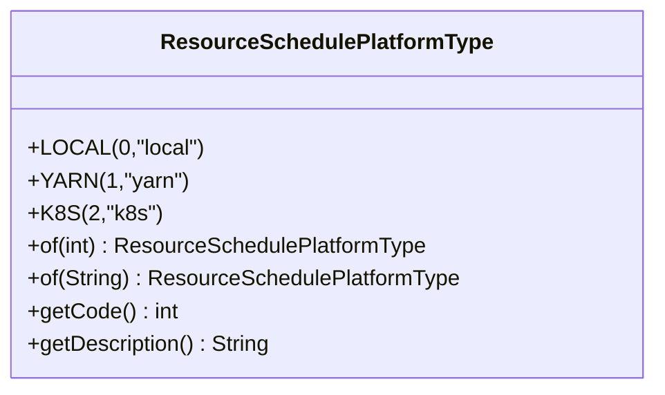
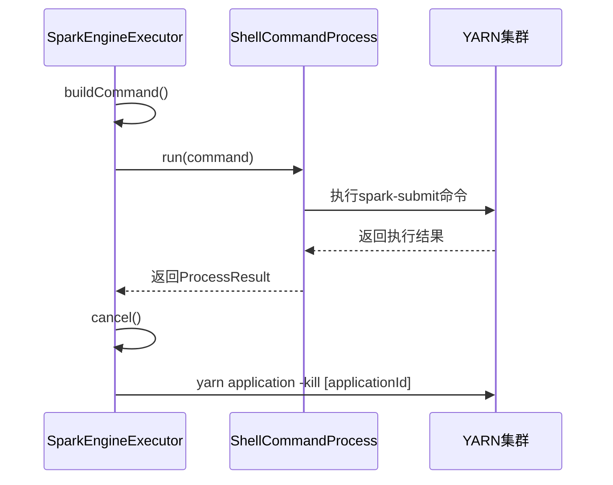
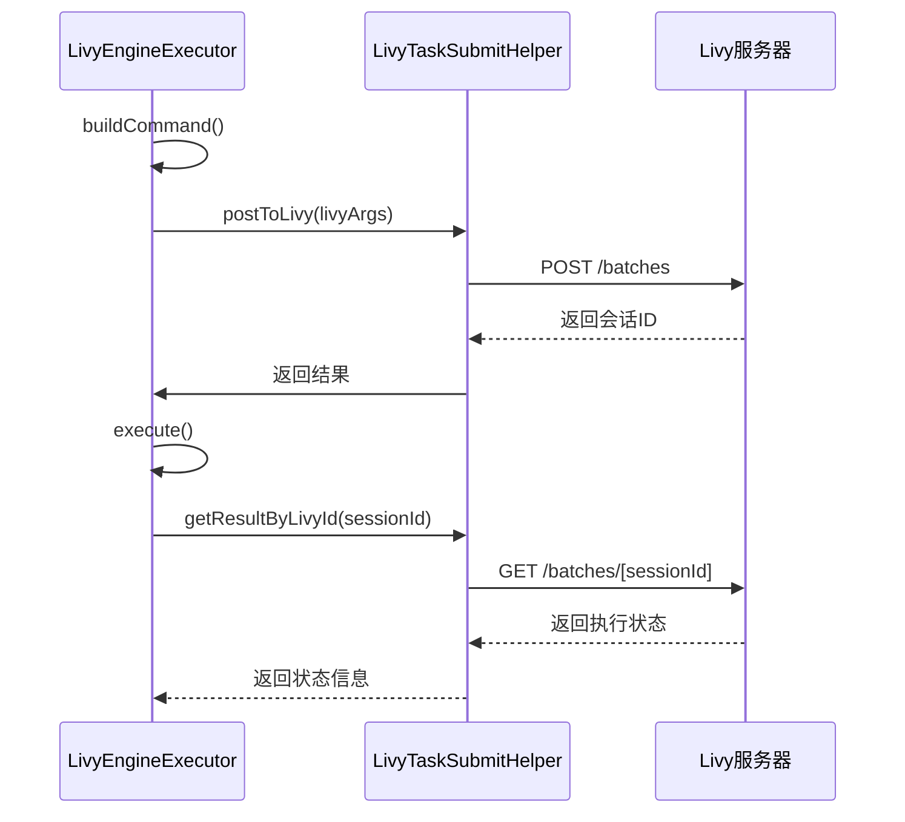
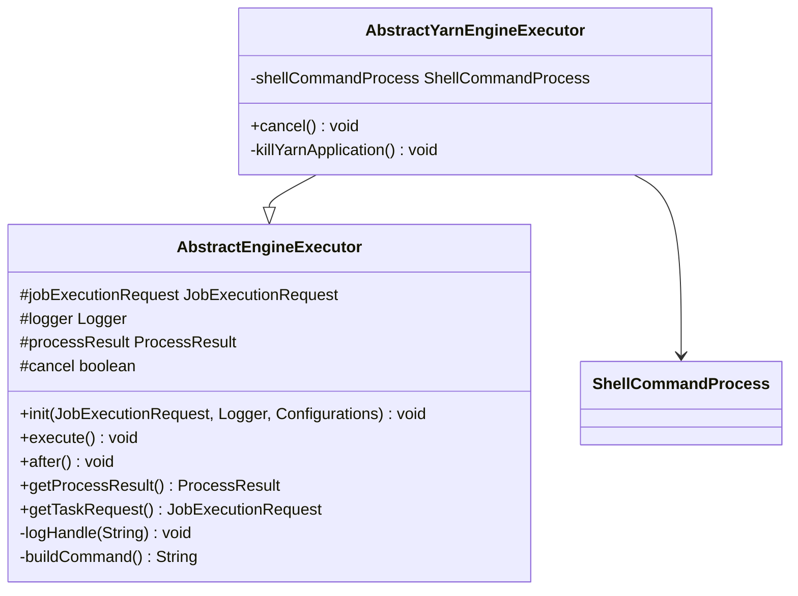
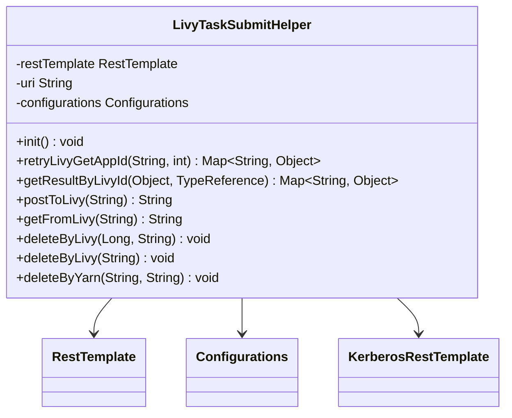
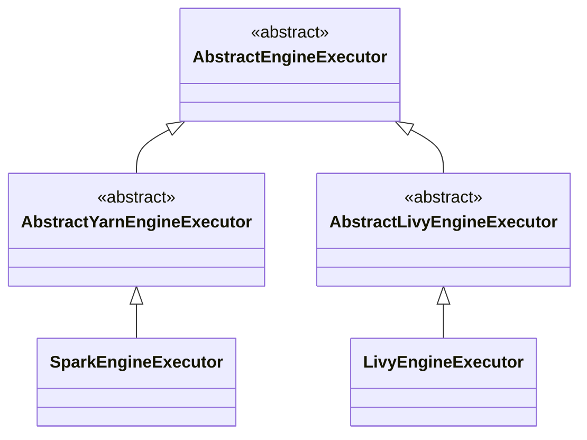

# 资源调度配置

<cite>
**本文档引用的文件**   
- [ResourceSchedulePlatformType.java](file://datavines-engine/datavines-engine-executor/src/main/java/io/datavines/engine/executor/core/enums/ResourceSchedulePlatformType.java)
- [AbstractYarnEngineExecutor.java](file://datavines-engine/datavines-engine-executor/src/main/java/io/datavines/engine/executor/core/base/AbstractYarnEngineExecutor.java)
- [AbstractLivyEngineExecutor.java](file://datavines-engine/datavines-engine-executor/src/main/java/io/datavines/engine/executor/core/base/AbstractLivyEngineExecutor.java)
- [LivyTaskSubmitHelper.java](file://datavines-engine/datavines-engine-executor/src/main/java/io/datavines/engine/executor/core/helper/LivyTaskSubmitHelper.java)
- [SparkEngineExecutor.java](file://datavines-engine/datavines-engine-plugins/datavines-engine-spark/datavines-engine-spark-executor/src/main/java/io/datavines/engine/spark/executor/SparkEngineExecutor.java)
- [LivyEngineExecutor.java](file://datavines-engine/datavines-engine-plugins/datavines-engine-livy/datavines-engine-livy-executor/src/main/java/io/datavines/engine/livy/executor/LivyEngineExecutor.java)
- [YarnUtils.java](file://datavines-common/src/main/java/io/datavines/common/utils/YarnUtils.java)
- [common.properties](file://datavines-common/src/main/resources/common.properties)
</cite>

## 目录
1. [引言](#引言)
2. [资源调度平台类型](#资源调度平台类型)
3. [YARN调度模式](#yarn调度模式)
4. [Livy调度模式](#livy调度模式)
5. [调度平台集成实现](#调度平台集成实现)
6. [资源调度配置最佳实践](#资源调度配置最佳实践)
7. [总结](#总结)

## 引言
DataVines支持多种资源调度平台，主要包括YARN和Livy两种模式。本文档详细说明了这两种调度模式的配置方法、连接方式、认证机制和资源管理策略。通过分析ResourceSchedulePlatformType枚举定义的调度类型，以及AbstractYarnEngineExecutor和LivyTaskSubmitHelper如何实现不同调度平台的集成，为用户提供完整的资源调度配置指导。

## 资源调度平台类型
DataVines通过ResourceSchedulePlatformType枚举定义了支持的资源调度平台类型，这些类型决定了任务提交和资源管理的方式。

**图源**
- [ResourceSchedulePlatformType.java](file://datavines-engine/datavines-engine-executor/src/main/java/io/datavines/engine/executor/core/enums/ResourceSchedulePlatformType.java#L19-L60)

ResourceSchedulePlatformType枚举包含以下三种调度平台类型：
- **LOCAL**：本地模式，代码值为0，描述为"local"
- **YARN**：YARN模式，代码值为1，描述为"yarn"
- **K8S**：Kubernetes模式，代码值为2，描述为"k8s"

该枚举提供了静态方法of()用于根据代码值或描述字符串获取对应的枚举实例，以及getCode()和getDescription()方法用于获取枚举的代码值和描述信息。

**本节来源**
- [ResourceSchedulePlatformType.java](file://datavines-engine/datavines-engine-executor/src/main/java/io/datavines/engine/executor/core/enums/ResourceSchedulePlatformType.java#L19-L60)

## YARN调度模式
YARN调度模式通过AbstractYarnEngineExecutor抽象类和具体的SparkEngineExecutor实现类来完成任务的提交和管理。

### 配置参数
YARN调度模式支持以下主要配置参数：
- **driver-cores**：Driver使用的CPU核心数
- **driver-memory**：Driver使用的内存大小
- **num-executors**：启动的Executor数量
- **executor-cores**：每个Executor使用的CPU核心数
- **executor-memory**：每个Executor使用的内存大小
- **app name**：应用程序名称
- **queue**：提交到的YARN队列
- **other arguments**：其他参数

### 连接方式
YARN调度通过命令行方式连接，使用spark-submit命令提交任务。在SparkEngineExecutor中，通过构建包含所有必要参数的命令字符串来实现任务提交。

### 认证机制
YARN调度模式支持通过Hadoop的认证机制进行安全访问。在YarnUtils类中，可以通过配置yarn.mode参数来指定YARN模式（单机模式、HA模式或不使用资源管理器）。

### 资源管理
YARN调度模式的资源管理主要通过以下方式实现：
- 通过queue参数指定任务提交到的YARN队列，实现资源隔离和优先级管理
- 通过num-executors、executor-cores和executor-memory参数精确控制资源分配
- 通过spark.yarn.tags参数为每个任务添加唯一标识，便于资源追踪和管理

**图源**
- [SparkEngineExecutor.java](file://datavines-engine/datavines-engine-plugins/datavines-engine-spark/datavines-engine-spark-executor/src/main/java/io/datavines/engine/spark/executor/SparkEngineExecutor.java#L41-L153)
- [AbstractYarnEngineExecutor.java](file://datavines-engine/datavines-engine-executor/src/main/java/io/datavines/engine/executor/core/base/AbstractYarnEngineExecutor.java#L25-L60)

**本节来源**
- [SparkEngineExecutor.java](file://datavines-engine/datavines-engine-plugins/datavines-engine-spark/datavines-engine-spark-executor/src/main/java/io/datavines/engine/spark/executor/SparkEngineExecutor.java#L41-L153)
- [AbstractYarnEngineExecutor.java](file://datavines-engine/datavines-engine-executor/src/main/java/io/datavines/engine/executor/core/base/AbstractYarnEngineExecutor.java#L25-L60)
- [YarnUtils.java](file://datavines-common/src/main/java/io/datavines/common/utils/YarnUtils.java#L37-L80)

## Livy调度模式
Livy调度模式通过AbstractLivyEngineExecutor抽象类和LivyTaskSubmitHelper辅助类来实现与Livy服务器的交互。

### 配置参数
Livy调度模式支持以下主要配置参数：
- **livy.uri**：Livy服务器的URI地址
- **livy.need.kerberos**：是否需要Kerberos认证
- **livy.server.auth.kerberos.principal**：Kerberos认证的主体
- **livy.server.auth.kerberos.keytab**：Kerberos认证的keytab文件位置
- **livy.task.proxyUser**：代理用户
- **livy.task.jar.lib.path**：JAR库的HDFS路径
- **livy.task.jars**：额外的JAR文件

### 连接方式
Livy调度通过REST API方式连接，使用HTTP POST请求向Livy服务器提交任务。LivyTaskSubmitHelper类封装了与Livy服务器通信的所有细节。

### 认证机制
Livy调度模式支持两种认证机制：
- **非Kerberos认证**：当livy.need.kerberos配置为false时，使用普通HTTP认证
- **Kerberos认证**：当livy.need.kerberos配置为true时，使用Kerberos认证，需要提供principal和keytab文件

### 资源管理
Livy调度模式的资源管理主要通过以下方式实现：
- 通过queue参数指定任务提交到的YARN队列
- 通过num-executors、executor-cores和executor-memory参数控制资源分配
- 通过proxyUser参数指定代理用户，实现多租户资源隔离
- 通过Livy的会话管理功能实现任务的生命周期管理

**图源**
- [LivyEngineExecutor.java](file://datavines-engine/datavines-engine-plugins/datavines-engine-livy/datavines-engine-livy-executor/src/main/java/io/datavines/engine/livy/executor/LivyEngineExecutor.java#L42-L237)
- [LivyTaskSubmitHelper.java](file://datavines-engine/datavines-engine-executor/src/main/java/io/datavines/engine/executor/core/helper/LivyTaskSubmitHelper.java#L39-L258)

**本节来源**
- [LivyEngineExecutor.java](file://datavines-engine/datavines-engine-plugins/datavines-engine-livy/datavines-engine-livy-executor/src/main/java/io/datavines/engine/livy/executor/LivyEngineExecutor.java#L42-L237)
- [LivyTaskSubmitHelper.java](file://datavines-engine/datavines-engine-executor/src/main/java/io/datavines/engine/executor/core/helper/LivyTaskSubmitHelper.java#L39-L258)

## 调度平台集成实现
DataVines通过抽象基类和具体实现类的组合模式实现了不同调度平台的集成，确保了代码的可扩展性和可维护性。

### AbstractYarnEngineExecutor实现
AbstractYarnEngineExecutor是YARN调度模式的抽象基类，提供了任务取消和YARN应用终止的通用实现。

**图源**
- [AbstractYarnEngineExecutor.java](file://datavines-engine/datavines-engine-executor/src/main/java/io/datavines/engine/executor/core/base/AbstractYarnEngineExecutor.java#L25-L60)

### LivyTaskSubmitHelper实现
LivyTaskSubmitHelper是Livy调度模式的核心辅助类，负责与Livy服务器的所有交互操作。

**图源**
- [LivyTaskSubmitHelper.java](file://datavines-engine/datavines-engine-executor/src/main/java/io/datavines/engine/executor/core/helper/LivyTaskSubmitHelper.java#L39-L258)

### 继承关系与实现
DataVines的调度平台集成采用了清晰的继承层次结构，确保了不同调度模式的实现既保持一致性又具有灵活性。

**图源**
- [AbstractYarnEngineExecutor.java](file://datavines-engine/datavines-engine-executor/src/main/java/io/datavines/engine/executor/core/base/AbstractYarnEngineExecutor.java#L25-L60)
- [AbstractLivyEngineExecutor.java](file://datavines-engine/datavines-engine-executor/src/main/java/io/datavines/engine/executor/core/base/AbstractLivyEngineExecutor.java#L23-L37)
- [SparkEngineExecutor.java](file://datavines-engine/datavines-engine-plugins/datavines-engine-spark/datavines-engine-spark-executor/src/main/java/io/datavines/engine/spark/executor/SparkEngineExecutor.java#L41-L153)
- [LivyEngineExecutor.java](file://datavines-engine/datavines-engine-plugins/datavines-engine-livy/datavines-engine-livy-executor/src/main/java/io/datavines/engine/livy/executor/LivyEngineExecutor.java#L42-L237)

**本节来源**
- [AbstractYarnEngineExecutor.java](file://datavines-engine/datavines-engine-executor/src/main/java/io/datavines/engine/executor/core/base/AbstractYarnEngineExecutor.java#L25-L60)
- [AbstractLivyEngineExecutor.java](file://datavines-engine/datavines-engine-executor/src/main/java/io/datavines/engine/executor/core/base/AbstractLivyEngineExecutor.java#L23-L37)
- [SparkEngineExecutor.java](file://datavines-engine/datavines-engine-plugins/datavines-engine-spark/datavines-engine-spark-executor/src/main/java/io/datavines/engine/spark/executor/SparkEngineExecutor.java#L41-L153)
- [LivyEngineExecutor.java](file://datavines-engine/datavines-engine-plugins/datavines-engine-livy/datavines-engine-livy-executor/src/main/java/io/datavines/engine/livy/executor/LivyEngineExecutor.java#L42-L237)
- [LivyTaskSubmitHelper.java](file://datavines-engine/datavines-engine-executor/src/main/java/io/datavines/engine/executor/core/helper/LivyTaskSubmitHelper.java#L39-L258)

## 资源调度配置最佳实践
为了确保DataVines在生产环境中的稳定运行和高效资源利用，以下是一些资源调度配置的最佳实践。

### 队列选择
- **生产环境**：为生产任务配置专用的高优先级队列，确保关键任务的资源保障
- **开发环境**：为开发和测试任务配置低优先级队列，避免影响生产任务
- **多租户环境**：为不同租户配置独立的队列，实现资源隔离和配额管理

### 资源配额
- **Driver资源**：根据任务复杂度合理配置Driver的CPU核心数和内存大小，避免资源浪费
- **Executor资源**：根据数据量和计算复杂度配置Executor数量、核心数和内存大小
- **动态调整**：根据任务历史执行情况动态调整资源配额，优化资源利用率

### 高可用配置
- **YARN HA模式**：在生产环境中启用YARN的高可用模式，配置多个ResourceManager
- **Livy高可用**：部署多个Livy服务器，通过负载均衡实现高可用
- **故障转移**：配置合理的重试机制和超时策略，确保任务在节点故障时能够自动恢复

### 安全配置
- **Kerberos认证**：在生产环境中启用Kerberos认证，确保集群安全
- **SSL/TLS**：配置HTTPS连接，保护数据传输安全
- **权限控制**：通过代理用户和队列权限控制，实现细粒度的访问控制

### 监控与告警
- **资源监控**：监控YARN队列的资源使用情况，及时发现资源瓶颈
- **任务监控**：监控任务的执行状态和性能指标，及时发现异常任务
- **告警配置**：配置合理的告警阈值，及时通知运维人员处理异常情况

**本节来源**
- [SparkEngineExecutor.java](file://datavines-engine/datavines-engine-plugins/datavines-engine-spark/datavines-engine-spark-executor/src/main/java/io/datavines/engine/spark/executor/SparkEngineExecutor.java#L41-L153)
- [LivyEngineExecutor.java](file://datavines-engine/datavines-engine-plugins/datavines-engine-livy/datavines-engine-livy-executor/src/main/java/io/datavines/engine/livy/executor/LivyEngineExecutor.java#L42-L237)
- [LivyTaskSubmitHelper.java](file://datavines-engine/datavines-engine-executor/src/main/java/io/datavines/engine/executor/core/helper/LivyTaskSubmitHelper.java#L39-L258)
- [YarnUtils.java](file://datavines-common/src/main/java/io/datavines/common/utils/YarnUtils.java#L37-L80)

## 总结
DataVines通过灵活的架构设计支持多种资源调度平台，包括YARN和Livy模式。通过ResourceSchedulePlatformType枚举定义调度类型，使用AbstractYarnEngineExecutor和AbstractLivyEngineExecutor抽象基类实现不同调度平台的集成。YARN模式通过命令行方式提交任务，适合对资源控制要求严格的场景；Livy模式通过REST API方式提交任务，适合需要细粒度会话管理和多租户支持的场景。通过合理的队列选择、资源配额、高可用配置和安全策略，可以确保DataVines在生产环境中的稳定运行和高效资源利用。