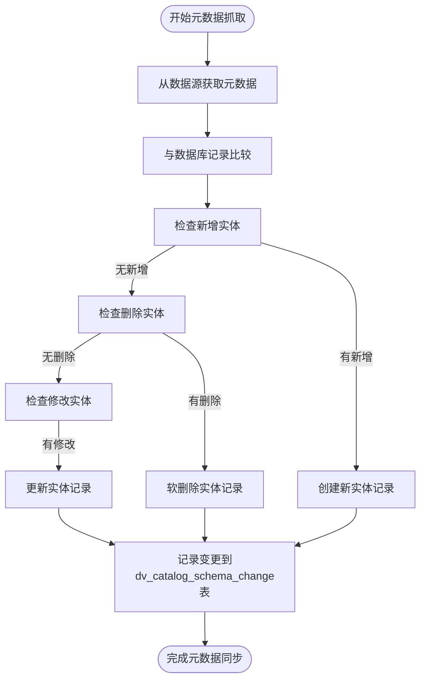
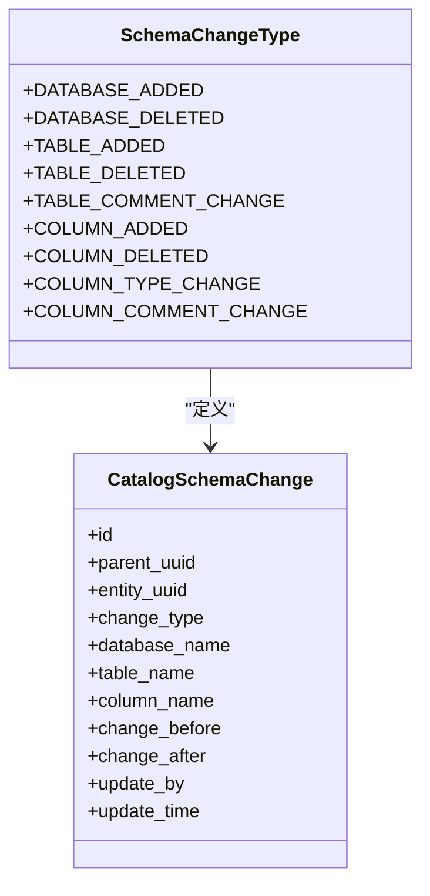
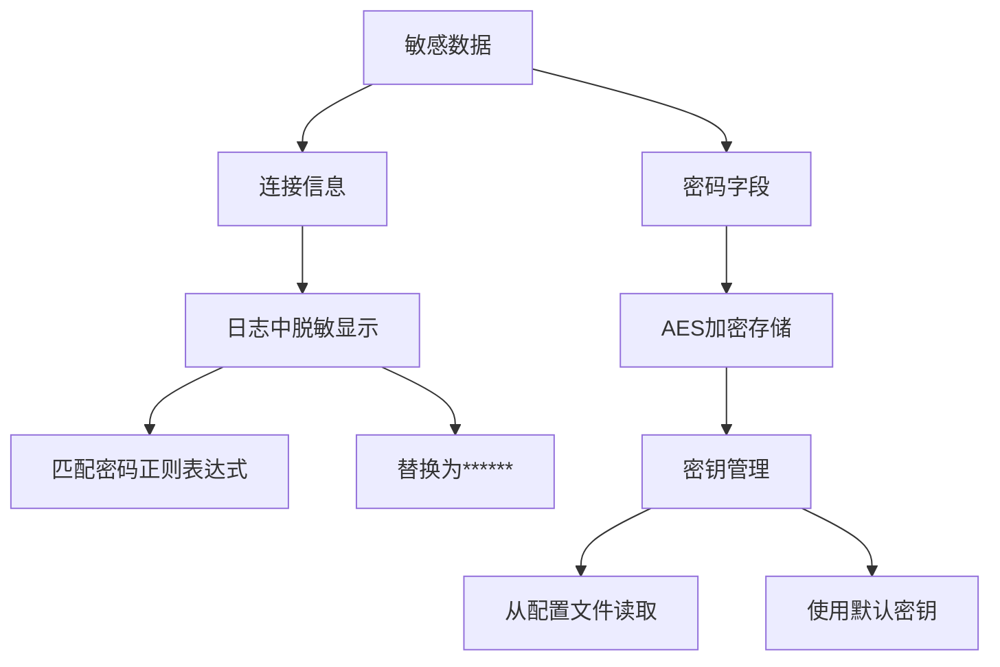
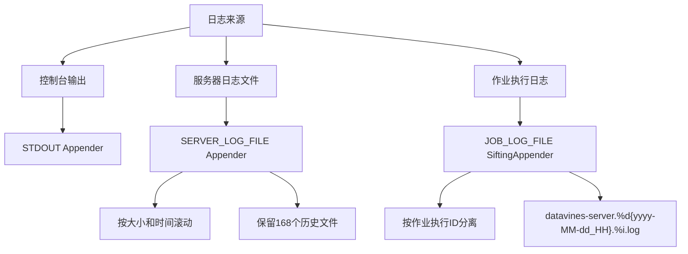
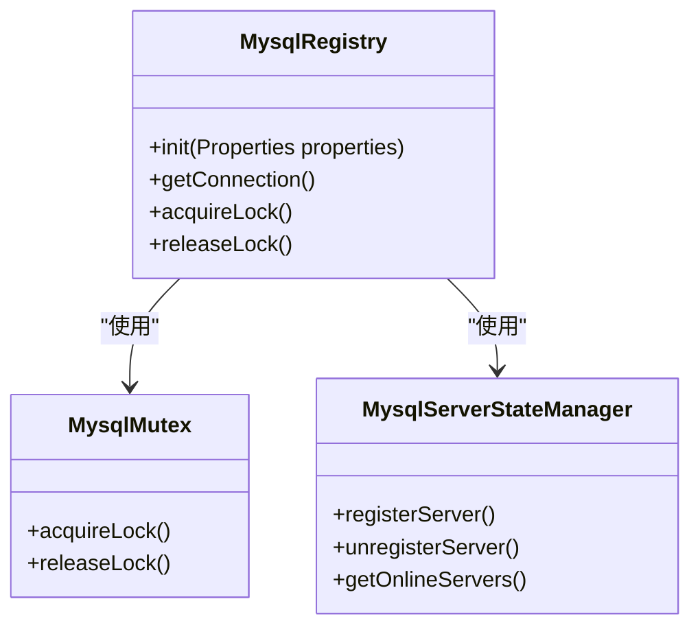

# 数据库管理

<cite>
**本文档引用的文件**   
- [datavines-mysql.sql](file://scripts/sql/datavines-mysql.sql)
- [application.yaml](file://datavines-server/src/main/resources/application.yaml)
- [CatalogMetaDataFetchExecutorImpl.java](file://datavines-server/src/main/java/io/datavines/server/scheduler/metadata/task/CatalogMetaDataFetchExecutorImpl.java)
- [SchemaChangeType.java](file://datavines-server/src/main/java/io/datavines/server/enums/SchemaChangeType.java)
- [CatalogSchemaChange.java](file://datavines-server/src/main/java/io/datavines/server/repository/entity/catalog/CatalogSchemaChange.java)
- [MysqlRegistry.java](file://datavines-registry/datavines-registry-plugins/datavines-registry-mysql/src/main/java/io/datavines/registry/plugin/MysqlRegistry.java)
- [server-logback.xml](file://datavines-server/src/main/resources/server-logback.xml)
- [SensitiveDataConverter.java](file://datavines-common/src/main/java/io/datavines/common/log/SensitiveDataConverter.java)
</cite>

## 目录
1. [数据库初始化](#数据库初始化)
2. [数据库迁移与版本管理](#数据库迁移与版本管理)
3. [备份与恢复方案](#备份与恢复方案)
4. [数据库安全管理](#数据库安全管理)
5. [日常维护与监控](#日常维护与监控)

## 数据库初始化

DataVines的数据库初始化通过执行`datavines-mysql.sql`脚本完成，该脚本创建了系统所需的所有表结构和初始数据。脚本包含了Quartz调度框架所需的表结构以及DataVines核心功能的表结构。

数据库初始化脚本创建了以下主要表结构：
- **Quartz调度表**：包括`QRTZ_JOB_DETAILS`、`QRTZ_TRIGGERS`、`QRTZ_FIRED_TRIGGERS`等，用于任务调度管理
- **数据质量规则表**：`dv_job`表存储规则作业定义，`dv_job_schedule`表存储作业调度信息
- **元数据目录表**：`dv_catalog_entity_instance`表存储实体实例，`dv_catalog_entity_rel`表存储实体关系
- **执行结果表**：`dv_job_execution_result`表存储规则执行结果，`dv_actual_values`表存储实际值
- **数据源管理表**：`dv_datasource`表存储数据源配置，`dv_error_data_storage`表存储错误数据存储配置
- **告警管理表**：`dv_sla`表存储SLA配置，`dv_sla_notification`表存储通知配置

数据库初始化过程中，系统会自动创建这些表结构，并设置适当的索引和外键约束以确保数据完整性。

**Section sources**
- [datavines-mysql.sql](file://scripts/sql/datavines-mysql.sql#L1-L893)

## 数据库迁移与版本管理

DataVines实现了完善的数据库迁移和版本管理机制，通过元数据变更跟踪来安全地进行模式变更。系统能够自动检测和记录数据库、表和列级别的变更。

### 元数据变更跟踪

系统通过`CatalogMetaDataFetchExecutorImpl`类实现元数据变更跟踪，该类会定期从数据源获取元数据并与数据库中的记录进行比较，识别出新增、删除或修改的实体。

**Diagram sources **
- [CatalogMetaDataFetchExecutorImpl.java](file://datavines-server/src/main/java/io/datavines/server/scheduler/metadata/task/CatalogMetaDataFetchExecutorImpl.java#L143-L366)

### 变更类型与记录

系统定义了多种变更类型，并将所有变更记录在`dv_catalog_schema_change`表中，便于审计和追溯。变更类型包括：

**Diagram sources **
- [SchemaChangeType.java](file://datavines-server/src/main/java/io/datavines/server/enums/SchemaChangeType.java#L24-L73)
- [CatalogSchemaChange.java](file://datavines-server/src/main/java/io/datavines/server/repository/entity/catalog/CatalogSchemaChange.java#L30-L37)

当检测到模式变更时，系统会创建相应的变更记录，包括变更前后的详细信息，如列类型变更会记录`change_before`和`change_after`字段。

**Section sources**
- [CatalogMetaDataFetchExecutorImpl.java](file://datavines-server/src/main/java/io/datavines/server/scheduler/metadata/task/CatalogMetaDataFetchExecutorImpl.java#L143-L461)
- [SchemaChangeType.java](file://datavines-server/src/main/java/io/datavines/server/enums/SchemaChangeType.java#L24-L73)
- [CatalogSchemaChange.java](file://datavines-server/src/main/java/io/datavines/server/repository/entity/catalog/CatalogSchemaChange.java#L30-L37)

## 备份与恢复方案

DataVines提供了完整的备份和恢复方案，确保数据安全和系统可靠性。

### 全量备份策略

系统建议定期进行全量备份，备份频率根据业务需求确定，通常为每日一次。全量备份包括：
- DataVines元数据库的所有表数据
- 配置文件（application.yaml等）
- 日志文件（可选）

### 增量备份策略

对于频繁变更的数据，建议实施增量备份策略：
- 交易数据：每小时备份一次
- 日志数据：每天备份一次
- 配置变更：实时备份或每15分钟备份一次

### 恢复流程

数据恢复流程如下：
1. 停止DataVines服务
2. 恢复最新的全量备份
3. 按时间顺序应用增量备份
4. 验证数据完整性
5. 启动DataVines服务

## 数据库安全管理

DataVines实施了多层次的数据库安全管理措施，确保数据安全和隐私保护。

### 权限控制

系统通过以下方式实现权限控制：
- 基于角色的访问控制（RBAC）
- 数据源级别的访问权限
- 工作空间级别的隔离
- 管理员和普通用户的权限分离

### 敏感数据保护

系统对敏感数据实施了严格的保护措施：

**Diagram sources **
- [SensitiveDataConverter.java](file://datavines-common/src/main/java/io/datavines/common/log/SensitiveDataConverter.java#L34-L39)
- [DataSourceServiceImpl.java](file://datavines-server/src/main/java/io/datavines/server/repository/service/impl/DataSourceServiceImpl.java#L247-L253)

系统使用AES加密算法对数据源的密码等敏感信息进行加密存储，并在日志输出时对敏感信息进行脱敏处理，防止密码等敏感信息泄露。

**Section sources**
- [SensitiveDataConverter.java](file://datavines-common/src/main/java/io/datavines/common/log/SensitiveDataConverter.java#L34-L39)
- [DataSourceServiceImpl.java](file://datavines-server/src/main/java/io/datavines/server/repository/service/impl/DataSourceServiceImpl.java#L247-L253)

## 日常维护与监控

### 日志管理

系统配置了完善的日志管理机制，通过`server-logback.xml`文件定义了多种日志输出策略：

**Diagram sources **
- [server-logback.xml](file://datavines-server/src/main/resources/server-logback.xml#L61-L77)

日志系统实现了：
- 控制台实时输出
- 服务器日志按小时和大小滚动
- 作业执行日志按作业ID分离存储
- 敏感信息自动脱敏

### 告警与监控

系统通过以下方式实现告警和监控：
- 数据库连接状态监控
- 作业执行状态监控
- 资源使用情况监控
- 自定义阈值告警

数据库连接通过`MysqlRegistry`类管理，确保集群环境下的高可用性。

**Diagram sources **
- [MysqlRegistry.java](file://datavines-registry/datavines-registry-plugins/datavines-registry-mysql/src/main/java/io/datavines/registry/plugin/MysqlRegistry.java#L29-L38)

**Section sources**
- [server-logback.xml](file://datavines-server/src/main/resources/server-logback.xml#L21-L85)
- [MysqlRegistry.java](file://datavines-registry/datavines-registry-plugins/datavines-registry-mysql/src/main/java/io/datavines/registry/plugin/MysqlRegistry.java#L29-L38)