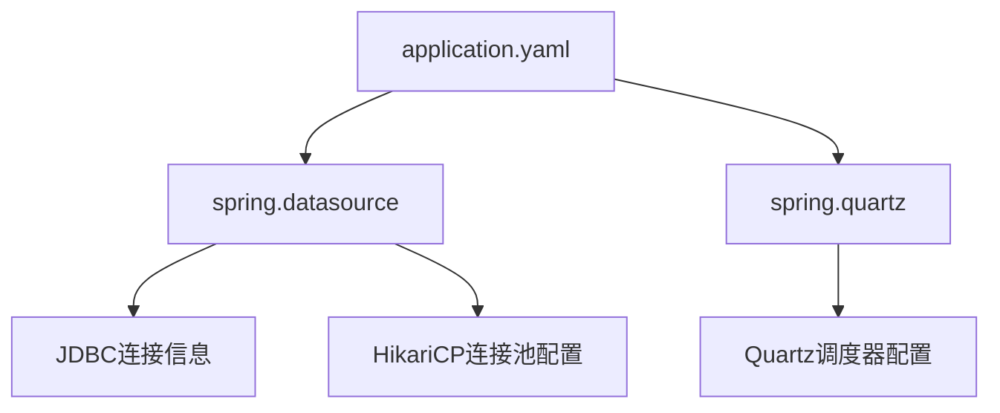
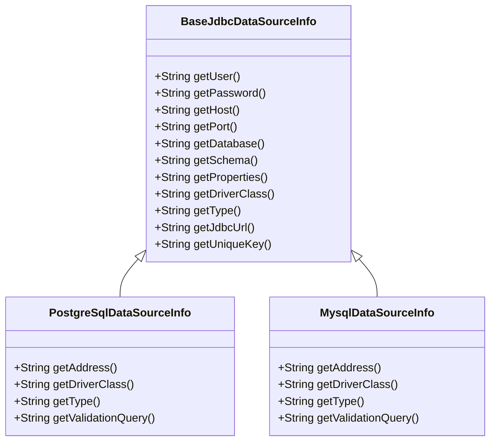
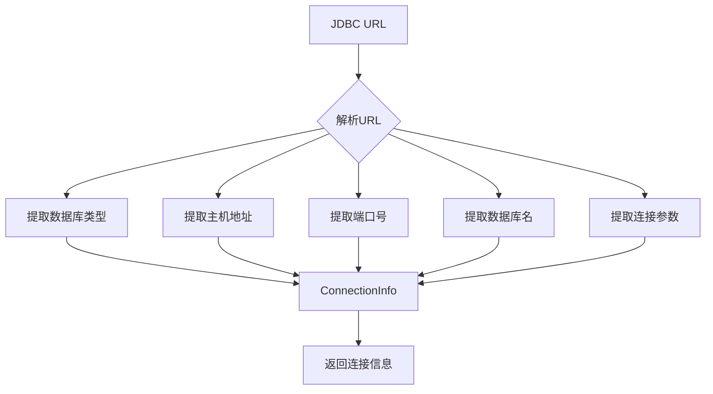
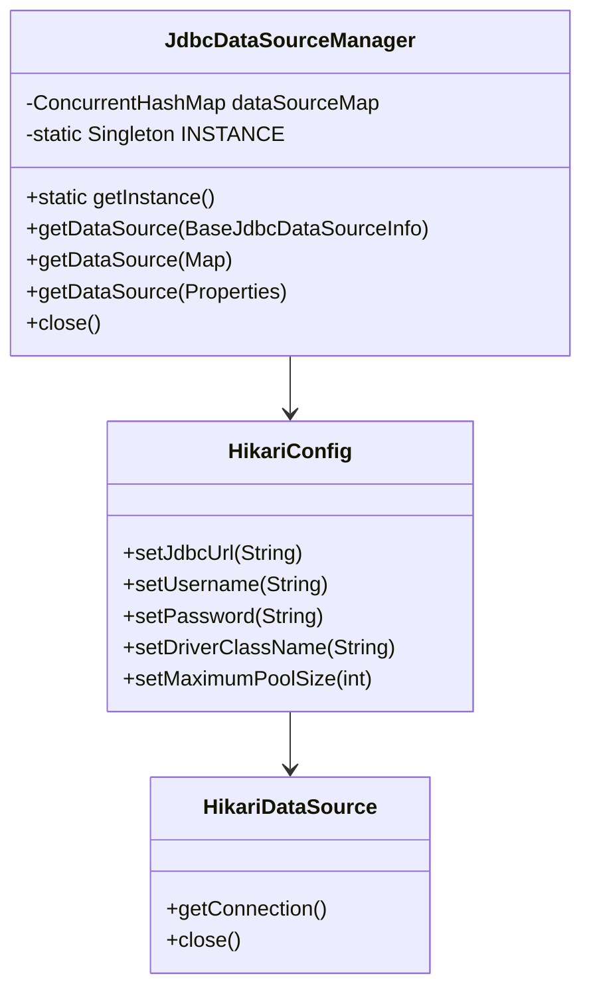
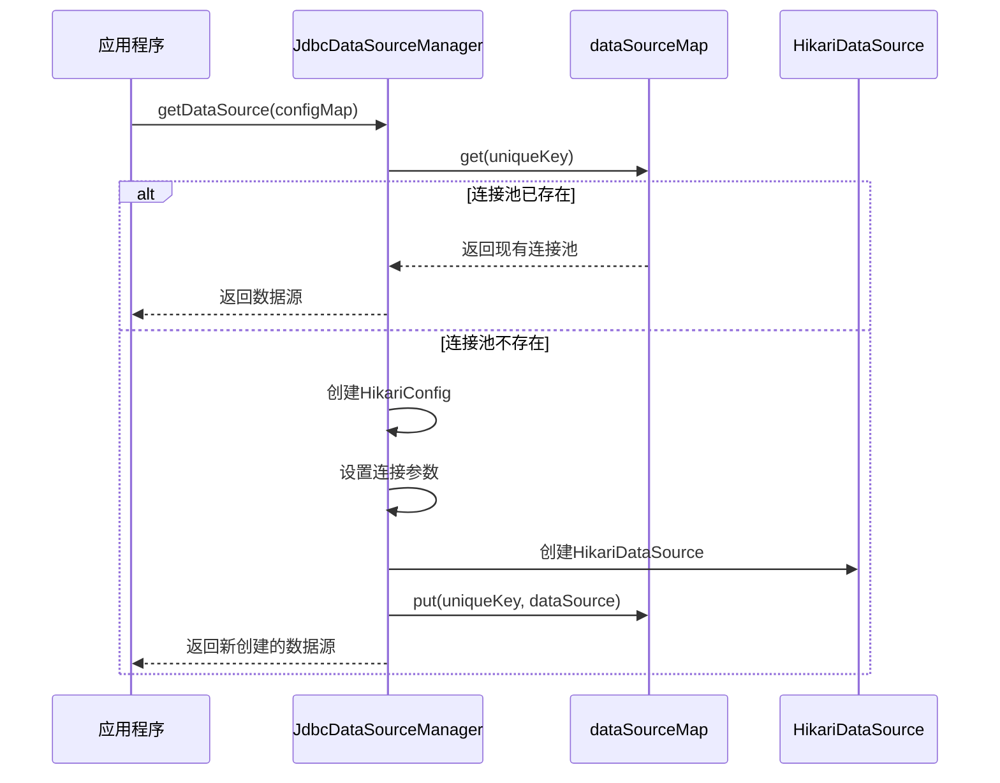

# 数据库连接配置

<cite>
**本文档引用的文件**   
- [application.yaml](file://datavines-server/src/main/resources/application.yaml)
- [BaseJdbcDataSourceInfo.java](file://datavines-common/src/main/java/io/datavines/common/datasource/jdbc/BaseJdbcDataSourceInfo.java)
- [JdbcDataSourceManager.java](file://datavines-common/src/main/java/io/datavines/common/datasource/jdbc/JdbcDataSourceManager.java)
- [ConnectionInfo.java](file://datavines-common/src/main/java/io/datavines/common/entity/ConnectionInfo.java)
- [JdbcUrlParser.java](file://datavines-common/src/main/java/io/datavines/common/utils/JdbcUrlParser.java)
- [DefaultDataSourceInfoUtils.java](file://datavines-server/src/main/java/io/datavines/server/utils/DefaultDataSourceInfoUtils.java)
- [PostgreSqlDataSourceInfo.java](file://datavines-connector/connector-plugins/datavines-connector-postgresql/src/main/java/io/datavines/connector/plugin/PostgreSqlDataSourceInfo.java)
- [MysqlParameterConverter.java](file://datavines-connector/connector-plugins/datavines-connector-mysql/src/main/java/io/datavines/connector/plugin/MysqlParameterConverter.java)
</cite>

## 目录
1. [简介](#简介)
2. [核心配置文件分析](#核心配置文件分析)
3. [数据源配置详解](#数据源配置详解)
4. [连接池参数配置](#连接池参数配置)
5. [支持的数据库类型](#支持的数据库类型)
6. [多数据源配置方案](#多数据源配置方案)
7. [连接测试与故障排查](#连接测试与故障排查)

## 简介
DataVines是一个数据质量监控平台，其数据库连接配置主要通过Spring Boot的application.yaml文件进行管理。系统支持多种数据库类型，包括PostgreSQL、MySQL等，并使用HikariCP作为连接池实现。本文档详细说明DataVines的数据库连接配置方法，包括JDBC URL、用户名、密码、驱动类等配置项的含义，连接池参数配置，支持的数据库类型及其特定配置要求，以及主从数据库配置示例和多数据源配置方案。

## 核心配置文件分析
DataVines的数据库连接配置主要位于`application.yaml`文件中，该文件定义了系统与数据库的连接信息和连接池参数。



**图表来源**
- [application.yaml](file://datavines-server/src/main/resources/application.yaml)

**本节来源**
- [application.yaml](file://datavines-server/src/main/resources/application.yaml)

## 数据源配置详解
DataVines的数据源配置包含JDBC连接所需的所有基本信息，这些配置项在`application.yaml`文件中定义。

### JDBC连接配置项
DataVines的JDBC连接配置包含以下关键参数：

| 配置项 | 说明 | 示例值 |
|--------|------|--------|
| driver-class-name | JDBC驱动类名 | org.postgresql.Driver |
| url | JDBC连接URL | jdbc:postgresql://127.0.0.1:5432/datavines |
| username | 数据库用户名 | postgres |
| password | 数据库密码 | 123456 |

这些配置项通过`BaseJdbcDataSourceInfo`类进行抽象和管理，该类定义了所有JDBC数据源的通用属性和方法。



**图表来源**
- [BaseJdbcDataSourceInfo.java](file://datavines-common/src/main/java/io/datavines/common/datasource/jdbc/BaseJdbcDataSourceInfo.java)
- [PostgreSqlDataSourceInfo.java](file://datavines-connector/connector-plugins/datavines-connector-postgresql/src/main/java/io/datavines/connector/plugin/PostgreSqlDataSourceInfo.java)

**本节来源**
- [application.yaml](file://datavines-server/src/main/resources/application.yaml)
- [BaseJdbcDataSourceInfo.java](file://datavines-common/src/main/java/io/datavines/common/datasource/jdbc/BaseJdbcDataSourceInfo.java)

### JDBC URL结构
JDBC URL遵循标准格式：`jdbc:数据库类型://主机:端口/数据库名?参数`。DataVines使用`JdbcUrlParser`类解析JDBC URL，提取连接信息。



**图表来源**
- [JdbcUrlParser.java](file://datavines-common/src/main/java/io/datavines/common/utils/JdbcUrlParser.java)

**本节来源**
- [JdbcUrlParser.java](file://datavines-common/src/main/java/io/datavines/common/utils/JdbcUrlParser.java)

## 连接池参数配置
DataVines使用HikariCP作为连接池实现，连接池参数在`application.yaml`文件中通过`spring.datasource.hikari`配置项进行设置。

### HikariCP连接池参数
| 参数 | 说明 | 示例值 |
|------|------|--------|
| connection-test-query | 连接测试查询语句 | select 1 |
| minimum-idle | 最小空闲连接数 | 5 |
| maximum-pool-size | 最大连接池大小 | 50 |
| connection-timeout | 连接超时时间（毫秒） | 30000 |
| idle-timeout | 空闲超时时间（毫秒） | 600000 |
| validation-timeout | 验证超时时间（毫秒） | 3000 |
| leak-detection-threshold | 连接泄漏检测阈值 | 0 |
| initialization-fail-timeout | 初始化失败超时时间 | 1 |

### 连接池配置示例
```yaml
spring:
  datasource:
    hikari:
      connection-test-query: select 1
      minimum-idle: 5
      auto-commit: true
      validation-timeout: 3000
      pool-name: datavines
      maximum-pool-size: 50
      connection-timeout: 30000
      idle-timeout: 600000
      leak-detection-threshold: 0
      initialization-fail-timeout: 1
```

连接池的管理由`JdbcDataSourceManager`类负责，该类使用单例模式管理所有数据源连接。



**图表来源**
- [JdbcDataSourceManager.java](file://datavines-common/src/main/java/io/datavines/common/datasource/jdbc/JdbcDataSourceManager.java)

**本节来源**
- [application.yaml](file://datavines-server/src/main/resources/application.yaml)
- [JdbcDataSourceManager.java](file://datavines-common/src/main/java/io/datavines/common/datasource/jdbc/JdbcDataSourceManager.java)

## 支持的数据库类型
DataVines支持多种数据库类型，每种数据库类型都有其特定的配置要求。

### PostgreSQL配置
PostgreSQL是DataVines的默认数据库，配置示例如下：

```yaml
spring:
  datasource:
    driver-class-name: org.postgresql.Driver
    url: jdbc:postgresql://127.0.0.1:5432/datavines
    username: postgres
    password: 123456
```

PostgreSQL特定的配置在`PostgreSqlDataSourceInfo`类中定义：

```java
public class PostgreSqlDataSourceInfo extends BaseJdbcDataSourceInfo {
    @Override
    public String getAddress() {
        return "jdbc:postgresql://"+getHost()+":"+getPort();
    }
    
    @Override
    public String getDriverClass() {
        return "org.postgresql.Driver";
    }
    
    @Override
    public String getType() {
        return "postgresql";
    }
    
    @Override
    public String getValidationQuery() {
        return "SELECT 'x'";
    }
}
```

### MySQL配置
MySQL配置需要激活mysql profile，并使用相应的驱动和URL格式：

```yaml
---
spring:
  config:
    activate:
      on-profile: mysql
  datasource:
    driver-class-name: com.mysql.cj.jdbc.Driver
    url: jdbc:mysql://127.0.0.1:3306/datavines?useUnicode=true&characterEncoding=UTF-8&useSSL=false&serverTimezone=Asia/Shanghai
    username: root
    password: 123456
  quartz:
    properties:
      org.quartz.jobStore.driverDelegateClass: org.quartz.impl.jdbcjobstore.StdJDBCDelegate
```

MySQL的参数转换在`MysqlParameterConverter`类中实现：

```java
public class MysqlParameterConverter extends JdbcParameterConverter {
    @Override
    protected String getUrl(Map<String, Object> parameter) {
        String url = String.format("jdbc:mysql://%s:%s/%s",
                parameter.get(HOST),
                parameter.get(PORT),
                parameter.get(DATABASE));
        String properties = (String)parameter.get(PROPERTIES);
        if (StringUtils.isNotEmpty(properties)) {
            url += "?" + properties;
        }
        return url;
    }
}
```

### 其他支持的数据库
DataVines还支持以下数据库类型：
- ClickHouse
- Databend
- DM (达梦)
- Doris
- Hive
- Impala
- MongoDB
- Oracle
- Presto
- SQL Server
- StarRocks
- Trino

每种数据库类型都有对应的连接器插件，位于`datavines-connector-plugins`目录下。

**本节来源**
- [application.yaml](file://datavines-server/src/main/resources/application.yaml)
- [PostgreSqlDataSourceInfo.java](file://datavines-connector/connector-plugins/datavines-connector-postgresql/src/main/java/io/datavines/connector/plugin/PostgreSqlDataSourceInfo.java)
- [MysqlParameterConverter.java](file://datavines-connector/connector-plugins/datavines-connector-mysql/src/main/java/io/datavines/connector/plugin/MysqlParameterConverter.java)

## 多数据源配置方案
DataVines支持多数据源配置，允许系统同时连接多个不同的数据库。

### 主从数据库配置
主从数据库配置可以通过定义多个数据源来实现。系统使用`ConnectionInfo`类来存储连接信息：

```java
@Data
public class ConnectionInfo {
    private String type;
    private String url;
    private String host;
    private String port;
    private String driverName;
    private String catalog;
    private String database;
    private String schema;
    private String properties;
    private String address;
    private String user;
    private String password;
    private Map<String,Object> allConfigMap = new HashMap<>();
}
```

### 多数据源管理
多数据源的管理通过`JdbcDataSourceManager`的`dataSourceMap`实现，使用连接信息的MD5哈希值作为唯一键：

```java
private String getUniqueKey(Map<String,Object> configMap) {
    String url = String.valueOf(configMap.get(URL));
    String username = String.valueOf(configMap.get(USER));
    String password = String.valueOf(configMap.get(PASSWORD));
    return Md5Utils.getMd5(String.format("%s@@%s@@%s",url,username,password),false);
}
```

当需要获取数据源时，系统首先检查`dataSourceMap`中是否已存在对应的连接池，如果不存在则创建新的连接池并缓存。



**图表来源**
- [JdbcDataSourceManager.java](file://datavines-common/src/main/java/io/datavines/common/datasource/jdbc/JdbcDataSourceManager.java)

**本节来源**
- [JdbcDataSourceManager.java](file://datavines-common/src/main/java/io/datavines/common/datasource/jdbc/JdbcDataSourceManager.java)
- [ConnectionInfo.java](file://datavines-common/src/main/java/io/datavines/common/entity/ConnectionInfo.java)

## 连接测试与故障排查
DataVines提供了连接测试和故障排查机制，确保数据库连接的可靠性。

### 连接测试流程
系统通过`DefaultDataSourceInfoUtils`类获取默认数据源的连接信息：

```java
public static ConnectionInfo getDefaultConnectionInfo(){
    javax.sql.DataSource defaultDataSource =
            SpringApplicationContext.getBean(javax.sql.DataSource.class);
    HikariDataSource hikariDataSource = (HikariDataSource)defaultDataSource;
    
    ConnectionInfo connectionInfo = JdbcUrlParser.getConnectionInfo(hikariDataSource.getJdbcUrl(),
            hikariDataSource.getUsername(),hikariDataSource.getPassword());
    
    if (connectionInfo != null) {
        connectionInfo.setDriverName(hikariDataSource.getDriverClassName());
    }
    
    return connectionInfo;
}
```

### 故障排查指南
当数据库连接出现问题时，可以按照以下步骤进行排查：

1. **检查配置文件**：确认`application.yaml`中的数据库连接参数是否正确
2. **检查网络连接**：确保应用程序服务器能够访问数据库服务器
3. **检查数据库状态**：确认数据库服务正在运行
4. **检查连接池状态**：查看连接池是否已满或存在连接泄漏
5. **查看日志信息**：检查应用程序日志中的错误信息

### 常见问题及解决方案
| 问题现象 | 可能原因 | 解决方案 |
|---------|---------|---------|
| 连接超时 | 网络问题或数据库负载过高 | 检查网络连接，增加connection-timeout值 |
| 认证失败 | 用户名或密码错误 | 检查用户名和密码配置 |
| 驱动类找不到 | JDBC驱动未正确加载 | 确认驱动类名正确且JAR包在类路径中 |
| 连接池耗尽 | 最大连接数设置过小 | 增加maximum-pool-size值 |
| SSL连接问题 | SSL配置不正确 | 在URL中添加useSSL=false参数 |

**本节来源**
- [DefaultDataSourceInfoUtils.java](file://datavines-server/src/main/java/io/datavines/server/utils/DefaultDataSourceInfoUtils.java)
- [JdbcUrlParser.java](file://datavines-common/src/main/java/io/datavines/common/utils/JdbcUrlParser.java)