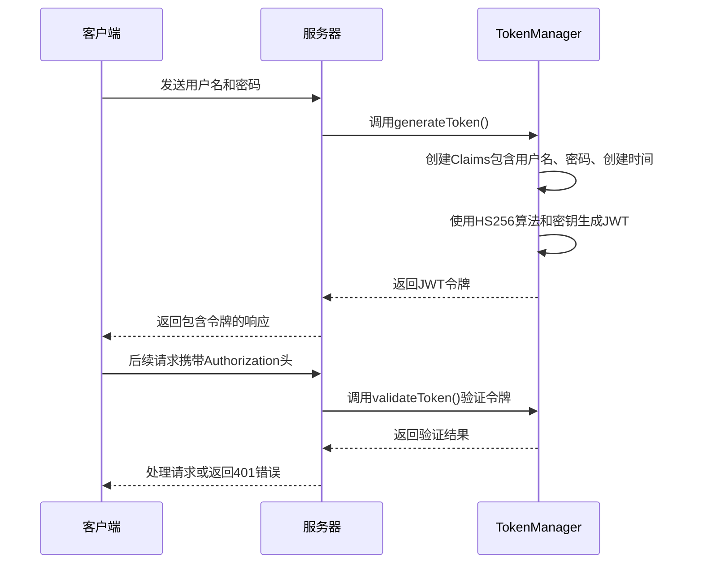
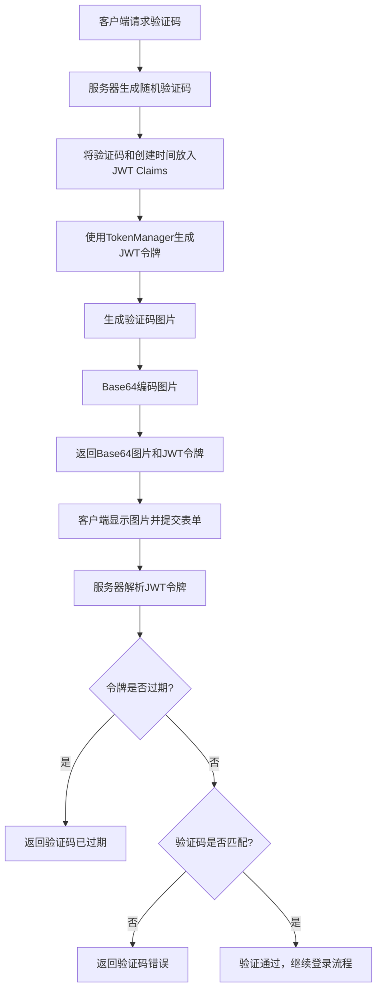

# 安全配置

<cite>
**本文档引用的文件**  
- [TokenManager.java](file://datavines-core/src/main/java/io/datavines/core/utils/TokenManager.java)
- [KaptchaConfig.java](file://datavines-server/src/main/java/io/datavines/server/api/config/KaptchaConfig.java)
- [VerificationUtil.java](file://datavines-server/src/main/java/io/datavines/server/utils/VerificationUtil.java)
- [AuthenticationInterceptor.java](file://datavines-server/src/main/java/io/datavines/server/api/inteceptor/AuthenticationInterceptor.java)
- [AuthIgnore.java](file://datavines-server/src/main/java/io/datavines/server/api/annotation/AuthIgnore.java)
- [CheckTokenExist.java](file://datavines-server/src/main/java/io/datavines/server/api/annotation/CheckTokenExist.java)
- [DataVinesConstants.java](file://datavines-core/src/main/java/io/datavines/core/constant/DataVinesConstants.java)
- [application.yaml](file://datavines-server/src/main/resources/application.yaml)
- [WebMvcConfig.java](file://datavines-server/src/main/java/io/datavines/server/api/config/WebMvcConfig.java)
- [CryptionUtils.java](file://datavines-common/src/main/java/io/datavines/common/utils/CryptionUtils.java)
- [SensitiveDataConverter.java](file://datavines-common/src/main/java/io/datavines/common/log/SensitiveDataConverter.java)
- [PasswordFilterUtils.java](file://datavines-common/src/main/java/io/datavines/common/utils/PasswordFilterUtils.java)
- [HttpUtils.java](file://datavines-common/src/main/java/io/datavines/common/utils/HttpUtils.java)
</cite>

## 目录
1. [简介](#简介)
2. [JWT认证配置](#jwt认证配置)
3. [验证码配置](#验证码配置)
4. [接口权限控制](#接口权限控制)
5. [安全策略配置](#安全策略配置)
6. [生产环境安全加固建议](#生产环境安全加固建议)
7. [总结](#总结)

## 简介

DataVines服务器的安全配置体系旨在保护API接口免受未授权访问，确保系统的数据安全和用户隐私。本系统采用JWT（JSON Web Token）认证机制进行用户身份验证，结合验证码机制增强登录安全性，并通过注解方式实现细粒度的接口权限控制。安全配置主要分布在`datavines-server`和`datavines-core`模块中，通过Spring框架的拦截器和AOP技术实现。

系统的核心安全组件包括：
- **JWT认证**：使用`io.jsonwebtoken`库生成和验证JWT令牌，通过`TokenManager`类集中管理令牌的生成、解析和验证逻辑。
- **验证码**：集成`kaptcha`库生成图形验证码，验证码信息通过JWT令牌进行安全传输，防止中间人攻击。
- **权限控制**：通过`@AuthIgnore`和`@CheckTokenExist`注解标记接口，由`AuthenticationInterceptor`拦截器在请求处理前进行权限校验。

**Section sources**
- [TokenManager.java](file://datavines-core/src/main/java/io/datavines/core/utils/TokenManager.java#L1-L100)
- [AuthenticationInterceptor.java](file://datavines-server/src/main/java/io/datavines/server/api/inteceptor/AuthenticationInterceptor.java#L1-L50)
- [AuthIgnore.java](file://datavines-server/src/main/java/io/datavines/server/api/annotation/AuthIgnore.java#L1-L28)

## JWT认证配置

DataVines服务器使用JWT（JSON Web Token）作为主要的认证机制，通过在客户端和服务器之间传递加密的令牌来验证用户身份。JWT配置主要在`TokenManager`类中实现，该类负责令牌的生成、解析和验证。

### JWT配置参数

JWT的配置参数通过Spring的`@Value`注解从配置文件中注入，支持在`application.yaml`中进行自定义：

```java
@Value("${jwt.token.secret:asdqwe}")
private String tokenSecret;

@Value("${jwt.token.timeout:8640000}")
private Long timeout;

@Value("${jwt.token.algorithm:HS256}")
private String algorithm;
```

| 配置项 | 默认值 | 说明 |
| :--- | :--- | :--- |
| `jwt.token.secret` | asdqwe | JWT签名密钥，用于生成和验证令牌的HMAC签名，建议在生产环境中使用强随机字符串 |
| `jwt.token.timeout` | 8640000 | 令牌有效期（毫秒），默认为2.4小时（8640000毫秒），可根据安全需求调整 |
| `jwt.token.algorithm` | HS256 | JWT签名算法，支持HS256、HS384、HS512等HMAC算法 |

### JWT令牌结构

JWT令牌由三部分组成：头部（Header）、载荷（Payload）和签名（Signature）。DataVines在载荷中存储了用户的关键信息：

- `un` (TOKEN_USER_NAME): 用户名
- `up` (TOKEN_USER_PASSWORD): 用户密码（已加密）
- `ct` (TOKEN_CREATE_TIME): 令牌创建时间戳



**Diagram sources**
- [TokenManager.java](file://datavines-core/src/main/java/io/datavines/core/utils/TokenManager.java#L42-L62)
- [AuthenticationInterceptor.java](file://datavines-server/src/main/java/io/datavines/server/api/inteceptor/AuthenticationInterceptor.java#L89-L98)

**Section sources**
- [TokenManager.java](file://datavines-core/src/main/java/io/datavines/core/utils/TokenManager.java#L40-L100)

## 验证码配置

为了防止暴力破解和自动化攻击，DataVines服务器在登录流程中集成了图形验证码机制。验证码配置通过`KaptchaConfig`类实现，该类使用`kaptcha`库生成可配置的验证码图片。

### 验证码配置参数

验证码的外观和行为可以通过`application.yaml`中的属性进行配置，所有配置项都使用`@Value`注解注入到`KaptchaConfig`类中：

```java
@Value("${kaptcha.border:yes}")
private String kaptchaBorder;

@Value("${kaptcha.border.color:105,179,90}")
private String kaptchaBorderColor;

@Value("${kaptcha.textproducer.font.color:blue}")
private String kaptchaTextproducerFontColor;

@Value("${kaptcha.image.width:125}")
private String kaptchaImageWidth;

@Value("${kaptcha.image.height:65}")
private String kaptchaImageHeight;

@Value("${kaptcha.textproducer.font.size:45}")
private String kaptchaTextproducerFontSize;

@Value("${kaptcha.session.key:code}")
private String kaptchaSessionKey;

@Value("${kaptcha.textproducer.char.length:4}")
private String getKaptchaTextproducerCharLength;

@Value("${kaptcha.textproducer.font.names:cmr10}")
private String kaptchaTextproducerFontNames;
```

| 配置项 | 默认值 | 说明 |
| :--- | :--- | :--- |
| `kaptcha.border` | yes | 是否显示边框 |
| `kaptcha.border.color` | 105,179,90 | 边框颜色（RGB格式） |
| `kaptcha.textproducer.font.color` | blue | 验证码字体颜色 |
| `kaptcha.image.width` | 125 | 图片宽度（像素） |
| `kaptcha.image.height` | 65 | 图片高度（像素） |
| `kaptcha.textproducer.font.size` | 45 | 字体大小 |
| `kaptcha.session.key` | code | 验证码在会话中的键名 |
| `kaptcha.textproducer.char.length` | 4 | 验证码字符长度 |
| `kaptcha.textproducer.font.names` | cmr10 | 字体名称 |

### 验证码安全机制

与传统的将验证码存储在服务器会话中的方式不同，DataVines采用了更安全的JWT-based验证码机制。验证码的值被加密存储在JWT令牌中，而不是服务器内存中，这使得系统更容易扩展和集群化。

`VerificationUtil`类负责验证码的生成和验证：

1. **生成验证码**：调用`createVerificationCodeAndImage()`方法，生成随机验证码文本，并将其与过期时间一起编码到JWT令牌中。
2. **验证验证码**：调用`validVerificationCode()`方法，解析JWT令牌，检查验证码是否过期（默认5分钟）以及用户输入的验证码是否匹配。



**Diagram sources**
- [KaptchaConfig.java](file://datavines-server/src/main/java/io/datavines/server/api/config/KaptchaConfig.java#L29-L54)
- [VerificationUtil.java](file://datavines-server/src/main/java/io/datavines/server/utils/VerificationUtil.java#L52-L83)

**Section sources**
- [KaptchaConfig.java](file://datavines-server/src/main/java/io/datavines/server/api/config/KaptchaConfig.java#L1-L73)
- [VerificationUtil.java](file://datavines-server/src/main/java/io/datavines/server/utils/VerificationUtil.java#L1-L87)

## 接口权限控制

DataVines服务器通过自定义注解和Spring拦截器实现了灵活的接口权限控制机制。核心是`AuthenticationInterceptor`拦截器，它在每个请求到达控制器之前进行身份验证和权限检查。

### 权限控制注解

系统提供了两个关键的注解来控制接口的访问权限：

#### @AuthIgnore 注解

`@AuthIgnore`注解用于标记不需要身份验证的公共接口。例如，登录、注册和获取验证码等接口需要被公开访问。

```java
@Target({ElementType.METHOD})
@Retention(RetentionPolicy.RUNTIME)
public @interface AuthIgnore {
}
```

当`AuthenticationInterceptor`检测到一个方法被`@AuthIgnore`注解标记时，它会直接放行该请求，不进行任何令牌验证。

#### @CheckTokenExist 注解

`@CheckTokenExist`注解用于标记需要检查令牌是否存在的接口。与基本的令牌验证不同，此注解会调用`AccessTokenService`服务来检查令牌是否在数据库中存在且未被禁用，提供了更严格的访问控制。

```java
@Target({ElementType.METHOD})
@Retention(RetentionPolicy.RUNTIME)
public @interface CheckTokenExist {
}
```

### 拦截器工作流程

`AuthenticationInterceptor`是权限控制的核心，它实现了`HandlerInterceptor`接口，并在`preHandle`方法中执行权限检查逻辑。

```mermaid
flowchart TD
A[请求到达] --> B{方法是否有@AuthIgnore注解?}
B --> |是| C[放行请求]
B --> |否| D[从请求头或参数中获取令牌]
D --> E{令牌是否存在?}
E --> |否| F[抛出TOKEN_IS_NULL_ERROR异常]
E --> |是| G{方法是否有@CheckTokenExist注解?}
G --> |是| H[调用AccessTokenService检查令牌是否存在]
H --> I{令牌是否存在?}
I --> |否| J[抛出INVALID_TOKEN异常]
I --> |是| K[继续]
G --> |否| K[继续]
K --> L[从令牌中解析用户名]
L --> M[查询用户信息]
M --> N{用户是否存在?}
N --> |否| O[抛出INVALID_TOKEN异常]
N --> |是| P[将用户信息存入请求属性]
P --> Q[验证令牌的有效性]
Q --> R{令牌是否有效?}
R --> |否| S[抛出INVALID_TOKEN异常]
R --> |是| T[设置上下文，放行请求]
```

**Diagram sources**
- [AuthenticationInterceptor.java](file://datavines-server/src/main/java/io/datavines/server/api/inteceptor/AuthenticationInterceptor.java#L54-L104)
- [AuthIgnore.java](file://datavines-server/src/main/java/io/datavines/server/api/annotation/AuthIgnore.java#L24-L27)
- [CheckTokenExist.java](file://datavines-server/src/main/java/io/datavines/server/api/annotation/CheckTokenExist.java#L24-L27)

**Section sources**
- [AuthenticationInterceptor.java](file://datavines-server/src/main/java/io/datavines/server/api/inteceptor/AuthenticationInterceptor.java#L42-L116)
- [AuthIgnore.java](file://datavines-server/src/main/java/io/datavines/server/api/annotation/AuthIgnore.java#L1-L28)
- [CheckTokenExist.java](file://datavines-server/src/main/java/io/datavines/server/api/annotation/CheckTokenExist.java#L1-L27)

## 安全策略配置

除了核心的认证和权限控制，DataVines服务器还配置了多项安全策略来增强整体安全性。

### Web安全配置

`WebMvcConfig`类配置了全局的Web安全策略，包括跨域资源共享（CORS）和资源处理器。

#### CORS配置

系统通过`CorsFilter`允许所有来源的跨域请求，这在开发环境中非常方便，但在生产环境中应限制为特定的可信来源。

```java
private CorsConfiguration addCorsConfig() {
    CorsConfiguration corsConfiguration = new CorsConfiguration();
    corsConfiguration.setAllowedOriginPatterns(Collections.singletonList("*"));
    corsConfiguration.addAllowedHeader("*");
    corsConfiguration.addAllowedMethod("*");
    corsConfiguration.setAllowCredentials(true);
    return corsConfiguration;
}
```

#### 拦截器配置

`WebMvcConfig`注册了`AuthenticationInterceptor`，并配置了需要拦截的路径模式。所有以`/api/v1/`开头的API请求都会被拦截，但`/api/v1/login`路径被排除在外，允许匿名访问。

```java
registry.addInterceptor(loginRequiredInterceptor())
        .addPathPatterns(DataVinesConstants.BASE_API_PATH + "/**")
        .excludePathPatterns(DataVinesConstants.BASE_API_PATH + "/login");
```

### 敏感信息保护

DataVines服务器通过多种机制保护敏感信息，防止密码等机密数据在日志中泄露。

#### 日志脱敏

`SensitiveDataConverter`是一个Logback转换器，它使用正则表达式匹配日志中的密码字段，并将其替换为`******`。

```java
public static final String DATASOURCE_PASSWORD_REGEX = "(?<=(\\\\\"password\\\\\":\\\\\")).*?(?=(\\\\\"))";
```

`PasswordFilterUtils`类提供了具体的脱敏逻辑，`SensitiveLogUtils`则负责将匹配到的密码字符串替换为掩码。

**Section sources**
- [WebMvcConfig.java](file://datavines-server/src/main/java/io/datavines/server/api/config/WebMvcConfig.java#L35-L101)
- [SensitiveDataConverter.java](file://datavines-common/src/main/java/io/datavines/common/log/SensitiveDataConverter.java#L1-L60)
- [PasswordFilterUtils.java](file://datavines-common/src/main/java/io/datavines/common/utils/PasswordFilterUtils.java#L1-L76)

## 生产环境安全加固建议

为了在生产环境中确保DataVines服务器的安全性，建议采取以下加固措施：

### HTTPS配置

在生产环境中，必须使用HTTPS来加密所有客户端与服务器之间的通信，防止令牌和敏感数据被窃听。

1. **配置SSL/TLS**：在`application.yaml`中配置服务器的SSL证书和私钥。
2. **强制HTTPS**：配置Web服务器（如Nginx）将所有HTTP请求重定向到HTTPS。
3. **使用强加密套件**：禁用弱加密算法（如SSLv3、TLS 1.0），仅启用TLS 1.2及以上版本。

虽然当前代码库中没有直接的HTTPS服务器配置，但`HttpUtils`类已经为客户端请求配置了安全的SSL上下文，信任所有证书（在生产环境中应配置为信任特定的CA证书）。

```java
static {
    try {
        ctx = SSLContext.getInstance(SSLConnectionSocketFactory.TLS);
        ctx.init(null, new TrustManager[]{XTM}, null);
    } catch (NoSuchAlgorithmException e) {
        logger.error("SSLContext init with NoSuchAlgorithmException", e);
    } catch (KeyManagementException e) {
        logger.error("SSLContext init with KeyManagementException", e);
    }
    SSLConnectionSocketFactory socketFactory = new SSLConnectionSocketFactory(ctx, NoopHostnameVerifier.INSTANCE);
    ...
}
```

### 敏感信息加密

生产环境中的敏感配置信息（如数据库密码、JWT密钥）不应以明文形式存储。

1. **加密配置文件**：使用`CryptionUtils`类提供的AES加密功能对`application.yaml`中的敏感字段进行加密。
2. **环境变量**：将最敏感的密钥（如`jwt.token.secret`）通过环境变量注入，而不是写在配置文件中。
3. **密钥管理服务**：对于高安全要求的环境，考虑使用AWS KMS、Hashicorp Vault等专业密钥管理服务。

### 其他最佳实践

- **定期轮换密钥**：定期更换JWT签名密钥和数据库密码。
- **最小权限原则**：数据库用户应仅拥有执行必要操作的最小权限。
- **安全审计**：启用详细的访问日志，定期审查可疑活动。
- **输入验证**：对所有API输入进行严格的验证，防止注入攻击。
- **更新依赖**：定期更新`pom.xml`中的第三方库，修复已知的安全漏洞。

**Section sources**
- [HttpUtils.java](file://datavines-common/src/main/java/io/datavines/common/utils/HttpUtils.java#L78-L122)
- [CryptionUtils.java](file://datavines-common/src/main/java/io/datavines/common/utils/CryptionUtils.java#L1-L66)

## 总结

DataVines服务器的安全配置体系是一个多层次、多组件的综合系统。它以JWT认证为核心，结合验证码机制和细粒度的注解权限控制，构建了一个健壮的安全防线。通过`TokenManager`、`KaptchaConfig`和`AuthenticationInterceptor`等组件的协同工作，系统能够有效地验证用户身份并保护API接口。

在生产环境中部署时，必须超越默认配置，实施HTTPS加密、敏感信息保护和严格的访问控制策略。通过遵循本文档中的最佳实践，可以显著提升DataVines服务器的整体安全性，保护数据资产免受未授权访问和网络攻击。

[无来源，此部分为总结性内容]