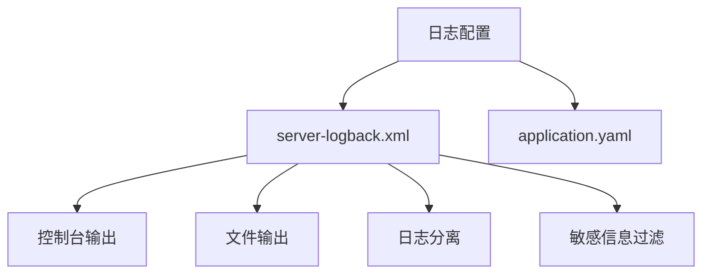
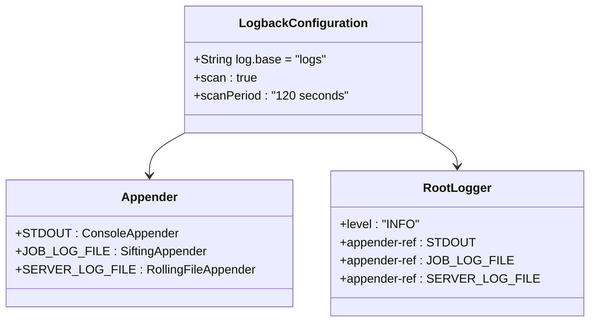
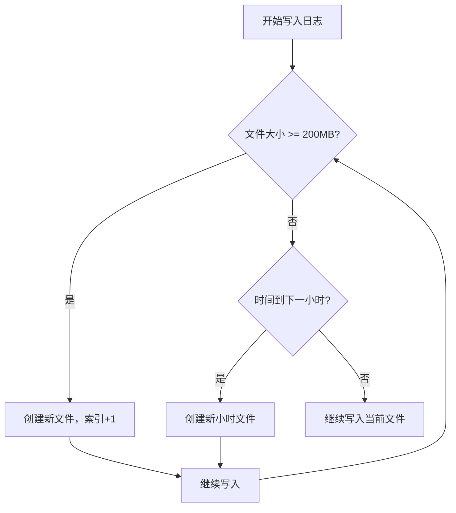
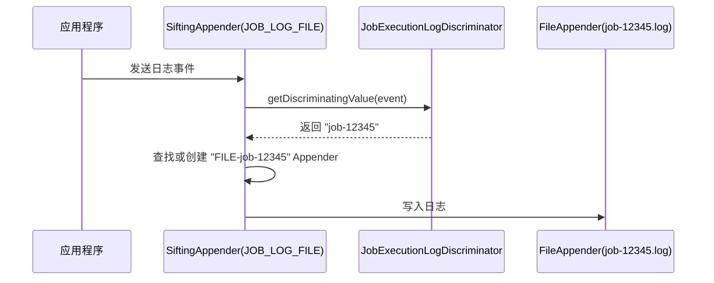

# 日志配置

<cite>
**本文档引用的文件**  
- [server-logback.xml](file://datavines-server/src/main/resources/server-logback.xml)
- [JobExecutionLogDiscriminator.java](file://datavines-common/src/main/java/io/datavines/common/log/JobExecutionLogDiscriminator.java)
- [JobExecutionLogFilter.java](file://datavines-common/src/main/java/io/datavines/common/log/JobExecutionLogFilter.java)
- [ServerLogFilter.java](file://datavines-common/src/main/java/io/datavines/common/log/ServerLogFilter.java)
- [SensitiveDataConverter.java](file://datavines-common/src/main/java/io/datavines/common/log/SensitiveDataConverter.java)
- [LoggerUtils.java](file://datavines-common/src/main/java/io/datavines/common/utils/LoggerUtils.java)
- [PasswordFilterUtils.java](file://datavines-common/src/main/java/io/datavines/common/utils/PasswordFilterUtils.java)
- [SensitiveLogUtils.java](file://datavines-common/src/main/java/io/datavines/common/utils/SensitiveLogUtils.java)
- [application.yaml](file://datavines-server/src/main/resources/application.yaml)
</cite>

## 目录
1. [日志配置概述](#日志配置概述)
2. [logback.xml 配置结构](#logbackxml-配置结构)
3. [日志级别设置](#日志级别设置)
4. [日志文件滚动策略](#日志文件滚动策略)
5. [日志输出格式](#日志输出格式)
6. [作业执行日志与服务器运行日志分离](#作业执行日志与服务器运行日志分离)
7. [敏感信息过滤机制](#敏感信息过滤机制)
8. [日志系统在问题排查与监控中的应用](#日志系统在问题排查与监控中的应用)

## 日志配置概述

DataVines 服务器的日志系统基于 Logback 实现，通过 `server-logback.xml` 文件进行配置。该系统支持控制台输出、文件输出，并实现了作业执行日志与服务器运行日志的分离。同时，系统内置了敏感信息过滤机制，能够自动对日志中的密码等敏感数据进行脱敏处理，保障系统安全。

**日志配置文件**  
日志配置由 `datavines-server/src/main/resources/server-logback.xml` 定义，并在 `application.yaml` 中通过 `logging.config` 属性指定加载路径。



**图源**  
- [server-logback.xml](file://datavines-server/src/main/resources/server-logback.xml)
- [application.yaml](file://datavines-server/src/main/resources/application.yaml)

## logback.xml 配置结构

`server-logback.xml` 是 DataVines 服务器的核心日志配置文件，其主要结构包括：

- **根配置**：`<configuration>` 标签，启用了配置扫描（`scan="true"`）和扫描周期（`scanPeriod="120 seconds"`），允许在不重启服务的情况下动态更新日志配置。
- **日志基础路径**：通过 `<property name="log.base" value="logs"/>` 定义日志文件的存储根目录。
- **Appender 配置**：定义了三种日志输出方式：
  - `STDOUT`：将日志输出到控制台。
  - `JOB_LOG_FILE`：使用 `SiftingAppender` 为每个作业执行生成独立的日志文件。
  - `SERVER_LOG_FILE`：将服务器运行日志输出到滚动文件中。
- **Root Logger**：将上述三个 Appender 绑定到根日志记录器，并设置日志级别为 `INFO`。



**图源**  
- [server-logback.xml](file://datavines-server/src/main/resources/server-logback.xml)

**节源**  
- [server-logback.xml](file://datavines-server/src/main/resources/server-logback.xml)

## 日志级别设置

DataVines 的日志级别遵循标准的 Logback 级别体系，从高到低依次为：`ERROR`、`WARN`、`INFO`、`DEBUG`、`TRACE`。

在 `server-logback.xml` 中，根日志记录器的级别被设置为 `INFO`，这意味着 `INFO` 及以上级别的日志（`INFO`、`WARN`、`ERROR`）将被记录。

此外，`JOB_LOG_FILE` Appender 中配置了 `ThresholdFilter`，其级别也设置为 `INFO`，确保只有 `INFO` 及以上级别的日志才会被写入作业日志文件。

```xml
<root level="INFO">
    <appender-ref ref="STDOUT"/>
    <appender-ref ref="JOB_LOG_FILE"/>
    <appender-ref ref="SERVER_LOG_FILE"/>
</root>
```

**节源**  
- [server-logback.xml](file://datavines-server/src/main/resources/server-logback.xml)

## 日志文件滚动策略

服务器运行日志（`SERVER_LOG_FILE`）采用了基于时间和大小的双重滚动策略（`SizeAndTimeBasedRollingPolicy`），具体配置如下：

- **文件名模式**：`<fileNamePattern>${log.base}/datavines-server.%d{yyyy-MM-dd_HH}.%i.log</fileNamePattern>`
  - 按小时（`%d{yyyy-MM-dd_HH}`）进行滚动。
  - 当文件大小达到上限时，会在同一小时内生成新的文件（`%i` 为索引）。
- **最大历史文件数**：`<maxHistory>168</maxHistory>`，保留最近 168 小时（7 天）的日志文件。
- **单个文件最大大小**：`<maxFileSize>200MB</maxFileSize>`，当文件达到 200MB 时会触发滚动。

这种策略确保了日志文件不会无限增长，便于管理和归档。



**图源**  
- [server-logback.xml](file://datavines-server/src/main/resources/server-logback.xml)

**节源**  
- [server-logback.xml](file://datavines-server/src/main/resources/server-logback.xml)

## 日志输出格式

DataVines 定义了统一的日志输出格式，适用于控制台和文件输出。格式定义在 `<pattern>` 标签内：

```xml
[%level] %date{yyyy-MM-dd HH:mm:ss.SSS} %logger{96}:[%line] - %msg%n
```

该格式包含以下信息：
- `[%level]`：日志级别（如 `[INFO]`）。
- `%date{yyyy-MM-dd HH:mm:ss.SSS}`：精确到毫秒的时间戳。
- `%logger{96}`：记录日志的类名（最多 96 个字符）。
- `[%line]`：日志语句在源代码中的行号。
- `- %msg%n`：日志消息内容和换行符。

此格式清晰、完整，便于阅读和解析。

**节源**  
- [server-logback.xml](file://datavines-server/src/main/resources/server-logback.xml)

## 作业执行日志与服务器运行日志分离

DataVines 通过巧妙的配置实现了作业执行日志与服务器运行日志的完全分离。

### 作业执行日志分离机制

作业执行日志的分离依赖于 Logback 的 `SiftingAppender`（筛选追加器）和自定义的 `Discriminator`（鉴别器）。

1.  **SiftingAppender (`JOB_LOG_FILE`)**：这是一个多路复用的 Appender，它可以根据一个“鉴别值”（discriminating value）动态地创建多个子 Appender。
2.  **Discriminator (`JobExecutionLogDiscriminator`)**：该类继承自 `AbstractDiscriminator`，其核心方法 `getDiscriminatingValue(ILoggingEvent event)` 决定了日志的分流依据。
    - 它从日志事件的 `loggerName` 中提取出 `jobExecutionUniqueId`。
    - 这个 `jobExecutionUniqueId` 通常是一个包含作业ID、执行时间等信息的唯一标识符。
    - 该方法返回的值（如 `job-12345`）将作为 `SiftingAppender` 创建子文件的依据。
3.  **Sift 配置**：在 `<sift>` 标签内，定义了一个模板 Appender。`${jobExecutionUniqueId}` 会被 `Discriminator` 返回的实际值替换，从而为每个作业执行创建一个独立的日志文件（如 `logs/job-12345.log`）。

### 服务器运行日志分离机制

服务器运行日志的分离则通过 `ServerLogFilter` 实现。

- `ServerLogFilter` 是一个自定义的 `Filter`，其 `decide` 方法会检查日志事件的线程名。
- 只有当线程名以 `"Server-"` 开头时，该日志才会被 `SERVER_LOG_FILE` Appender 接受（`FilterReply.ACCEPT`），否则被拒绝（`FilterReply.DENY`）。
- 这样，只有服务器核心线程产生的日志才会被写入 `datavines-server.log` 文件。



**图源**  
- [server-logback.xml](file://datavines-server/src/main/resources/server-logback.xml)
- [JobExecutionLogDiscriminator.java](file://datavines-common/src/main/java/io/datavines/common/log/JobExecutionLogDiscriminator.java)

**节源**  
- [server-logback.xml](file://datavines-server/src/main/resources/server-logback.xml)
- [JobExecutionLogDiscriminator.java](file://datavines-common/src/main/java/io/datavines/common/log/JobExecutionLogDiscriminator.java)
- [JobExecutionLogFilter.java](file://datavines-common/src/main/java/io/datavines/common/log/JobExecutionLogFilter.java)
- [ServerLogFilter.java](file://datavines-common/src/main/java/io/datavines/common/log/ServerLogFilter.java)

## 敏感信息过滤机制

DataVines 内置了敏感信息过滤机制，能够自动对日志中出现的密码等敏感数据进行脱敏处理。

### 实现原理

该机制的核心是 `SensitiveDataConverter` 类，它通过 Logback 的 `conversionRule` 机制被集成到日志格式化流程中。

1.  **注册转换器**：在 `server-logback.xml` 中，通过 `<conversionRule conversionWord="message" converterClass="io.datavines.common.log.SensitiveDataConverter"/>` 将 `message` 关键字映射到 `SensitiveDataConverter` 类。
2.  **重写消息格式**：在 `JOB_LOG_FILE` 的 `<pattern>` 中，使用 `%message%n` 而不是 `%msg%n`。这使得日志消息会经过 `SensitiveDataConverter` 的处理。
3.  **正则表达式匹配**：`SensitiveDataConverter` 内部定义了正则表达式（如 `DATASOURCE_PASSWORD_REGEX`），用于匹配 JSON 格式日志中 `"password":"..."` 的模式。
4.  **脱敏处理**：`convert` 方法会获取原始日志消息，然后调用 `PasswordFilterUtils.convertPassword` 方法，使用正则表达式查找并替换所有匹配的密码字段。
5.  **掩码实现**：`SensitiveLogUtils.maskDataSourcePwd` 方法将匹配到的密码字符串替换为固定的掩码字符串 `******`。

### 配置方法

此机制是内置且默认启用的，无需额外配置。只要日志消息中包含符合预定义正则表达式的敏感信息，就会被自动脱敏。

```mermaid
flowchart LR
A[原始日志消息] --> B{包含密码?}
B --> |是| C[应用正则表达式]
C --> D[匹配 "password":"123456"]
D --> E[替换为 "password":"******"]
E --> F[输出脱敏日志]
B --> |否| F
```

**图源**  
- [server-logback.xml](file://datavines-server/src/main/resources/server-logback.xml)
- [SensitiveDataConverter.java](file://datavines-common/src/main/java/io/datavines/common/log/SensitiveDataConverter.java)
- [PasswordFilterUtils.java](file://datavines-common/src/main/java/io/datavines/common/utils/PasswordFilterUtils.java)
- [SensitiveLogUtils.java](file://datavines-common/src/main/java/io/datavines/common/utils/SensitiveLogUtils.java)

**节源**  
- [server-logback.xml](file://datavines-server/src/main/resources/server-logback.xml)
- [SensitiveDataConverter.java](file://datavines-common/src/main/java/io/datavines/common/log/SensitiveDataConverter.java)
- [PasswordFilterUtils.java](file://datavines-common/src/main/java/io/datavines/common/utils/PasswordFilterUtils.java)
- [SensitiveLogUtils.java](file://datavines-common/src/main/java/io/datavines/common/utils/SensitiveLogUtils.java)

## 日志系统在问题排查与监控中的应用

DataVines 的日志系统为问题排查和系统监控提供了强有力的支持。

### 问题排查

- **精准定位**：通过分离的作业日志，可以快速定位到特定作业执行的完整日志流，无需在庞大的服务器日志中搜索。
- **上下文完整**：日志格式包含时间、类名、行号等信息，便于开发者快速定位代码位置。
- **敏感信息保护**：脱敏机制确保了排查问题时不会意外暴露数据库密码等敏感信息，符合安全审计要求。

### 系统监控

- **日志轮转**：基于时间和大小的滚动策略，保证了日志文件的可管理性，防止磁盘空间被耗尽。
- **动态配置**：`scan="true"` 允许运维人员在不重启服务的情况下调整日志级别（例如，临时将级别调为 `DEBUG` 以获取更详细的调试信息）。
- **多渠道输出**：同时输出到控制台和文件，方便在开发调试和生产环境监控中使用。

通过合理利用这些日志特性，运维和开发团队可以高效地维护 DataVines 服务器的稳定运行。

**节源**  
- [server-logback.xml](file://datavines-server/src/main/resources/server-logback.xml)
- [LoggerUtils.java](file://datavines-common/src/main/java/io/datavines/common/utils/LoggerUtils.java)