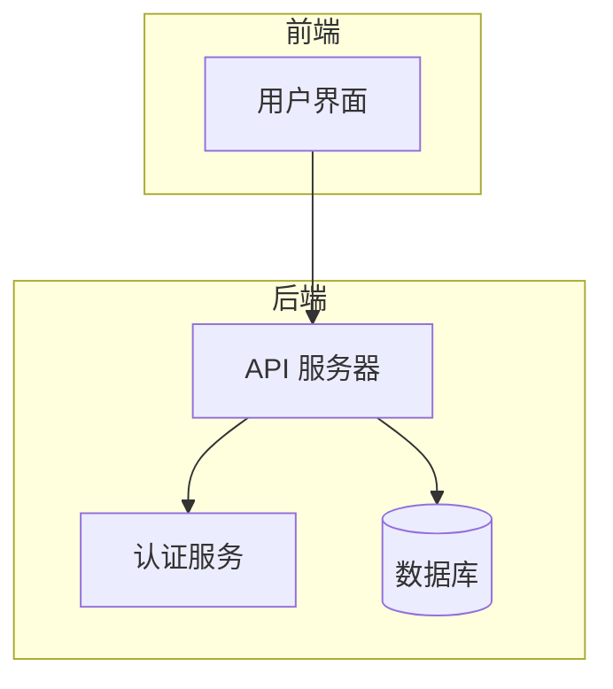
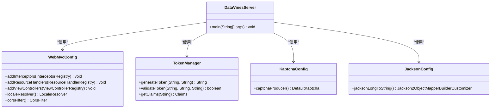
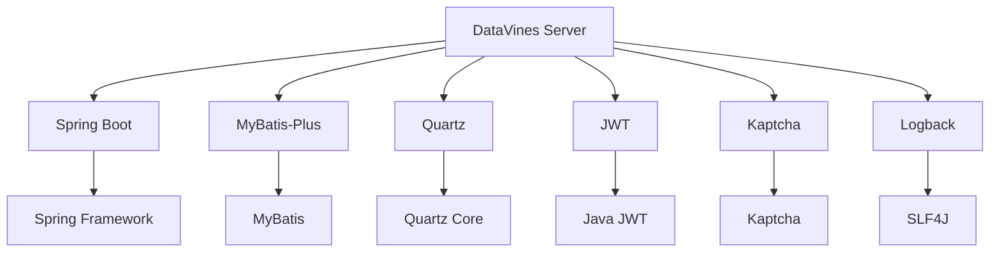

# 服务器配置

<cite>
**本文档引用的文件**  
- [application.yaml](file://datavines-server/src/main/resources/application.yaml)
- [server-logback.xml](file://datavines-server/src/main/resources/server-logback.xml)
- [JacksonConfig.java](file://datavines-server/src/main/java/io/datavines/server/config/JacksonConfig.java)
- [TokenManager.java](file://datavines-core/src/main/java/io/datavines/core/utils/TokenManager.java)
- [WebMvcConfig.java](file://datavines-server/src/main/java/io/datavines/server/api/config/WebMvcConfig.java)
- [KaptchaConfig.java](file://datavines-server/src/main/java/io/datavines/server/api/config/KaptchaConfig.java)
- [common.properties](file://datavines-common/src/main/resources/common.properties)
- [DataVinesConstants.java](file://datavines-core/src/main/java/io/datavines/core/constant/DataVinesConstants.java)
- [CommonConstants.java](file://datavines-common/src/main/java/io/datavines/common/CommonConstants.java)
- [datavines-daemon.sh](file://bin/datavines-daemon.sh)
</cite>

## 目录
1. [简介](#简介)
2. [项目结构](#项目结构)
3. [核心组件](#核心组件)
4. [架构概述](#架构概述)
5. [详细组件分析](#详细组件分析)
6. [依赖分析](#依赖分析)
7. [性能考虑](#性能考虑)
8. [故障排除指南](#故障排除指南)
9. [结论](#结论)

## 简介
DataVines 是一个数据质量监控平台，提供数据校验、监控和告警功能。本配置文档详细说明了 DataVines 服务器的所有配置选项，包括服务器端口、线程池配置、日志配置、安全配置（如 JWT、验证码）、跨域配置等。文档解释了 application.yaml 中各个配置项的作用、可选值和默认值，提供了配置示例和最佳实践，特别是生产环境下的安全配置建议。同时，文档还说明了配置的加载机制和优先级，以及如何通过环境变量覆盖配置文件中的值。

## 项目结构
DataVines 项目采用模块化设计，主要包含以下模块：
- **datavines-cli**: 命令行工具
- **datavines-client**: HTTP 客户端
- **datavines-common**: 公共组件和工具类
- **datavines-connector**: 数据源连接器
- **datavines-core**: 核心功能
- **datavines-engine**: 执行引擎
- **datavines-metric**: 指标定义
- **datavines-notification**: 通知服务
- **datavines-registry**: 注册中心
- **datavines-runner**: 任务执行器
- **datavines-server**: 服务器端
- **datavines-spi**: SPI 接口
- **datavines-ui**: 用户界面

服务器配置主要集中在 `datavines-server` 模块中，包括 `application.yaml` 配置文件、日志配置、安全配置等。



**图表来源**  
- [application.yaml](file://datavines-server/src/main/resources/application.yaml)
- [server-logback.xml](file://datavines-server/src/main/resources/server-logback.xml)

**章节来源**  
- [application.yaml](file://datavines-server/src/main/resources/application.yaml)
- [server-logback.xml](file://datavines-server/src/main/resources/server-logback.xml)

## 核心组件
DataVines 服务器的核心组件包括：
- **Spring Boot**: 作为基础框架
- **MyBatis-Plus**: ORM 框架
- **Quartz**: 任务调度
- **JWT**: 认证机制
- **Kaptcha**: 验证码生成
- **Logback**: 日志框架

这些组件通过 `application.yaml` 配置文件进行配置，确保系统的稳定运行和高效管理。

**章节来源**  
- [application.yaml](file://datavines-server/src/main/resources/application.yaml)
- [JacksonConfig.java](file://datavines-server/src/main/java/io/datavines/server/config/JacksonConfig.java)

## 架构概述
DataVines 服务器采用微服务架构，通过 Spring Boot 实现。系统通过 `application.yaml` 配置文件管理各种配置项，包括数据库连接、任务调度、日志记录等。认证机制采用 JWT，确保用户身份的安全性。验证码通过 Kaptcha 生成，增强系统的安全性。日志记录使用 Logback，支持多种日志级别和输出格式。



**图表来源**  
- [WebMvcConfig.java](file://datavines-server/src/main/java/io/datavines/server/api/config/WebMvcConfig.java)
- [TokenManager.java](file://datavines-core/src/main/java/io/datavines/core/utils/TokenManager.java)
- [KaptchaConfig.java](file://datavines-server/src/main/java/io/datavines/server/api/config/KaptchaConfig.java)
- [JacksonConfig.java](file://datavines-server/src/main/java/io/datavines/server/config/JacksonConfig.java)

## 详细组件分析

### 服务器配置分析
DataVines 服务器的配置主要通过 `application.yaml` 文件进行管理。以下是关键配置项的详细说明：

#### 服务器端口配置
```yaml
server:
  port: 5600
```
- **作用**: 设置服务器监听的端口号。
- **可选值**: 任意有效的端口号（1-65535）。
- **默认值**: 5600。
- **生产环境建议**: 使用非默认端口以增加安全性。

#### 数据库连接配置
```yaml
spring:
  datasource:
    driver-class-name: org.postgresql.Driver
    url: jdbc:postgresql://127.0.0.1:5432/datavines
    username: postgres
    password: 123456
    hikari:
      connection-test-query: select 1
      minimum-idle: 5
      auto-commit: true
      validation-timeout: 3000
      pool-name: datavines
      maximum-pool-size: 50
      connection-timeout: 30000
      idle-timeout: 600000
      leak-detection-threshold: 0
      initialization-fail-timeout: 1
```
- **作用**: 配置数据库连接信息，包括驱动类名、URL、用户名、密码以及 HikariCP 连接池参数。
- **可选值**: 根据使用的数据库类型选择相应的驱动类名和 URL。
- **默认值**: PostgreSQL 数据库，端口 5432，数据库名 datavines，用户名 postgres，密码 123456。
- **生产环境建议**: 使用强密码，配置合理的连接池大小，避免资源浪费。

#### 任务调度配置
```yaml
spring:
  quartz:
    job-store-type: jdbc
    jdbc:
      initialize-schema: never
    properties:
      org.quartz.threadPool.threadPriority: 5
      org.quartz.jobStore.isClustered: true
      org.quartz.jobStore.class: org.springframework.scheduling.quartz.LocalDataSourceJobStore
      org.quartz.scheduler.instanceId: AUTO
      org.quartz.jobStore.tablePrefix: QRTZ_
      org.quartz.jobStore.acquireTriggersWithinLock: true
      org.quartz.scheduler.instanceName: datavines
      org.quartz.threadPool.class: org.quartz.simpl.SimpleThreadPool
      org.quartz.threadPool.makeThreadsDaemons: true
      org.quartz.threadPool.threadCount: 25
      org.quartz.jobStore.misfireThreshold: 60000
      org.quartz.scheduler.batchTriggerAcquisitionMaxCount: 1
      org.quartz.scheduler.makeSchedulerThreadDaemon: true
      org.quartz.jobStore.useProperties: false
      org.quartz.threadPool.threadCount: 25
      org.quartz.jobStore.misfireThreshold: 60000
      org.quartz.scheduler.batchTriggerAcquisitionMaxCount: 1
      org.quartz.scheduler.makeSchedulerThreadDaemon: true
      org.quartz.jobStore.driverDelegateClass: org.quartz.impl.jdbcjobstore.PostgreSQLDelegate
      org.quartz.jobStore.clusterCheckinInterval: 5000
```
- **作用**: 配置 Quartz 任务调度器，支持集群模式。
- **可选值**: 根据实际需求调整线程池大小、任务存储方式等。
- **默认值**: 使用 JDBC 存储任务，支持集群，线程池大小 25。
- **生产环境建议**: 确保数据库连接稳定，合理配置线程池大小，避免任务积压。

#### 日志配置
```yaml
logging:
  config: classpath:server-logback.xml
```
- **作用**: 指定日志配置文件的位置。
- **可选值**: 任意有效的日志配置文件路径。
- **默认值**: `classpath:server-logback.xml`。
- **生产环境建议**: 配置详细的日志级别和输出格式，便于问题排查。

#### 安全配置
```yaml
jwt:
  token:
    secret: asdqwe
    timeout: 8640000
    algorithm: HS256
```
- **作用**: 配置 JWT 认证机制，包括密钥、超时时间和算法。
- **可选值**: 密钥可以是任意字符串，超时时间单位为毫秒，算法支持 HS256、HS384、HS512 等。
- **默认值**: 密钥 asdqwe，超时时间 8640000 毫秒（10 天），算法 HS256。
- **生产环境建议**: 使用强密钥，缩短超时时间，提高安全性。

#### 验证码配置
```yaml
kaptcha:
  border: yes
  border.color: 105,179,90
  textproducer.font.color: blue
  image.width: 125
  image.height: 65
  textproducer.font.size: 45
  session.key: code
  textproducer.char.length: 4
  textproducer.font.names: cmr10
```
- **作用**: 配置 Kaptcha 验证码生成器，包括边框、字体颜色、图片尺寸、字符长度等。
- **可选值**: 根据实际需求调整各项参数。
- **默认值**: 边框 yes，边框颜色 105,179,90，字体颜色 blue，图片宽度 125，高度 65，字体大小 45，会话键 code，字符长度 4，字体名称 cmr10。
- **生产环境建议**: 调整验证码复杂度，防止自动化攻击。

#### 跨域配置
```java
@Configuration
public class WebMvcConfig implements WebMvcConfigurer {
    @Bean
    public CorsFilter corsFilter() {
        UrlBasedCorsConfigurationSource source = new UrlBasedCorsConfigurationSource();
        source.registerCorsConfiguration("/**", addCorsConfig());
        return new CorsFilter(source);
    }

    private CorsConfiguration addCorsConfig() {
        CorsConfiguration corsConfiguration = new CorsConfiguration();
        corsConfiguration.setAllowedOriginPatterns(Collections.singletonList("*"));
        corsConfiguration.addAllowedHeader("*");
        corsConfiguration.addAllowedMethod("*");
        corsConfiguration.setAllowCredentials(true);
        return corsConfiguration;
    }
}
```
- **作用**: 配置跨域资源共享（CORS），允许前端应用访问后端 API。
- **可选值**: 根据实际需求调整允许的源、头信息、方法等。
- **默认值**: 允许所有源、头信息和方法，支持凭据。
- **生产环境建议**: 限制允许的源，避免安全风险。

**章节来源**  
- [application.yaml](file://datavines-server/src/main/resources/application.yaml)
- [WebMvcConfig.java](file://datavines-server/src/main/java/io/datavines/server/api/config/WebMvcConfig.java)
- [TokenManager.java](file://datavines-core/src/main/java/io/datavines/core/utils/TokenManager.java)
- [KaptchaConfig.java](file://datavines-server/src/main/java/io/datavines/server/api/config/KaptchaConfig.java)

### Jackson 配置分析
```java
@Configuration
public class JacksonConfig {
    @Bean
    public Jackson2ObjectMapperBuilderCustomizer jacksonLongToString() {
        return builder -> {
            builder.serializerByType(Long.class, ToStringSerializer.instance);
            builder.serializerByType(long.class, ToStringSerializer.instance);
            builder.serializerByType(BigInteger.class, ToStringSerializer.instance);
            builder.serializerByType(BigDecimal.class, ToStringSerializer.instance);
        };
    }
}
```
- **作用**: 配置 Jackson 序列化器，将长整型、大整数和大十进制数序列化为字符串，避免 JavaScript 中的精度丢失问题。
- **可选值**: 无。
- **默认值**: 启用长整型、大整数和大十进制数的字符串序列化。
- **生产环境建议**: 保持启用，确保数据精度。

**章节来源**  
- [JacksonConfig.java](file://datavines-server/src/main/java/io/datavines/server/config/JacksonConfig.java)

## 依赖分析
DataVines 服务器依赖于多个外部库和框架，包括 Spring Boot、MyBatis-Plus、Quartz、JWT、Kaptcha 和 Logback。这些依赖通过 Maven 管理，确保版本兼容性和稳定性。



**图表来源**  
- [pom.xml](file://datavines-server/pom.xml)

**章节来源**  
- [pom.xml](file://datavines-server/pom.xml)

## 性能考虑
为了确保 DataVines 服务器的高性能，建议采取以下措施：
- **优化数据库连接池**: 根据实际负载调整 HikariCP 连接池的大小，避免资源浪费。
- **合理配置任务调度**: 调整 Quartz 线程池大小，确保任务能够及时执行。
- **日志级别管理**: 在生产环境中使用适当的日志级别，减少不必要的日志输出。
- **缓存机制**: 使用缓存减少数据库查询次数，提高响应速度。
- **负载均衡**: 在高并发场景下，使用负载均衡器分散请求压力。

## 故障排除指南
### 常见问题及解决方案
1. **服务器启动失败**
   - **原因**: 配置文件错误或依赖库缺失。
   - **解决方案**: 检查 `application.yaml` 文件中的配置项是否正确，确保所有依赖库已正确安装。

2. **数据库连接失败**
   - **原因**: 数据库地址、端口、用户名或密码错误。
   - **解决方案**: 检查 `application.yaml` 中的数据库连接信息，确保与实际数据库匹配。

3. **任务调度异常**
   - **原因**: Quartz 配置错误或数据库连接问题。
   - **解决方案**: 检查 `application.yaml` 中的 Quartz 配置，确保数据库连接正常。

4. **日志记录不完整**
   - **原因**: 日志配置文件错误或日志级别设置不当。
   - **解决方案**: 检查 `server-logback.xml` 文件中的配置，确保日志级别和输出格式正确。

5. **认证失败**
   - **原因**: JWT 密钥错误或超时时间过短。
   - **解决方案**: 检查 `application.yaml` 中的 JWT 配置，确保密钥和超时时间正确。

**章节来源**  
- [application.yaml](file://datavines-server/src/main/resources/application.yaml)
- [server-logback.xml](file://datavines-server/src/main/resources/server-logback.xml)
- [TokenManager.java](file://datavines-core/src/main/java/io/datavines/core/utils/TokenManager.java)

## 结论
DataVines 服务器的配置文档详细说明了所有配置选项，包括服务器端口、线程池配置、日志配置、安全配置（如 JWT、验证码）、跨域配置等。通过 `application.yaml` 配置文件管理各种配置项，确保系统的稳定运行和高效管理。生产环境下的安全配置建议包括使用强密码、合理配置连接池大小、限制允许的源等。配置的加载机制和优先级也得到了明确说明，支持通过环境变量覆盖配置文件中的值。希望本文档能帮助您更好地理解和配置 DataVines 服务器。