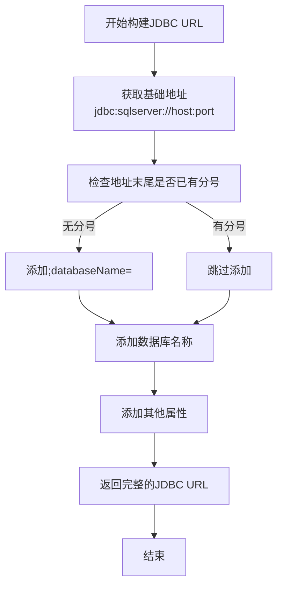
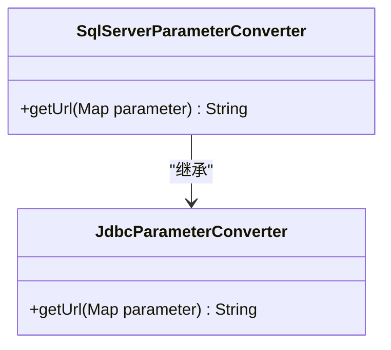
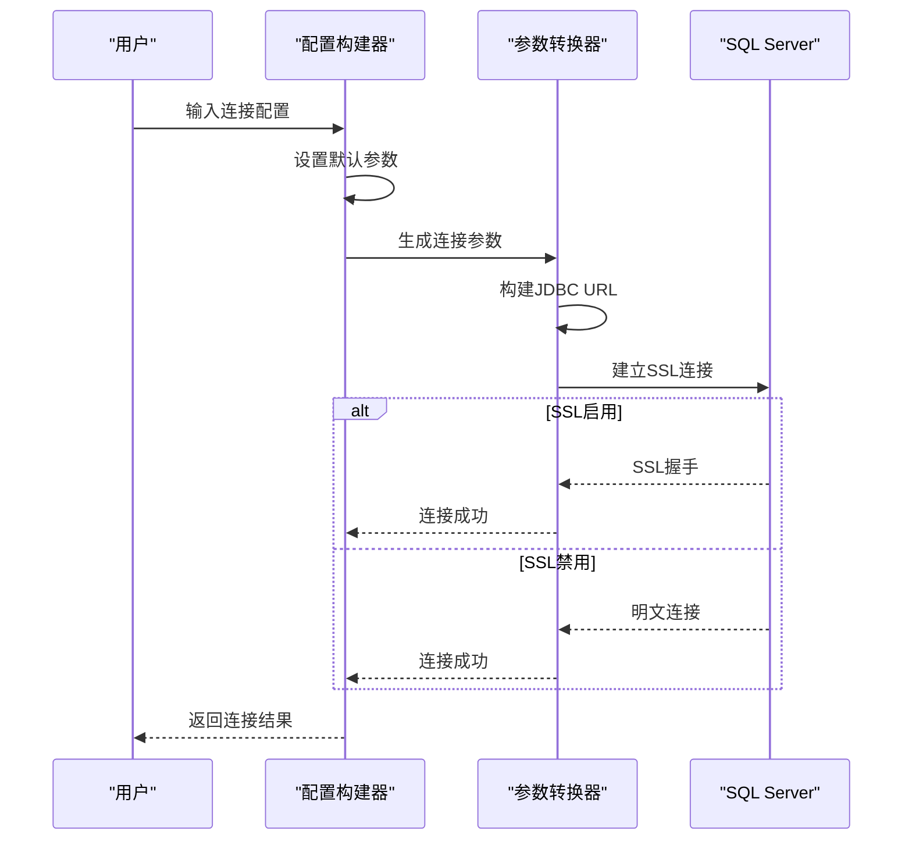
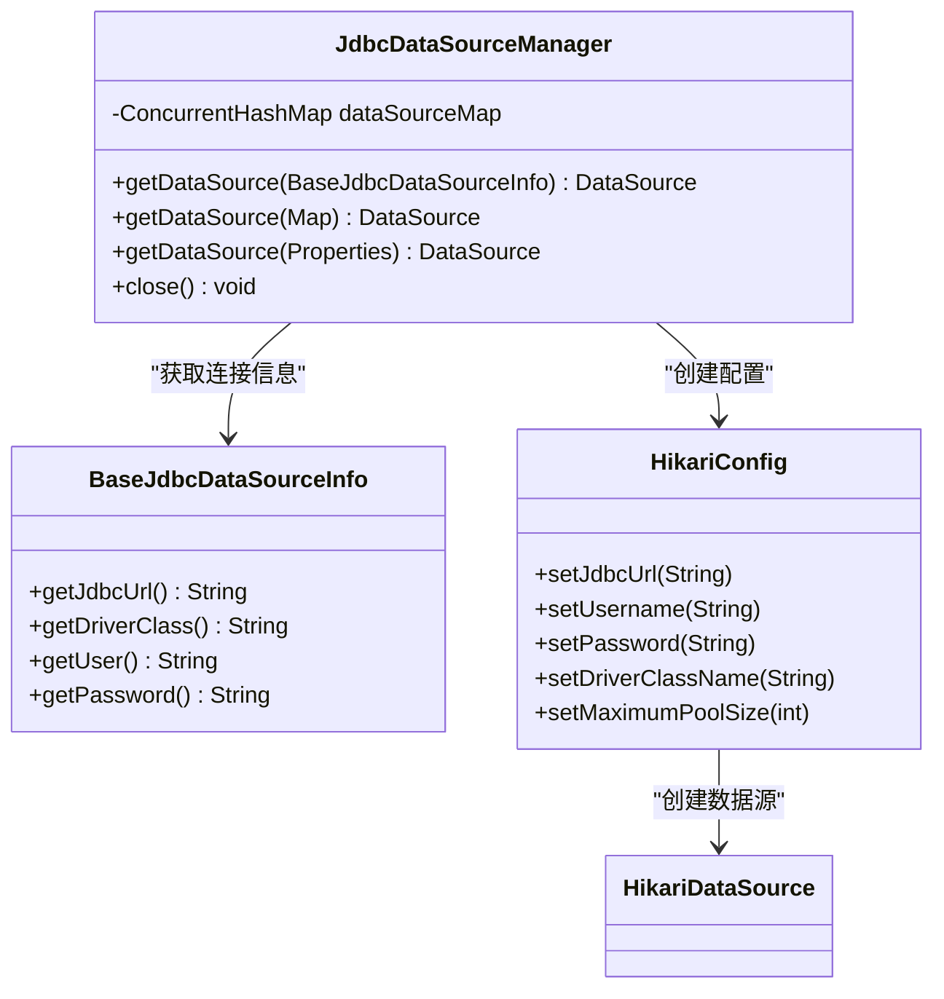
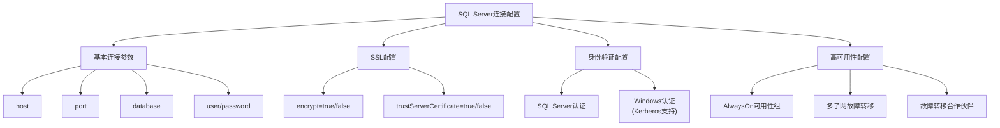
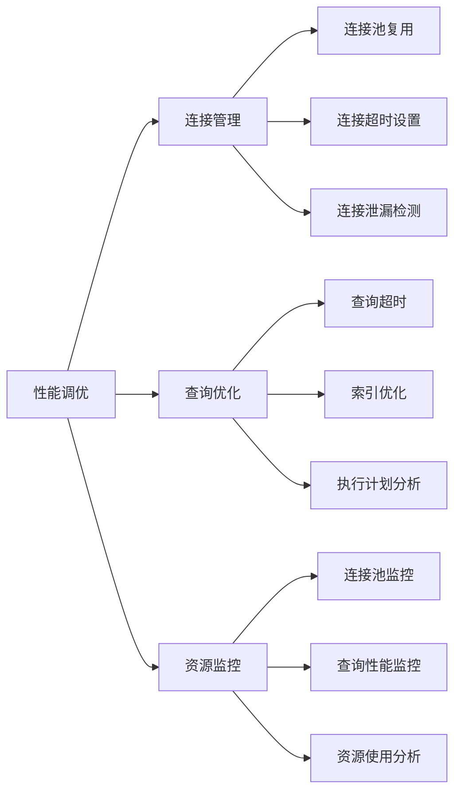
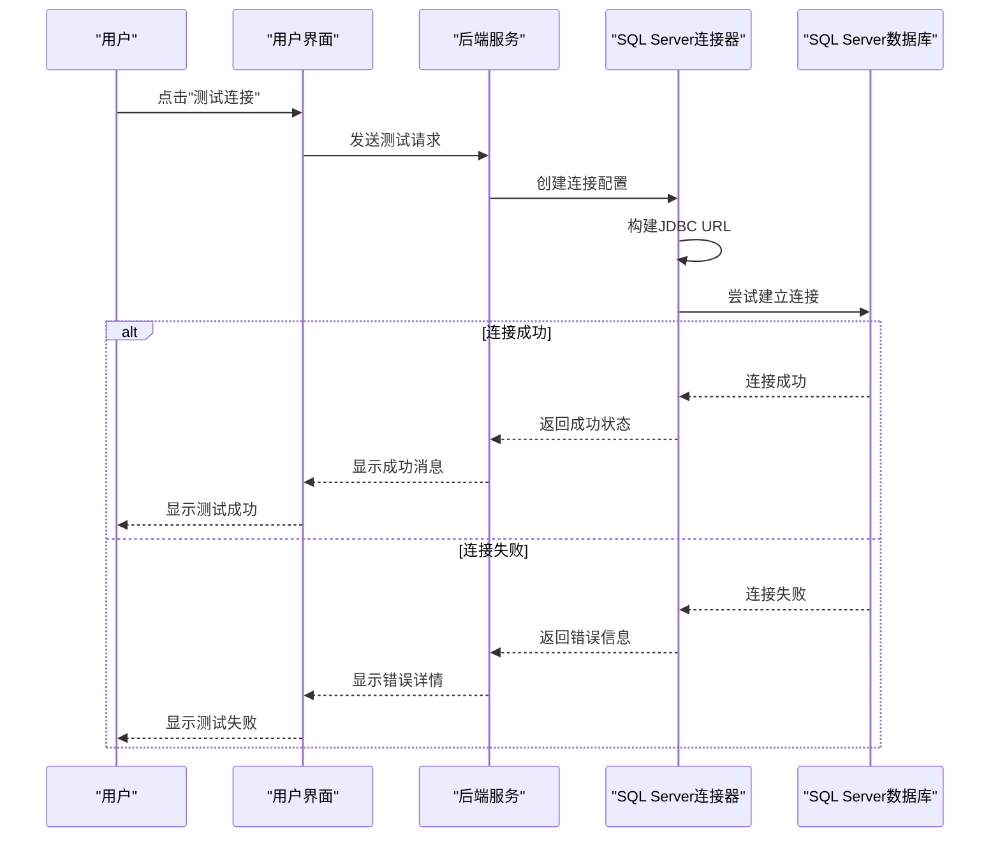

# SQL Server配置

<cite>
**本文档引用的文件**   
- [SqlServerDataSourceInfo.java](file://datavines-connector\datavines-connector-plugins\datavines-connector-sqlserver\src\main\java\io\datavines\connector\plugin\SqlServerDataSourceInfo.java)
- [SqlServerParameterConverter.java](file://datavines-connector\datavines-connector-plugins\datavines-connector-sqlserver\src\main\java\io\datavines\connector\plugin\SqlServerParameterConverter.java)
- [SqlServerConfigBuilder.java](file://datavines-connector\datavines-connector-plugins\datavines-connector-sqlserver\src\main\java\io\datavines\connector\plugin\SqlServerConfigBuilder.java)
- [SqlServerConnector.java](file://datavines-connector\datavines-connector-plugins\datavines-connector-sqlserver\src\main\java\io\datavines\connector\plugin\SqlServerConnector.java)
- [BaseJdbcDataSourceInfo.java](file://datavines-common\src\main\java\io\datavines\common\datasource\jdbc\BaseJdbcDataSourceInfo.java)
- [JdbcDataSourceManager.java](file://datavines-common\src\main\java\io\datavines\common\datasource\jdbc\JdbcDataSourceManager.java)
- [JdbcConfigBuilder.java](file://datavines-connector\datavines-connector-plugins\datavines-connector-jdbc\src\main\java\io\datavines\connector\plugin\JdbcConfigBuilder.java)
</cite>

## 目录
1. [简介](#简介)
2. [JDBC连接字符串格式](#jdbc连接字符串格式)
3. [连接参数配置](#连接参数配置)
4. [SSL配置方法](#ssl配置方法)
5. [连接池参数设置](#连接池参数设置)
6. [SQL Server特有配置选项](#sql-server特有配置选项)
7. [性能调优建议](#性能调优建议)
8. [连接器连通性和性能测试](#连接器连通性和性能测试)

## 简介
本文档详细说明了DataVines平台中SQL Server连接器的配置方法。文档涵盖了JDBC连接字符串格式、连接参数、SSL配置、连接池设置、SQL Server特有配置选项、性能调优建议以及连接器连通性和性能测试方法。

**本文档引用的文件**   
- [SqlServerDataSourceInfo.java](file://datavines-connector\datavines-connector-plugins\datavines-connector-sqlserver\src\main\java\io\datavines\connector\plugin\SqlServerDataSourceInfo.java)
- [SqlServerParameterConverter.java](file://datavines-connector\datavines-connector-plugins\datavines-connector-sqlserver\src\main\java\io\datavines\connector\plugin\SqlServerParameterConverter.java)

## JDBC连接字符串格式
SQL Server连接器使用标准的JDBC连接字符串格式，其基本结构如下：

```
jdbc:sqlserver://host:port;databaseName=database
```

在DataVines平台中，该连接字符串由`SqlServerDataSourceInfo`类动态生成。连接字符串的构建过程如下：

1. 基础地址格式为`jdbc:sqlserver://host:port`
2. 数据库名称通过`databaseName`参数指定
3. 其他连接属性通过分号(`;`)分隔添加



**图源**
- [SqlServerDataSourceInfo.java](file://datavines-connector\datavines-connector-plugins\datavines-connector-sqlserver\src\main\java\io\datavines\connector\plugin\SqlServerDataSourceInfo.java#L53-L64)

**本节源码**
- [SqlServerDataSourceInfo.java](file://datavines-connector\datavines-connector-plugins\datavines-connector-sqlserver\src\main\java\io\datavines\connector\plugin\SqlServerDataSourceInfo.java#L53-L64)

## 连接参数配置
SQL Server连接器支持多种连接参数配置，这些参数通过`SqlServerParameterConverter`类进行处理。

### 基本连接参数
基本连接参数包括：
- **host**: SQL Server服务器地址
- **port**: SQL Server端口号（默认1433）
- **database**: 要连接的数据库名称
- **user**: 用户名
- **password**: 密码

### 高级连接参数
高级连接参数通过`properties`字段配置，以键值对形式提供，多个参数用分号分隔。



**图源**
- [SqlServerParameterConverter.java](file://datavines-connector\datavines-connector-plugins\datavines-connector-sqlserver\src\main\java\io\datavines\connector\plugin\SqlServerParameterConverter.java#L27-L38)

**本节源码**
- [SqlServerParameterConverter.java](file://datavines-connector\datavines-connector-plugins\datavines-connector-sqlserver\src\main\java\io\datavines\connector\plugin\SqlServerParameterConverter.java#L27-L38)

## SSL配置方法
SQL Server连接器支持SSL加密连接，通过配置特定参数实现。

### SSL相关参数
主要SSL配置参数包括：
- **encrypt**: 是否启用加密连接
  - true: 启用SSL加密
  - false: 禁用SSL加密
- **trustServerCertificate**: 是否信任服务器证书
  - true: 不验证服务器证书
  - false: 验证服务器证书（默认值）

在DataVines平台中，`trustServerCertificate`参数的默认值设置为`false`，确保连接安全性。



**图源**
- [SqlServerConfigBuilder.java](file://datavines-connector\datavines-connector-plugins\datavines-connector-sqlserver\src\main\java\io\datavines\connector\plugin\SqlServerConfigBuilder.java#L26-L30)

**本节源码**
- [SqlServerConfigBuilder.java](file://datavines-connector\datavines-connector-plugins\datavines-connector-sqlserver\src\main\java\io\datavines\connector\plugin\SqlServerConfigBuilder.java#L26-L30)

## 连接池参数设置
DataVines平台使用HikariCP作为连接池实现，为SQL Server连接器提供高效的连接管理。

### 连接池配置
连接池的主要配置参数：
- **最大连接数**: 10个连接
- **连接超时**: 默认值
- **空闲超时**: 默认值
- **生命周期超时**: 默认值

连接池由`JdbcDataSourceManager`类管理，确保连接的高效复用和资源优化。



**图源**
- [JdbcDataSourceManager.java](file://datavines-common\src\main\java\io\datavines\common\datasource\jdbc\JdbcDataSourceManager.java#L55-L63)
- [BaseJdbcDataSourceInfo.java](file://datavines-common\src\main\java\io\datavines\common\datasource\jdbc\BaseJdbcDataSourceInfo.java#L96-L103)

**本节源码**
- [JdbcDataSourceManager.java](file://datavines-common\src\main\java\io\datavines\common\datasource\jdbc\JdbcDataSourceManager.java#L55-L63)
- [BaseJdbcDataSourceInfo.java](file://datavines-common\src\main\java\io\datavines\common\datasource\jdbc\BaseJdbcDataSourceInfo.java#L96-L103)

## SQL Server特有配置选项
SQL Server连接器支持多种特有配置选项，以满足不同的部署需求。

### Windows身份验证配置
虽然当前代码中未直接实现Windows身份验证，但平台架构支持通过Kerberos认证进行集成Windows身份验证。

相关配置参数：
- **keytabFile**: Kerberos keytab文件路径
- **keytabPrincipal**: Kerberos主体名称
- **krb5ConfFile**: Kerberos配置文件路径

这些参数在`BaseJdbcDataSourceInfo`类中定义，为Windows身份验证提供基础支持。

### AlwaysOn可用性组配置
对于AlwaysOn可用性组，可以通过以下方式配置：
- 使用多个主机地址
- 配置故障转移合作伙伴
- 设置多子网故障转移

### 多子网故障转移配置
多子网故障转移通过以下参数支持：
- **multiSubnetFailover**: 启用多子网故障转移
- **loginTimeout**: 登录超时设置



**图源**
- [BaseJdbcDataSourceInfo.java](file://datavines-common\src\main\java\io\datavines\common\datasource\jdbc\BaseJdbcDataSourceInfo.java#L184-L194)

**本节源码**
- [BaseJdbcDataSourceInfo.java](file://datavines-common\src\main\java\io\datavines\common\datasource\jdbc\BaseJdbcDataSourceInfo.java#L184-L194)

## 性能调优建议
为优化SQL Server连接器的性能，建议采用以下策略：

### 连接复用
利用连接池实现连接复用，避免频繁创建和销毁连接。HikariCP连接池自动管理连接生命周期，确保连接的高效复用。

### 批量操作
对于大量数据操作，建议使用批量处理：
- 批量插入（Batch Insert）
- 批量更新（Batch Update）
- 批量删除（Batch Delete）

### 查询超时设置
合理设置查询超时，避免长时间运行的查询影响系统性能：
- 设置合理的`queryTimeout`值
- 监控长查询并进行优化
- 使用索引优化查询性能

### 连接池优化
连接池配置优化建议：
- 根据负载调整最大连接数
- 设置适当的连接超时
- 监控连接池使用情况



**本节源码**
- [JdbcDataSourceManager.java](file://datavines-common\src\main\java\io\datavines\common\datasource\jdbc\JdbcDataSourceManager.java)
- [BaseJdbcDataSourceInfo.java](file://datavines-common\src\main\java\io\datavines\common\datasource\jdbc\BaseJdbcDataSourceInfo.java)

## 连接器连通性和性能测试
为确保SQL Server连接器的正常工作，需要进行连通性和性能测试。

### 连通性测试
连通性测试通过`getConnection()`方法实现：

```java
public Connection getConnection() throws Exception {
    Class.forName(getDriverClass());
    return DriverManager.getConnection(getJdbcUrl(), getUser(), getPassword());
}
```

测试步骤：
1. 加载SQL Server JDBC驱动
2. 使用配置的连接参数建立连接
3. 执行验证查询（如"SELECT 1"）
4. 返回连接状态

### 性能测试
性能测试建议包括：
- 连接建立时间测试
- 查询响应时间测试
- 并发连接测试
- 长时间运行稳定性测试

### 测试工具
平台提供了测试连接的接口，可以通过以下方式测试：
- 使用管理界面的测试连接功能
- 调用API进行连接测试
- 使用命令行工具进行测试



**图源**
- [BaseJdbcDataSourceInfo.java](file://datavines-common\src\main\java\io\datavines\common\datasource\jdbc\BaseJdbcDataSourceInfo.java#L149-L152)

**本节源码**
- [BaseJdbcDataSourceInfo.java](file://datavines-common\src\main\java\io\datavines\common\datasource\jdbc\BaseJdbcDataSourceInfo.java#L149-L152)