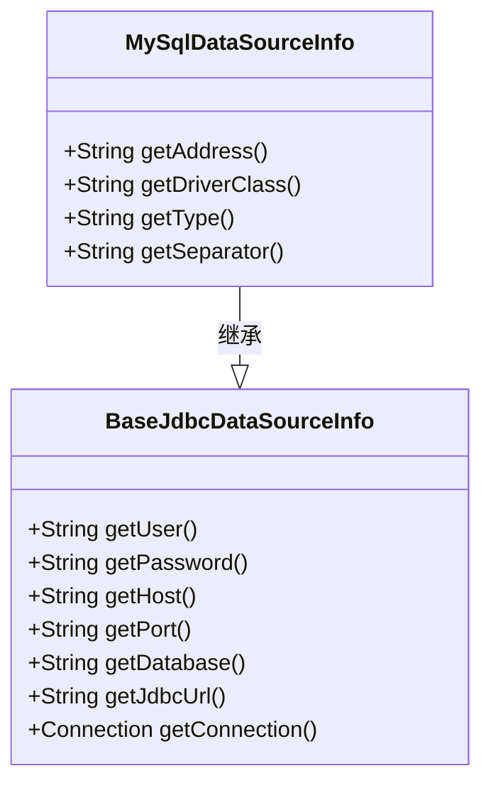
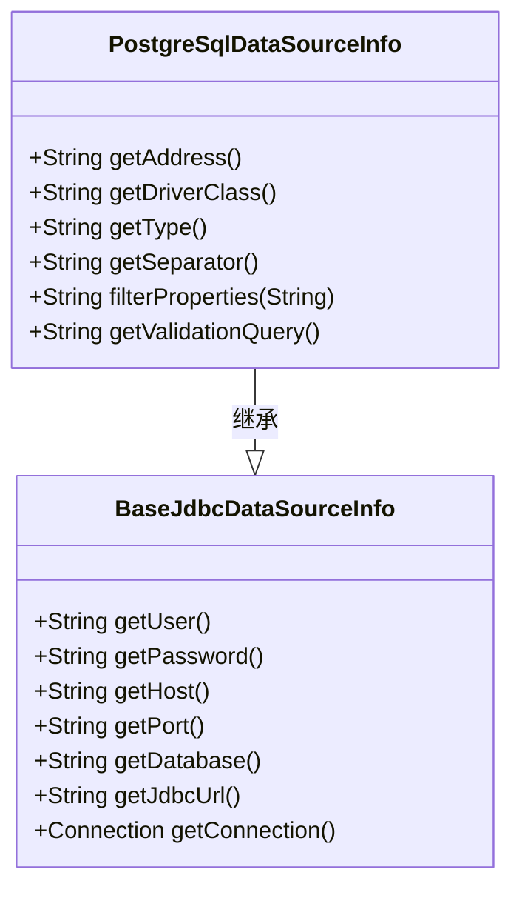
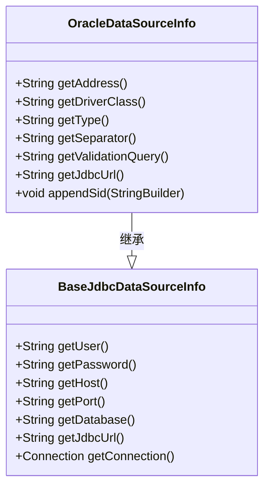
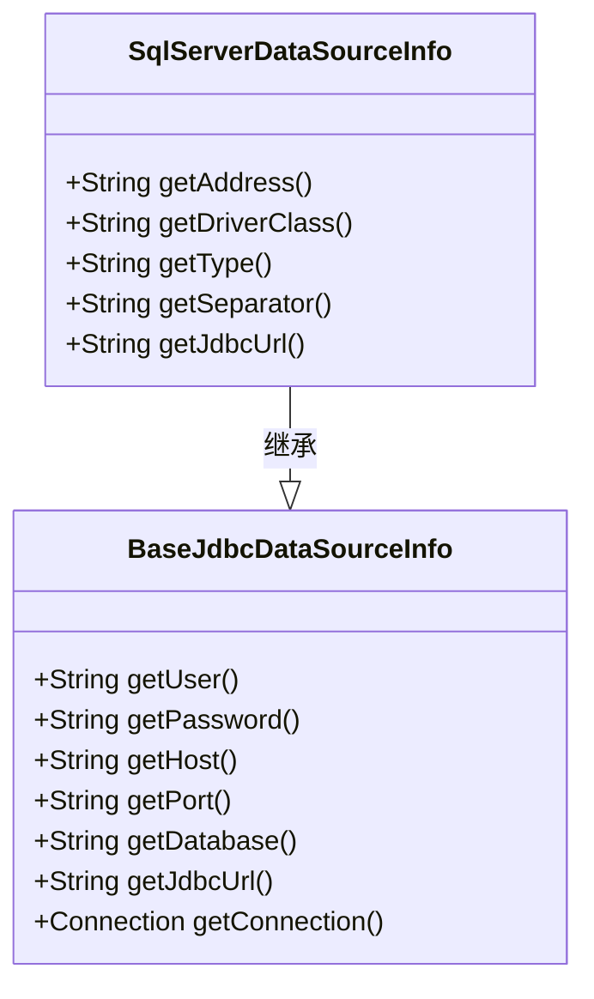
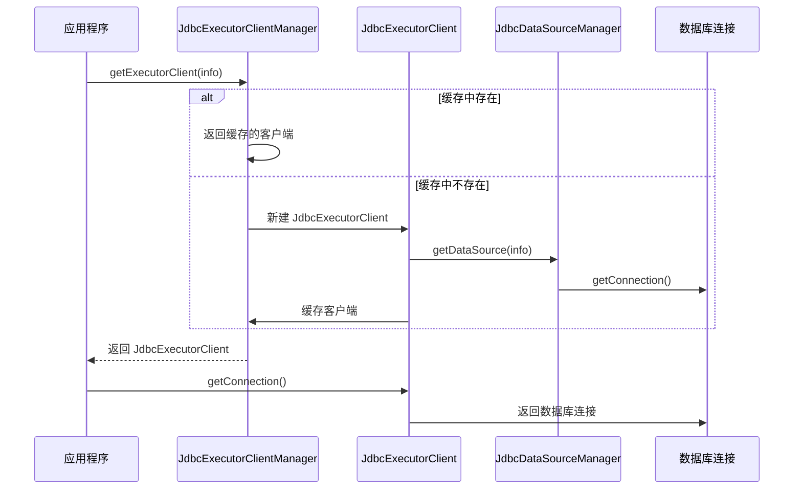
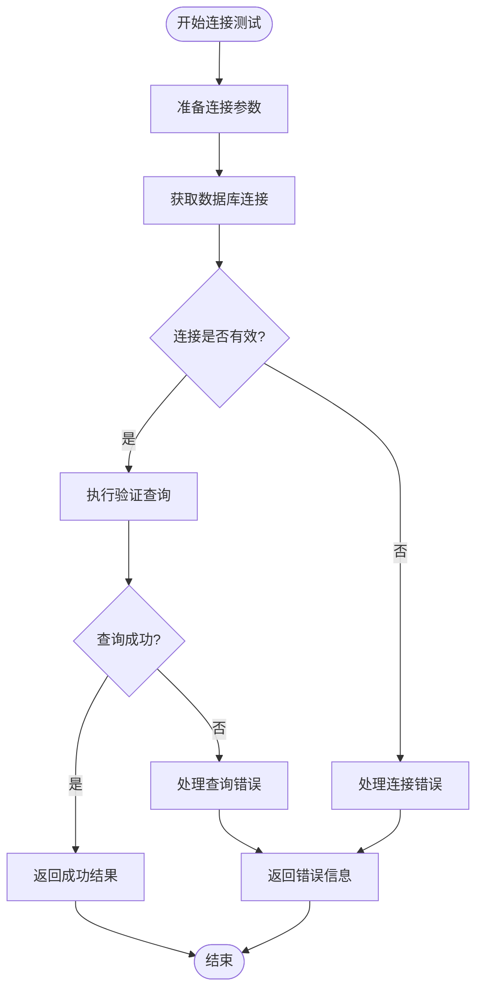
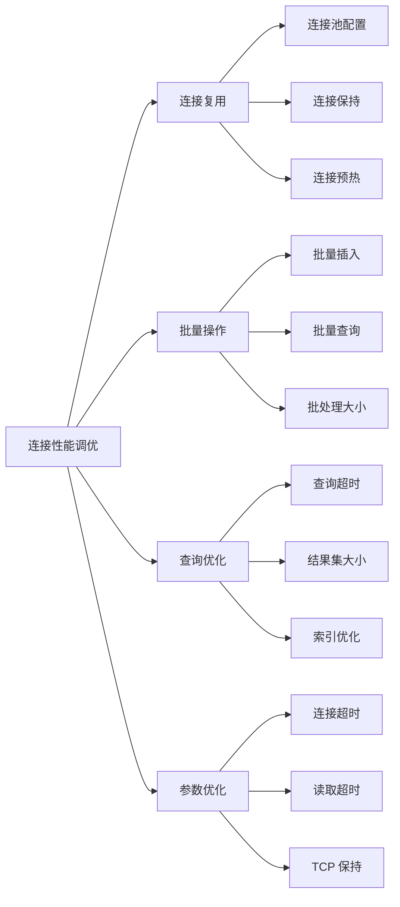
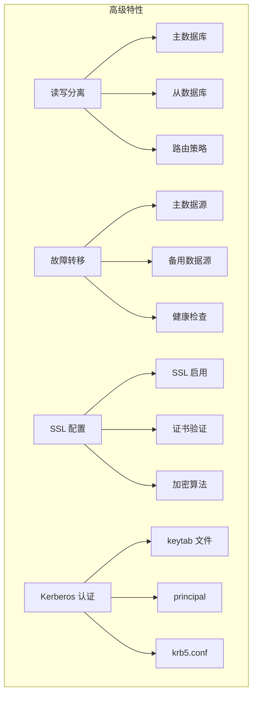

# 关系型数据库配置

<cite>
**本文档中引用的文件**  
- [JdbcConnectionInfo.java](file://datavines-common/src/main/java/io/datavines/common/datasource/jdbc/JdbcConnectionInfo.java)
- [BaseJdbcDataSourceInfo.java](file://datavines-common/src/main/java/io/datavines/common/datasource/jdbc/BaseJdbcDataSourceInfo.java)
- [JdbcDataSourceInfoManager.java](file://datavines-common/src/main/java/io/datavines/common/datasource/jdbc/JdbcDataSourceInfoManager.java)
- [JdbcExecutorClient.java](file://datavines-common/src/main/java/io/datavines/common/datasource/jdbc/JdbcExecutorClient.java)
- [JdbcExecutorClientManager.java](file://datavines-common/src/main/java/io/datavines/common/datasource/jdbc/JdbcExecutorClientManager.java)
- [ConnectionUtils.java](file://datavines-common/src/main/java/io/datavines/common/utils/ConnectionUtils.java)
- [MySqlDataSourceInfo.java](file://datavines-connector/ datavines-connector-plugins/ datavines-connector-mysql/src/main/java/io/ datavines/connector/plugin/MySqlDataSourceInfo.java)
- [PostgreSqlDataSourceInfo.java](file://datavines-connector/ datavines-connector-plugins/ datavines-connector-postgresql/src/main/java/io/ datavines/connector/plugin/PostgreSqlDataSourceInfo.java)
- [OracleDataSourceInfo.java](file://datavines-connector/ datavines-connector-plugins/ datavines-connector-oracle/src/main/java/io/ datavines/connector/plugin/OracleDataSourceInfo.java)
- [SqlServerDataSourceInfo.java](file://datavines-connector/ datavines-connector-plugins/ datavines-connector-sqlserver/src/main/java/io/ datavines/connector/plugin/SqlServerDataSourceInfo.java)
- [TestConnectionRequestParam.java](file://datavines-common/src/main/java/io/datavines/common/param/TestConnectionRequestParam.java)
- [ExecuteRequestParam.java](file://datavines-common/src/main/java/io/datavines/common/param/ExecuteRequestParam.java)
</cite>

## 目录
1. [简介](#简介)
2. [核心配置组件](#核心配置组件)
3. [数据库连接配置](#数据库连接配置)
   - [MySQL配置](#mysql配置)
   - [PostgreSQL配置](#postgresql配置)
   - [Oracle配置](#oracle配置)
   - [SQL Server配置](#sql-server配置)
4. [连接池管理](#连接池管理)
5. [连接测试与验证](#连接测试与验证)
6. [性能调优建议](#性能调优建议)
7. [高级特性配置](#高级特性配置)

## 简介
DataVines 是一个数据质量平台，支持多种关系型数据库的连接与管理。本文档详细说明了如何配置 MySQL、PostgreSQL、Oracle 和 SQL Server 等主流关系型数据库的连接器，包括 JDBC 连接字符串格式、连接参数、SSL 配置、连接池参数以及高级特性如读写分离和故障转移。同时提供性能调优建议和连接测试方法。

## 核心配置组件

DataVines 的数据库连接配置基于一套统一的组件架构，主要包括以下几个核心类：

- **JdbcConnectionInfo**: 存储基本的连接信息，如 host、port、database、username、password 等
- **BaseJdbcDataSourceInfo**: 抽象基类，定义了所有 JDBC 数据源的通用行为和属性
- **JdbcDataSourceInfoManager**: 管理数据源信息的缓存，使用 MD5 哈希作为唯一键
- **JdbcExecutorClient**: 执行数据库操作的客户端，封装了连接获取和 JdbcTemplate
- **JdbcExecutorClientManager**: 管理 JdbcExecutorClient 实例的单例模式管理器

这些组件共同构成了 DataVines 数据库连接的基础架构，确保连接配置的一致性和高效性。

**Section sources**
- [JdbcConnectionInfo.java](file://datavines-common/src/main/java/io/datavines/common/datasource/jdbc/JdbcConnectionInfo.java)
- [BaseJdbcDataSourceInfo.java](file://datavines-common/src/main/java/io/datavines/common/datasource/jdbc/BaseJdbcDataSourceInfo.java)
- [JdbcDataSourceInfoManager.java](file://datavines-common/src/main/java/io/datavines/common/datasource/jdbc/JdbcDataSourceInfoManager.java)
- [JdbcExecutorClient.java](file://datavines-common/src/main/java/io/datavines/common/datasource/jdbc/JdbcExecutorClient.java)
- [JdbcExecutorClientManager.java](file://datavines-common/src/main/java/io/datavines/common/datasource/jdbc/JdbcExecutorClientManager.java)

## 数据库连接配置

### MySQL配置

MySQL 数据库的连接配置遵循标准的 JDBC 规范，主要配置参数如下：

- **JDBC URL 格式**: `jdbc:mysql://<host>:<port>/<database>`
- **驱动类**: `com.mysql.cj.jdbc.Driver`
- **分隔符**: `?` (用于连接参数)
- **验证查询**: `Select 1`

连接参数包括：
- host: 数据库服务器地址
- port: 端口号（默认 3306）
- database: 数据库名称
- user: 用户名
- password: 密码
- properties: 其他连接属性（如 SSL 配置、时区等）

**Diagram sources**
- [MySqlDataSourceInfo.java](file://datavines-connector/datavines-connector-plugins/datavines-connector-mysql/src/main/java/io/datavines/connector/plugin/MySqlDataSourceInfo.java)
- [BaseJdbcDataSourceInfo.java](file://datavines-common/src/main/java/io/datavines/common/datasource/jdbc/BaseJdbcDataSourceInfo.java)

**Section sources**
- [MySqlDataSourceInfo.java](file://datavines-connector/datavines-connector-plugins/datavines-connector-mysql/src/main/java/io/datavines/connector/plugin/MySqlDataSourceInfo.java)

### PostgreSQL配置

PostgreSQL 数据库的连接配置具有以下特点：

- **JDBC URL 格式**: `jdbc:postgresql://<host>:<port>/<database>`
- **驱动类**: `org.postgresql.Driver`
- **分隔符**: `?` (用于连接参数)
- **验证查询**: `SELECT 'x'`

PostgreSQL 特有的安全特性：
- 自动过滤敏感参数 `autoDeserialize=true`
- 支持 SSL 连接配置
- 支持 Kerberos 认证

连接参数包括：
- host: 数据库服务器地址
- port: 端口号（默认 5432）
- database: 数据库名称
- user: 用户名
- password: 密码
- properties: 其他连接属性

**Diagram sources**
- [PostgreSqlDataSourceInfo.java](file://datavines-connector/datavines-connector-plugins/datavines-connector-postgresql/src/main/java/io/datavines/connector/plugin/PostgreSqlDataSourceInfo.java)
- [BaseJdbcDataSourceInfo.java](file://datavines-common/src/main/java/io/datavines/common/datasource/jdbc/BaseJdbcDataSourceInfo.java)

**Section sources**
- [PostgreSqlDataSourceInfo.java](file://datavines-connector/datavines-connector-plugins/datavines-connector-postgresql/src/main/java/io/datavines/connector/plugin/PostgreSqlDataSourceInfo.java)

### Oracle配置

Oracle 数据库的连接配置较为特殊，主要特点如下：

- **JDBC URL 格式**: `jdbc:oracle:thin:@//<host>:<port>/<sid>`
- **驱动类**: `oracle.jdbc.driver.OracleDriver`
- **分隔符**: `?` (用于连接参数)
- **验证查询**: `Select 1 FROM DUAL`

Oracle 特有的配置：
- 支持 SID (System Identifier) 配置
- 使用 `DUAL` 表进行连接验证
- 支持服务名连接

连接参数包括：
- host: 数据库服务器地址
- port: 端口号（默认 1521）
- sid: 系统标识符
- user: 用户名
- password: 密码
- properties: 其他连接属性

**Diagram sources**
- [OracleDataSourceInfo.java](file://datavines-connector/datavines-connector-plugins/datavines-connector-oracle/src/main/java/io/datavines/connector/plugin/OracleDataSourceInfo.java)
- [BaseJdbcDataSourceInfo.java](file://datavines-common/src/main/java/io/datavines/common/datasource/jdbc/BaseJdbcDataSourceInfo.java)

**Section sources**
- [OracleDataSourceInfo.java](file://datavines-connector/datavines-connector-plugins/datavines-connector-oracle/src/main/java/io/datavines/connector/plugin/OracleDataSourceInfo.java)

### SQL Server配置

SQL Server 数据库的连接配置具有以下特点：

- **JDBC URL 格式**: `jdbc:sqlserver://<host>:<port>;databaseName=<database>`
- **驱动类**: `com.microsoft.sqlserver.jdbc.SQLServerDriver`
- **分隔符**: `;` (用于连接参数)
- **验证查询**: `Select 1`

SQL Server 特有的配置：
- 使用分号 `;` 作为参数分隔符
- 数据库名称通过 `databaseName` 参数指定
- 支持 Windows 身份验证

连接参数包括：
- host: 数据库服务器地址
- port: 端口号（默认 1433）
- database: 数据库名称
- user: 用户名
- password: 密码
- properties: 其他连接属性

**Diagram sources**
- [SqlServerDataSourceInfo.java](file://datavines-connector/datavines-connector-plugins/datavines-connector-sqlserver/src/main/java/io/datavines/connector/plugin/SqlServerDataSourceInfo.java)
- [BaseJdbcDataSourceInfo.java](file://datavines-common/src/main/java/io/datavines/common/datasource/jdbc/BaseJdbcDataSourceInfo.java)

**Section sources**
- [SqlServerDataSourceInfo.java](file://datavines-connector/datavines-connector-plugins/datavines-connector-sqlserver/src/main/java/io/datavines/connector/plugin/SqlServerDataSourceInfo.java)

## 连接池管理

DataVines 通过 JdbcExecutorClientManager 实现了高效的连接池管理机制：

- **连接缓存**: 使用 ConcurrentHashMap 缓存 JdbcExecutorClient 实例
- **唯一键生成**: 基于连接参数的 MD5 哈希值作为缓存键
- **连接复用**: 相同连接配置的请求复用已有连接
- **线程安全**: 使用并发集合确保多线程环境下的安全性

连接池的关键特性：
- **连接获取**: 通过 `getExecutorClient()` 方法获取连接客户端
- **连接释放**: 连接由连接池自动管理，无需手动释放
- **连接验证**: 每次获取连接时进行有效性检查
- **连接超时**: 支持配置连接超时时间

**Diagram sources**
- [JdbcExecutorClientManager.java](file://datavines-common/src/main/java/io/datavines/common/datasource/jdbc/JdbcExecutorClientManager.java)
- [JdbcExecutorClient.java](file://datavines-common/src/main/java/io/datavines/common/datasource/jdbc/JdbcExecutorClient.java)
- [JdbcDataSourceManager.java](file://datavines-common/src/main/java/io/datavines/common/datasource/jdbc/JdbcDataSourceManager.java)

**Section sources**
- [JdbcExecutorClientManager.java](file://datavines-common/src/main/java/io/datavines/common/datasource/jdbc/JdbcExecutorClientManager.java)
- [JdbcExecutorClient.java](file://datavines-common/src/main/java/io/datavines/common/datasource/jdbc/JdbcExecutorClient.java)

## 连接测试与验证

DataVines 提供了完善的连接测试机制，确保数据库连接的可靠性：

### 连接测试流程

1. **参数准备**: 创建 TestConnectionRequestParam 对象
2. **连接获取**: 调用 ConnectionUtils.getConnection() 方法
3. **连接验证**: 执行验证查询（如 `Select 1`）
4. **结果返回**: 返回连接测试结果

### 测试参数配置

- **测试请求参数**: TestConnectionRequestParam 类继承自 ConnectorRequestParam
- **连接验证查询**: 各数据库类型有特定的验证查询语句
- **超时处理**: 支持配置连接超时时间
- **错误处理**: 捕获并处理连接异常

**Diagram sources**
- [TestConnectionRequestParam.java](file://datavines-common/src/main/java/io/datavines/common/param/TestConnectionRequestParam.java)
- [ConnectionUtils.java](file://datavines-common/src/main/java/io/datavines/common/utils/ConnectionUtils.java)

**Section sources**
- [TestConnectionRequestParam.java](file://datavines-common/src/main/java/io/datavines/common/param/TestConnectionRequestParam.java)
- [ConnectionUtils.java](file://datavines-common/src/main/java/io/datavines/common/utils/ConnectionUtils.java)

## 性能调优建议

为了优化数据库连接性能，建议采取以下措施：

### 连接复用
- **连接池配置**: 合理设置最大连接数和最小连接数
- **连接保持**: 保持连接长时间存活，减少连接创建开销
- **连接预热**: 在系统启动时预先创建连接

### 批量操作
- **批量插入**: 使用批量插入语句提高写入性能
- **批量查询**: 合并多个查询请求
- **批处理大小**: 设置合适的批处理大小（如 fetchSize=500）

### 查询优化
- **查询超时**: 设置合理的查询超时时间
- **结果集大小**: 限制返回结果集的大小
- **索引优化**: 确保查询字段有适当的索引

### 连接参数优化
- **连接超时**: 设置合理的连接超时时间
- **读取超时**: 设置合理的读取超时时间
- **TCP 保持**: 启用 TCP 保持连接

**Section sources**
- [ExecuteRequestParam.java](file://datavines-common/src/main/java/io/datavines/common/param/ExecuteRequestParam.java)
- [JdbcExecutorClient.java](file://datavines-common/src/main/java/io/datavines/common/datasource/jdbc/JdbcExecutorClient.java)

## 高级特性配置

### 读写分离
- **配置方式**: 通过不同的数据源配置实现
- **路由策略**: 应用层实现读写分离路由
- **健康检查**: 定期检查主从数据库的健康状态

### 故障转移
- **多数据源配置**: 配置主备数据库连接
- **自动切换**: 当主数据库不可用时自动切换到备用数据库
- **恢复机制**: 主数据库恢复后自动切换回主数据库

### SSL 配置
- **SSL 启用**: 在连接参数中启用 SSL
- **证书验证**: 配置证书验证方式
- **加密算法**: 选择合适的加密算法

### Kerberos 认证
- **Kerberos 配置**: 配置 keytab 文件和 principal
- **krb5.conf**: 指定 krb5.conf 配置文件
- **票据更新**: 自动处理 Kerberos 票据更新

**Section sources**
- [BaseJdbcDataSourceInfo.java](file://datavines-common/src/main/java/io/datavines/common/datasource/jdbc/BaseJdbcDataSourceInfo.java)
- [JdbcConnectionInfo.java](file://datavines-common/src/main/java/io/datavines/common/datasource/jdbc/JdbcConnectionInfo.java)