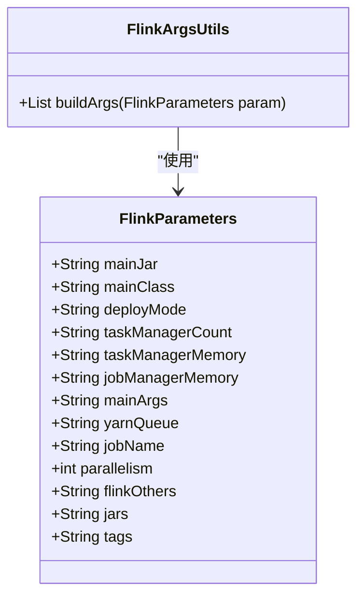
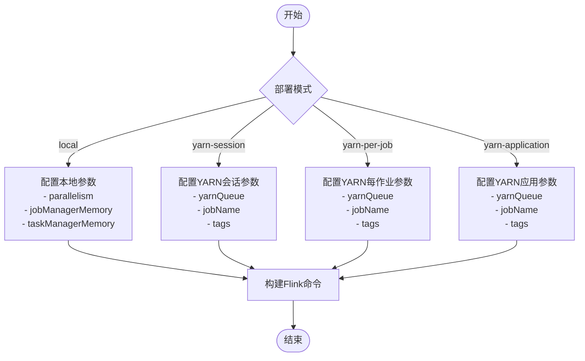
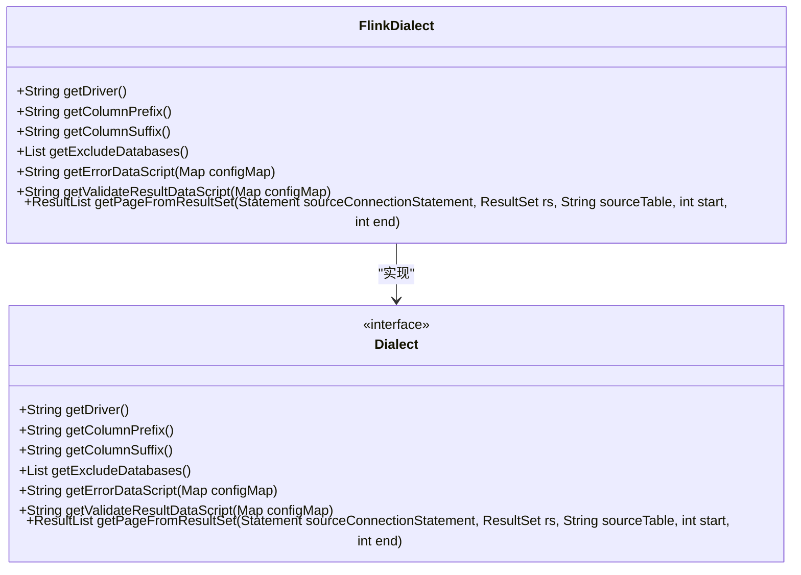
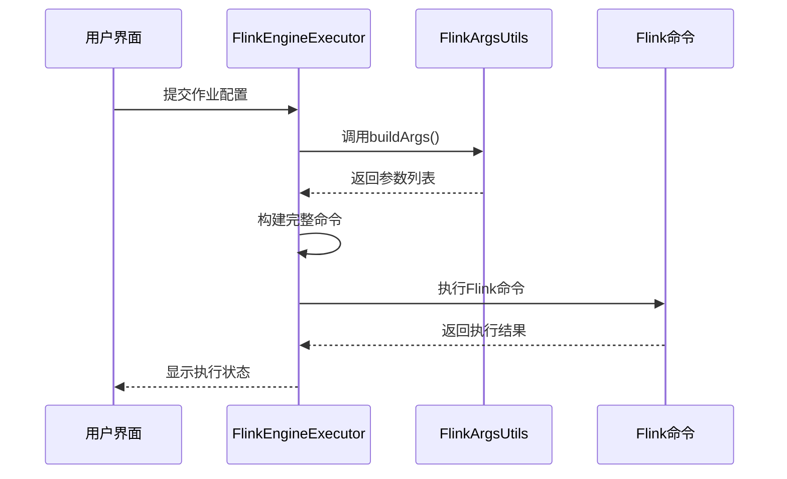

# Flink配置

<cite>
**本文档引用文件**  
- [FlinkConfiguration.tsx](file://datavines-ui\src\view\Main\Config\FlinkConfiguration.tsx)
- [FlinkArgsUtils.java](file://datavines-engine\datavines-engine-plugins\datavines-engine-flink\datavines-engine-flink-executor\src\main\java\io\datavines\engine\flink\executor\parameter\FlinkArgsUtils.java)
- [FlinkParameters.java](file://datavines-engine\datavines-engine-plugins\datavines-engine-flink\datavines-engine-flink-executor\src\main\java\io\datavines\engine\flink\executor\parameter\FlinkParameters.java)
- [FlinkConnectorFactory.java](file://datavines-connector\datavines-connector-plugins\datavines-connector-flink\src\main\java\io\datavines\connector\plugin\FlinkConnectorFactory.java)
- [FlinkDialect.java](file://datavines-connector\datavines-connector-plugins\datavines-connector-flink\src\main\java\io\datavines\connector\plugin\FlinkDialect.java)
- [SqlTransform.java](file://datavines-engine\datavines-engine-plugins\datavines-engine-flink\datavines-engine-flink-transform-sql\src\main\java\io\datavines\engine\flink\transform\sql\SqlTransform.java)
- [FlinkEngineExecutor.java](file://datavines-engine\datavines-engine-plugins\datavines-engine-flink\datavines-engine-flink-executor\src\main\java\io\datavines\engine\flink\executor\FlinkEngineExecutor.java)
- [pom.xml](file://datavines-engine\datavines-engine-plugins\datavines-engine-flink\pom.xml)
</cite>

## 目录
1. [Flink连接参数配置](#flink连接参数配置)  
2. [Flink SQL Gateway连接配置](#flink-sql-gateway连接配置)  
3. [Flink SQL方言与版本兼容性](#flink-sql方言与版本兼容性)  
4. [安全配置](#安全配置)  
5. [作业提交与性能优化](#作业提交与性能优化)  

## Flink连接参数配置

Flink连接参数配置主要包含JobManager地址、REST端口、集群名称等核心参数。在Datavines系统中，这些参数通过FlinkParameters类进行管理，支持多种部署模式的配置。

核心参数包括：
- **deployMode**: 部署模式，支持local、yarn-session、yarn-per-job、yarn-application
- **jobManagerMemory**: JobManager内存大小
- **taskManagerMemory**: TaskManager内存大小
- **parallelism**: 并行度设置
- **jobName**: 作业名称
- **yarnQueue**: YARN队列名称
- **tags**: 作业标签

在前端配置界面中，用户可以通过表单设置这些参数，系统会将配置信息传递给后端执行器。



**图源**  
- [FlinkParameters.java](file://datavines-engine\datavines-engine-plugins\datavines-engine-flink\datavines-engine-flink-executor\src\main\java\io\datavines\engine\flink\executor\parameter\FlinkParameters.java)
- [FlinkArgsUtils.java](file://datavines-engine\datavines-engine-plugins\datavines-engine-flink\datavines-engine-flink-executor\src\main\java\io\datavines\engine\flink\executor\parameter\FlinkArgsUtils.java)

**节源**  
- [FlinkParameters.java](file://datavines-engine\datavines-engine-plugins\datavines-engine-flink\datavines-engine-flink-executor\src\main\java\io\datavines\engine\flink\executor\parameter\FlinkParameters.java)
- [FlinkArgsUtils.java](file://datavines-engine\datavines-engine-plugins\datavines-engine-flink\datavines-engine-flink-executor\src\main\java\io\datavines\engine\flink\executor\parameter\FlinkArgsUtils.java)

## Flink SQL Gateway连接配置

Flink SQL Gateway连接配置支持Standalone、YARN、Kubernetes等多种部署模式。不同模式的配置方式有所不同，主要通过命令行参数和系统属性进行配置。

### 部署模式配置

#### Standalone模式
Standalone模式是最简单的部署方式，直接在本地运行Flink作业。配置参数相对简单，主要设置并行度和内存参数。

#### YARN模式
YARN模式支持三种子模式：
- **yarn-session**: YARN会话模式，预先启动YARN集群，然后提交作业
- **yarn-per-job**: 每个作业独立运行在YARN上
- **yarn-application**: 应用程序模式，整个Flink应用作为一个YARN应用运行

YARN模式的配置需要额外设置以下参数：
- yarnQueue: YARN队列名称
- jobName: 作业名称
- tags: 作业标签



**图源**  
- [FlinkArgsUtils.java](file://datavines-engine\datavines-engine-plugins\datavines-engine-flink\datavines-engine-flink-executor\src\main\java\io\datavines\engine\flink\executor\parameter\FlinkArgsUtils.java)
- [FlinkEngineExecutor.java](file://datavines-engine\datavines-engine-plugins\datavines-engine-flink\datavines-engine-flink-executor\src\main\java\io\datavines\engine\flink\executor\FlinkEngineExecutor.java)

**节源**  
- [FlinkArgsUtils.java](file://datavines-engine\datavines-engine-plugins\datavines-engine-flink\datavines-engine-flink-executor\src\main\java\io\datavines\engine\flink\executor\parameter\FlinkArgsUtils.java)

## Flink SQL方言与版本兼容性

Flink SQL方言配置通过FlinkDialect类实现，该类实现了Dialect接口，为Flink提供特定的SQL语法支持。

### SQL方言特性

FlinkDialect类目前实现了基本的接口方法，但具体实现为空。这表明系统可能依赖Flink内置的SQL解析器，而不是自定义方言。

主要接口方法包括：
- getDriver(): 获取JDBC驱动
- getColumnPrefix()/getColumnSuffix(): 获取列名前缀/后缀
- getExcludeDatabases(): 获取排除的数据库列表
- getErrorDataScript(): 获取错误数据脚本
- getValidateResultDataScript(): 获取验证结果数据脚本

### 版本兼容性

根据pom.xml文件中的依赖配置，当前系统使用Flink 1.16.1版本：

```xml
<properties>
    <flink.version>1.16.1</flink.version>
    <scala.binary.version>2.12</scala.binary.version>
    <scope>provided</scope>
</properties>
```

系统依赖的主要Flink组件包括：
- flink-streaming-java: 流处理核心
- flink-clients: 客户端API
- flink-table-api-java: Table API
- flink-table-planner: 表规划器
- flink-connector-jdbc: JDBC连接器



**图源**  
- [FlinkDialect.java](file://datavines-connector\datavines-connector-plugins\datavines-connector-flink\src\main\java\io\datavines\connector\plugin\FlinkDialect.java)
- [FlinkConnectorFactory.java](file://datavines-connector\datavines-connector-plugins\datavines-connector-flink\src\main\java\io\datavines\connector\plugin\FlinkConnectorFactory.java)

**节源**  
- [FlinkDialect.java](file://datavines-connector\datavines-connector-plugins\datavines-connector-flink\src\main\java\io\datavines\connector\plugin\FlinkDialect.java)
- [pom.xml](file://datavines-engine\datavines-engine-plugins\datavines-engine-flink\pom.xml)

## 安全配置

当前代码库中未发现明确的安全配置选项，如SSL加密或认证机制。系统主要通过以下方式确保安全性：

1. **密码处理**: 在JDBC连接中，密码通过ParserUtils.decode方法进行解码，表明系统可能对密码进行了某种形式的编码或加密存储。

2. **配置隔离**: 不同的连接配置被隔离在各自的配置对象中，减少了配置泄露的风险。

3. **作业隔离**: 每个作业通过唯一的标签(tags)进行标识，有助于作业的追踪和管理。

未来可以考虑添加以下安全特性：
- SSL/TLS加密连接
- Kerberos认证
- 基于角色的访问控制(RBAC)
- 敏感信息加密存储

## 作业提交与性能优化

### 作业提交流程

作业提交通过FlinkEngineExecutor类实现，主要流程如下：

1. 初始化作业执行请求
2. 构建Flink命令行参数
3. 执行Flink命令
4. 处理执行结果



**图源**  
- [FlinkEngineExecutor.java](file://datavines-engine\datavines-engine-plugins\datavines-engine-flink\datavines-engine-flink-executor\src\main\java\io\datavines\engine\flink\executor\FlinkEngineExecutor.java)
- [FlinkArgsUtils.java](file://datavines-engine\datavines-engine-plugins\datavines-engine-flink\datavines-engine-flink-executor\src\main\java\io\datavines\engine\flink\executor\parameter\FlinkArgsUtils.java)

**节源**  
- [FlinkEngineExecutor.java](file://datavines-engine\datavines-engine-plugins\datavines-engine-flink\datavines-engine-flink-executor\src\main\java\io\datavines\engine\flink\executor\FlinkEngineExecutor.java)

### 性能优化建议

1. **合理设置并行度**: 根据数据量和集群资源合理设置parallelism参数，避免资源浪费或性能瓶颈。

2. **内存配置优化**: 
   - JobManager内存: 通常设置为1-2GB，除非有大量作业提交
   - TaskManager内存: 根据任务复杂度和数据量调整，建议从2GB开始逐步调整

3. **YARN资源管理**:
   - 合理分配YARN队列资源
   - 设置适当的application.name便于监控和管理
   - 使用tags进行作业分类和追踪

4. **JAR包管理**:
   - 将依赖JAR包集中管理
   - 避免重复加载相同的JAR包

5. **SQL优化**:
   - 使用SqlTransform类进行SQL转换时，确保SQL语句经过优化
   - 避免在SQL中使用复杂的嵌套查询

6. **监控与调优**:
   - 启用Flink的监控功能
   - 定期检查作业执行日志
   - 根据执行情况调整配置参数

通过合理配置这些参数和遵循优化建议，可以显著提升Flink作业的执行效率和稳定性。

**节源**  
- [FlinkEngineExecutor.java](file://datavines-engine\datavines-engine-plugins\datavines-engine-flink\datavines-engine-flink-executor\src\main\java\io\datavines\engine\flink\executor\FlinkEngineExecutor.java)
- [SqlTransform.java](file://datavines-engine\datavines-engine-plugins\datavines-engine-flink\datavines-engine-flink-transform-sql\src\main\java\io\datavines\engine\flink\transform\sql\SqlTransform.java)