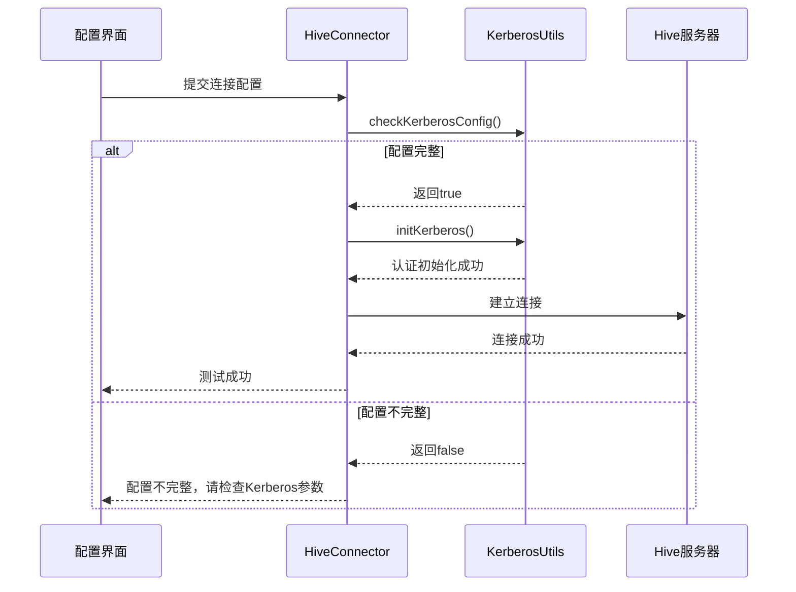
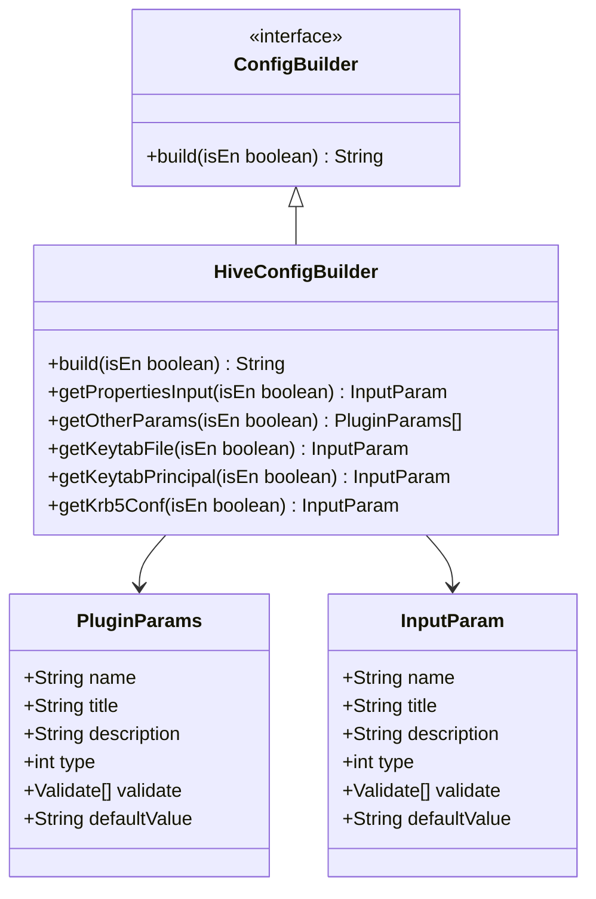
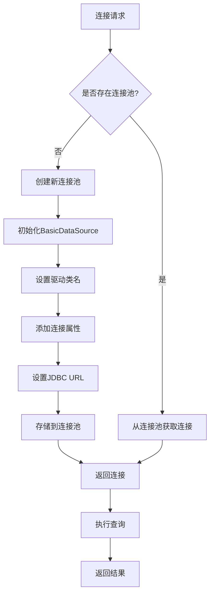
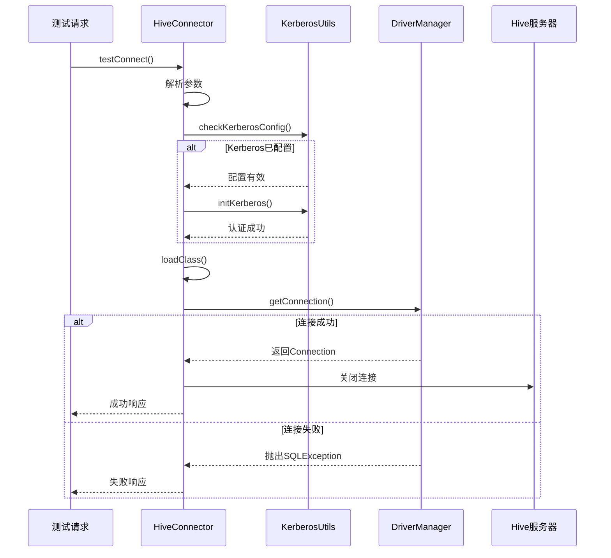

# Hive配置

<cite>
**本文档引用文件**   
- [HiveDataSourceInfo.java](file://datavines-connector\datavines-connector-plugins\datavines-connector-hive\src\main\java\io\datavines\connector\plugin\HiveDataSourceInfo.java)
- [HiveParameterConverter.java](file://datavines-connector\datavines-connector-plugins\datavines-connector-hive\src\main\java\io\datavines\connector\plugin\HiveParameterConverter.java)
- [KerberosUtils.java](file://datavines-connector\datavines-connector-plugins\datavines-connector-hive\src\main\java\io\datavines\connector\plugin\KerberosUtils.java)
- [HiveConfigBuilder.java](file://datavines-connector\datavines-connector-plugins\datavines-connector-hive\src\main\java\io\datavines\connector\plugin\HiveConfigBuilder.java)
- [HiveConnector.java](file://datavines-connector\datavines-connector-plugins\datavines-connector-hive\src\main\java\io\datavines\connector\plugin\HiveConnector.java)
- [BaseJdbcDataSourceInfo.java](file://datavines-common\src\main\java\io\datavines\common\datasource\jdbc\BaseJdbcDataSourceInfo.java)
- [ConfigConstants.java](file://datavines-common\src\main\java\io\datavines\common\ConfigConstants.java)
</cite>

## 目录
1. [Hive连接器配置](#hive连接器配置)
2. [基本连接配置](#基本连接配置)
3. [Kerberos认证配置](#kerberos认证配置)
4. [Hive Metastore连接配置](#hive-metastore连接配置)
5. [性能优化建议](#性能优化建议)
6. [连接测试方法](#连接测试方法)
7. [常见问题排查指南](#常见问题排查指南)

## Hive连接器配置

本文档详细说明Hive连接器的配置方法，包括JDBC URL、数据库名称、用户名密码等基本配置，重点描述Kerberos认证配置方法，包括keytab文件配置、principal设置等安全认证方式。同时说明Hive Metastore的连接配置，支持Thrift和HTTP模式，并提供性能优化建议和连接测试方法。

**本文档引用文件**   
- [HiveDataSourceInfo.java](file://datavines-connector\datavines-connector-plugins\datavines-connector-hive\src\main\java\io\datavines\connector\plugin\HiveDataSourceInfo.java)
- [HiveParameterConverter.java](file://datavines-connector\datavines-connector-plugins\datavines-connector-hive\src\main\java\io\datavines\connector\plugin\HiveParameterConverter.java)

## 基本连接配置

Hive连接器的基本配置包括JDBC URL、数据库名称、用户名和密码等参数。JDBC URL的格式为`jdbc:hive2://host:port/database`，其中host和port分别表示Hive服务器的主机地址和端口号，database表示要连接的数据库名称。

在配置中，需要提供以下基本参数：
- **主机地址(host)**: Hive服务器的主机地址，支持多个地址用逗号分隔
- **端口号(port)**: Hive服务器的端口号，默认为10000
- **数据库名称(database)**: 要连接的Hive数据库名称
- **用户名(user)**: 连接Hive的用户名
- **密码(password)**: 连接Hive的密码

JDBC URL的构建通过`HiveParameterConverter`类的`getUrl`方法实现，该方法根据提供的参数构建完整的JDBC连接字符串。

**本文档引用文件**   
- [HiveParameterConverter.java](file://datavines-connector\datavines-connector-plugins\datavines-connector-hive\src\main\java\io\datavines\connector\plugin\HiveParameterConverter.java#L28-L44)
- [HiveDataSourceInfo.java](file://datavines-connector\datavines-connector-plugins\datavines-connector-hive\src\main\java\io\datavines\connector\plugin\HiveDataSourceInfo.java#L31-L39)

## Kerberos认证配置

Hive连接器支持Kerberos认证，通过keytab文件和principal进行安全认证。Kerberos认证配置需要提供以下参数：

- **keytab文件路径(keytab_file)**: keytab文件的完整路径
- **principal(keytab_principal)**: 与keytab文件关联的principal名称
- **krb5.conf文件路径(krb5_conf)**: Kerberos配置文件krb5.conf的路径

Kerberos认证的实现由`KerberosUtils`类负责，该类提供了检查Kerberos配置、从keytab文件获取principal列表和初始化Kerberos认证的功能。在连接测试时，系统会先检查Kerberos配置是否完整，然后调用`initKerberos`方法进行认证初始化。

**图表来源**  
- [KerberosUtils.java](file://datavines-connector\datavines-connector-plugins\datavines-connector-hive\src\main\java\io\datavines\connector\plugin\KerberosUtils.java#L39-L77)
- [HiveConnector.java](file://datavines-connector\datavines-connector-plugins\datavines-connector-hive\src\main\java\io\datavines\connector\plugin\HiveConnector.java#L58-L60)

**本文档引用文件**   
- [KerberosUtils.java](file://datavines-connector\datavines-connector-plugins\datavines-connector-hive\src\main\java\io\datavines\connector\plugin\KerberosUtils.java)
- [HiveConnector.java](file://datavines-connector\datavines-connector-plugins\datavines-connector-hive\src\main\java\io\datavines\connector\plugin\HiveConnector.java)

## Hive Metastore连接配置

Hive Metastore的连接配置通过`HiveConfigBuilder`类实现，支持Thrift和HTTP模式。配置构建器定义了所有必要的连接参数，包括主机、端口、数据库、用户、密码以及Kerberos相关参数。

Hive Metastore连接配置的主要参数包括：
- **主机(host)**: Metastore服务的主机地址
- **端口(port)**: Metastore服务的端口，默认为9083
- **catalog**: Hive catalog名称
- **schema**: Hive schema名称
- **properties**: 额外的连接属性，如`hive.resultset.use.unique.column.names=false`

**图表来源**  
- [HiveConfigBuilder.java](file://datavines-connector\datavines-connector-plugins\datavines-connector-hive\src\main\java\io\datavines\connector\plugin\HiveConfigBuilder.java#L31-L117)

**本文档引用文件**   
- [HiveConfigBuilder.java](file://datavines-connector\datavines-connector-plugins\datavines-connector-hive\src\main\java\io\datavines\connector\plugin\HiveConfigBuilder.java)

## 性能优化建议

为了提高Hive连接器的性能，建议进行以下优化配置：

### 连接池配置
通过`BaseJdbcDataSourceInfo`类的连接管理机制，系统自动管理连接池。连接池的配置基于数据源的唯一键（unique key），该键由主机、端口、数据库、用户等参数的MD5哈希值生成。

### 查询并发度设置
在`BaseJdbcDataSourceInfo`类中，可以通过设置`properties`参数来优化查询性能。例如，可以设置`fetchSize`参数来控制每次从服务器获取的行数，减少网络传输次数。

### 其他性能优化
- **启用Spark Hive支持**: 通过设置`enable_spark_hive_support`参数为true，可以在Spark环境中更好地支持Hive操作
- **连接属性优化**: 在`properties`字段中配置适当的连接属性，如`hive.resultset.use.unique.column.names=false`，可以提高查询性能

**图表来源**  
- [BaseJdbcDataSourceInfo.java](file://datavines-common\src\main\java\io\datavines\common\datasource\jdbc\BaseJdbcDataSourceInfo.java#L96-L103)
- [TrinoDataSourceClient.java](file://datavines-connector\datavines-connector-plugins\datavines-connector-trino\src\main\java\io\datavines\connector\plugin\TrinoDataSourceClient.java#L94-L123)

**本文档引用文件**   
- [BaseJdbcDataSourceInfo.java](file://datavines-common\src\main\java\io\datavines\common\datasource\jdbc\BaseJdbcDataSourceInfo.java)
- [ConfigConstants.java](file://datavines-common\src\main\java\io\datavines\common\ConfigConstants.java)

## 连接测试方法

Hive连接器提供了连接测试功能，通过`HiveConnector`类的`testConnect`方法实现。连接测试的流程如下：

1. 解析连接参数
2. 检查Kerberos配置（如果启用）
3. 初始化Kerberos认证（如果配置完整）
4. 加载JDBC驱动类
5. 建立数据库连接
6. 关闭连接并返回测试结果

连接测试方法会返回一个`ConnectorResponse`对象，包含测试状态和结果。测试成功时返回成功状态和true结果，测试失败时返回失败状态和false结果。

**图表来源**  
- [HiveConnector.java](file://datavines-connector\datavines-connector-plugins\datavines-connector-hive\src\main\java\io\datavines\connector\plugin\HiveConnector.java#L55-L72)
- [BaseJdbcDataSourceInfo.java](file://datavines-common\src\main\java\io\datavines\common\datasource\jdbc\BaseJdbcDataSourceInfo.java#L149-L152)

**本文档引用文件**   
- [HiveConnector.java](file://datavines-connector\datavines-connector-plugins\datavines-connector-hive\src\main\java\io\datavines\connector\plugin\HiveConnector.java)
- [BaseJdbcDataSourceInfo.java](file://datavines-common\src\main\java\io\datavines\common\datasource\jdbc\BaseJdbcDataSourceInfo.java)

## 常见问题排查指南

### Kerberos认证失败
**问题现象**: 连接测试时提示Kerberos认证失败
**可能原因**:
- keytab文件路径不正确
- principal名称与keytab文件不匹配
- krb5.conf文件路径错误
- Kerberos服务不可用

**解决方案**:
1. 检查keytab文件路径是否正确，文件是否存在
2. 确认principal名称是否与keytab文件中的principal匹配
3. 验证krb5.conf文件路径和内容是否正确
4. 使用`klist`命令检查Kerberos票据是否正常获取

### 连接超时
**问题现象**: 连接Hive服务器超时
**可能原因**:
- 网络不通或防火墙阻止
- Hive服务器未启动或端口不正确
- 服务器负载过高

**解决方案**:
1. 检查网络连接是否正常，使用ping命令测试
2. 确认Hive服务器是否正常运行，端口是否正确
3. 检查服务器资源使用情况，确保有足够的资源

### 权限不足
**问题现象**: 连接成功但无法访问数据库或表
**可能原因**:
- 用户没有足够的权限
- 数据库或表不存在
- Hive配置限制了访问

**解决方案**:
1. 确认用户是否有访问指定数据库和表的权限
2. 检查数据库和表名称是否正确
3. 查看Hive的授权配置，确保用户有相应权限

### 驱动类加载失败
**问题现象**: 提示无法加载Hive JDBC驱动类
**可能原因**:
- hive-jdbc依赖未正确引入
- 驱动类名错误
- 类路径问题

**解决方案**:
1. 确认pom.xml中已正确引入hive-jdbc依赖
2. 检查驱动类名是否为`org.apache.hive.jdbc.HiveDriver`
3. 确保类路径配置正确

**本文档引用文件**   
- [HiveConnector.java](file://datavines-connector\datavines-connector-plugins\datavines-connector-hive\src\main\java\io\datavines\connector\plugin\HiveConnector.java)
- [KerberosUtils.java](file://datavines-connector\datavines-connector-plugins\datavines-connector-hive\src\main\java\io\datavines\connector\plugin\KerberosUtils.java)
- [BaseJdbcDataSourceInfo.java](file://datavines-common\src\main\java\io\datavines\common\datasource\jdbc\BaseJdbcDataSourceInfo.java)