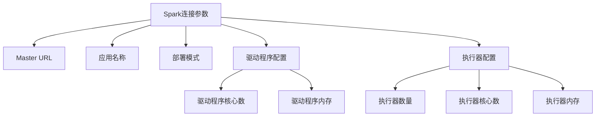
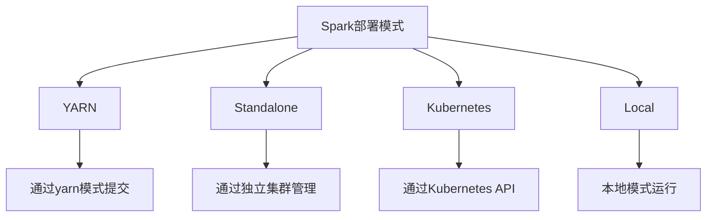
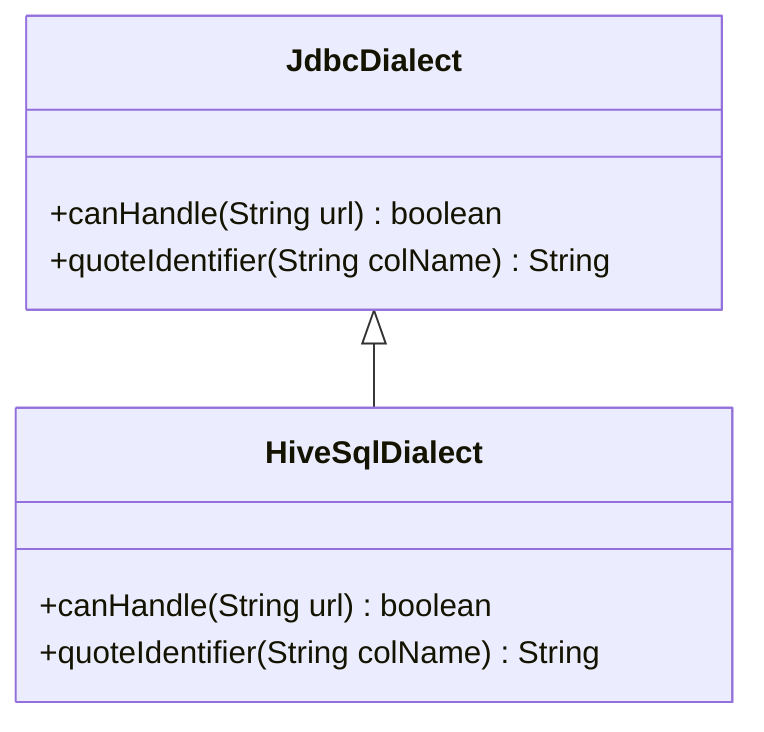
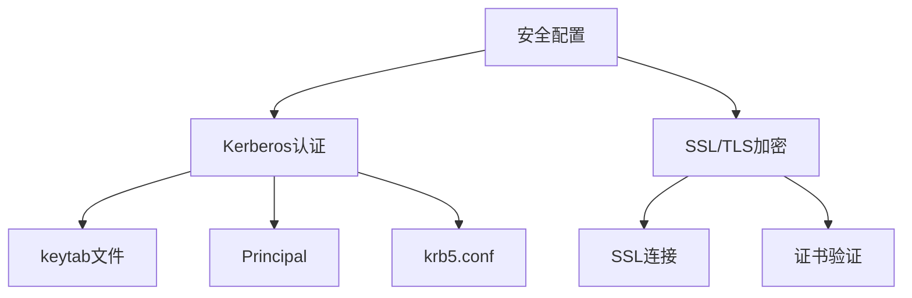
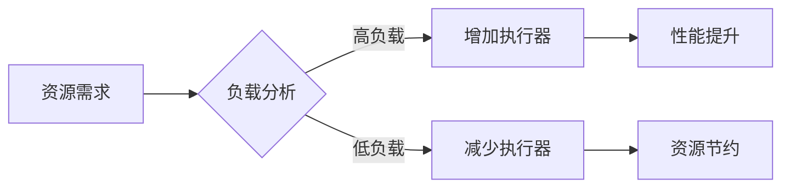

# Spark配置

<cite>
**本文档引用的文件**
- [SparkEngineParameter.java](file://datavines-common/src/main/java/io/datavines/common/entity/SparkEngineParameter.java)
- [SparkConstants.java](file://datavines-engine/datavines-engine-plugins/datavines-engine-spark/datavines-engine-spark-executor/src/main/java/io/datavines/engine/spark/executor/parameter/SparkConstants.java)
- [SparkArgsUtils.java](file://datavines-engine/datavines-engine-plugins/datavines-engine-spark/datavines-engine-spark-executor/src/main/java/io/datavines/engine/spark/executor/parameter/SparkArgsUtils.java)
- [SparkParameters.java](file://datavines-engine/datavines-engine-plugins/datavines-engine-spark/datavines-engine-spark-executor/src/main/java/io/datavines/engine/spark/executor/parameter/SparkParameters.java)
- [HiveConfigBuilder.java](file://datavines-connector/datavines-connector-plugins/datavines-connector-hive/src/main/java/io/datavines/connector/plugin/HiveConfigBuilder.java)
- [KerberosUtils.java](file://datavines-connector/datavines-connector-plugins/datavines-connector-hive/src/main/java/io/datavines/connector/plugin/KerberosUtils.java)
- [SparkRuntimeEnvironment.java](file://datavines-engine/datavines-engine-plugins/datavines-engine-spark/datavines-engine-spark-api/src/main/java/io/datavines/engine/spark/api/SparkRuntimeEnvironment.java)
- [HiveSqlDialect.java](file://datavines-engine/datavines-engine-plugins/datavines-engine-spark/datavines-engine-spark-api/src/main/java/io/datavines/engine/spark/api/dialect/HiveSqlDialect.java)
- [LivyTaskSubmitHelper.java](file://datavines-engine/datavines-engine-executor/src/main/java/io/datavines/engine/executor/core/helper/LivyTaskSubmitHelper.java)
</cite>

## 目录
1. [Spark连接参数配置](#spark连接参数配置)
2. [Spark Thrift Server连接配置](#spark-thrift-server连接配置)
3. [Spark SQL方言配置](#spark-sql方言配置)
4. [Spark安全配置](#spark安全配置)
5. [Spark性能调优建议](#spark性能调优建议)

## Spark连接参数配置

Spark连接参数配置是确保Spark应用程序正确运行的关键。在Datavines系统中，Spark连接参数主要通过`SparkEngineParameter`类进行定义和管理。核心参数包括Master URL、应用名称、执行器内存等。

### 核心连接参数

Spark连接的核心参数通过`SparkConstants`类中的常量定义，这些参数在启动Spark应用程序时作为命令行参数传递：



**参数说明：**

- **Master URL**: 通过`--master`参数指定，定义Spark集群的主节点地址。支持多种部署模式，包括`yarn`、`local`等。
- **应用名称**: 通过`--name`参数指定，为Spark应用程序设置名称，便于在集群管理界面中识别。
- **部署模式**: 通过`--deploy-mode`参数指定，可选值为`cluster`或`client`，决定驱动程序在集群内部还是外部运行。
- **驱动程序配置**: 包括`--driver-cores`（驱动程序核心数）和`--driver-memory`（驱动程序内存），用于配置驱动程序的计算资源。
- **执行器配置**: 包括`--num-executors`（执行器数量）、`--executor-cores`（每个执行器的核心数）和`--executor-memory`（每个执行器的内存），用于配置执行器的资源分配。

这些参数在`SparkArgsUtils.buildArgs()`方法中被组装成命令行参数列表，确保所有配置项正确传递给Spark-submit命令。

**参数配置示例：**
```java
SparkParameters param = new SparkParameters();
param.setMaster("yarn");
param.setAppName("MySparkApp");
param.setDeployMode("cluster");
param.setNumExecutors(4);
param.setExecutorCores(2);
param.setExecutorMemory("4g");
param.setDriverMemory("2g");
```

**Spark连接参数配置**
- [SparkEngineParameter.java](file://datavines-common/src/main/java/io/datavines/common/entity/SparkEngineParameter.java#L26-L68)
- [SparkConstants.java](file://datavines-engine/datavines-engine-plugins/datavines-engine-spark/datavines-engine-spark-executor/src/main/java/io/datavines/engine/spark/executor/parameter/SparkConstants.java#L28-L75)
- [SparkArgsUtils.java](file://datavines-engine/datavines-engine-plugins/datavines-engine-spark/datavines-engine-spark-executor/src/main/java/io/datavines/engine/spark/executor/parameter/SparkArgsUtils.java#L43-L128)

## Spark Thrift Server连接配置

Spark Thrift Server连接配置支持YARN、Standalone、Kubernetes等多种部署模式。在Datavines系统中，通过统一的参数配置机制实现不同部署模式的适配。

### 部署模式配置

Spark支持多种部署模式，每种模式都有其特定的配置要求：



在`SparkArgsUtils`类中，通过常量定义了不同部署模式的标识：

- `SPARK_CLUSTER = "cluster"`: 集群模式
- `SPARK_LOCAL = "local"`: 本地模式  
- `SPARK_ON_YARN = "yarn"`: YARN模式

当部署模式不为`local`时，系统会自动添加`yarn`作为Master URL，并配置相应的部署模式参数。

### YARN模式配置

YARN模式是企业环境中最常用的部署模式。在YARN模式下，需要配置队列信息以确保应用程序提交到正确的资源队列：

```java
if (!SPARK_LOCAL.equals(deployMode) && (StringUtils.isEmpty(others) || !others.contains(SparkConstants.SPARK_QUEUE))) {
    String queue = param.getQueue();
    if (StringUtils.isNotEmpty(queue)) {
        args.add(SparkConstants.SPARK_QUEUE);
        args.add(queue);
    }
}
```

此配置确保在非本地模式下，如果未通过其他参数指定队列，则使用`--queue`参数指定的队列名称。

### 资源调度平台

系统通过`ResourceSchedulePlatformType`枚举定义了不同的资源调度平台类型，支持灵活的平台适配。在YARN环境下，系统会读取`yarn.uri`配置项来确定ResourceManager的地址。

**Spark Thrift Server连接配置**
- [SparkArgsUtils.java](file://datavines-engine/datavines-engine-plugins/datavines-engine-spark/datavines-engine-spark-executor/src/main/java/io/datavines/engine/spark/executor/parameter/SparkArgsUtils.java#L27-L31)
- [SparkConstants.java](file://datavines-engine/datavines-engine-plugins/datavines-engine-spark/datavines-engine-spark-executor/src/main/java/io/datavines/engine/spark/executor/parameter/SparkConstants.java#L38-L38)
- [YarnUtils.java](file://datavines-common/src/main/java/io/datavines/common/utils/YarnUtils.java#L37-L47)

## Spark SQL方言配置

Spark SQL方言配置主要用于处理不同数据源的SQL语法差异，确保SQL语句的正确解析和执行。在Datavines系统中，针对Hive数据源实现了专门的SQL方言支持。

### Hive SQL方言实现

系统通过`HiveSqlDialect`类实现了Hive特有的SQL方言处理：



**HiveSqlDialect的主要功能：**

1. **URL匹配**: `canHandle()`方法检查JDBC URL是否以`jdbc:hive2`开头，确保只处理Hive连接。
2. **标识符引用**: `quoteIdentifier()`方法处理列名的引用，特别处理包含点号的列名（如`table.column`），提取实际的列名部分并用反引号包围。

在`SparkRuntimeEnvironment.prepare()`方法中，系统会注册Hive SQL方言：

```java
JdbcDialects.registerDialect(new HiveSqlDialect());
```

这确保了Spark SQL引擎能够正确处理Hive特有的语法和标识符引用规则。

### Spark Hive支持配置

系统支持通过配置项启用Spark对Hive的支持。在`HiveConfigBuilder`中，提供了`enable_spark_hive_support`配置参数：

```java
InputParam enableSparkHiveSupport = getInputParam("enable_spark_hive_support",
        "spark.enable.hive.support",
        isEn ? "please enter true or false" : "请填入 true 或者 false", 2, null,
        "true");
```

此配置项默认值为`true`，可以在创建Hive连接时根据需要启用或禁用Spark Hive支持。

**Spark SQL方言配置**
- [HiveSqlDialect.java](file://datavines-engine/datavines-engine-plugins/datavines-engine-spark/datavines-engine-spark-api/src/main/java/io/datavines/engine/spark/api/dialect/HiveSqlDialect.java#L23-L38)
- [SparkRuntimeEnvironment.java](file://datavines-engine/datavines-engine-plugins/datavines-engine-spark/datavines-engine-spark-api/src/main/java/io/datavines/engine/spark/api/SparkRuntimeEnvironment.java#L68-L71)
- [HiveConfigBuilder.java](file://datavines-connector/datavines-connector-plugins/datavines-connector-hive/src/main/java/io/datavines/connector/plugin/HiveConfigBuilder.java#L84-L87)

## Spark安全配置

Spark安全配置包括SSL/TLS加密和Kerberos认证等选项，确保数据传输和访问的安全性。在Datavines系统中，针对企业级安全需求提供了完整的安全配置支持。

### Kerberos认证配置

系统通过`KerberosUtils`类和`HiveConfigBuilder`实现了Kerberos认证支持：



**Kerberos配置参数：**

- **keytab文件**: 通过`keytab_file`参数指定keytab文件路径
- **Principal**: 通过`keytab_principal`参数指定主体名称  
- **krb5.conf**: 通过`krb5_conf`参数指定Kerberos配置文件路径

在`HiveConfigBuilder`中，这些参数被作为连接配置的一部分：

```java
params.add(getKeytabFile(isEn));
params.add(getKeytabPrincipal(isEn));
params.add(getKrb5Conf(isEn));
```

在`LivyTaskSubmitHelper`中，系统根据配置决定是否使用Kerberos认证：

```java
if (needKerberos.equalsIgnoreCase("false")) {
    // 无需Kerberos认证
    result = restTemplate.postForObject(uri, springEntity, String.class);
} else {
    // 需要Kerberos认证
    String userPrincipal = configurations.getString("livy.server.auth.kerberos.principal");
    String keyTabLocation = configurations.getString("livy.server.auth.kerberos.keytab");
    KerberosRestTemplate restTemplate = new KerberosRestTemplate(keyTabLocation, userPrincipal);
    result = restTemplate.getForObject(uri, String.class);
}
```

### 安全配置验证

在`HiveConnector`中，系统会验证Kerberos配置的完整性：

```java
if(KerberosUtils.checkKerberosConfig(dataSourceInfo.getKeytabPrincipal(), 
    dataSourceInfo.getKeytabFile(), dataSourceInfo.getKrb5ConfFile())){
    // Kerberos配置有效
}
```

这种分层的安全配置机制确保了在不同安全需求下的灵活适配，同时保持了配置的一致性和可管理性。

**Spark安全配置**
- [KerberosUtils.java](file://datavines-connector/datavines-connector-plugins/datavines-connector-hive/src/main/java/io/datavines/connector/plugin/KerberosUtils.java#L35-L35)
- [HiveConfigBuilder.java](file://datavines-connector/datavines-connector-plugins/datavines-connector-hive/src/main/java/io/datavines/connector/plugin/HiveConfigBuilder.java#L93-L114)
- [LivyTaskSubmitHelper.java](file://datavines-engine/datavines-engine-executor/src/main/java/io/datavines/engine/executor/core/helper/LivyTaskSubmitHelper.java#L127-L190)
- [HiveConnector.java](file://datavines-connector/datavines-connector-plugins/datavines-connector-hive/src/main/java/io/datavines/connector/plugin/HiveConnector.java#L58-L58)

## Spark性能调优建议

Spark性能调优是确保大数据处理任务高效运行的关键。在Datavines系统中，通过合理的资源配置和参数优化，可以显著提升Spark应用程序的性能。

### 动态资源分配

系统支持通过配置参数实现动态资源分配，根据工作负载自动调整执行器数量：



通过`num-executors`、`executor-cores`和`executor-memory`参数的合理配置，可以实现资源的最优分配：

```java
int numExecutors = param.getNumExecutors();
if (numExecutors > 0) {
    args.add(SparkConstants.NUM_EXECUTORS);
    args.add(String.format("%d", numExecutors));
}
```

### 并行度优化

并行度优化主要通过调整执行器核心数和数量来实现：

- **执行器核心数**: 通过`executor-cores`参数配置，建议设置为2-4个核心，避免过多的核心导致GC开销增加
- **执行器内存**: 通过`executor-memory`参数配置，建议每个执行器内存不超过32GB，以避免长时间的垃圾回收停顿
- **驱动程序内存**: 通过`driver-memory`参数配置，确保驱动程序有足够的内存处理元数据和结果收集

### 配置最佳实践

根据Spark官方推荐的配置最佳实践：

1. **内存分配**: 执行器内存的75%用于执行，25%用于存储
2. **核心利用率**: 每个执行器的核心数不应超过5个，以保持良好的并行度和资源利用率
3. **数据本地性**: 通过合理的分区策略和数据布局，最大化数据本地性，减少网络传输开销

在`SparkRuntimeEnvironment`中，系统还设置了关键的Spark配置：

```java
conf.set("spark.sql.crossJoin.enabled","true");
```

此配置允许执行笛卡尔积操作，在某些分析场景下可能需要，但应谨慎使用以避免性能问题。

**Spark性能调优建议**
- [SparkParameters.java](file://datavines-engine/datavines-engine-plugins/datavines-engine-spark/datavines-engine-spark-executor/src/main/java/io/datavines/engine/spark/executor/parameter/SparkParameters.java#L55-L65)
- [SparkArgsUtils.java](file://datavines-engine/datavines-engine-plugins/datavines-engine-spark/datavines-engine-spark-executor/src/main/java/io/datavines/engine/spark/executor/parameter/SparkArgsUtils.java#L73-L88)
- [SparkRuntimeEnvironment.java](file://datavines-engine/datavines-engine-plugins/datavines-engine-spark/datavines-engine-spark-api/src/main/java/io/datavines/engine/spark/api/SparkRuntimeEnvironment.java#L84-L84)