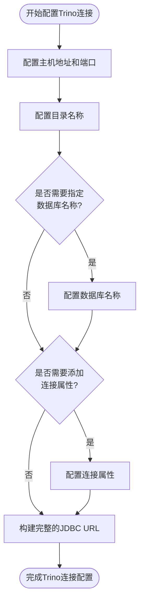
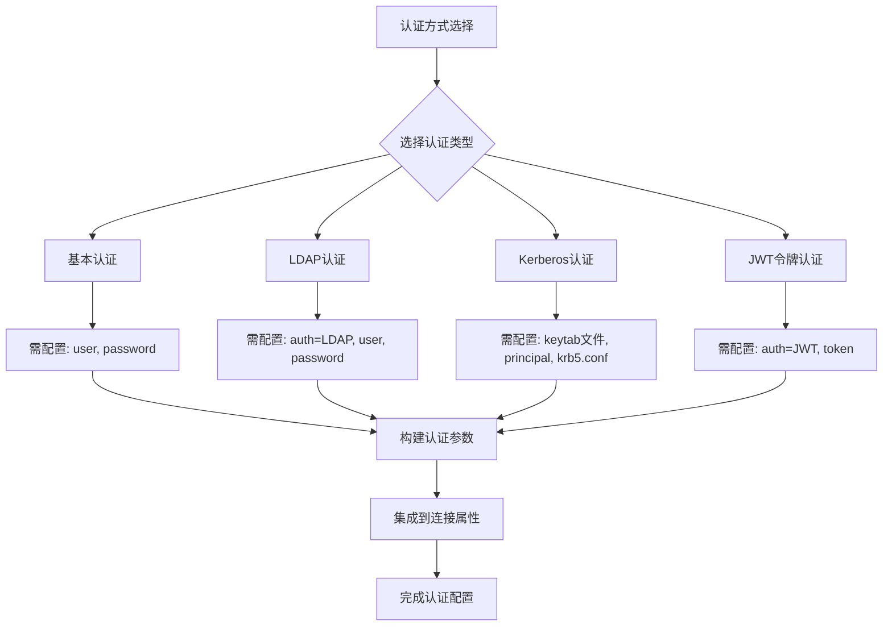
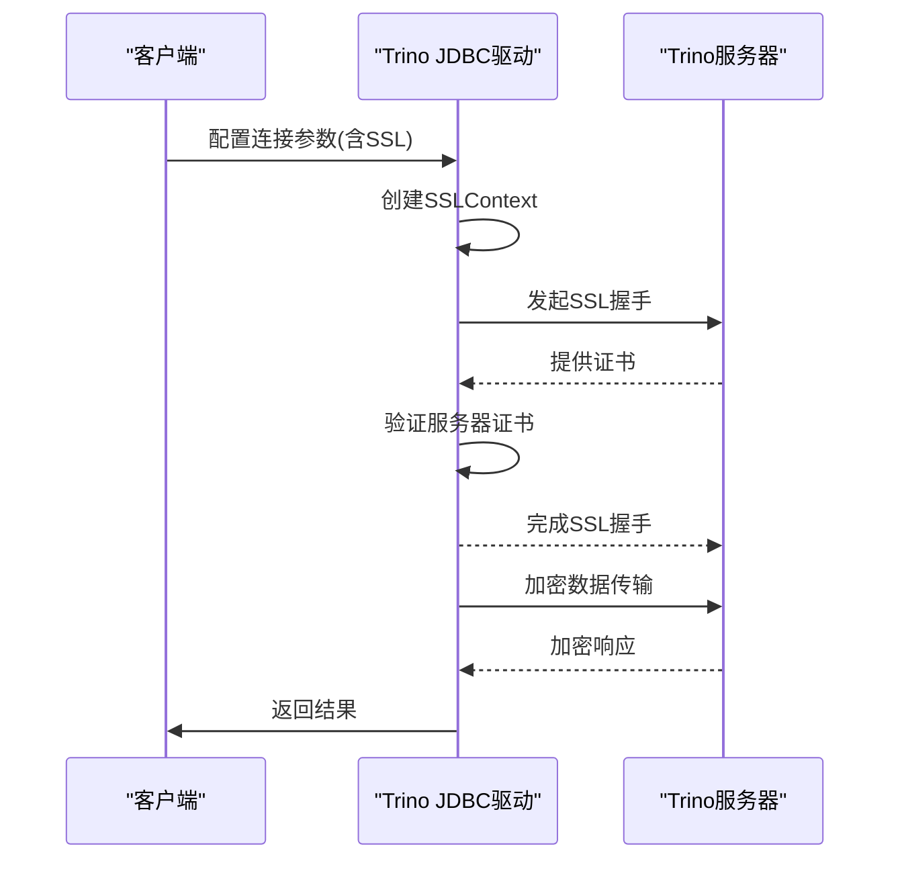
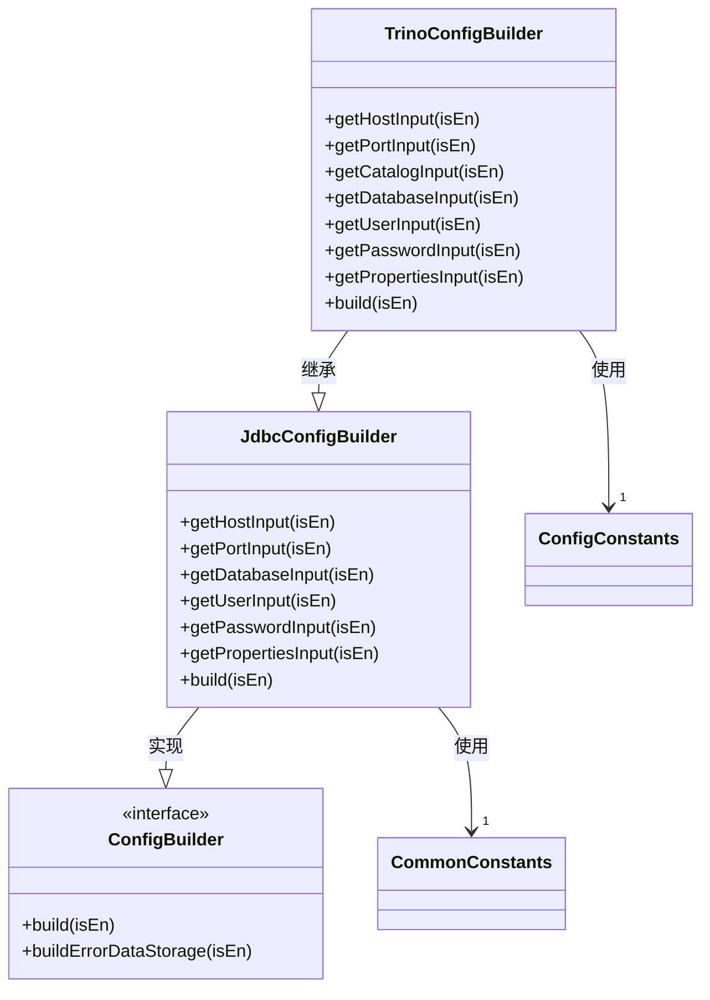
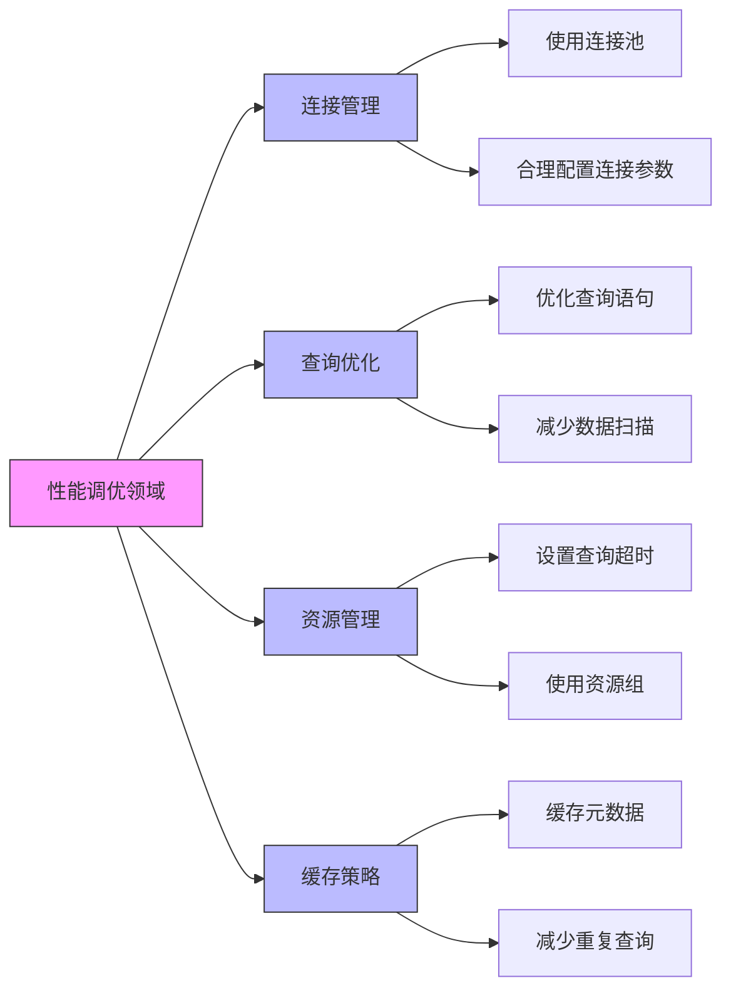
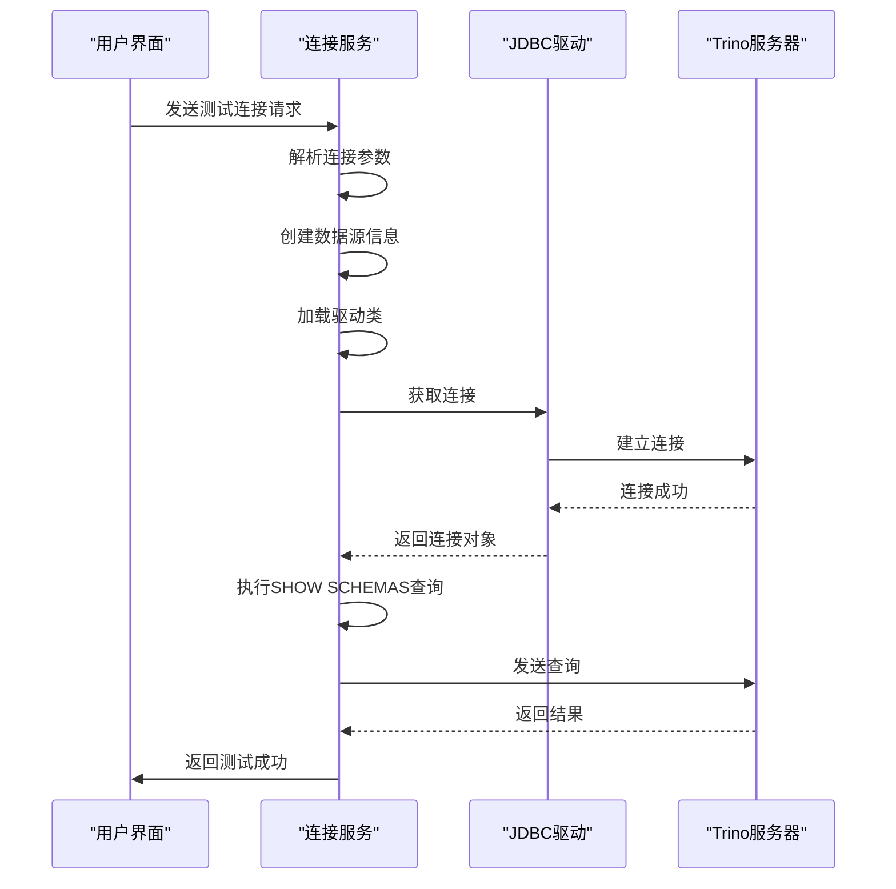

# Trino配置

<cite>
**本文档引用的文件**   
- [TrinoDataSourceInfo.java](file://datavines-connector\datavines-connector-plugins\datavines-connector-trino\src\main\java\io\datavines\connector\plugin\TrinoDataSourceInfo.java)
- [TrinoConfigBuilder.java](file://datavines-connector\datavines-connector-plugins\datavines-connector-trino\src\main\java\io\datavines\connector\plugin\TrinoConfigBuilder.java)
- [TrinoParameterConverter.java](file://datavines-connector\datavines-connector-plugins\datavines-connector-trino\src\main\java\io\datavines\connector\plugin\TrinoParameterConverter.java)
- [TrinoConnector.java](file://datavines-connector\datavines-connector-plugins\datavines-connector-trino\src\main\java\io\datavines\connector\plugin\TrinoConnector.java)
- [BaseJdbcDataSourceInfo.java](file://datavines-common\src\main\java\io\datavines\common\datasource\jdbc\BaseJdbcDataSourceInfo.java)
- [ConfigConstants.java](file://datavines-common\src\main\java\io\datavines\common\ConfigConstants.java)
- [JdbcConfigBuilder.java](file://datavines-connector\datavines-connector-plugins\datavines-connector-jdbc\src\main\java\io\datavines\connector\plugin\JdbcConfigBuilder.java)
</cite>

## 目录
1. [Trino连接参数配置](#trino连接参数配置)
2. [Trino认证配置](#trino认证配置)
3. [SSL/TLS加密连接配置](#ssltls加密连接配置)
4. [Trino高级配置选项](#trino高级配置选项)
5. [Trino性能调优建议](#trino性能调优建议)
6. [连接测试方法](#连接测试方法)

## Trino连接参数配置

Trino连接器的配置主要包括Coordinator地址、端口、目录名称、模式名称等核心参数。这些参数通过JDBC URL格式进行配置，确保能够正确连接到Trino集群。

Trino连接器使用标准的JDBC连接方式，其基本连接格式为：`jdbc:trino://host:port`。在此基础上，可以添加目录（catalog）和数据库（database）等信息以实现更精确的连接。

核心连接参数包括：
- **主机地址（host）**：Trino Coordinator节点的IP地址或主机名
- **端口（port）**：Trino服务监听的端口号，默认为8080
- **目录名称（catalog）**：指定要连接的数据源目录，如hive、mysql等
- **数据库名称（database）**：指定要连接的具体数据库
- **用户名（user）**：用于身份验证的用户名
- **密码（password）**：与用户名对应的密码

当配置数据库名称时，JDBC URL将包含完整的路径信息，格式为`jdbc:trino://host:port/catalog/database`；若不指定数据库，则格式为`jdbc:trino://host:port/catalog`。

**图源**
- [TrinoDataSourceInfo.java](file://datavines-connector\datavines-connector-plugins\datavines-connector-trino\src\main\java\io\datavines\connector\plugin\TrinoDataSourceInfo.java#L30-L46)
- [TrinoParameterConverter.java](file://datavines-connector\datavines-connector-plugins\datavines-connector-trino\src\main\java\io\datavines\connector\plugin\TrinoParameterConverter.java#L31-L47)

**本节来源**
- [TrinoDataSourceInfo.java](file://datavines-connector\datavines-connector-plugins\datavines-connector-trino\src\main\java\io\datavines\connector\plugin\TrinoDataSourceInfo.java#L30-L46)
- [TrinoParameterConverter.java](file://datavines-connector\datavines-connector-plugins\datavines-connector-trino\src\main\java\io\datavines\connector\plugin\TrinoParameterConverter.java#L31-L47)

## Trino认证配置

Trino支持多种认证方式，包括基本认证、LDAP、Kerberos和JWT令牌等。在Datavines系统中，主要通过配置相应的参数来实现不同类型的认证。

### 基本身份认证
基本身份认证是最简单的认证方式，通过用户名和密码进行验证。在配置中需要提供`user`和`password`参数。

### LDAP认证
LDAP认证允许使用LDAP服务器进行用户身份验证。要启用LDAP认证，需要在连接属性中添加相应的LDAP配置参数，如`auth=LDAP`，并确保服务器端已正确配置LDAP服务。

### Kerberos认证
对于需要更高安全级别的环境，可以使用Kerberos认证。虽然在当前代码库中没有直接针对Trino的Kerberos实现，但系统支持通过keytab文件、principal和krb5.conf配置来实现Kerberos认证，这在其他连接器（如Hive）中有示例。

### JWT令牌认证
JWT（JSON Web Token）令牌认证提供了一种无状态的身份验证机制。可以通过在连接属性中添加`auth=JWT`并提供相应的令牌来实现。

认证配置的关键在于正确设置连接属性（properties），这些属性会作为查询参数附加到JDBC URL后面。例如：`jdbc:trino://host:port/catalog?auth=LDAP&user=username`。

**图源**
- [TrinoConnector.java](file://datavines-connector\datavines-connector-plugins\datavines-connector-trino\src\main\java\io\datavines\connector\plugin\TrinoConnector.java#L63-L77)
- [ConfigConstants.java](file://datavines-common\src\main\java\io\datavines\common\ConfigConstants.java#L91-L92)

**本节来源**
- [TrinoConnector.java](file://datavines-connector\datavines-connector-plugins\datavines-connector-trino\src\main\java\io\datavines\connector\plugin\TrinoConnector.java#L63-L77)
- [ConfigConstants.java](file://datavines-common\src\main\java\io\datavines\common\ConfigConstants.java#L91-L92)

## SSL/TLS加密连接配置

为了确保数据传输的安全性，Trino支持通过SSL/TLS加密连接。在Datavines系统中，可以通过配置连接属性来启用SSL/TLS加密。

SSL/TLS配置主要通过在连接属性（properties）中添加相应的参数来实现。常见的配置参数包括：
- `SSL=true`：启用SSL连接
- `SSLVerification=FULL`：启用完整的证书验证
- 其他SSL相关参数可根据具体需求添加

在系统架构中，HTTP客户端已经集成了SSL支持，使用`SSLConnectionSocketFactory`和`SSLContext`来处理安全连接。虽然这是针对HTTP通信的，但体现了系统对安全连接的支持能力。

Trino JDBC驱动会自动处理SSL连接的建立，只需要在连接字符串中正确配置SSL参数即可。证书管理通常由JVM的信任库（truststore）和密钥库（keystore）负责，可以在JVM启动参数中指定相应的证书文件。

**图源**
- [HttpUtils.java](file://datavines-common\src\main\java\io\datavines\common\utils\HttpUtils.java#L79-L107)
- [TrinoParameterConverter.java](file://datavines-connector\datavines-connector-plugins\datavines-connector-trino\src\main\java\io\datavines\connector\plugin\TrinoParameterConverter.java#L44-L47)

**本节来源**
- [HttpUtils.java](file://datavines-common\src\main\java\io\datavines\common\utils\HttpUtils.java#L79-L107)

## Trino高级配置选项

Trino连接器提供了多种高级配置选项，以满足不同的使用场景和性能需求。这些选项主要通过连接属性（properties）进行配置。

### 会话属性
会话属性允许在连接时设置特定的执行环境参数。这些属性可以控制查询行为、资源使用等。通过在连接属性中添加相应的键值对来设置会话属性。

### 查询超时设置
查询超时设置用于防止长时间运行的查询占用过多资源。可以在连接属性中设置查询超时时间，单位通常为秒。这有助于提高系统的稳定性和响应性。

### 资源组配置
资源组配置允许将查询分配到不同的资源组中，从而实现资源的隔离和配额管理。这对于多租户环境或需要精细控制资源使用的场景非常重要。

### 其他高级选项
- **网络超时**：配置连接超时和读取超时
- **缓冲区大小**：调整数据传输的缓冲区大小
- **压缩设置**：启用数据传输压缩以减少网络带宽使用

这些高级配置选项都通过统一的属性机制进行管理，即在`properties`字段中以`key=value&key2=value2`的格式添加多个配置项。

**图源**
- [TrinoConfigBuilder.java](file://datavines-connector\datavines-connector-plugins\datavines-connector-trino\src\main\java\io\datavines\connector\plugin\TrinoConfigBuilder.java#L24-L30)
- [JdbcConfigBuilder.java](file://datavines-connector\datavines-connector-plugins\datavines-connector-jdbc\src\main\java\io\datavines\connector\plugin\JdbcConfigBuilder.java#L38-L70)

**本节来源**
- [TrinoConfigBuilder.java](file://datavines-connector\datavines-connector-plugins\datavines-connector-trino\src\main\java\io\datavines\connector\plugin\TrinoConfigBuilder.java#L24-L30)
- [JdbcConfigBuilder.java](file://datavines-connector\datavines-connector-plugins\datavines-connector-jdbc\src\main\java\io\datavines\connector\plugin\JdbcConfigBuilder.java#L38-L70)

## Trino性能调优建议

为了获得最佳的Trino查询性能，建议采取以下调优措施：

### 连接池配置
使用连接池可以显著提高性能，避免频繁创建和销毁连接的开销。系统中使用了`commons-dbcp2`作为连接池实现，应合理配置连接池大小、最大空闲连接数等参数。

### 批量操作
对于大量数据的操作，应尽量使用批量处理而不是逐条处理。这可以减少网络往返次数，提高整体吞吐量。

### 查询优化
- **合理使用过滤条件**：在查询中尽早应用过滤条件，减少数据传输量
- **选择合适的目录和表**：避免扫描不必要的数据
- **使用适当的JOIN策略**：根据数据量选择最适合的JOIN方式

### 资源管理
- **设置合理的查询超时**：防止长时间运行的查询影响系统稳定性
- **监控资源使用情况**：及时发现并解决资源瓶颈
- **使用资源组隔离**：将不同类型的查询分配到不同的资源组

### 缓存策略
对于频繁访问的元数据信息，可以考虑使用缓存机制，减少对Trino服务器的重复查询。

**图源**
- [pom.xml](file://datavines-connector\datavines-connector-plugins\datavines-connector-trino\pom.xml#L50-L53)
- [BaseJdbcExecutor.java](file://datavines-connector\datavines-connector-plugins\datavines-connector-jdbc\src\main\java\io\datavines\connector\plugin\BaseJdbcExecutor.java#L42-L44)

**本节来源**
- [pom.xml](file://datavines-connector\datavines-connector-plugins\datavines-connector-trino\pom.xml#L50-L53)
- [BaseJdbcExecutor.java](file://datavines-connector\datavines-connector-plugins\datavines-connector-jdbc\src\main\java\io\datavines\connector\plugin\BaseJdbcExecutor.java#L42-L44)

## 连接测试方法

Trino连接器提供了完善的连接测试功能，确保配置的正确性。连接测试主要通过`testConnect`方法实现。

连接测试的流程如下：
1. 解析数据源参数
2. 创建数据源信息对象
3. 加载JDBC驱动类
4. 构建连接属性
5. 尝试建立数据库连接
6. 执行简单的元数据查询（如SHOW SCHEMAS）
7. 返回测试结果

测试过程中会捕获所有异常，并返回详细的错误信息。成功的连接测试不仅要求能够建立连接，还需要能够成功执行基本的SQL查询。

连接测试是验证配置正确性的关键步骤，在生产环境中部署前必须进行充分的测试。建议在不同网络条件下进行多次测试，确保连接的稳定性和可靠性。

**图源**
- [TrinoConnector.java](file://datavines-connector\datavines-connector-plugins\datavines-connector-trino\src\main\java\io\datavines\connector\plugin\TrinoConnector.java#L58-L96)
- [BaseJdbcDataSourceInfo.java](file://datavines-common\src\main\java\io\datavines\common\datasource\jdbc\BaseJdbcDataSourceInfo.java#L149-L152)

**本节来源**
- [TrinoConnector.java](file://datavines-connector\datavines-connector-plugins\datavines-connector-trino\src\main\java\io\datavines\connector\plugin\TrinoConnector.java#L58-L96)
- [BaseJdbcDataSourceInfo.java](file://datavines-common\src\main\java\io\datavines\common\datasource\jdbc\BaseJdbcDataSourceInfo.java#L149-L152)