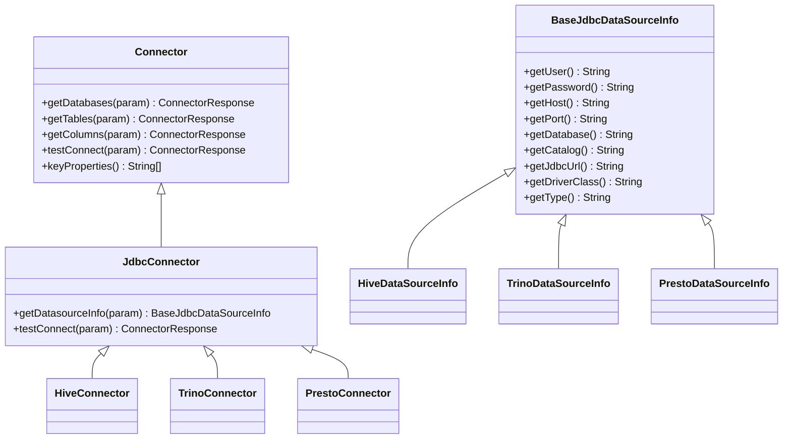
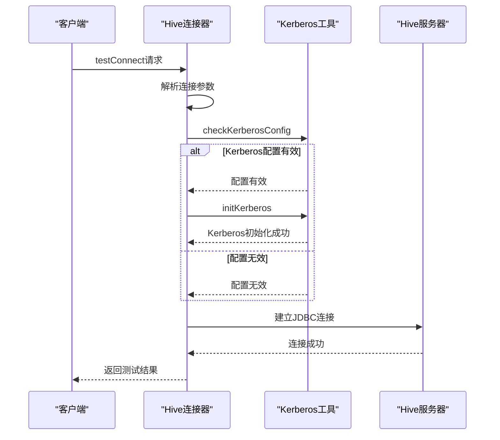
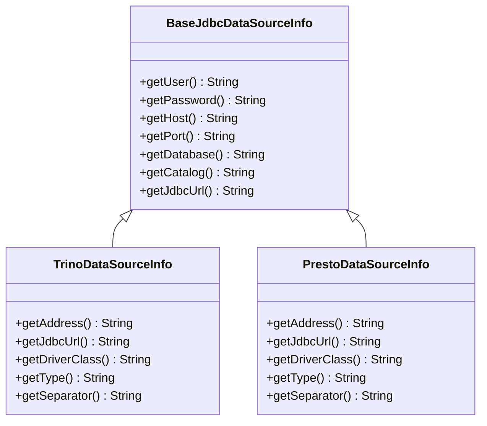
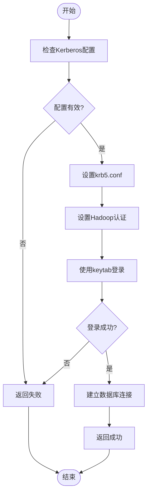

# 大数据平台配置

<cite>
**本文档中引用的文件**  
- [HiveConnector.java](file://datavines-connector/datavines-connector-plugins/datavines-connector-hive/src/main/java/io/datavines/connector/plugin/HiveConnector.java)
- [HiveDataSourceInfo.java](file://datavines-connector/datavines-connector-plugins/datavines-connector-hive/src/main/java/io/datavines/connector/plugin/HiveDataSourceInfo.java)
- [TrinoConnector.java](file://datavines-connector/datavines-connector-plugins/datavines-connector-trino/src/main/java/io/datavines/connector/plugin/TrinoConnector.java)
- [TrinoDataSourceInfo.java](file://datavines-connector/datavines-connector-plugins/datavines-connector-trino/src/main/java/io/datavines/connector/plugin/TrinoDataSourceInfo.java)
- [PrestoConnector.java](file://datavines-connector/datavines-connector-plugins/datavines-connector-presto/src/main/java/io/datavines/connector/plugin/PrestoConnector.java)
- [PrestoDataSourceInfo.java](file://datavines-connector/datavines-connector-plugins/datavines-connector-presto/src/main/java/io/datavines/connector/plugin/PrestoDataSourceInfo.java)
- [BaseJdbcDataSourceInfo.java](file://datavines-common/src/main/java/io/datavines/common/datasource/jdbc/BaseJdbcDataSourceInfo.java)
- [ConfigConstants.java](file://datavines-common/src/main/java/io/datavines/common/ConfigConstants.java)
- [KerberosUtils.java](file://datavines-connector/datavines-connector-plugins/datavines-connector-hive/src/main/java/io/datavines/connector/plugin/KerberosUtils.java)
- [Connector.java](file://datavines-connector/datavines-connector-api/src/main/java/io/datavines/connector/api/Connector.java)
</cite>

## 目录
1. [引言](#引言)
2. [核心连接器配置](#核心连接器配置)
3. [Hive平台配置](#hive平台配置)
4. [Spark平台配置](#spark平台配置)
5. [Flink平台配置](#flink平台配置)
6. [Trino与Presto平台配置](#trino与presto平台配置)
7. [认证与安全配置](#认证与安全配置)
8. [高可用性与负载均衡](#高可用性与负载均衡)
9. [性能调优建议](#性能调优建议)
10. [连接器测试与验证](#连接器测试与验证)

## 引言
本文档详细说明了大数据平台连接器的配置方法，涵盖Hive、Spark、Flink、Trino、Presto等主流大数据平台的连接参数、认证方式、执行引擎配置等关键配置项。文档还解释了如何配置高可用性、负载均衡等高级选项，并提供性能调优建议和连接测试方法。

## 核心连接器配置
大数据平台连接器基于统一的JDBC连接框架，通过继承`BaseJdbcDataSourceInfo`类实现各平台特定的连接配置。连接器通过`Connector`接口定义标准操作，包括获取数据库、表、列元数据以及测试连接等功能。



**图源**
- [Connector.java](file://datavines-connector/datavines-connector-api/src/main/java/io/datavines/connector/api/Connector.java)
- [BaseJdbcDataSourceInfo.java](file://datavines-common/src/main/java/io/datavines/common/datasource/jdbc/BaseJdbcDataSourceInfo.java)

**本节来源**
- [Connector.java](file://datavines-connector/datavines-connector-api/src/main/java/io/datavines/connector/api/Connector.java)
- [BaseJdbcDataSourceInfo.java](file://datavines-common/src/main/java/io/datavines/common/datasource/jdbc/BaseJdbcDataSourceInfo.java)

## Hive平台配置
Hive连接器通过`HiveConnector`类实现，支持标准JDBC连接和Kerberos认证。配置参数包括主机、端口、数据库、用户、密码以及Kerberos相关配置。

### 连接参数
Hive连接器的关键配置参数如下：

| 参数 | 描述 | 是否必需 |
|------|------|---------|
| host | Hive服务器主机地址，支持逗号分隔的多个主机 | 是 |
| port | Hive服务器端口，默认10000 | 是 |
| database | 要连接的数据库名称 | 是 |
| user | 认证用户名 | 否 |
| password | 认证密码 | 否 |
| keytab_file | Kerberos keytab文件路径 | 否 |
| keytab_principal | Kerberos主体名称 | 否 |
| krb5_conf | Kerberos配置文件路径 | 否 |
| properties | 其他JDBC连接属性 | 否 |

### JDBC URL格式
Hive连接器生成的JDBC URL格式为：
```
jdbc:hive2://host1:port,host2:port/database;properties
```

### Kerberos认证
Hive连接器支持Kerberos认证，通过`KerberosUtils`类实现。当配置了Kerberos相关参数时，连接器会自动初始化Kerberos环境。



**图源**
- [HiveConnector.java](file://datavines-connector/datavines-connector-plugins/datavines-connector-hive/src/main/java/io/datavines/connector/plugin/HiveConnector.java)
- [KerberosUtils.java](file://datavines-connector/datavines-connector-plugins/datavines-connector-hive/src/main/java/io/datavines/connector/plugin/KerberosUtils.java)

**本节来源**
- [HiveConnector.java](file://datavines-connector/datavines-connector-plugins/datavines-connector-hive/src/main/java/io/datavines/connector/plugin/HiveConnector.java)
- [HiveDataSourceInfo.java](file://datavines-connector/datavines-connector-plugins/datavines-connector-hive/src/main/java/io/datavines/connector/plugin/HiveDataSourceInfo.java)
- [KerberosUtils.java](file://datavines-connector/datavines-connector-plugins/datavines-connector-hive/src/main/java/io/datavines/connector/plugin/KerberosUtils.java)

## Spark平台配置
Spark平台配置主要通过Spark执行引擎实现，支持与Hive集成。配置参数包括Spark主节点地址、执行模式、资源分配等。

### Spark-Hive集成
通过配置`enable_spark_hive_support`参数启用Spark对Hive的支持。当启用时，Spark可以访问Hive元数据和表。

### 连接参数
Spark连接器的关键配置参数：

| 参数 | 描述 | 是否必需 |
|------|------|---------|
| spark.master | Spark主节点URL | 是 |
| spark.app.name | 应用程序名称 | 否 |
| spark.executor.instances | 执行器实例数量 | 否 |
| spark.executor.memory | 每个执行器内存 | 否 |
| spark.driver.memory | 驱动程序内存 | 否 |
| spark.sql.warehouse.dir | 仓库目录 | 否 |

## Flink平台配置
Flink平台配置通过Flink执行引擎实现，支持批处理和流处理模式。配置参数包括JobManager地址、并行度、检查点间隔等。

### 连接参数
Flink连接器的关键配置参数：

| 参数 | 描述 | 是否必需 |
|------|------|---------|
| jobmanager.rpc.address | JobManager地址 | 是 |
| jobmanager.rpc.port | JobManager端口 | 是 |
| parallelism.default | 默认并行度 | 否 |
| state.checkpoints.dir | 检查点目录 | 否 |
| execution.checkpointing.interval | 检查点间隔 | 否 |

## Trino与Presto平台配置
Trino和Presto连接器具有相似的配置结构，都基于JDBC协议，支持catalog和schema级别的数据访问。

### Trino配置
Trino连接器通过`TrinoConnector`类实现，配置参数包括：

| 参数 | 描述 | 是否必需 |
|------|------|---------|
| host | Trino服务器主机 | 是 |
| port | Trino服务器端口，默认8080 | 是 |
| catalog | 要连接的catalog | 是 |
| database | 要连接的数据库 | 是 |
| user | 认证用户名 | 否 |
| password | 认证密码 | 否 |

### Presto配置
Presto连接器通过`PrestoConnector`类实现，配置参数与Trino类似：

| 参数 | 描述 | 是否必需 |
|------|------|---------|
| host | Presto服务器主机 | 是 |
| port | Presto服务器端口，默认8080 | 是 |
| catalog | 要连接的catalog | 是 |
| database | 要连接的数据库 | 是 |
| user | 认证用户名 | 否 |
| password | 认证密码 | 否 |

### JDBC URL格式
Trino和Presto连接器生成的JDBC URL格式为：
```
jdbc:trino://host:port/catalog/database?properties
jdbc:presto://host:port/catalog/database?properties
```



**图源**
- [TrinoDataSourceInfo.java](file://datavines-connector/datavines-connector-plugins/datavines-connector-trino/src/main/java/io/datavines/connector/plugin/TrinoDataSourceInfo.java)
- [PrestoDataSourceInfo.java](file://datavines-connector/datavines-connector-plugins/datavines-connector-presto/src/main/java/io/datavines/connector/plugin/PrestoDataSourceInfo.java)

**本节来源**
- [TrinoConnector.java](file://datavines-connector/datavines-connector-plugins/datavines-connector-trino/src/main/java/io/datavines/connector/plugin/TrinoConnector.java)
- [TrinoDataSourceInfo.java](file://datavines-connector/datavines-connector-plugins/datavines-connector-trino/src/main/java/io/datavines/connector/plugin/TrinoDataSourceInfo.java)
- [PrestoConnector.java](file://datavines-connector/datavines-connector-plugins/datavines-connector-presto/src/main/java/io/datavines/connector/plugin/PrestoConnector.java)
- [PrestoDataSourceInfo.java](file://datavines-connector/datavines-connector-plugins/datavines-connector-presto/src/main/java/io/datavines/connector/plugin/PrestoDataSourceInfo.java)

## 认证与安全配置
大数据平台连接器支持多种认证方式，包括基本认证、Kerberos认证等。

### Kerberos认证
Kerberos认证通过`KerberosUtils`类实现，需要配置以下参数：

- **keytab_file**: Kerberos keytab文件路径
- **keytab_principal**: Kerberos主体名称
- **krb5_conf**: Kerberos配置文件路径

认证流程如下：
1. 检查Kerberos配置是否完整
2. 设置Java系统属性`java.security.krb5.conf`
3. 配置Hadoop安全认证为Kerberos
4. 使用keytab文件登录用户



**图源**
- [KerberosUtils.java](file://datavines-connector/datavines-connector-plugins/datavines-connector-hive/src/main/java/io/datavines/connector/plugin/KerberosUtils.java)

**本节来源**
- [KerberosUtils.java](file://datavines-connector/datavines-connector-plugins/datavines-connector-hive/src/main/java/io/datavines/connector/plugin/KerberosUtils.java)
- [ConfigConstants.java](file://datavines-common/src/main/java/io/datavines/common/ConfigConstants.java)

## 高可用性与负载均衡
大数据平台连接器支持高可用性和负载均衡配置，通过多主机配置和连接池实现。

### 多主机配置
对于支持多主机的平台（如Hive），可以在host参数中配置多个主机地址，用逗号分隔：
```
host1,host2,host3
```

### 连接池配置
连接器自动管理数据库连接，通过连接池提高性能和可靠性。连接池配置参数包括：

| 参数 | 描述 |
|------|------|
| validationQuery | 连接验证查询，默认"Select 1" |
| maxPoolSize | 最大连接池大小 |
| minPoolSize | 最小连接池大小 |
| idleTimeout | 空闲连接超时时间 |

## 性能调优建议
为优化大数据平台连接器的性能，建议采用以下配置策略。

### 并行度设置
根据数据量和处理需求合理设置并行度：

- 小数据集：并行度设置为2-4
- 中等数据集：并行度设置为8-16
- 大数据集：并行度设置为32以上

### 资源分配
合理分配计算资源，避免资源争用：

| 平台 | 建议配置 |
|------|----------|
| Spark | executor.instances=4, executor.memory=4g |
| Flink | parallelism.default=8, taskmanager.memory.process.size=4g |
| Hive | mapreduce.map.memory.mb=2048, mapreduce.reduce.memory.mb=4096 |

### 数据本地性优化
尽量将计算任务调度到数据所在的节点，减少网络传输开销。对于HDFS存储的数据，确保执行节点与数据节点在同一机架。

## 连接器测试与验证
连接器提供了测试连接功能，用于验证配置的正确性和连接的可用性。

### 测试流程
1. 准备连接参数
2. 调用testConnect方法
3. 验证返回结果
4. 记录测试日志

### 测试代码示例
```java
TestConnectionRequestParam param = new TestConnectionRequestParam();
param.setDataSourceParam("{\"host\":\"localhost\",\"port\":\"10000\",\"database\":\"default\",\"user\":\"hive\"}");
ConnectorResponse response = connector.testConnect(param);
if (response.getResult()) {
    System.out.println("连接测试成功");
} else {
    System.out.println("连接测试失败");
}
```

**本节来源**
- [HiveConnector.java](file://datavines-connector/datavines-connector-plugins/datavines-connector-hive/src/main/java/io/datavines/connector/plugin/HiveConnector.java)
- [TrinoConnector.java](file://datavines-connector/datavines-connector-plugins/datavines-connector-trino/src/main/java/io/datavines/connector/plugin/TrinoConnector.java)
- [PrestoConnector.java](file://datavines-connector/datavines-connector-plugins/datavines-connector-presto/src/main/java/io/datavines/connector/plugin/PrestoConnector.java)