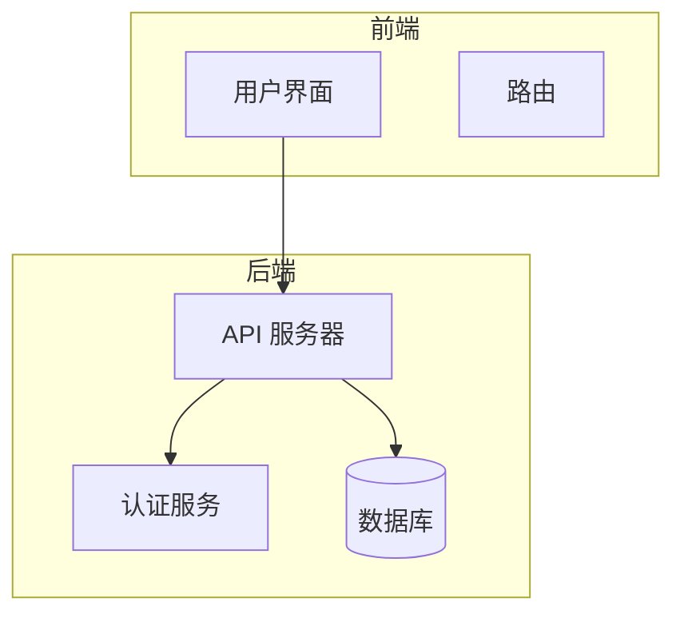
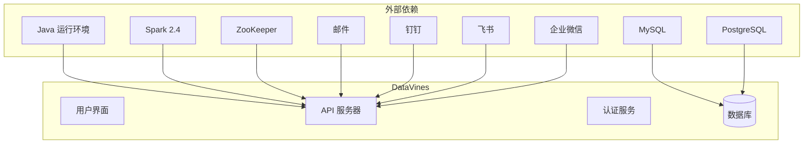

# 云存储配置

<cite>
**本文档引用的文件**  
- [application.yaml](file://datavines-server/src/main/resources/application.yaml)
- [common.properties](file://datavines-common/src/main/resources/common.properties)
- [ConfigBuilder.java](file://datavines-connector/datavines-connector-api/src/main/java/io/datavines/connector/api/ConfigBuilder.java)
- [JdbcConfigBuilder.java](file://datavines-connector/datavines-connector-plugins/datavines-connector-jdbc/src/main/java/io/datavines/connector/plugin/JdbcConfigBuilder.java)
- [FileConnectorFactory.java](file://datavines-connector/datavines-connector-plugins/datavines-connector-file/src/main/java/io/datavines/connector/plugin/FileConnectorFactory.java)
- [ErrorDataStorageController.java](file://datavines-server/src/main/java/io/datavines/server/api/controller/ErrorDataStorageController.java)
- [ErrorDataStorageServiceImpl.java](file://datavines-server/src/main/java/io/datavines/server/repository/service/impl/ErrorDataStorageServiceImpl.java)
- [ErrorDataStorageCreate.java](file://datavines-server/src/main/java/io/datavines/server/api/dto/bo/storage/ErrorDataStorageCreate.java)
- [ErrorDataStorageUpdate.java](file://datavines-server/src/main/java/io/datavines/server/api/dto/bo/storage/ErrorDataStorageUpdate.java)
</cite>

## 目录
1. [简介](#简介)
2. [项目结构](#项目结构)
3. [核心组件](#核心组件)
4. [架构概述](#架构概述)
5. [详细组件分析](#详细组件分析)
6. [依赖分析](#依赖分析)
7. [性能考虑](#性能考虑)
8. [故障排除指南](#故障排除指南)
9. [结论](#结论)

## 简介
DataVines 是一个易于使用的数据质量服务平台，支持多种指标。该平台基于插件设计，允许用户自定义扩展多个模块，包括数据源、检查规则、作业执行引擎、警报通道、错误数据存储和注册中心。本配置文档将详细说明如何配置云存储访问密钥、安全令牌、区域（Region）设置、存储桶（Bucket）权限等，并解释不同云服务商的配置差异、SDK版本兼容性、传输加密（SSL/TLS）设置等。此外，还将提供云存储性能优化建议，如多部分上传、预签名URL、CDN集成等，以及云存储连接测试、成本控制和安全最佳实践。

## 项目结构
DataVines 项目的结构清晰地划分为多个模块，每个模块负责不同的功能。以下是主要模块的简要介绍：

- **bin/**: 包含启动脚本，如 `datavines-daemon.sh` 和 `datavines-submit.sh`。
- **datavines-cli/**: 命令行接口模块。
- **datavines-client/**: 客户端模块，包含 HTTP 客户端核心组件。
- **datavines-common/**: 公共模块，包含配置、数据源、实体、枚举、异常、日志、参数、工具类等。
- **datavines-connector/**: 连接器模块，支持多种数据源，如 MySQL、Impala、StarRocks、Doris、Presto、Trino、ClickHouse、PostgreSQL 等。
- **datavines-core/**: 核心模块，包含 AOP、常量、实体、枚举、异常、工具类等。
- **datavines-dist/**: 分发模块，包含构建脚本。
- **datavines-engine/**: 执行引擎模块，支持 Spark 和 Local 两种执行模式。
- **datavines-metric/**: 指标模块，支持多种数据质量检查规则。
- **datavines-notification/**: 通知模块，支持邮件、钉钉、飞书、企业微信等通知方式。
- **datavines-registry/**: 注册中心模块，支持 MySQL、PostgreSQL 和 ZooKeeper。
- **datavines-runner/**: 作业运行器模块，负责作业的执行。
- **datavines-server/**: 服务器模块，包含 API、配置、DQC、注册、仓库、调度、工具类等。
- **datavines-spi/**: SPI 模块，支持插件加载。
- **datavines-ui/**: 用户界面模块，包含前端组件、钩子、HTTP 请求、语言、存储、类型、工具类等。
- **deploy/**: 部署模块，包含 Docker Compose 和 Kubernetes 配置。
- **scripts/sql/**: SQL 脚本模块，包含数据库初始化脚本。
- **tools/checkstyle/**: 代码检查工具模块，包含 Checkstyle 配置。



**图源**
- [datavines-ui](file://datavines-ui)
- [datavines-server](file://datavines-server)

**节源**
- [README.md](file://README.md)

## 核心组件
DataVines 的核心组件包括数据目录、数据质量、数据剖析、插件设计、多种执行模式、易部署和高可用性。

### 数据目录
- 定期获取数据源元数据，构建数据目录。
- 定期监控元数据变化。
- 支持标签管理，与元数据结合。

### 数据质量
- 内置 27 种数据质量检查规则。
- 支持 4 种数据质量检查规则类型：
  - 单表列检查
  - 单表自定义 SQL 检查
  - 跨表准确性检查
  - 两表值比较检查
- 支持计划任务进行检查。
- 支持 SLA 用于检查结果警报。

### 数据剖析
- 支持定时执行数据检测，输出数据剖析报告。
- 支持自动识别列类型，自动匹配适当的数据剖析指标。
- 支持表行数趋势监控。
- 支持数据分布视图。

### 插件设计
- **数据源**: 支持 MySQL、Impala、StarRocks、Doris、Presto、Trino、ClickHouse、PostgreSQL 等。
- **检查规则**: 内置 27 种检查规则，如空值检查、非空检查、枚举检查等。
- **作业执行引擎**: 支持 Spark 和 Local 两种执行模式。Spark 引擎目前仅支持 Spark 2.4 版本，Local 引擎是基于 JDBC 开发的本地执行引擎，不依赖其他执行引擎。
- **警报通道**: 支持邮件。
- **错误数据存储**: 支持 MySQL 和本地文件（仅 Local 执行引擎支持）。
- **注册中心**: 支持 MySQL、PostgreSQL 和 ZooKeeper。

### 多种执行模式
- 提供网页配置检查作业，运行作业，查看作业执行日志，查看错误数据和检查结果。
- 支持在线生成作业运行脚本，通过 `datavines-submit.sh` 提交作业，可与调度系统结合使用。

### 易部署和高可用性
- 平台依赖较少，易于部署。
- 最小化仅依赖 MySQL 启动项目，完成数据质量操作检查。
- 支持水平扩展，自动容错。
- 分布式设计，Server 节点支持水平扩展以提高性能。
- 作业自动容错，确保作业不会丢失或重复。

**节源**
- [README.md](file://README.md)

## 架构概述
DataVines 的架构设计旨在提供一个灵活、可扩展的数据质量服务平台。系统架构主要包括前端、后端、数据源、执行引擎、通知服务、注册中心和错误数据存储。


**图源**
- [datavines-ui](file://datavines-ui)
- [datavines-server](file://datavines-server)

**节源**
- [README.md](file://README.md)

## 详细组件分析

### 错误数据存储配置
错误数据存储是 DataVines 中的一个重要组件，用于存储数据质量检查过程中发现的错误数据。目前支持 MySQL 和本地文件两种存储方式。

#### 配置文件
错误数据存储的配置主要在 `application.yaml` 文件中进行。以下是配置文件的相关部分：

```yaml
spring:
  datasource:
    driver-class-name: org.postgresql.Driver
    url: jdbc:postgresql://127.0.0.1:5432/datavines
    username: postgres
    password: 123456
    hikari:
      connection-test-query: select 1
      minimum-idle: 5
      auto-commit: true
      validation-timeout: 3000
      pool-name: datavines
      maximum-pool-size: 50
      connection-timeout: 30000
      idle-timeout: 600000
      leak-detection-threshold: 0
      initialization-fail-timeout: 1
```

#### 配置接口
`ConfigBuilder` 接口定义了生成配置的方法。不同的数据源需要实现该接口来生成相应的配置。

```java
public interface ConfigBuilder {
    String build(boolean isEn);
    String buildErrorDataStorage(boolean isEn);
}
```

#### 具体实现
以 MySQL 为例，`MysqlConfigBuilder` 类实现了 `ConfigBuilder` 接口，生成 MySQL 数据源的配置。

```java
public class MysqlConfigBuilder extends JdbcConfigBuilder {
    @Override
    public String buildErrorDataStorage(boolean isEn) {
        List<PluginParams> params = new ArrayList<>();
        params.add(getHostInput(isEn));
        params.add(getPortInput(isEn));
        if (getCatalogInput(isEn) != null) {
            params.add(getCatalogInput(isEn));
        }
        params.add(getErrorDataStorageDatabaseInput(isEn));
        if (getSchemaInput(isEn) != null) {
            params.add(getSchemaInput(isEn));
        }
        params.add(getUserInput(isEn));
        params.add(getPasswordInput(isEn));
        params.add(getPropertiesInput(isEn));
        ObjectMapper mapper = new ObjectMapper();
        mapper.setSerializationInclusion(JsonInclude.Include.NON_NULL);
        String result = null;
        try {
            result = mapper.writeValueAsString(params);
        } catch (JsonProcessingException e) {
            log.error("json parse error : ", e);
        }
        return result;
    }
}
```

#### 控制器
`ErrorDataStorageController` 类提供了 REST API 接口，用于管理错误数据存储的配置。

```java
@Api(value = "errorDataStorage", tags = "errorDataStorage", produces = MediaType.APPLICATION_JSON_VALUE)
@RestController
@RequestMapping(value = DataVinesConstants.BASE_API_PATH + "/errorDataStorage", produces = MediaType.APPLICATION_JSON_VALUE)
@RefreshToken
public class ErrorDataStorageController {
    @Autowired
    private ErrorDataStorageService errorDataStorageService;

    @ApiOperation(value = "test error data storage")
    @PostMapping(value = "/test", consumes = MediaType.APPLICATION_JSON_VALUE)
    public Object testConnection(@Valid @RequestBody TestConnectionRequestParam param)  {
        return errorDataStorageService.testConnect(param);
    }

    @ApiOperation(value = "create error data storage")
    @PostMapping(consumes = MediaType.APPLICATION_JSON_VALUE)
    public Object create(@Valid @RequestBody ErrorDataStorageCreate errorDataStorageCreate) throws DataVinesServerException {
        return errorDataStorageService.create(errorDataStorageCreate);
    }

    @ApiOperation(value = "update error data storage")
    @PutMapping(consumes = MediaType.APPLICATION_JSON_VALUE)
    public Object update(@Valid @RequestBody ErrorDataStorageUpdate errorDataStorageUpdate) throws DataVinesServerException {
        return errorDataStorageService.update(errorDataStorageUpdate);
    }

    @ApiOperation(value = "delete error data storage")
    @DeleteMapping(value = "/{id}")
    public Object delete(@PathVariable long id) {
        return errorDataStorageService.deleteById(id);
    }

    @ApiOperation(value = "get error data storage page")
    @PostMapping(value = "page")
    public Object page(@Valid @RequestBody ErrorDataStoragePageParam errorDataStoragePageParam) {
        return errorDataStorageService.getErrorDataStoragePage(errorDataStoragePageParam);
    }

    @ApiOperation(value = "get storage config json")
    @GetMapping(value = "/config/{type}")
    public Object getConfigJson(@PathVariable String type){
        return errorDataStorageService.getConfigJson(type);
    }

    @ApiOperation(value = "get error data storage type list")
    @GetMapping(value = "/type/list")
    public Object getErrorDataStorageTypeList() {
        Set<String> errorDataStorageList = PluginLoader.getPluginLoader(ConnectorFactory.class).getSupportedPlugins();
        List<Item> items = new ArrayList<>();
        for (String errorDataStorage : errorDataStorageList) {
            ConnectorFactory connectorFactory = PluginLoader.getPluginLoader(ConnectorFactory.class).getOrCreatePlugin(errorDataStorage);
            if (connectorFactory  == null) {
                continue;
            }
            if (connectorFactory.getDialect().supportToBeErrorDataStorage()) {
                Item item = new Item(errorDataStorage,errorDataStorage);
                items.add(item);
            }
        }
        return items;
    }
}
```

#### 服务层
`ErrorDataStorageServiceImpl` 类实现了 `ErrorDataStorageService` 接口，提供了具体的业务逻辑。

```java
@Slf4j
@Service("errorDataStorageService")
public class ErrorDataStorageServiceImpl extends ServiceImpl<ErrorDataStorageMapper, ErrorDataStorage> implements ErrorDataStorageService {
    @Override
    public boolean testConnect(TestConnectionRequestParam param) {
        // 测试连接逻辑
    }

    @Override
    public long create(ErrorDataStorageCreate tenantCreate) throws DataVinesServerException {
        // 创建错误数据存储逻辑
    }

    @Override
    public int deleteById(long id) {
        // 删除错误数据存储逻辑
    }

    @Override
    public int update(ErrorDataStorageUpdate tenantUpdate) throws DataVinesServerException {
        // 更新错误数据存储逻辑
    }

    @Override
    public ErrorDataStorage getById(long id) {
        // 获取错误数据存储逻辑
    }

    @Override
    public List<ErrorDataStorage> listByWorkspaceId(long workspaceId) {
        // 列出工作区内的错误数据存储逻辑
    }

    @Override
    public IPage<ErrorDataStorageVO> getErrorDataStoragePage(ErrorDataStoragePageParam errorDataStoragePageParam) {
        // 获取错误数据存储分页逻辑
    }

    @Override
    public String getConfigJson(String type) {
        // 获取配置 JSON 逻辑
    }
}
```

**节源**
- [application.yaml](file://datavines-server/src/main/resources/application.yaml)
- [ConfigBuilder.java](file://datavines-connector/datavines-connector-api/src/main/java/io/datavines/connector/api/ConfigBuilder.java)
- [JdbcConfigBuilder.java](file://datavines-connector/datavines-connector-plugins/datavines-connector-jdbc/src/main/java/io/datavines/connector/plugin/JdbcConfigBuilder.java)
- [MysqlConfigBuilder.java](file://datavines-connector/datavines-connector-plugins/datavines-connector-mysql/src/main/java/io/datavines/connector/plugin/MysqlConfigBuilder.java)
- [ErrorDataStorageController.java](file://datavines-server/src/main/java/io/datavines/server/api/controller/ErrorDataStorageController.java)
- [ErrorDataStorageServiceImpl.java](file://datavines-server/src/main/java/io/datavines/server/repository/service/impl/ErrorDataStorageServiceImpl.java)
- [ErrorDataStorageCreate.java](file://datavines-server/src/main/java/io/datavines/server/api/dto/bo/storage/ErrorDataStorageCreate.java)
- [ErrorDataStorageUpdate.java](file://datavines-server/src/main/java/io/datavines/server/api/dto/bo/storage/ErrorDataStorageUpdate.java)

## 依赖分析
DataVines 依赖于多个外部组件和库，以实现其功能。主要依赖包括：

- **Java 运行环境**: JDK 8
- **数据库**: MySQL、PostgreSQL
- **执行引擎**: Spark 2.4
- **注册中心**: MySQL、PostgreSQL、ZooKeeper
- **通知服务**: 邮件、钉钉、飞书、企业微信



**图源**
- [pom.xml](file://pom.xml)

**节源**
- [pom.xml](file://pom.xml)

## 性能考虑
为了提高 DataVines 的性能，可以采取以下措施：

- **水平扩展**: 通过增加 Server 节点来提高系统的处理能力。
- **缓存**: 使用缓存机制减少数据库查询次数，提高响应速度。
- **异步处理**: 将耗时的操作异步处理，避免阻塞主线程。
- **优化查询**: 优化 SQL 查询语句，减少不必要的数据传输。
- **资源管理**: 合理分配和管理资源，避免资源浪费。

## 故障排除指南
在使用 DataVines 时，可能会遇到一些常见问题。以下是一些故障排除建议：

- **连接问题**: 检查数据库连接配置是否正确，确保数据库服务正常运行。
- **性能问题**: 监控系统性能，分析瓶颈，优化配置。
- **数据质量问题**: 检查数据源配置，确保数据源连接正常，数据质量检查规则配置正确。
- **日志问题**: 查看日志文件，定位问题原因，及时修复。

**节源**
- [server-logback.xml](file://datavines-server/src/main/resources/server-logback.xml)

## 结论
DataVines 是一个功能强大的数据质量服务平台，支持多种数据源、检查规则、执行模式和通知方式。通过合理的配置和优化，可以有效提高数据质量和系统性能。希望本文档能帮助您更好地理解和使用 DataVines。