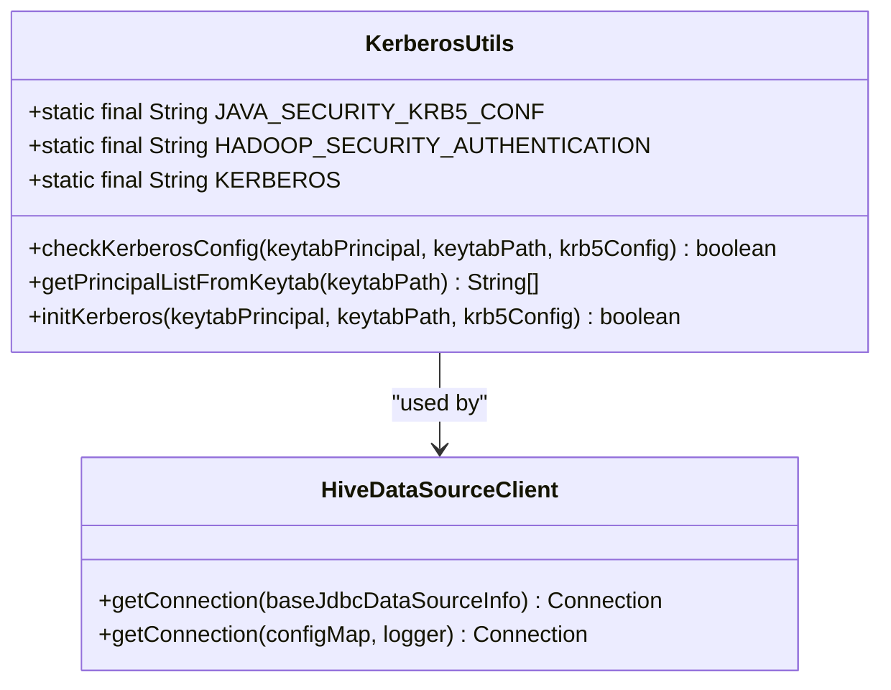

# 分布式文件系统配置

<cite>
**本文档中引用的文件**  
- [KerberosUtils.java](file://datavines-connector\datavines-connector-plugins\datavines-connector-hive\src\main\java\io\datavines\connector\plugin\KerberosUtils.java)
- [HiveDataSourceClient.java](file://datavines-connector\datavines-connector-plugins\datavines-connector-hive\src\main\java\io\datavines\connector\plugin\HiveDataSourceClient.java)
- [common.properties](file://datavines-common\src\main\resources\common.properties)
- [LivyEngineExecutor.java](file://datavines-engine\datavines-engine-plugins\datavines-engine-livy\datavines-engine-livy-executor\src\main\java\io\datavines\engine\livy\executor\LivyEngineExecutor.java)
- [README.md](file://datavines-engine\datavines-engine-plugins\datavines-engine-livy\README.md)
</cite>

## 目录
1. [简介](#简介)
2. [HDFS集成配置](#hdfs集成配置)
3. [NameNode地址配置](#namenode地址配置)
4. [HDFS用户认证与Kerberos安全配置](#hdfs用户认证与kerberos安全配置)
5. [HDFS文件路径与权限配置](#hdfs文件路径与权限配置)
6. [副本策略配置](#副本策略配置)
7. [HDFS性能调优建议](#hdfs性能调优建议)
8. [HDFS连接测试与故障排查](#hdfs连接测试与故障排查)

## 简介
本文档详细说明了在DataVines平台中配置分布式文件系统（HDFS）的方法，包括Hadoop配置文件的集成、NameNode地址配置、HDFS用户认证、Kerberos安全配置等。同时，文档还解释了如何配置HDFS文件路径、文件权限和副本策略，并提供了HDFS性能调优建议，如块大小设置、读取缓冲区配置、并发连接数等。最后，文档包含了HDFS连接测试和故障排查指南。

## HDFS集成配置
在DataVines平台中，HDFS的集成主要通过Hive连接器实现。Hive连接器支持通过JDBC连接到Hive服务，并通过HDFS存储数据。Hive连接器的配置主要涉及以下几个方面：

1. **Hive元数据仓库目录**：通过`hive.metastore.warehouse.dir`参数配置Hive元数据仓库的HDFS路径。
2. **Hive元数据服务地址**：通过`hive.metastore.uris`参数配置Hive元数据服务的Thrift地址。
3. **HDFS库文件路径**：通过`livy.task.jar.lib.path`参数配置Livy任务所需的JAR文件在HDFS上的路径。

**Section sources**
- [README.md](file://datavines-engine\datavines-engine-plugins\datavines-engine-livy\README.md#L22)
- [LivyEngineExecutor.java](file://datavines-engine\datavines-engine-plugins\datavines-engine-livy\datavines-engine-livy-executor\src\main\java\io\datavines\engine\livy\executor\LivyEngineExecutor.java#L107)

## NameNode地址配置
NameNode地址的配置主要通过Hive连接器的JDBC URL实现。在Hive连接器的配置中，JDBC URL通常包含NameNode的地址和端口。例如：

```
jdbc:hive2://<namenode-host>:<port>/default
```

其中，`<namenode-host>`是NameNode的主机名或IP地址，`<port>`是HiveServer2的端口。

**Section sources**
- [HiveDataSourceClient.java](file://datavines-connector\datavines-connector-plugins\datavines-connector-hive\src\main\java\io\datavines\connector\plugin\HiveDataSourceClient.java#L32)

## HDFS用户认证与Kerberos安全配置
DataVines平台支持通过Kerberos进行HDFS用户认证。Kerberos配置主要涉及以下几个方面：

1. **Kerberos配置文件路径**：通过`krb5.conf`文件配置Kerberos的认证信息。
2. **Keytab文件路径**：通过`keytab.file`参数配置用户的Keytab文件路径。
3. **Kerberos主体**：通过`keytab.principal`参数配置用户的Kerberos主体。

Kerberos认证的初始化通过`KerberosUtils`类实现，该类提供了检查Kerberos配置、获取Keytab中的主体列表和初始化Kerberos认证的功能。



**Diagram sources**
- [KerberosUtils.java](file://datavines-connector\datavines-connector-plugins\datavines-connector-hive\src\main\java\io\datavines\connector\plugin\KerberosUtils.java#L30-L77)
- [HiveDataSourceClient.java](file://datavines-connector\datavines-connector-plugins\datavines-connector-hive\src\main\java\io\datavines\connector\plugin\HiveDataSourceClient.java#L30-L38)

**Section sources**
- [KerberosUtils.java](file://datavines-connector\datavines-connector-plugins\datavines-connector-hive\src\main\java\io\datavines\connector\plugin\KerberosUtils.java#L30-L77)
- [HiveDataSourceClient.java](file://datavines-connector\datavines-connector-plugins\datavines-connector-hive\src\main\java\io\datavines\connector\plugin\HiveDataSourceClient.java#L30-L38)

## HDFS文件路径与权限配置
HDFS文件路径的配置主要通过`common.properties`文件中的相关参数实现。例如：

- `local.tmp.workdir`：配置本地临时工作目录。
- `local.data.dir`：配置本地数据目录。
- `error.data.dir`：配置错误数据目录。
- `validate.result.data.dir`：配置验证结果数据目录。

这些目录的配置可以影响HDFS上文件的存储路径和权限。

**Section sources**
- [common.properties](file://datavines-common\src\main\resources\common.properties#L65-L75)
- [CommonPropertyUtils.java](file://datavines-common\src\main\java\io\datavines\common\utils\CommonPropertyUtils.java#L65-L75)

## 副本策略配置
HDFS的副本策略配置主要通过Hadoop的`hdfs-site.xml`文件实现。在DataVines平台中，副本策略的配置可以通过环境变量或配置文件传递给Hadoop集群。副本策略的配置包括：

- `dfs.replication`：配置文件的副本数。
- `dfs.blocksize`：配置HDFS块的大小。

这些配置可以通过Livy任务的`conf`参数传递给Spark作业。

**Section sources**
- [LivyEngineExecutor.java](file://datavines-engine\datavines-engine-plugins\datavines-engine-livy\datavines-engine-livy-executor\src\main\java\io\datavines\engine\livy\executor\LivyEngineExecutor.java#L146-L151)

## HDFS性能调优建议
为了优化HDFS的性能，建议进行以下配置：

1. **块大小设置**：根据数据大小和访问模式调整HDFS块大小。较大的块大小可以减少NameNode的元数据压力，但可能会增加小文件的存储开销。
2. **读取缓冲区配置**：通过`io.file.buffer.size`参数配置HDFS读取缓冲区的大小，以提高读取性能。
3. **并发连接数**：通过`dfs.client.max.block.acquire.threads`参数配置客户端获取块的最大线程数，以提高并发性能。

这些配置可以通过Livy任务的`conf`参数传递给Spark作业。

**Section sources**
- [LivyEngineExecutor.java](file://datavines-engine\datavines-engine-plugins\datavines-engine-livy\datavines-engine-livy-executor\src\main\java\io\datavines\engine\livy\executor\LivyEngineExecutor.java#L146-L151)

## HDFS连接测试与故障排查
在配置HDFS连接后，建议进行连接测试以确保配置正确。连接测试可以通过以下步骤进行：

1. **测试Hive连接**：使用Hive连接器的`testConnect`方法测试Hive连接。
2. **检查Kerberos配置**：使用`KerberosUtils.checkKerberosConfig`方法检查Kerberos配置是否正确。
3. **检查HDFS路径**：通过HDFS命令行工具检查HDFS路径是否存在且权限正确。

如果连接测试失败，可以参考以下故障排查步骤：

1. **检查Kerberos日志**：查看Kerberos认证日志，确认认证是否成功。
2. **检查HDFS日志**：查看HDFS日志，确认HDFS服务是否正常运行。
3. **检查网络连接**：确认客户端与NameNode和DataNode之间的网络连接是否正常。

**Section sources**
- [HiveConnector.java](file://datavines-connector\datavines-connector-plugins\datavines-connector-hive\src\main\java\io\datavines\connector\plugin\HiveConnector.java#L54-L58)
- [KerberosUtils.java](file://datavines-connector\datavines-connector-plugins\datavines-connector-hive\src\main\java\io\datavines\connector\plugin\KerberosUtils.java#L39-L49)