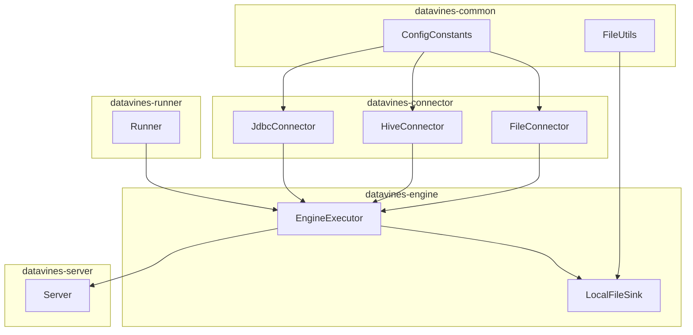
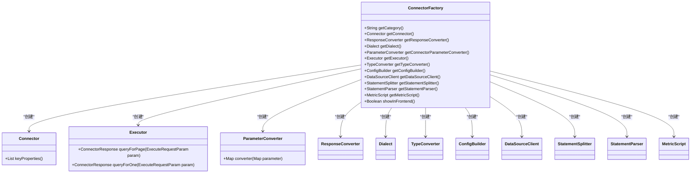
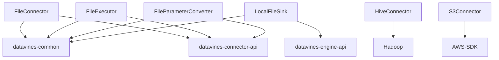

# 文件系统配置

<cite>
**本文档中引用的文件**  
- [FileConnectorFactory.java](file://datavines-connector\datavines-connector-plugins\datavines-connector-file\src\main\java\io\datavines\connector\plugin\FileConnectorFactory.java)
- [FileExecutor.java](file://datavines-connector\datavines-connector-plugins\datavines-connector-file\src\main\java\io\datavines\connector\plugin\FileExecutor.java)
- [FileParameterConverter.java](file://datavines-connector\datavines-connector-plugins\datavines-connector-file\src\main\java\io\datavines\connector\plugin\FileParameterConverter.java)
- [LocalFileSink.java](file://datavines-engine\datavines-engine-plugins\datavines-engine-local\datavines-engine-local-connector-file\src\main\java\io\datavines\engine\local\connector\LocalFileSink.java)
- [FileUtils.java](file://datavines-engine\datavines-engine-plugins\datavines-engine-local\datavines-engine-local-api\src\main\java\io\datavines\engine\local\api\utils\FileUtils.java)
- [ConfigConstants.java](file://datavines-common\src\main\java\io\datavines\common\ConfigConstants.java)
- [submit_job_file_source.json](file://datavines-runner\src\main\resources\submit_job_file_source.json)
- [submit_job_file_storage.json](file://datavines-runner\src\main\resources\submit_job_file_storage.json)
- [HiveConfigBuilder.java](file://datavines-connector\datavines-connector-plugins\datavines-connector-hive\src\main\java\io\datavines\connector\plugin\HiveConfigBuilder.java)
- [KerberosUtils.java](file://datavines-connector\datavines-connector-plugins\datavines-connector-hive\src\main\java\io\datavines\connector\plugin\KerberosUtils.java)
- [common.properties](file://datavines-common\src\main\resources\common.properties)
</cite>

## 目录
1. [简介](#简介)
2. [项目结构](#项目结构)
3. [核心组件](#核心组件)
4. [架构概述](#架构概述)
5. [详细组件分析](#详细组件分析)
6. [依赖分析](#依赖分析)
7. [性能考虑](#性能考虑)
8. [故障排除指南](#故障排除指南)
9. [结论](#结论)

## 简介
DataVines 是一个大数据质量检测平台，支持多种数据源的连接和验证。本文档重点介绍文件系统连接器的配置方法，包括本地文件系统、HDFS 和 S3 存储系统的配置。文档详细说明了文件路径格式、认证方式（如 AWS 凭证、Hadoop 配置）、支持的文件格式（CSV、JSON、Parquet 等）、压缩格式等。此外，还解释了如何配置文件监控、增量读取等高级特性，并提供性能调优建议，如批量读取、缓存策略、并发控制等。最后，说明了如何测试文件系统连接器的连通性和性能。

## 项目结构
DataVines 项目采用模块化设计，主要分为以下几个部分：
- **datavines-connector**: 数据源连接器模块，包含各种数据源的连接器实现。
- **datavines-engine**: 执行引擎模块，负责任务的执行和调度。
- **datavines-common**: 公共工具和配置模块，提供通用的工具类和常量。
- **datavines-server**: 服务器模块，提供 REST API 和 Web 界面。
- **datavines-runner**: 任务运行器模块，负责启动和管理任务执行。



**图源**
- [FileConnectorFactory.java](file://datavines-connector\datavines-connector-plugins\datavines-connector-file\src\main\java\io\datavines\connector\plugin\FileConnectorFactory.java)
- [LocalFileSink.java](file://datavines-engine\datavines-engine-plugins\datavines-engine-local\datavines-engine-local-connector-file\src\main\java\io\datavines\engine\local\connector\LocalFileSink.java)
- [ConfigConstants.java](file://datavines-common\src\main\java\io\datavines\common\ConfigConstants.java)

**节源**
- [FileConnectorFactory.java](file://datavines-connector\datavines-connector-plugins\datavines-connector-file\src\main\java\io\datavines\connector\plugin\FileConnectorFactory.java)
- [LocalFileSink.java](file://datavines-engine\datavines-engine-plugins\datavines-engine-local\datavines-engine-local-connector-file\src\main\java\io\datavines\engine\local\connector\LocalFileSink.java)
- [ConfigConstants.java](file://datavines-common\src\main\java\io\datavines\common\ConfigConstants.java)

## 核心组件
### 文件连接器
文件连接器（FileConnector）是 DataVines 中用于处理文件系统数据源的核心组件。它实现了 `Connector` 接口，提供了基本的连接和查询功能。文件连接器通过 `FileConnectorFactory` 工厂类创建，支持多种文件格式和认证方式。

```java
public class FileConnector implements Connector {
    @Override
    public List<String> keyProperties() {
        return Collections.emptyList();
    }
}
```

**节源**
- [FileConnector.java](file://datavines-connector\datavines-connector-plugins\datavines-connector-file\src\main\java\io\datavines\connector\plugin\FileConnector.java)

### 文件执行器
文件执行器（FileExecutor）负责执行文件系统的查询操作。它实现了 `Executor` 接口，提供了分页查询和单条记录查询的功能。文件执行器通过 `FileExecutor` 类实现，支持 CSV、JSON、Parquet 等多种文件格式。

```java
@Slf4j
public class FileExecutor implements Executor {
    @Override
    public ConnectorResponse queryForPage(ExecuteRequestParam param) throws Exception {
        ConnectorResponse.ConnectorResponseBuilder builder = ConnectorResponse.builder();

        int pageNumber = param.getPageNumber();
        int pageSize  = param.getPageSize();

        Map<String,String> parameterMap = JSONUtils.toMap(param.getDataSourceParam(), String.class, String.class);
        String dir = parameterMap.get("data_dir");
        String filePath = dir +"/" + param.getScript() ;

        if (FileUtils.isExist(filePath)) {
            if (pageNumber < 1) {
                pageNumber = 1;
            }

            if (pageSize < 1) {
                pageSize = 10;
            }

            builder.result(readForPage(filePath, pageNumber, pageSize, parameterMap.get("column_separator")));
        }

        return builder.build();
    }

    @Override
    public ConnectorResponse queryForOne(ExecuteRequestParam param) throws Exception {
        ConnectorResponse.ConnectorResponseBuilder builder = ConnectorResponse.builder();

        Map<String,String> parameterMap = JSONUtils.toMap(param.getDataSourceParam(), String.class, String.class);
        String dir = parameterMap.get("data_dir");
        String filePath = dir +"/" + param.getScript();
        builder.result(readForPage(filePath,1, 2, parameterMap.get("column_separator")));
        return builder.build();
    }
}
```

**节源**
- [FileExecutor.java](file://datavines-connector\datavines-connector-plugins\datavines-connector-file\src\main\java\io\datavines\connector\plugin\FileExecutor.java)

### 文件参数转换器
文件参数转换器（FileParameterConverter）负责将用户输入的参数转换为文件系统连接器所需的格式。它实现了 `ParameterConverter` 接口，支持多种参数类型和格式。

```java
public class FileParameterConverter implements ParameterConverter {
    @Override
    public Map<String, Object> converter(Map<String, Object> parameter) {
        return parameter;
    }
}
```

**节源**
- [FileParameterConverter.java](file://datavines-connector\datavines-connector-plugins\datavines-connector-file\src\main\java\io\datavines\connector\plugin\FileParameterConverter.java)

## 架构概述
DataVines 的文件系统连接器架构主要包括以下几个部分：
- **连接器工厂**：负责创建和管理连接器实例。
- **连接器**：提供基本的连接和查询功能。
- **执行器**：负责执行具体的查询操作。
- **参数转换器**：负责将用户输入的参数转换为连接器所需的格式。
- **响应转换器**：负责将查询结果转换为用户友好的格式。



**图源**
- [FileConnectorFactory.java](file://datavines-connector\datavines-connector-plugins\datavines-connector-file\src\main\java\io\datavines\connector\plugin\FileConnectorFactory.java)

**节源**
- [FileConnectorFactory.java](file://datavines-connector\datavines-connector-plugins\datavines-connector-file\src\main\java\io\datavines\connector\plugin\FileConnectorFactory.java)

## 详细组件分析
### 文件连接器工厂
文件连接器工厂（FileConnectorFactory）是文件连接器的创建工厂，负责创建和管理文件连接器实例。它实现了 `ConnectorFactory` 接口，提供了创建连接器、执行器、参数转换器等组件的方法。

```java
public class FileConnectorFactory implements ConnectorFactory {
    @Override
    public String getCategory() {
        return "file";
    }

    @Override
    public Connector getConnector() {
        return new FileConnector();
    }

    @Override
    public ResponseConverter getResponseConverter() {
        return new FileResponseConverter();
    }

    @Override
    public Dialect getDialect() {
        return new FileDialect();
    }

    @Override
    public ParameterConverter getConnectorParameterConverter() {
        return new FileParameterConverter();
    }

    @Override
    public Executor getExecutor() {
        return new FileExecutor();
    }

    @Override
    public TypeConverter getTypeConverter() {
        return new FileTypeConverter();
    }

    @Override
    public ConfigBuilder getConfigBuilder() {
        return null;
    }

    @Override
    public DataSourceClient getDataSourceClient() {
        return null;
    }

    @Override
    public StatementSplitter getStatementSplitter() {
        return null;
    }

    @Override
    public StatementParser getStatementParser() {
        return null;
    }

    @Override
    public MetricScript getMetricScript() {
        return null;
    }

    @Override
    public Boolean showInFrontend() {
        return false;
    }
}
```

**节源**
- [FileConnectorFactory.java](file://datavines-connector\datavines-connector-plugins\datavines-connector-file\src\main\java\io\datavines\connector\plugin\FileConnectorFactory.java)

### 文件执行器
文件执行器（FileExecutor）负责执行文件系统的查询操作。它实现了 `Executor` 接口，提供了分页查询和单条记录查询的功能。文件执行器通过 `FileExecutor` 类实现，支持 CSV、JSON、Parquet 等多种文件格式。

```java
@Slf4j
public class FileExecutor implements Executor {
    @Override
    public ConnectorResponse queryForPage(ExecuteRequestParam param) throws Exception {
        ConnectorResponse.ConnectorResponseBuilder builder = ConnectorResponse.builder();

        int pageNumber = param.getPageNumber();
        int pageSize  = param.getPageSize();

        Map<String,String> parameterMap = JSONUtils.toMap(param.getDataSourceParam(), String.class, String.class);
        String dir = parameterMap.get("data_dir");
        String filePath = dir +"/" + param.getScript() ;

        if (FileUtils.isExist(filePath)) {
            if (pageNumber < 1) {
                pageNumber = 1;
            }

            if (pageSize < 1) {
                pageSize = 10;
            }

            builder.result(readForPage(filePath, pageNumber, pageSize, parameterMap.get("column_separator")));
        }

        return builder.build();
    }

    @Override
    public ConnectorResponse queryForOne(ExecuteRequestParam param) throws Exception {
        ConnectorResponse.ConnectorResponseBuilder builder = ConnectorResponse.builder();

        Map<String,String> parameterMap = JSONUtils.toMap(param.getDataSourceParam(), String.class, String.class);
        String dir = parameterMap.get("data_dir");
        String filePath = dir +"/" + param.getScript();
        builder.result(readForPage(filePath,1, 2, parameterMap.get("column_separator")));
        return builder.build();
    }
}
```

**节源**
- [FileExecutor.java](file://datavines-connector\datavines-connector-plugins\datavines-connector-file\src\main\java\io\datavines\connector\plugin\FileExecutor.java)

### 文件参数转换器
文件参数转换器（FileParameterConverter）负责将用户输入的参数转换为文件系统连接器所需的格式。它实现了 `ParameterConverter` 接口，支持多种参数类型和格式。

```java
public class FileParameterConverter implements ParameterConverter {
    @Override
    public Map<String, Object> converter(Map<String, Object> parameter) {
        return parameter;
    }
}
```

**节源**
- [FileParameterConverter.java](file://datavines-connector\datavines-connector-plugins\datavines-connector-file\src\main\java\io\datavines\connector\plugin\FileParameterConverter.java)

## 依赖分析
DataVines 的文件系统连接器依赖于多个模块和库，主要包括：
- **datavines-common**: 提供通用的工具类和常量。
- **datavines-connector-api**: 提供连接器接口和基类。
- **datavines-engine-api**: 提供执行引擎接口和基类。
- **Hadoop**: 用于 HDFS 文件系统的访问。
- **AWS SDK**: 用于 S3 文件系统的访问。



**图源**
- [FileConnectorFactory.java](file://datavines-connector\datavines-connector-plugins\datavines-connector-file\src\main\java\io\datavines\connector\plugin\FileConnectorFactory.java)
- [LocalFileSink.java](file://datavines-engine\datavines-engine-plugins\datavines-engine-local\datavines-engine-local-connector-file\src\main\java\io\datavines\engine\local\connector\LocalFileSink.java)
- [HiveConfigBuilder.java](file://datavines-connector\datavines-connector-plugins\datavines-connector-hive\src\main\java\io\datavines\connector\plugin\HiveConfigBuilder.java)
- [KerberosUtils.java](file://datavines-connector\datavines-connector-plugins\datavines-connector-hive\src\main\java\io\datavines\connector\plugin\KerberosUtils.java)

**节源**
- [FileConnectorFactory.java](file://datavines-connector\datavines-connector-plugins\datavines-connector-file\src\main\java\io\datavines\connector\plugin\FileConnectorFactory.java)
- [LocalFileSink.java](file://datavines-engine\datavines-engine-plugins\datavines-engine-local\datavines-engine-local-connector-file\src\main\java\io\datavines\engine\local\connector\LocalFileSink.java)
- [HiveConfigBuilder.java](file://datavines-connector\datavines-connector-plugins\datavines-connector-hive\src\main\java\io\datavines\connector\plugin\HiveConfigBuilder.java)
- [KerberosUtils.java](file://datavines-connector\datavines-connector-plugins\datavines-connector-hive\src\main\java\io\datavines\connector\plugin\KerberosUtils.java)

## 性能考虑
为了提高文件系统连接器的性能，可以采取以下措施：
- **批量读取**：通过设置合适的批量大小，减少 I/O 操作次数。
- **缓存策略**：使用缓存机制，减少重复读取文件的开销。
- **并发控制**：通过多线程或异步操作，提高文件读取的并发度。
- **压缩格式**：使用高效的压缩格式，减少文件传输和存储的开销。

## 故障排除指南
### 连接问题
- **检查文件路径**：确保文件路径正确无误。
- **检查权限**：确保有足够的权限访问文件。
- **检查网络**：对于远程文件系统，确保网络连接正常。

### 性能问题
- **检查批量大小**：调整批量大小，找到最佳性能点。
- **检查缓存**：确保缓存机制正常工作。
- **检查并发度**：调整并发度，避免资源竞争。

## 结论
DataVines 的文件系统连接器提供了强大的文件系统访问能力，支持多种文件格式和认证方式。通过合理的配置和优化，可以显著提高文件读取的性能和可靠性。本文档详细介绍了文件系统连接器的配置方法和最佳实践，希望对用户有所帮助。