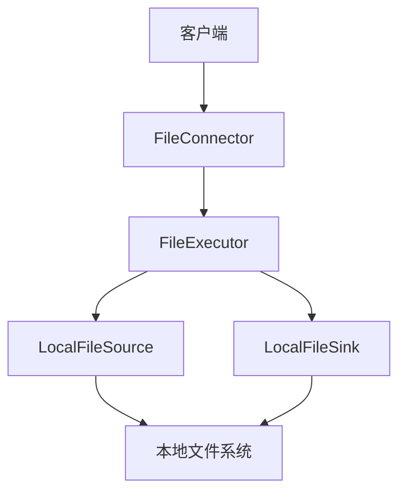
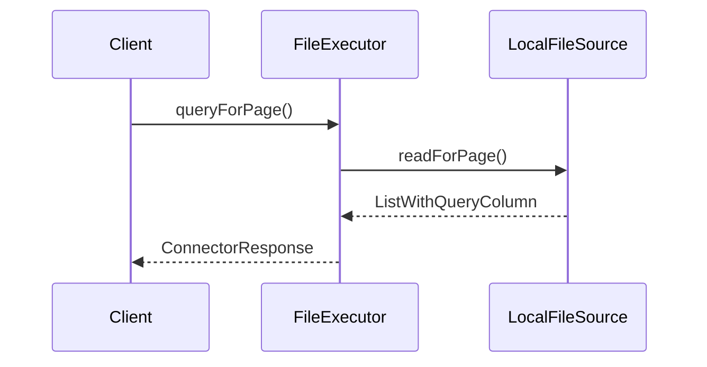
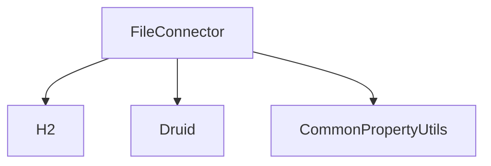

# 本地文件系统配置

<cite>
**本文档中引用的文件**  
- [FileConnector.java](file://datavines-connector/datavines-connector-plugins/datavines-connector-file/src/main/java/io/datavines/connector/plugin/FileConnector.java)
- [FileConnectorFactory.java](file://datavines-connector/datavines-connector-plugins/datavines-connector-file/src/main/java/io/datavines/connector/plugin/FileConnectorFactory.java)
- [FileExecutor.java](file://datavines-connector/datavines-connector-plugins/datavines-connector-file/src/main/java/io/datavines/connector/plugin/FileExecutor.java)
- [FileDialect.java](file://datavines-connector/datavines-connector-plugins/datavines-connector-file/src/main/java/io/datavines/connector/plugin/FileDialect.java)
- [LocalFileSource.java](file://datavines-engine/datavines-engine-plugins/datavines-engine-local/datavines-engine-local-connector-file/src/main/java/io/datavines/engine/local/connector/LocalFileSource.java)
- [LocalFileSink.java](file://datavines-engine/datavines-engine-plugins/datavines-engine-local/datavines-engine-local-connector-file/src/main/java/io/datavines/engine/local/connector/LocalFileSink.java)
- [CommonPropertyUtils.java](file://datavines-common/src/main/java/io/datavines/common/utils/CommonPropertyUtils.java)
- [submit_job_file_source.json](file://datavines-runner/src/main/resources/submit_job_file_source.json)
</cite>

## 目录
1. [简介](#简介)
2. [项目结构](#项目结构)
3. [核心组件](#核心组件)
4. [架构概述](#架构概述)
5. [详细组件分析](#详细组件分析)
6. [依赖分析](#依赖分析)
7. [性能考虑](#性能考虑)
8. [故障排除指南](#故障排除指南)
9. [结论](#结论)

## 简介
本文档详细说明了如何配置本地文件系统连接器，包括本地文件路径、文件权限、文件格式（CSV、JSON、Parquet等）和压缩格式（GZIP、SNAPPY等）的配置。文档还解释了文件读取模式、编码设置、分隔符配置等参数，并提供了配置示例和最佳实践，包括如何处理大文件、文件锁定机制、文件监控等。此外，文档还说明了如何测试本地文件系统连接器的连通性和性能。

## 项目结构
本项目采用模块化设计，主要分为以下几个部分：
- `datavines-connector`: 包含各种数据源连接器的实现，包括本地文件系统连接器。
- `datavines-engine`: 包含执行引擎的实现，支持本地、Spark、Flink等执行模式。
- `datavines-common`: 包含通用工具类和常量定义。
- `datavines-runner`: 包含作业提交和执行的入口。

**本地文件系统连接器相关文件路径：**
- `datavines-connector/datavines-connector-plugins/datavines-connector-file/src/main/java/io/datavines/connector/plugin/`: 本地文件连接器的核心实现。
- `datavines-engine/datavines-engine-plugins/datavines-engine-local/datavines-engine-local-connector-file/src/main/java/io/datavines/engine/local/connector/`: 本地文件源和接收器的实现。

**Section sources**
- [FileConnector.java](file://datavines-connector/datavines-connector-plugins/datavines-connector-file/src/main/java/io/datavines/connector/plugin/FileConnector.java#L1-L31)
- [FileConnectorFactory.java](file://datavines-connector/datavines-connector-plugins/datavines-connector-file/src/main/java/io/datavines/connector/plugin/FileConnectorFactory.java#L1-L88)

## 核心组件
本地文件系统连接器的核心组件包括：
- `FileConnector`: 实现了`Connector`接口，用于连接本地文件系统。
- `FileExecutor`: 负责执行文件读取操作，支持分页查询。
- `LocalFileSource`: 本地文件源，用于从本地文件系统读取数据。
- `LocalFileSink`: 本地文件接收器，用于将数据写入本地文件系统。

**Section sources**
- [FileExecutor.java](file://datavines-connector/datavines-connector-plugins/datavines-connector-file/src/main/java/io/datavines/connector/plugin/FileExecutor.java#L1-L163)
- [LocalFileSource.java](file://datavines-engine/datavines-engine-plugins/datavines-engine-local/datavines-engine-local-connector-file/src/main/java/io/datavines/engine/local/connector/LocalFileSource.java#L1-L144)
- [LocalFileSink.java](file://datavines-engine/datavines-engine-plugins/datavines-engine-local/datavines-engine-local-connector-file/src/main/java/io/datavines/engine/local/connector/LocalFileSink.java#L1-L161)

## 架构概述
本地文件系统连接器的架构如下图所示：

**Diagram sources**
- [FileConnector.java](file://datavines-connector/datavines-connector-plugins/datavines-connector-file/src/main/java/io/datavines/connector/plugin/FileConnector.java#L1-L31)
- [FileExecutor.java](file://datavines-connector/datavines-connector-plugins/datavines-connector-file/src/main/java/io/datavines/connector/plugin/FileExecutor.java#L1-L163)
- [LocalFileSource.java](file://datavines-engine/datavines-engine-plugins/datavines-engine-local/datavines-engine-local-connector-file/src/main/java/io/datavines/engine/local/connector/LocalFileSource.java#L1-L144)
- [LocalFileSink.java](file://datavines-engine/datavines-engine-plugins/datavines-engine-local/datavines-engine-local-connector-file/src/main/java/io/datavines/engine/local/connector/LocalFileSink.java#L1-L161)

## 详细组件分析

### FileConnector 分析
`FileConnector`是本地文件系统连接器的核心类，实现了`Connector`接口。它通过`FileConnectorFactory`创建，并提供了连接本地文件系统的能力。

**Section sources**
- [FileConnector.java](file://datavines-connector/datavines-connector-plugins/datavines-connector-file/src/main/java/io/datavines/connector/plugin/FileConnector.java#L1-L31)
- [FileConnectorFactory.java](file://datavines-connector/datavines-connector-plugins/datavines-connector-file/src/main/java/io/datavines/connector/plugin/FileConnectorFactory.java#L1-L88)

### FileExecutor 分析
`FileExecutor`负责执行文件读取操作，支持分页查询。它通过`readForPage`方法读取指定页码和页大小的数据，并返回包含结果列表和列信息的`ListWithQueryColumn`对象。

**Diagram sources**
- [FileExecutor.java](file://datavines-connector/datavines-connector-plugins/datavines-connector-file/src/main/java/io/datavines/connector/plugin/FileExecutor.java#L1-L163)
- [LocalFileSource.java](file://datavines-engine/datavines-engine-plugins/datavines-engine-local/datavines-engine-local-connector-file/src/main/java/io/datavines/engine/local/connector/LocalFileSource.java#L1-L144)

### LocalFileSource 分析
`LocalFileSource`是本地文件源，用于从本地文件系统读取数据。它通过`getConnectionItem`方法创建连接，并使用H2内存数据库将CSV文件加载到内存中进行查询。

**Section sources**
- [LocalFileSource.java](file://datavines-engine/datavines-engine-plugins/datavines-engine-local/datavines-engine-local-connector-file/src/main/java/io/datavines/engine/local/connector/LocalFileSource.java#L1-L144)

### LocalFileSink 分析
`LocalFileSink`是本地文件接收器，用于将数据写入本地文件系统。它支持将验证结果和错误数据写入指定目录。

**Section sources**
- [LocalFileSink.java](file://datavines-engine/datavines-engine-plugins/datavines-engine-local/datavines-engine-local-connector-file/src/main/java/io/datavines/engine/local/connector/LocalFileSink.java#L1-L161)

## 依赖分析
本地文件系统连接器依赖于以下组件：
- `H2`: 用于在内存中创建临时表以查询CSV文件。
- `Druid`: 用于数据库连接池管理。
- `CommonPropertyUtils`: 用于读取配置属性。

**Diagram sources**
- [LocalFileSource.java](file://datavines-engine/datavines-engine-plugins/datavines-engine-local/datavines-engine-local-connector-file/src/main/java/io/datavines/engine/local/connector/LocalFileSource.java#L1-L144)
- [LocalFileSink.java](file://datavines-engine/datavines-engine-plugins/datavines-engine-local/datavines-engine-local-connector-file/src/main/java/io/datavines/engine/local/connector/LocalFileSink.java#L1-L161)
- [CommonPropertyUtils.java](file://datavines-common/src/main/java/io/datavines/common/utils/CommonPropertyUtils.java#L1-L351)

## 性能考虑
- **大文件处理**: 本地文件系统连接器对文件大小有限制，默认最大文件长度为10MB。可以通过配置`file.max.length`属性来调整此限制。
- **文件锁定**: 使用ZooKeeper进行文件锁定，确保在分布式环境中文件的独占访问。
- **文件监控**: 可以通过配置文件监控来检测文件的变化并触发相应的操作。

**Section sources**
- [LocalFileSource.java](file://datavines-engine/datavines-engine-plugins/datavines-engine-local/datavines-engine-local-connector-file/src/main/java/io/datavines/engine/local/connector/LocalFileSource.java#L100-L109)
- [ZooKeeperClient.java](file://datavines-common/src/main/java/io/datavines/common/zookeeper/ZooKeeperClient.java#L206-L224)

## 故障排除指南
- **文件路径错误**: 确保配置的文件路径正确且文件存在。
- **文件格式错误**: 确保文件格式符合预期，特别是CSV文件的分隔符和编码。
- **权限问题**: 确保应用程序有读取和写入文件的权限。
- **大文件处理失败**: 检查文件大小是否超过配置的最大文件长度。

**Section sources**
- [LocalFileSource.java](file://datavines-engine/datavines-engine-plugins/datavines-engine-local/datavines-engine-local-connector-file/src/main/java/io/datavines/engine/local/connector/LocalFileSource.java#L100-L109)
- [LocalFileSink.java](file://datavines-engine/datavines-engine-plugins/datavines-engine-local/datavines-engine-local-connector-file/src/main/java/io/datavines/engine/local/connector/LocalFileSink.java#L120-L160)

## 结论
本文档详细介绍了本地文件系统连接器的配置和使用方法。通过合理配置文件路径、格式、权限等参数，可以高效地处理本地文件数据。同时，通过最佳实践和故障排除指南，可以确保系统的稳定性和性能。