# 连接器配置

<cite>
**本文档中引用的文件**  
- [Connector.java](file://datavines-connector/datavines-connector-api/src/main/java/io/datavines/connector/api/Connector.java)
- [Dialect.java](file://datavines-connector/datavines-connector-api/src/main/java/io/datavines/connector/api/Dialect.java)
- [DataSourceClient.java](file://datavines-connector/datavines-connector-api/src/main/java/io/datavines/connector/api/DataSourceClient.java)
- [Executor.java](file://datavines-connector/datavines-connector-api/src/main/java/io/datavines/connector/api/Executor.java)
- [JdbcDataSourceManager.java](file://datavines-common/src/main/java/io/datavines/common/datasource/jdbc/JdbcDataSourceManager.java)
- [JdbcConnector.java](file://datavines-connector/datavines-connector-plugins/datavines-connector-jdbc/src/main/java/io/datavines/connector/plugin/JdbcConnector.java)
- [JdbcDialect.java](file://datavines-connector/datavines-connector-plugins/datavines-connector-jdbc/src/main/java/io/datavines/connector/plugin/JdbcDialect.java)
- [BaseJdbcExecutor.java](file://datavines-connector/datavines-connector-plugins/datavines-connector-jdbc/src/main/java/io/datavines/connector/plugin/BaseJdbcExecutor.java)
- [JdbcConnectionInfo.java](file://datavines-common/src/main/java/io/datavines/common/datasource/jdbc/JdbcConnectionInfo.java)
- [BaseJdbcDataSourceInfo.java](file://datavines-common/src/main/java/io/datavines/common/datasource/jdbc/BaseJdbcDataSourceInfo.java)
- [MysqlConnector.java](file://datavines-connector/datavines-connector-plugins/datavines-connector-mysql/src/main/java/io/datavines/connector/plugin/MysqlConnector.java)
- [PostgreSqlConnector.java](file://datavines-connector/datavines-connector-plugins/datavines-connector-postgresql/src/main/java/io/datavines/connector/plugin/PostgreSqlConnector.java)
- [HiveConnector.java](file://datavines-connector/datavines-connector-plugins/datavines-connector-hive/src/main/java/io/datavines/connector/plugin/HiveConnector.java)
- [DorisConnector.java](file://datavines-connector/datavines-connector-plugins/datavines-connector-doris/src/main/java/io/datavines/connector/plugin/DorisConnector.java)
- [DorisDataSourceInfo.java](file://datavines-connector/datavines-connector-plugins/datavines-connector-doris/src/main/java/io/datavines/connector/plugin/DorisDataSourceInfo.java)
- [DorisParameterConverter.java](file://datavines-connector/datavines-connector-plugins/datavines-connector-doris/src/main/java/io/datavines/connector/plugin/DorisParameterConverter.java)
- [DorisConfigBuilder.java](file://datavines-connector/datavines-connector-plugins/datavines-connector-doris/src/main/java/io/datavines/connector/plugin/DorisConfigBuilder.java)
- [ConfigConstants.java](file://datavines-common/src/main/java/io/datavines/common/ConfigConstants.java)
</cite>

## 更新摘要
**变更内容**   
- 新增Doris连接器多目录(catalog)配置参数说明
- 添加CATALOG参数的使用方法和默认目录(internal)配置
- 更新JDBC连接器配置章节，包含Doris特有的目录切换机制
- 增加Doris连接器的连接测试和性能优化建议

## 目录
1. [简介](#简介)
2. [连接器架构](#连接器架构)
3. [核心组件](#核心组件)
4. [数据源配置](#数据源配置)
5. [JDBC连接器配置](#jdbc连接器配置)
6. [高级连接选项](#高级连接选项)
7. [连接池配置](#连接池配置)
8. [连接测试](#连接测试)
9. [性能调优建议](#性能调优建议)
10. [自定义连接器开发](#自定义连接器开发)

## 简介

DataVines支持多种数据源连接器，包括MySQL、PostgreSQL、Oracle、SQL Server、Hive、Spark、Flink等。本文档详细说明了这些连接器的配置方法，包括连接参数、认证方式、连接池配置、超时设置等。同时，文档还解释了如何配置JDBC连接字符串、Kerberos认证等高级选项，并提供了连接器性能调优建议，如连接复用、批量操作等。最后，文档说明了如何开发和集成自定义连接器，以及如何测试连接器的连通性。

**新增** DataVines现已支持Doris连接器，该连接器具有独特的多目录(catalog)配置能力，允许用户在连接时指定不同的数据目录，并提供默认的internal目录配置。

## 连接器架构

DataVines的连接器架构基于插件化设计，通过统一的接口实现不同数据源的连接和操作。核心架构包括连接器（Connector）、数据源客户端（DataSourceClient）、执行器（Executor）和方言（Dialect）四个主要组件。

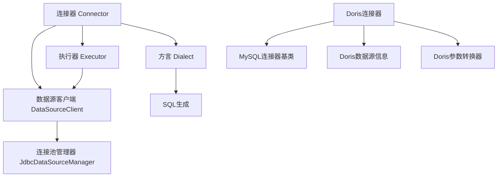
```mermaid
graph TD
Connector[连接器 Connector] --> DataSourceClient[数据源客户端 DataSourceClient]
Connector --> Executor[执行器 Executor]
Connector --> Dialect[方言 Dialect]
DataSourceClient --> JdbcDataSourceManager[连接池管理器 JdbcDataSourceManager]
Executor --> DataSourceClient
Dialect --> SQL[SQL生成]
DorisConnector[Doris连接器] --> MysqlConnector[MySQL连接器基类]
DorisConnector --> DorisDataSourceInfo[Doris数据源信息]
DorisConnector --> DorisParameterConverter[Doris参数转换器]
```

**图表来源**  
- [Connector.java](file://datavines-connector/datavines-connector-api/src/main/java/io/datavines/connector/api/Connector.java)
- [DataSourceClient.java](file://datavines-connector/datavines-connector-api/src/main/java/io/datavines/connector/api/DataSourceClient.java)
- [Executor.java](file://datavines-connector/datavines-connector-api/src/main/java/io/datavines/connector/api/Executor.java)
- [Dialect.java](file://datavines-connector/datavines-connector-api/src/main/java/io/datavines/connector/api/Dialect.java)
- [JdbcDataSourceManager.java](file://datavines-common/src/main/java/io/datavines/common/datasource/jdbc/JdbcDataSourceManager.java)
- [DorisConnector.java](file://datavines-connector/datavines-connector-plugins/datavines-connector-doris/src/main/java/io/datavines/connector/plugin/DorisConnector.java)

## 核心组件

DataVines连接器的核心组件包括连接器接口、数据源客户端、执行器和方言。这些组件共同协作，实现对不同数据源的统一访问和操作。

**组件来源**  
- [Connector.java](file://datavines-connector/datavines-connector-api/src/main/java/io/datavines/connector/api/Connector.java)
- [DataSourceClient.java](file://datavines-connector/datavines-connector-api/src/main/java/io/datavines/connector/api/DataSourceClient.java)
- [Executor.java](file://datavines-connector/datavines-connector-api/src/main/java/io/datavines/connector/api/Executor.java)
- [Dialect.java](file://datavines-connector/datavines-connector-api/src/main/java/io/datavines/connector/api/Dialect.java)

### 连接器接口

连接器接口（Connector）定义了数据源连接的基本操作，包括获取数据库、表、列信息，以及测试连接等。

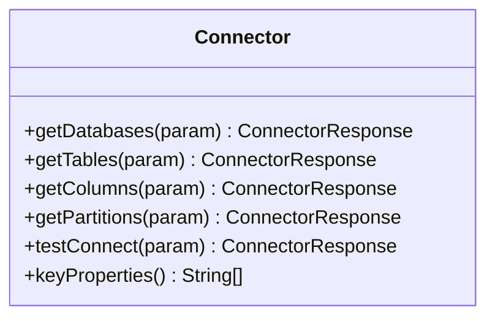
```mermaid
classDiagram
class Connector {
+getDatabases(param) ConnectorResponse
+getTables(param) ConnectorResponse
+getColumns(param) ConnectorResponse
+getPartitions(param) ConnectorResponse
+testConnect(param) ConnectorResponse
+keyProperties() String[]
}
```

**图表来源**  
- [Connector.java](file://datavines-connector/datavines-connector-api/src/main/java/io/datavines/connector/api/Connector.java)

### 数据源客户端

数据源客户端（DataSourceClient）负责管理数据源连接，提供获取数据源和连接的方法。

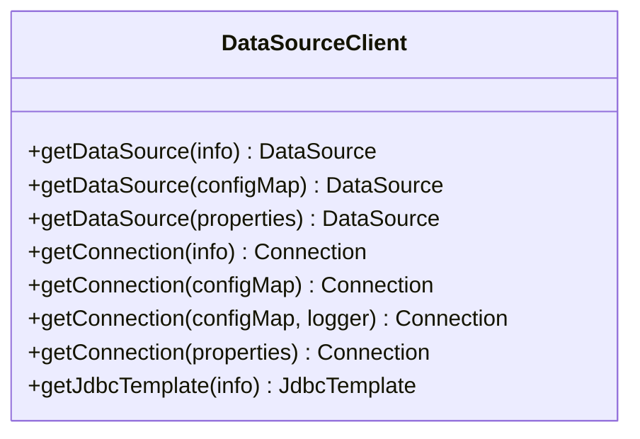
```mermaid
classDiagram
class DataSourceClient {
+getDataSource(info) DataSource
+getDataSource(configMap) DataSource
+getDataSource(properties) DataSource
+getConnection(info) Connection
+getConnection(configMap) Connection
+getConnection(configMap, logger) Connection
+getConnection(properties) Connection
+getJdbcTemplate(info) JdbcTemplate
}
```

**图表来源**  
- [DataSourceClient.java](file://datavines-connector/datavines-connector-api/src/main/java/io/datavines/connector/api/DataSourceClient.java)

### 执行器

执行器（Executor）负责执行SQL脚本和查询操作。

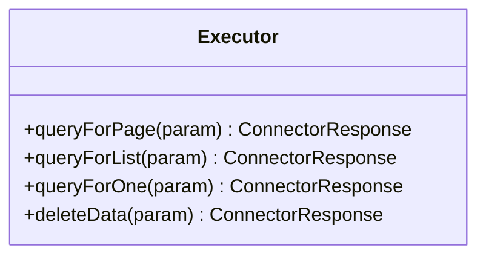
```mermaid
classDiagram
class Executor {
+queryForPage(param) ConnectorResponse
+queryForList(param) ConnectorResponse
+queryForOne(param) ConnectorResponse
+deleteData(param) ConnectorResponse
}
```

**图表来源**  
- [Executor.java](file://datavines-connector/datavines-connector-api/src/main/java/io/datavines/connector/api/Executor.java)

### 方言

方言（Dialect）定义了特定数据库的SQL语法和特性。

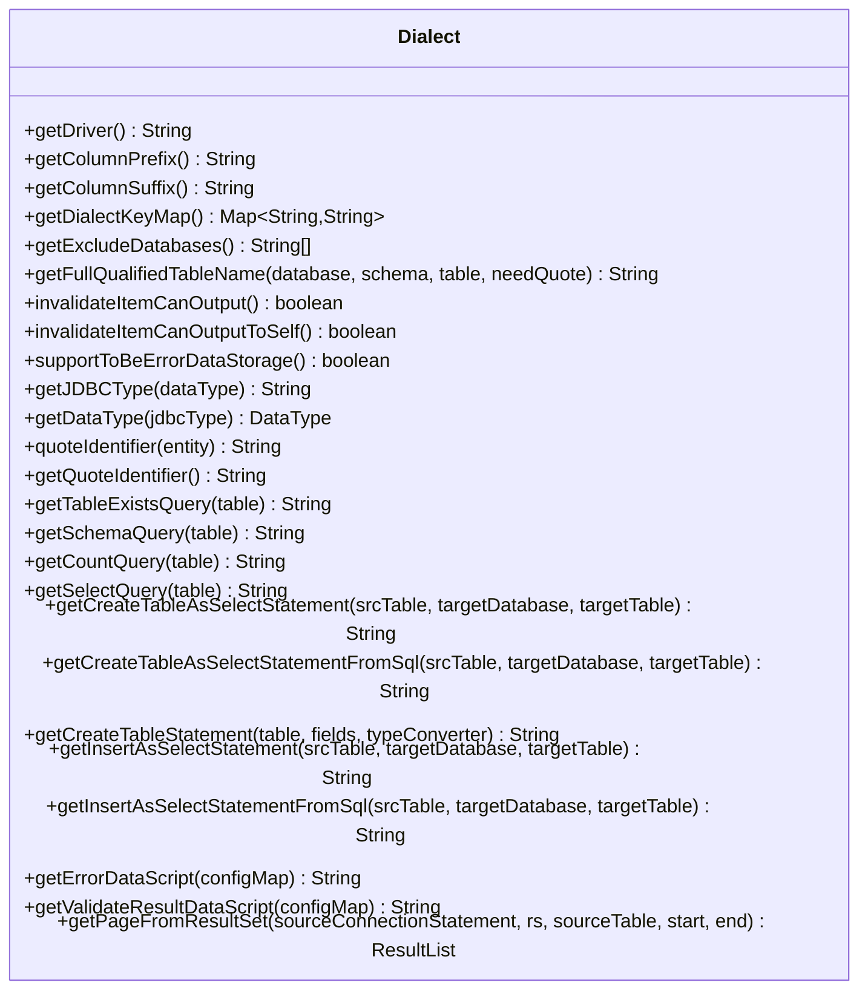
```mermaid
classDiagram
class Dialect {
+getDriver() String
+getColumnPrefix() String
+getColumnSuffix() String
+getDialectKeyMap() Map~String,String~
+getExcludeDatabases() String[]
+getFullQualifiedTableName(database, schema, table, needQuote) String
+invalidateItemCanOutput() boolean
+invalidateItemCanOutputToSelf() boolean
+supportToBeErrorDataStorage() boolean
+getJDBCType(dataType) String
+getDataType(jdbcType) DataType
+quoteIdentifier(entity) String
+getQuoteIdentifier() String
+getTableExistsQuery(table) String
+getSchemaQuery(table) String
+getCountQuery(table) String
+getSelectQuery(table) String
+getCreateTableAsSelectStatement(srcTable, targetDatabase, targetTable) String
+getCreateTableAsSelectStatementFromSql(srcTable, targetDatabase, targetTable) String
+getCreateTableStatement(table, fields, typeConverter) String
+getInsertAsSelectStatement(srcTable, targetDatabase, targetTable) String
+getInsertAsSelectStatementFromSql(srcTable, targetDatabase, targetTable) String
+getErrorDataScript(configMap) String
+getValidateResultDataScript(configMap) String
+getPageFromResultSet(sourceConnectionStatement, rs, sourceTable, start, end) ResultList
}
```

**图表来源**  
- [Dialect.java](file://datavines-connector/datavines-connector-api/src/main/java/io/datavines/connector/api/Dialect.java)

## 数据源配置

DataVines支持多种数据源的配置，每种数据源都有其特定的配置参数。

### 配置参数

所有数据源都支持以下基本配置参数：

- **host**: 数据源地址
- **port**: 端口号
- **database**: 数据库名称
- **user**: 用户名
- **password**: 密码
- **properties**: 连接属性

**新增** **catalog**: 目录类型（仅Doris连接器支持）

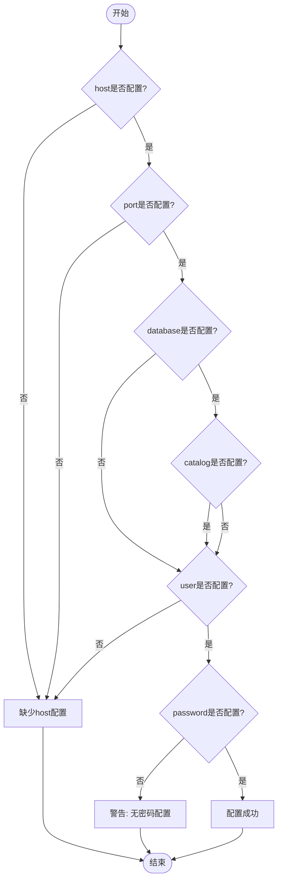
```mermaid
flowchart TD
Start([开始]) --> HostCheck{"host是否配置?"}
HostCheck --> |是| PortCheck{"port是否配置?"}
HostCheck --> |否| Error[缺少host配置]
PortCheck --> |是| DatabaseCheck{"database是否配置?"}
PortCheck --> |否| Error
DatabaseCheck --> |是| CatalogCheck{"catalog是否配置?"}
DatabaseCheck --> |否| UserCheck{"user是否配置?"}
CatalogCheck --> |是| UserCheck
CatalogCheck --> |否| UserCheck
UserCheck --> |是| PasswordCheck{"password是否配置?"}
UserCheck --> |否| Error
PasswordCheck --> |是| Success[配置成功]
PasswordCheck --> |否| Warning[警告: 无密码配置]
Error --> End([结束])
Warning --> End
Success --> End
```

**图表来源**  
- [BaseJdbcDataSourceInfo.java](file://datavines-common/src/main/java/io/datavines/common/datasource/jdbc/BaseJdbcDataSourceInfo.java)
- [JdbcConnectionInfo.java](file://datavines-common/src/main/java/io/datavines/common/datasource/jdbc/JdbcConnectionInfo.java)
- [ConfigConstants.java](file://datavines-common/src/main/java/io/datavines/common/ConfigConstants.java)

## JDBC连接器配置

JDBC连接器是DataVines中最常用的连接器类型，支持多种关系型数据库。

### MySQL连接器

MySQL连接器通过JDBC驱动连接MySQL数据库。

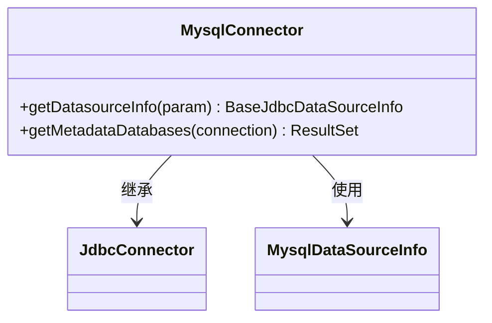
```mermaid
classDiagram
class MysqlConnector {
+getDatasourceInfo(param) BaseJdbcDataSourceInfo
+getMetadataDatabases(connection) ResultSet
}
MysqlConnector --> JdbcConnector : 继承
MysqlConnector --> MysqlDataSourceInfo : 使用
```

**图表来源**  
- [MysqlConnector.java](file://datavines-connector/datavines-connector-plugins/datavines-connector-mysql/src/main/java/io/datavines/connector/plugin/MysqlConnector.java)
- [JdbcConnector.java](file://datavines-connector/datavines-connector-plugins/datavines-connector-jdbc/src/main/java/io/datavines/connector/plugin/JdbcConnector.java)

### PostgreSQL连接器

PostgreSQL连接器支持PostgreSQL数据库的连接和操作。

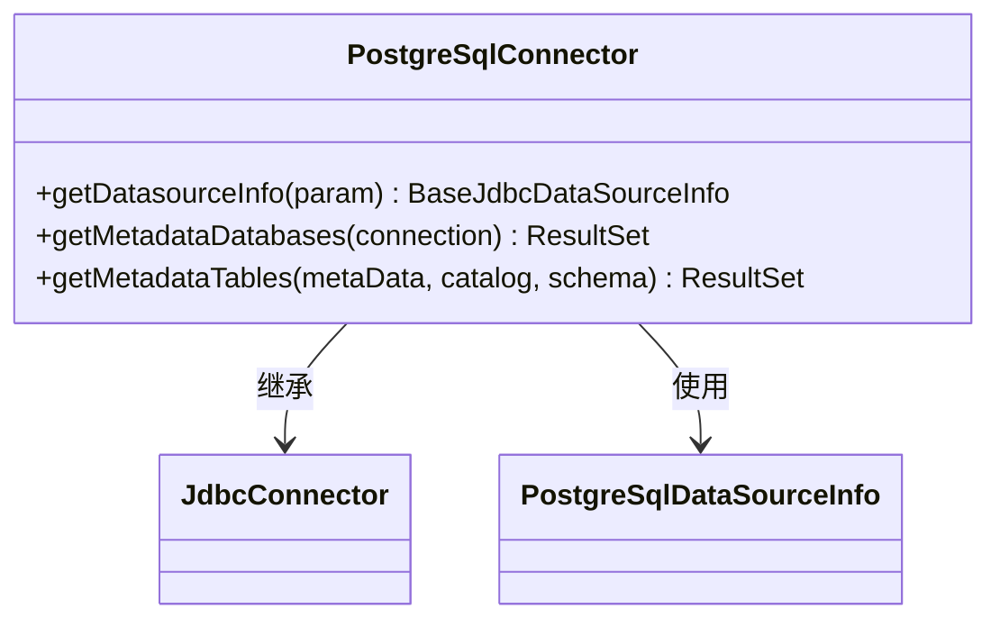
```mermaid
classDiagram
class PostgreSqlConnector {
+getDatasourceInfo(param) BaseJdbcDataSourceInfo
+getMetadataDatabases(connection) ResultSet
+getMetadataTables(metaData, catalog, schema) ResultSet
}
PostgreSqlConnector --> JdbcConnector : 继承
PostgreSqlConnector --> PostgreSqlDataSourceInfo : 使用
```

**图表来源**  
- [PostgreSqlConnector.java](file://datavines-connector/datavines-connector-plugins/datavines-connector-postgresql/src/main/java/io/datavines/connector/plugin/PostgreSqlConnector.java)
- [JdbcConnector.java](file://datavines-connector/datavines-connector-plugins/datavines-connector-jdbc/src/main/java/io/datavines/connector/plugin/JdbcConnector.java)

### **新增** Doris连接器

Doris连接器支持Apache Doris数据库的连接和操作，具有独特的多目录(catalog)配置能力。

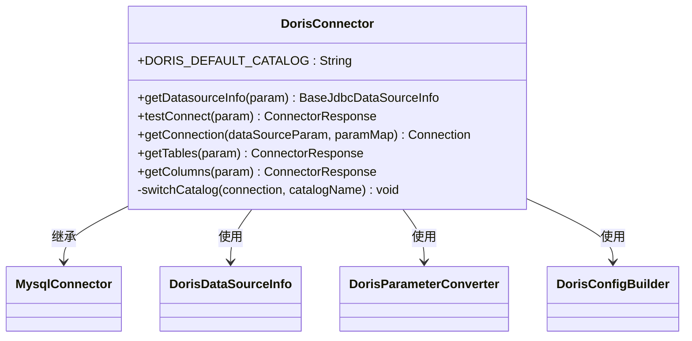
```mermaid
classDiagram
class DorisConnector {
+DORIS_DEFAULT_CATALOG : String
+getDatasourceInfo(param) BaseJdbcDataSourceInfo
+testConnect(param) ConnectorResponse
+getConnection(dataSourceParam, paramMap) Connection
+getTables(param) ConnectorResponse
+getColumns(param) ConnectorResponse
-switchCatalog(connection, catalogName) void
}
DorisConnector --> MysqlConnector : 继承
DorisConnector --> DorisDataSourceInfo : 使用
DorisConnector --> DorisParameterConverter : 使用
DorisConnector --> DorisConfigBuilder : 使用
```

**图表来源**  
- [DorisConnector.java](file://datavines-connector/datavines-connector-plugins/datavines-connector-doris/src/main/java/io/datavines/connector/plugin/DorisConnector.java)
- [MysqlConnector.java](file://datavines-connector/datavines-connector-plugins/datavines-connector-mysql/src/main/java/io/datavines/connector/plugin/MysqlConnector.java)

#### **新增** Doris连接器配置参数

Doris连接器支持以下配置参数：

- **host**: Doris服务器地址
- **port**: 端口号（默认：9030）
- **catalog**: 目录类型（可选，默认：internal）
- **database**: 数据库名称
- **user**: 用户名
- **password**: 密码
- **properties**: 连接属性

**新增** **CATALOG参数使用方法**：

1. **指定目录类型**：在连接参数中设置`catalog`字段
2. **默认目录**：未指定时自动使用`internal`目录
3. **目录切换**：连接建立后自动执行`SWITCH`命令切换到指定目录

**新增** **目录切换机制**：

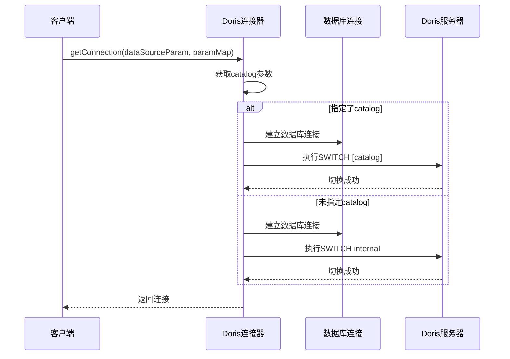
```mermaid
sequenceDiagram
participant Client as 客户端
participant DorisConnector as Doris连接器
participant Connection as 数据库连接
participant Doris as Doris服务器
Client->>DorisConnector : getConnection(dataSourceParam, paramMap)
DorisConnector->>DorisConnector : 获取catalog参数
alt 指定了catalog
DorisConnector->>Connection : 建立数据库连接
DorisConnector->>Doris : 执行SWITCH [catalog]
Doris-->>DorisConnector : 切换成功
else 未指定catalog
DorisConnector->>Connection : 建立数据库连接
DorisConnector->>Doris : 执行SWITCH internal
Doris-->>DorisConnector : 切换成功
end
DorisConnector-->>Client : 返回连接
```

**图表来源**  
- [DorisConnector.java](file://datavines-connector/datavines-connector-plugins/datavines-connector-doris/src/main/java/io/datavines/connector/plugin/DorisConnector.java)

#### **新增** Doris连接器URL构建

Doris连接器根据是否指定catalog动态构建JDBC URL：

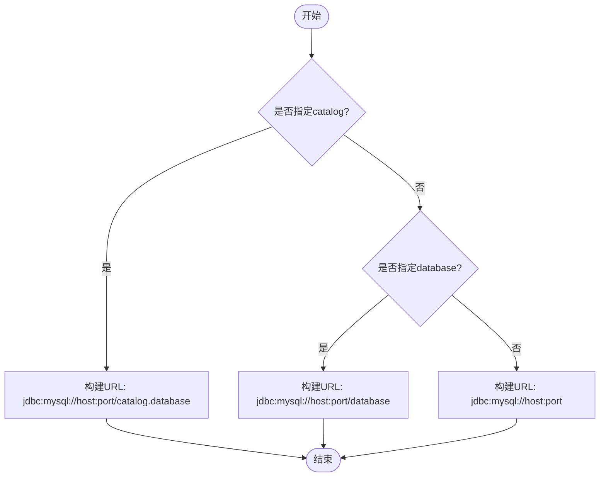
```mermaid
flowchart TD
Start([开始]) --> CheckCatalog{"是否指定catalog?"}
CheckCatalog --> |是| BuildCatalogUrl[构建URL: jdbc:mysql://host:port/catalog.database]
CheckCatalog --> |否| CheckDatabase{"是否指定database?"}
BuildCatalogUrl --> End([结束])
CheckDatabase --> |是| BuildDatabaseUrl[构建URL: jdbc:mysql://host:port/database]
CheckDatabase --> |否| BuildDefaultUrl[构建URL: jdbc:mysql://host:port]
BuildDatabaseUrl --> End
BuildDefaultUrl --> End
```

**图表来源**  
- [DorisParameterConverter.java](file://datavines-connector/datavines-connector-plugins/datavines-connector-doris/src/main/java/io/datavines/connector/plugin/DorisParameterConverter.java)
- [DorisDataSourceInfo.java](file://datavines-connector/datavines-connector-plugins/datavines-connector-doris/src/main/java/io/datavines/connector/plugin/DorisDataSourceInfo.java)

## 高级连接选项

DataVines支持多种高级连接选项，包括JDBC连接字符串配置和Kerberos认证。

### JDBC连接字符串

JDBC连接字符串的配置遵循标准的JDBC格式。

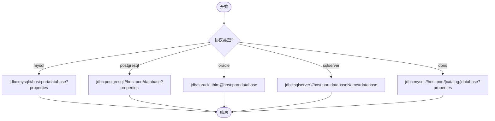
```mermaid
flowchart TD
Start([开始]) --> Protocol{"协议类型?"}
Protocol --> |mysql| MysqlFormat["jdbc:mysql://host:port/database?properties"]
Protocol --> |postgresql| PostgreSqlFormat["jdbc:postgresql://host:port/database?properties"]
Protocol --> |oracle| OracleFormat["jdbc:oracle:thin:@host:port:database"]
Protocol --> |sqlserver| SqlServerFormat["jdbc:sqlserver://host:port;databaseName=database"]
Protocol --> |doris| DorisFormat["jdbc:mysql://host:port/[catalog.]database?properties"]
MysqlFormat --> End([结束])
PostgreSqlFormat --> End
OracleFormat --> End
SqlServerFormat --> End
DorisFormat --> End
```

**图表来源**  
- [BaseJdbcDataSourceInfo.java](file://datavines-common/src/main/java/io/datavines/common/datasource/jdbc/BaseJdbcDataSourceInfo.java)
- [JdbcConnectionInfo.java](file://datavines-common/src/main/java/io/datavines/common/datasource/jdbc/JdbcConnectionInfo.java)
- [DorisParameterConverter.java](file://datavines-connector/datavines-connector-plugins/datavines-connector-doris/src/main/java/io/datavines/connector/plugin/DorisParameterConverter.java)

### Kerberos认证

Hive连接器支持Kerberos认证，需要配置相关参数。

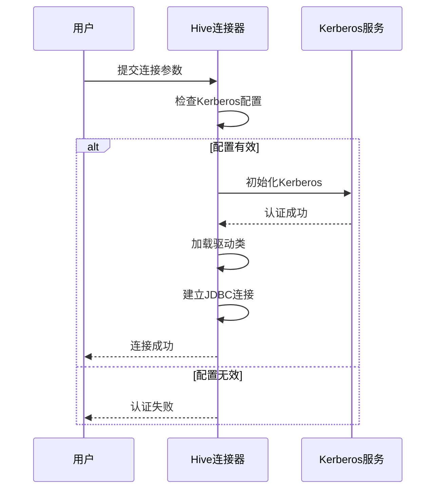
```mermaid
sequenceDiagram
participant User as 用户
participant HiveConnector as Hive连接器
participant Kerberos as Kerberos服务
User->>HiveConnector : 提交连接参数
HiveConnector->>HiveConnector : 检查Kerberos配置
alt 配置有效
HiveConnector->>Kerberos : 初始化Kerberos
Kerberos-->>HiveConnector : 认证成功
HiveConnector->>HiveConnector : 加载驱动类
HiveConnector->>HiveConnector : 建立JDBC连接
HiveConnector-->>User : 连接成功
else 配置无效
HiveConnector-->>User : 认证失败
end
```

**图表来源**  
- [HiveConnector.java](file://datavines-connector/datavines-connector-plugins/datavines-connector-hive/src/main/java/io/datavines/connector/plugin/HiveConnector.java)

## 连接池配置

DataVines使用HikariCP作为默认的连接池实现，提供高效的连接管理。

### 连接池管理

连接池管理器负责创建和管理数据库连接。

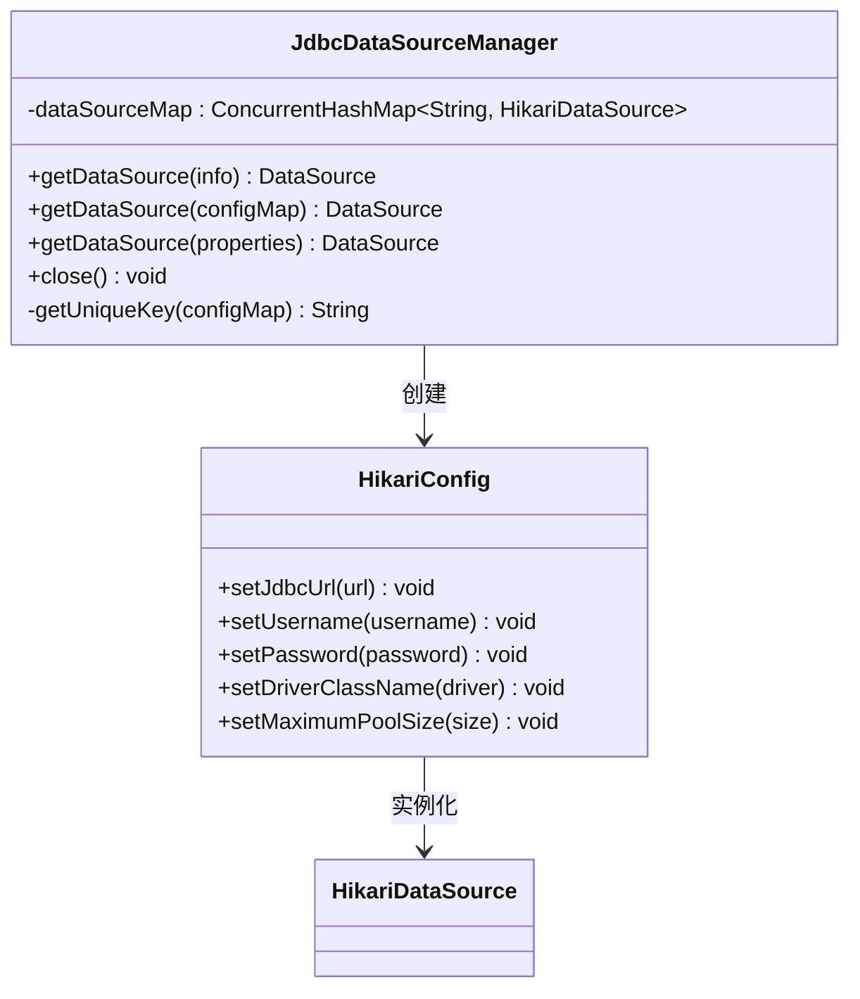
```mermaid
classDiagram
class JdbcDataSourceManager {
-dataSourceMap : ConcurrentHashMap~String, HikariDataSource~
+getDataSource(info) DataSource
+getDataSource(configMap) DataSource
+getDataSource(properties) DataSource
+close() void
-getUniqueKey(configMap) String
}
class HikariConfig {
+setJdbcUrl(url) void
+setUsername(username) void
+setPassword(password) void
+setDriverClassName(driver) void
+setMaximumPoolSize(size) void
}
JdbcDataSourceManager --> HikariConfig : 创建
HikariConfig --> HikariDataSource : 实例化
```

**图表来源**  
- [JdbcDataSourceManager.java](file://datavines-common/src/main/java/io/datavines/common/datasource/jdbc/JdbcDataSourceManager.java)

### 连接池参数

连接池支持以下主要参数配置：

- **maximumPoolSize**: 最大连接数，默认为10
- **connectionTimeout**: 连接超时时间
- **idleTimeout**: 空闲超时时间
- **maxLifetime**: 连接最大生命周期

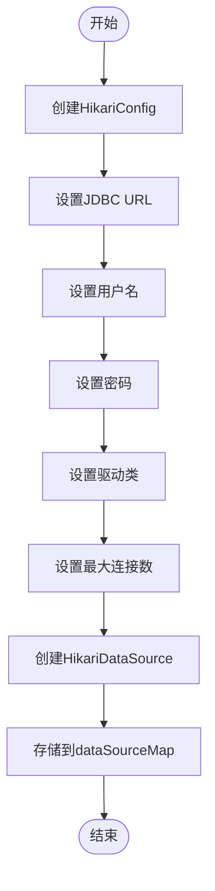
```mermaid
flowchart TD
Start([开始]) --> CreateConfig[创建HikariConfig]
CreateConfig --> SetUrl[设置JDBC URL]
SetUrl --> SetUser[设置用户名]
SetUser --> SetPassword[设置密码]
SetPassword --> SetDriver[设置驱动类]
SetDriver --> SetPoolSize[设置最大连接数]
SetPoolSize --> CreateDataSource[创建HikariDataSource]
CreateDataSource --> Store[存储到dataSourceMap]
Store --> End([结束])
```

**图表来源**  
- [JdbcDataSourceManager.java](file://datavines-common/src/main/java/io/datavines/common/datasource/jdbc/JdbcDataSourceManager.java)

## 连接测试

DataVines提供了连接测试功能，用于验证数据源连接的可用性。

### 连接测试流程

连接测试通过创建临时连接来验证连接参数的正确性。

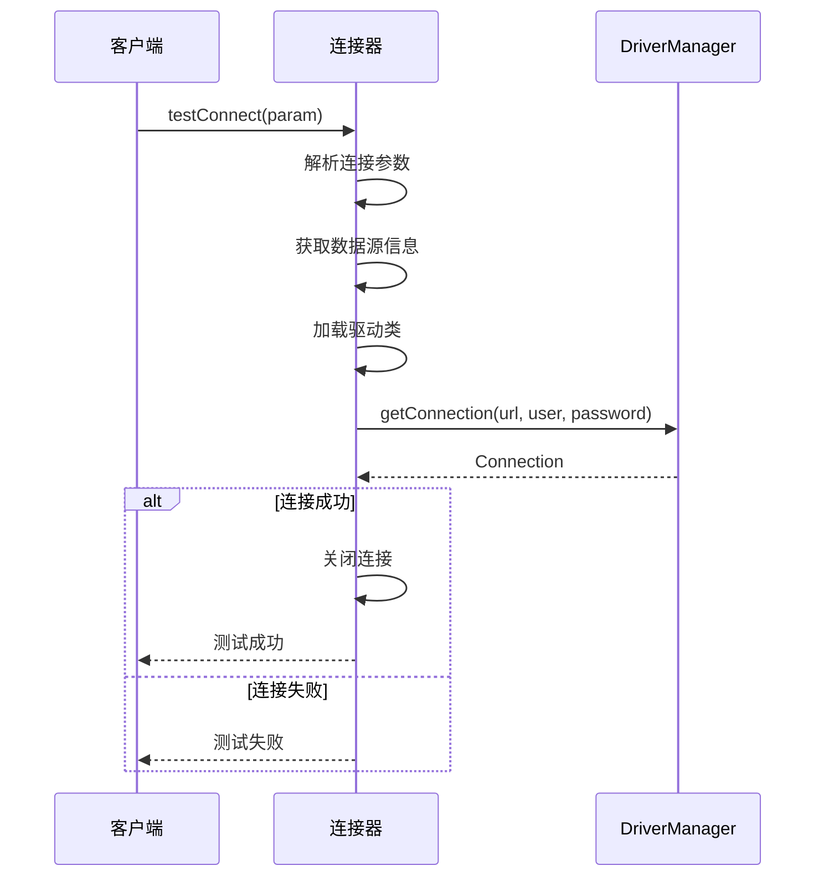
```mermaid
sequenceDiagram
participant Client as 客户端
participant Connector as 连接器
participant DriverManager as DriverManager
Client->>Connector : testConnect(param)
Connector->>Connector : 解析连接参数
Connector->>Connector : 获取数据源信息
Connector->>Connector : 加载驱动类
Connector->>DriverManager : getConnection(url, user, password)
DriverManager-->>Connector : Connection
alt 连接成功
Connector->>Connector : 关闭连接
Connector-->>Client : 测试成功
else 连接失败
Connector-->>Client : 测试失败
end
```

**图表来源**  
- [JdbcConnector.java](file://datavines-connector/datavines-connector-plugins/datavines-connector-jdbc/src/main/java/io/datavines/connector/plugin/JdbcConnector.java)
- [BaseJdbcDataSourceInfo.java](file://datavines-common/src/main/java/io/datavines/common/datasource/jdbc/BaseJdbcDataSourceInfo.java)

**新增** **Doris连接器连接测试**：

Doris连接器的连接测试流程与标准JDBC连接器类似，但会检查目录切换功能：

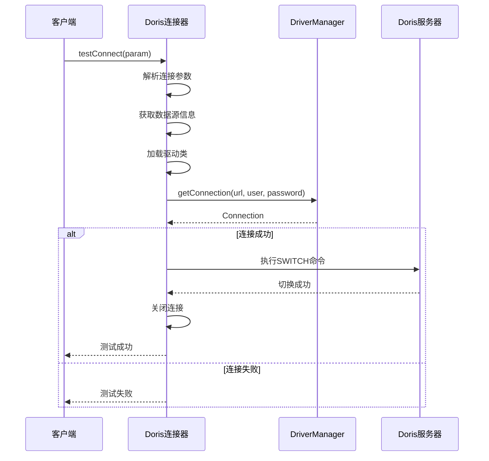
```mermaid
sequenceDiagram
participant Client as 客户端
participant DorisConnector as Doris连接器
participant DriverManager as DriverManager
participant Doris as Doris服务器
Client->>DorisConnector : testConnect(param)
DorisConnector->>DorisConnector : 解析连接参数
DorisConnector->>DorisConnector : 获取数据源信息
DorisConnector->>DorisConnector : 加载驱动类
DorisConnector->>DriverManager : getConnection(url, user, password)
DriverManager-->>DorisConnector : Connection
alt 连接成功
DorisConnector->>Doris : 执行SWITCH命令
Doris-->>DorisConnector : 切换成功
DorisConnector->>DorisConnector : 关闭连接
DorisConnector-->>Client : 测试成功
else 连接失败
DorisConnector-->>Client : 测试失败
end
```

**图表来源**  
- [DorisConnector.java](file://datavines-connector/datavines-connector-plugins/datavines-connector-doris/src/main/java/io/datavines/connector/plugin/DorisConnector.java)

## 性能调优建议

为了提高连接器的性能，建议采用以下调优策略。

### 连接复用

通过连接池实现连接复用，避免频繁创建和销毁连接。

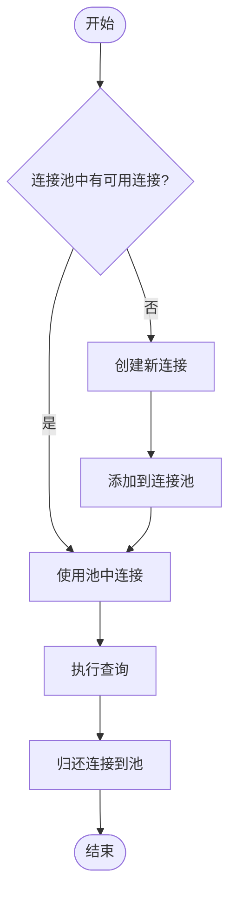
```mermaid
flowchart TD
Start([开始]) --> CheckPool{"连接池中有可用连接?"}
CheckPool --> |是| UseConnection[使用池中连接]
CheckPool --> |否| CreateConnection[创建新连接]
CreateConnection --> AddToPool[添加到连接池]
AddToPool --> UseConnection
UseConnection --> ExecuteQuery[执行查询]
ExecuteQuery --> ReturnConnection[归还连接到池]
ReturnConnection --> End([结束])
```

**图表来源**  
- [JdbcDataSourceManager.java](file://datavines-common/src/main/java/io/datavines/common/datasource/jdbc/JdbcDataSourceManager.java)

### 批量操作

对于大量数据操作，建议使用批量处理来提高效率。

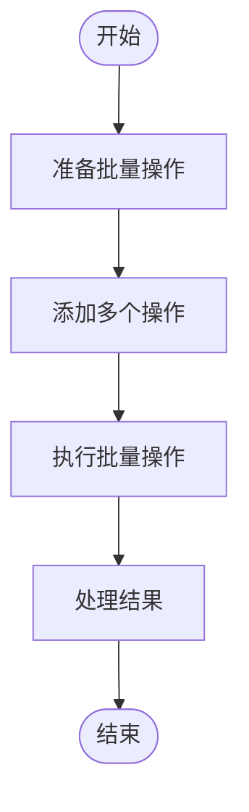
```mermaid
flowchart TD
Start([开始]) --> PrepareBatch[准备批量操作]
PrepareBatch --> AddOperations[添加多个操作]
AddOperations --> ExecuteBatch[执行批量操作]
ExecuteBatch --> ProcessResults[处理结果]
ProcessResults --> End([结束])
```

**图表来源**  
- [BaseJdbcExecutor.java](file://datavines-connector/datavines-connector-plugins/datavines-connector-jdbc/src/main/java/io/datavines/connector/plugin/BaseJdbcExecutor.java)

**新增** **Doris连接器性能优化建议**：

1. **目录预切换**：在连接建立时自动切换到目标目录，避免后续查询中的目录切换开销
2. **连接池优化**：为Doris连接器配置合适的连接池大小，考虑到目录切换的额外开销
3. **批量查询**：利用Doris的批量查询能力，减少网络往返次数
4. **索引优化**：合理使用Doris的分区和索引机制，提高查询性能

## 自定义连接器开发

DataVines支持开发自定义连接器，以支持新的数据源类型。

### 开发步骤

开发自定义连接器需要实现核心接口并注册为插件。

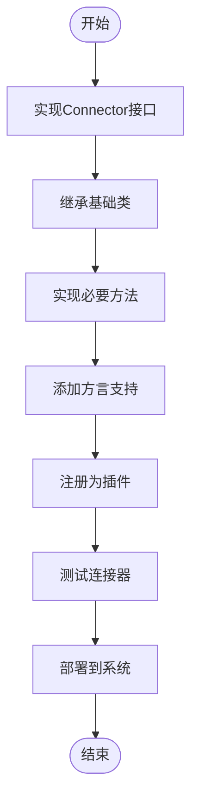
```mermaid
flowchart TD
Start([开始]) --> ImplementInterface[实现Connector接口]
ImplementInterface --> ExtendBase[继承基础类]
ExtendBase --> ImplementMethods[实现必要方法]
ImplementMethods --> AddDialect[添加方言支持]
AddDialect --> RegisterPlugin[注册为插件]
RegisterPlugin --> Test[测试连接器]
Test --> Deploy[部署到系统]
Deploy --> End([结束])
```

**图表来源**  
- [Connector.java](file://datavines-connector/datavines-connector-api/src/main/java/io/datavines/connector/api/Connector.java)
- [JdbcConnector.java](file://datavines-connector/datavines-connector-plugins/datavines-connector-jdbc/src/main/java/io/datavines/connector/plugin/JdbcConnector.java)

### 接口实现

自定义连接器需要实现以下核心方法：

- **getDatabases**: 获取数据库列表
- **getTables**: 获取表列表
- **getColumns**: 获取列信息
- **testConnect**: 测试连接
- **keyProperties**: 返回关键配置属性

**新增** **Doris连接器开发要点**：

1. **继承关系**：Doris连接器继承自MysqlConnector，复用MySQL的大部分功能
2. **目录支持**：实现CATALOG参数解析和目录切换逻辑
3. **URL构建**：根据是否指定catalog动态构建JDBC URL
4. **默认目录**：设置internal为默认目录类型
5. **连接测试**：在连接测试中验证目录切换功能

```mermaid
classDiagram
class CustomConnector {
+getDatabases(param) ConnectorResponse
+getTables(param) ConnectorResponse
+getColumns(param) ConnectorResponse
+testConnect(param) ConnectorResponse
+keyProperties() String[]
}
CustomConnector --> Connector : 实现
DorisConnector --> MysqlConnector : 继承
DorisConnector --> DorisDataSourceInfo : 使用
DorisConnector --> DorisParameterConverter : 使用
```

**图表来源**  
- [Connector.java](file://datavines-connector/datavines-connector-api/src/main/java/io/datavines/connector/api/Connector.java)
- [DorisConnector.java](file://datavines-connector/datavines-connector-plugins/datavines-connector-doris/src/main/java/io/datavines/connector/plugin/DorisConnector.java)