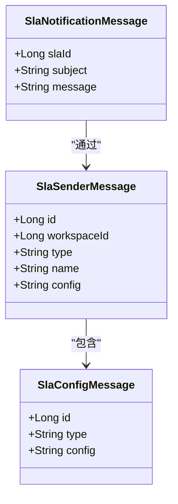
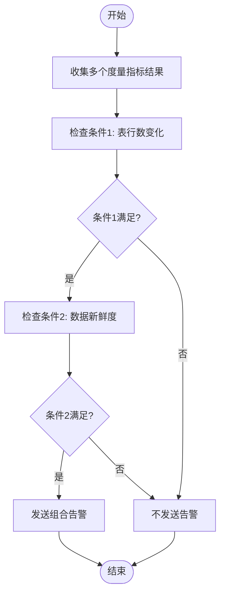
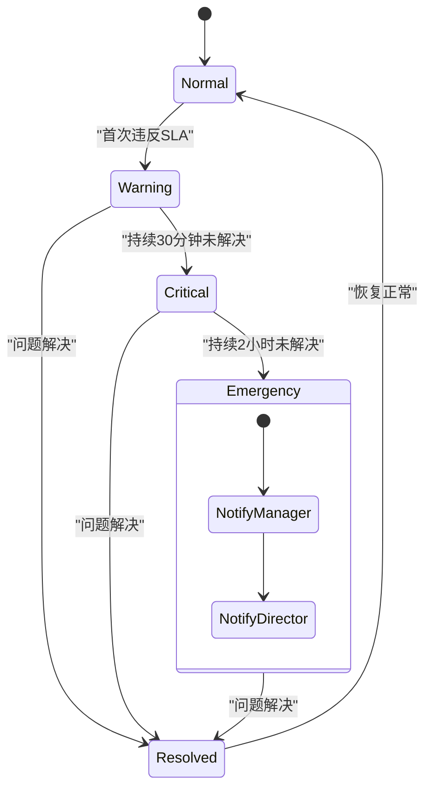
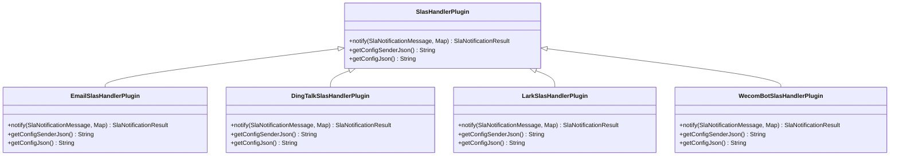
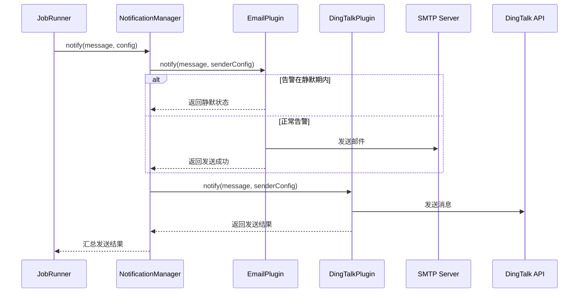
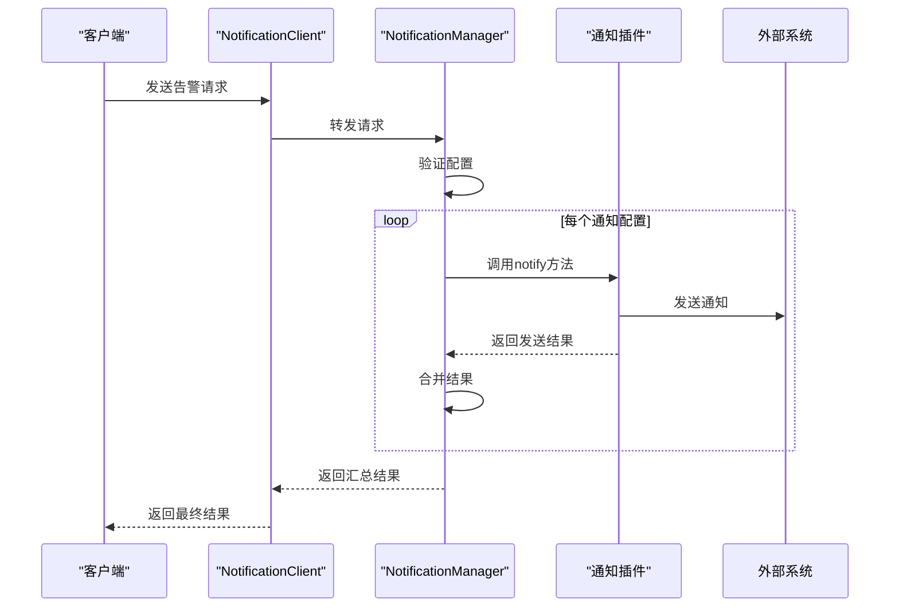

# SLA告警配置

<cite>
**本文档引用文件**  
- [SlaNotificationMessage.java](file://datavines-notification/datavines-notification-api/src/main/java/io/datavines/notification/api/entity/SlaNotificationMessage.java)
- [SlaSenderMessage.java](file://datavines-notification/datavines-notification-api/src/main/java/io/datavines/notification/api/entity/SlaSenderMessage.java)
- [SlaConfigMessage.java](file://datavines-notification/datavines-notification-api/src/main/java/io/datavines/notification/api/entity/SlaConfigMessage.java)
- [NotificationManager.java](file://datavines-notification/datavines-notification-core/src/main/java/io/datavines/notification/core/NotificationManager.java)
- [NotificationClientImpl.java](file://datavines-notification/datavines-notification-core/src/main/java/io/datavines/notification/core/client/impl/NotificationClientImpl.java)
- [SlasHandlerPlugin.java](file://datavines-notification/datavines-notification-api/src/main/java/io/datavines/notification/api/spi/SlasHandlerPlugin.java)
- [JobRunner.java](file://datavines-runner/src/main/java/io/datavines/runner/JobRunner.java)
- [SlaConfigVO.java](file://datavines-server/src/main/java/io/datavines/server/api/dto/vo/SlaConfigVO.java)
- [SlaNotificationServiceImpl.java](file://datavines-server/src/main/java/io/datavines/server/repository/service/impl/SlaNotificationServiceImpl.java)
- [EmailSlasHandlerPlugin.java](file://datavines-notification/datavines-notification-plugins/datavines-notification-plugin-email/src/main/java/io/datavines/notification/plugin/email/EmailSlasHandlerPlugin.java)
- [DingTalkSlasHandlerPlugin.java](file://datavines-notification/datavines-notification-plugins/datavines-notification-plugin-dingtalk/src/main/java/io/datavines/notification/plugin/dingtalk/DingTalkSlasHandlerPlugin.java)
- [LarkSlasHandlerPlugin.java](file://datavines-notification/datavines-notification-plugins/datavines-notification-plugin-lark/src/main/java/io/datavines/notification/plugin/lark/LarkSlasHandlerPlugin.java)
- [WecomBotSlasHandlerPlugin.java](file://datavines-notification/datavines-notification-plugins/datavines-notification-plugin-wecombot/src/main/java/io/datavines/notification/plugin/wecombot/WecomBotSlasHandlerPlugin.java)
</cite>

## 目录
1. [SLA告警配置概述](#sla告警配置概述)
2. [SLA阈值与告警级别配置](#sla阈值与告警级别配置)
3. [多条件组合告警配置](#多条件组合告警配置)
4. [告警抑制与升级机制](#告警抑制与升级机制)
5. [通知渠道绑定与优先级设置](#通知渠道绑定与优先级设置)
6. [重复通知间隔与静默期配置](#重复通知间隔与静默期配置)
7. [SLA告警测试方法](#sla告警测试方法)
8. [监控看板集成方案](#监控看板集成方案)
9. [NotificationManager协调机制](#notificationmanager协调机制)
10. [配置示例与最佳实践](#配置示例与最佳实践)

## SLA告警配置概述

DataVines中的SLA（服务等级协议）告警系统提供了一套完整的数据质量监控和通知机制，用于确保数据处理作业符合预定义的服务水平要求。该系统通过灵活的配置选项，支持多种告警策略和通知渠道，能够满足不同场景下的监控需求。

SLA告警系统的核心组件包括告警规则定义、阈值判断、通知渠道管理和告警结果处理。系统在数据质量检查失败时触发告警流程，通过NotificationManager协调多个通知插件，将告警信息发送给指定的接收者。

**本节来源**  
- [SlaNotificationMessage.java](file://datavines-notification/datavines-notification-api/src/main/java/io/datavines/notification/api/entity/SlaNotificationMessage.java#L28-L36)
- [SlaConfigVO.java](file://datavines-server/src/main/java/io/datavines/server/api/dto/vo/SlaConfigVO.java#L26-L33)

## SLA阈值与告警级别配置

SLA阈值配置是告警系统的基础，决定了何时触发告警。在DataVines中，阈值配置与具体的度量指标（Metric）相关联，通过比较实际值与预期值来判断是否违反SLA。

告警级别通过不同的通知渠道和接收者来体现。系统支持配置多个级别的告警，例如：
- **警告级别**：通过邮件通知相关开发人员
- **严重级别**：通过钉钉、飞书等即时通讯工具通知值班团队
- **紧急级别**：通过企业微信机器人通知整个运维团队

阈值配置通常包含以下要素：
- **比较操作符**：支持大于、小于、等于、不等于等操作
- **阈值数值**：具体的数值阈值
- **结果公式**：用于计算实际值的公式



**图表来源**  
- [SlaNotificationMessage.java](file://datavines-notification/datavines-notification-api/src/main/java/io/datavines/notification/api/entity/SlaNotificationMessage.java#L28-L36)
- [SlaSenderMessage.java](file://datavines-notification/datavines-notification-api/src/main/java/io/datavines/notification/api/entity/SlaSenderMessage.java#L28-L42)
- [SlaConfigMessage.java](file://datavines-notification/datavines-notification-api/src/main/java/io/datavines/notification/api/entity/SlaConfigMessage.java#L28-L45)

**本节来源**  
- [TaskParameter.java](file://datavines-client/datavines-http-client/datavines-http-client-core/src/main/java/io/datavines/http/client/request/TaskParameter.java#L107-L113)
- [SlaNotificationMessage.java](file://datavines-notification/datavines-notification-api/src/main/java/io/datavines/notification/api/entity/SlaNotificationMessage.java#L30-L35)

## 多条件组合告警配置

DataVines支持复杂的多条件组合告警配置，允许用户定义基于多个度量指标的复合告警规则。这种配置方式可以实现更精细的监控策略，避免单一指标误报。

多条件组合告警的实现机制如下：
1. 系统收集多个度量指标的执行结果
2. 根据预定义的逻辑关系（AND、OR）进行组合判断
3. 当组合条件满足时触发告警

例如，可以配置"表行数减少超过10% AND 数据新鲜度超过2小时"的复合告警规则，只有当两个条件同时满足时才发送告警。



**图表来源**  
- [JobRunner.java](file://datavines-runner/src/main/java/io/datavines/runner/JobRunner.java#L125-L141)
- [SlaNotificationServiceImpl.java](file://datavines-server/src/main/java/io/datavines/server/repository/service/impl/SlaNotificationServiceImpl.java#L77-L88)

**本节来源**  
- [JobRunner.java](file://datavines-runner/src/main/java/io/datavines/runner/JobRunner.java#L125-L141)
- [SlaNotificationServiceImpl.java](file://datavines-server/src/main/java/io/datavines/server/repository/service/impl/SlaNotificationServiceImpl.java#L77-L88)

## 告警抑制与升级机制

DataVines提供了告警抑制和升级机制，以避免告警风暴并确保重要问题得到及时处理。

### 告警抑制
告警抑制机制用于在特定条件下暂时停止发送重复告警。常见的抑制策略包括：
- **时间窗口抑制**：在指定时间窗口内只发送一次告警
- **状态变化抑制**：只有当告警状态发生变化时才发送通知
- **依赖抑制**：当上游任务失败时，抑制下游任务的告警

### 告警升级
告警升级机制确保长时间未解决的问题能够引起更高层级的关注。升级策略包括：
- **时间-based升级**：告警持续一定时间后升级到更高级别的通知渠道
- **严重性升级**：随着问题持续，逐步增加通知的接收者范围
- **自动升级**：系统自动将未确认的告警升级到值班经理



**图表来源**  
- [NotificationManager.java](file://datavines-notification/datavines-notification-core/src/main/java/io/datavines/notification/core/NotificationManager.java#L45-L69)
- [SlaNotificationResult.java](file://datavines-notification/datavines-notification-api/src/main/java/io/datavines/notification/api/entity/SlaNotificationResult.java#L38-L51)

**本节来源**  
- [NotificationManager.java](file://datavines-notification/datavines-notification-core/src/main/java/io/datavines/notification/core/NotificationManager.java#L45-L69)
- [SlaNotificationResult.java](file://datavines-notification/datavines-notification-api/src/main/java/io/datavines/notification/api/entity/SlaNotificationResult.java#L38-L51)

## 通知渠道绑定与优先级设置

DataVines支持多种通知渠道的绑定和优先级设置，确保告警信息能够通过最合适的渠道送达相关人员。

### 支持的通知渠道
系统通过插件化架构支持以下通知渠道：
- **邮件通知**：通过SMTP服务器发送电子邮件
- **钉钉通知**：通过钉钉机器人发送消息
- **飞书通知**：通过飞书机器人发送消息
- **企业微信通知**：通过企业微信机器人发送消息

### 优先级设置
通知渠道的优先级通过以下方式配置：
1. **渠道类型优先级**：即时通讯工具通常优先级高于邮件
2. **接收者角色优先级**：值班人员优先级高于普通开发人员
3. **时间优先级**：工作时间内的通知优先级高于非工作时间

通知渠道的配置通过`SlasHandlerPlugin`接口实现，每个通知插件都必须实现该接口。



**图表来源**  
- [SlasHandlerPlugin.java](file://datavines-notification/datavines-notification-api/src/main/java/io/datavines/notification/api/spi/SlasHandlerPlugin.java#L28-L43)
- [EmailSlasHandlerPlugin.java](file://datavines-notification/datavines-notification-plugins/datavines-notification-plugin-email/src/main/java/io/datavines/notification/plugin/email/EmailSlasHandlerPlugin.java)
- [DingTalkSlasHandlerPlugin.java](file://datavines-notification/datavines-notification-plugins/datavines-notification-plugin-dingtalk/src/main/java/io/datavines/notification/plugin/dingtalk/DingTalkSlasHandlerPlugin.java)

**本节来源**  
- [SlasHandlerPlugin.java](file://datavines-notification/datavines-notification-api/src/main/java/io/datavines/notification/api/spi/SlasHandlerPlugin.java#L28-L43)
- [NotificationConstants.java](file://datavines-notification/datavines-notification-api/src/main/java/io/datavines/notification/api/constants/NotificationConstants.java#L19-L28)

## 重复通知间隔与静默期配置

为了防止告警信息过度打扰，DataVines提供了重复通知间隔和静默期配置功能。

### 重复通知间隔
重复通知间隔定义了相同告警在未解决情况下重新发送的时间间隔。配置选项包括：
- **固定间隔**：每隔固定时间发送一次提醒
- **指数退避**：发送间隔随时间指数增长
- **自定义间隔**：根据告警级别设置不同的间隔

### 静默期
静默期是指在特定时间段内不发送任何告警的配置。常见的静默期设置包括：
- **维护窗口**：系统维护期间自动静默
- **非工作时间**：夜间或周末自动静默
- **节假日**：法定节假日自动静默

这些配置通过`SlaSenderMessage`和`SlaConfigMessage`中的配置字段实现，具体配置格式由各个通知插件定义。



**图表来源**  
- [NotificationClientImpl.java](file://datavines-notification/datavines-notification-core/src/main/java/io/datavines/notification/core/client/impl/NotificationClientImpl.java#L32-L44)
- [NotificationManager.java](file://datavines-notification/datavines-notification-core/src/main/java/io/datavines/notification/core/NotificationManager.java#L45-L69)

**本节来源**  
- [NotificationClientImpl.java](file://datavines-notification/datavines-notification-core/src/main/java/io/datavines/notification/core/client/impl/NotificationClientImpl.java#L32-L44)
- [JobRunner.java](file://datavines-runner/src/main/java/io/datavines/runner/JobRunner.java#L142-L143)

## SLA告警测试方法

DataVines提供了多种SLA告警测试方法，确保告警配置的正确性和可靠性。

### 测试接口
系统提供了专门的测试接口，用于验证告警配置：
- **testSend**：测试特定SLA配置的告警发送功能
- **test**：测试完整的SLA规则执行流程

### 测试步骤
1. 创建测试用的SLA配置
2. 调用测试接口发送测试告警
3. 验证通知渠道是否收到预期消息
4. 检查告警日志和状态

测试功能通过`SlaController`中的测试方法实现，允许用户在配置完成后立即验证告警流程。

**本节来源**  
- [SlaController.java](file://datavines-server/src/main/java/io/datavines/server/api/controller/SlaController.java#Ltest)
- [SlaNotificationServiceImpl.java](file://datavines-server/src/main/java/io/datavines/server/repository/service/impl/SlaNotificationServiceImpl.java#L91-L102)

## 监控看板集成方案

SLA告警系统与DataVines的监控看板深度集成，提供全面的告警可视化功能。

### 看板功能
- **实时告警列表**：显示当前所有活动的告警
- **历史告警统计**：按时间、类型、级别统计告警历史
- **SLA合规率**：计算和展示SLA合规情况
- **告警趋势分析**：分析告警发生的时间趋势

### 集成方式
前端通过`SLAsNoticeList`、`SLAs`和`SLAsSetting`等组件实现告警看板的UI展示，与后端API进行数据交互。

```mermaid
graph TB
subgraph "前端UI"
SLAsNoticeList["告警通知列表"]
SLAs["SLA指标"]
SLAsSetting["SLA设置"]
end
subgraph "后端服务"
SlaController["SlaController"]
SlaService["SlaService"]
SlaNotificationService["SlaNotificationService"]
end
SLAsNoticeList --> SlaController: 获取告警列表
SLAs --> SlaController: 获取SLA指标
SLAsSetting --> SlaController: 配置SLA规则
SlaController --> SlaService: 处理业务逻辑
SlaController --> SlaNotificationService: 处理通知配置
```

**图表来源**  
- [index.tsx](file://datavines-ui/src/view/Main/Warning/index.tsx#L8-L21)
- [SlaController.java](file://datavines-server/src/main/java/io/datavines/server/api/controller/SlaController.java)

**本节来源**  
- [index.tsx](file://datavines-ui/src/view/Main/Warning/index.tsx#L8-L21)
- [SlaNotificationServiceImpl.java](file://datavines-server/src/main/java/io/datavines/server/repository/service/impl/SlaNotificationServiceImpl.java#L77-L88)

## NotificationManager协调机制

`NotificationManager`是SLA告警系统的核心协调组件，负责管理所有通知插件和告警发送流程。

### 核心功能
1. **插件管理**：通过SPI机制加载和管理所有通知插件
2. **路由分发**：根据配置将告警消息分发到相应的通知插件
3. **结果聚合**：汇总各个通知渠道的发送结果
4. **异常处理**：处理通知发送过程中的异常情况

### 工作流程


**图表来源**  
- [NotificationManager.java](file://datavines-notification/datavines-notification-core/src/main/java/io/datavines/notification/core/NotificationManager.java#L45-L69)
- [NotificationClientImpl.java](file://datavines-notification/datavines-notification-core/src/main/java/io/datavines/notification/core/client/impl/NotificationClientImpl.java#L32-L44)

**本节来源**  
- [NotificationManager.java](file://datavines-notification/datavines-notification-core/src/main/java/io/datavines/notification/core/NotificationManager.java#L33-L71)
- [NotificationClientImpl.java](file://datavines-notification/datavines-notification-core/src/main/java/io/datavines/notification/core/client/impl/NotificationClientImpl.java#L32-L44)

## 配置示例与最佳实践

### 配置示例
```json
{
  "slaId": 1001,
  "threshold": 0.1,
  "operator": "GREATER_THAN",
  "notificationConfig": [
    {
      "sender": {
        "type": "email",
        "config": "{\"smtpHost\":\"smtp.example.com\",\"port\":587}"
      },
      "receivers": [
        {
          "type": "email",
          "config": "{\"to\":\"dev-team@example.com\"}"
        }
      ]
    },
    {
      "sender": {
        "type": "dingtalk",
        "config": "{\"webhook\":\"https://oapi.dingtalk.com/robot/send?access_token=xxx\"}"
      },
      "receivers": [
        {
          "type": "dingtalk",
          "config": "{\"atMobiles\":[\"13800138000\"]}"
        }
      ]
    }
  ]
}
```

### 最佳实践
1. **分层告警**：根据问题严重性配置不同级别的通知
2. **合理设置静默期**：避免在维护期间收到不必要的告警
3. **定期测试配置**：确保所有通知渠道正常工作
4. **监控告警系统自身**：确保告警系统本身的可靠性
5. **文档化SLA规则**：便于团队成员理解和维护

**本节来源**  
- [JobRunner.java](file://datavines-runner/src/main/java/io/datavines/runner/JobRunner.java#L125-L141)
- [SlaConfigVO.java](file://datavines-server/src/main/java/io/datavines/server/api/dto/vo/SlaConfigVO.java#L26-L33)
- [SlaNotificationMessage.java](file://datavines-notification/datavines-notification-api/src/main/java/io/datavines/notification/api/entity/SlaNotificationMessage.java#L30-L35)