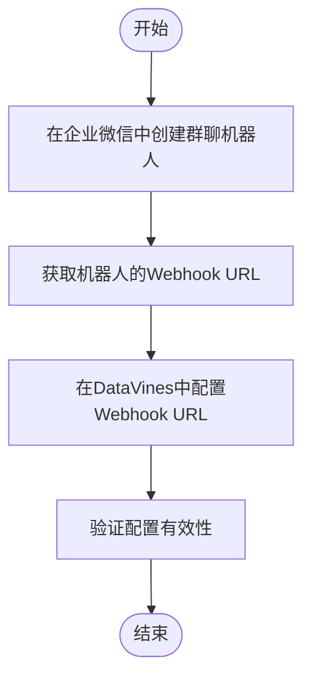
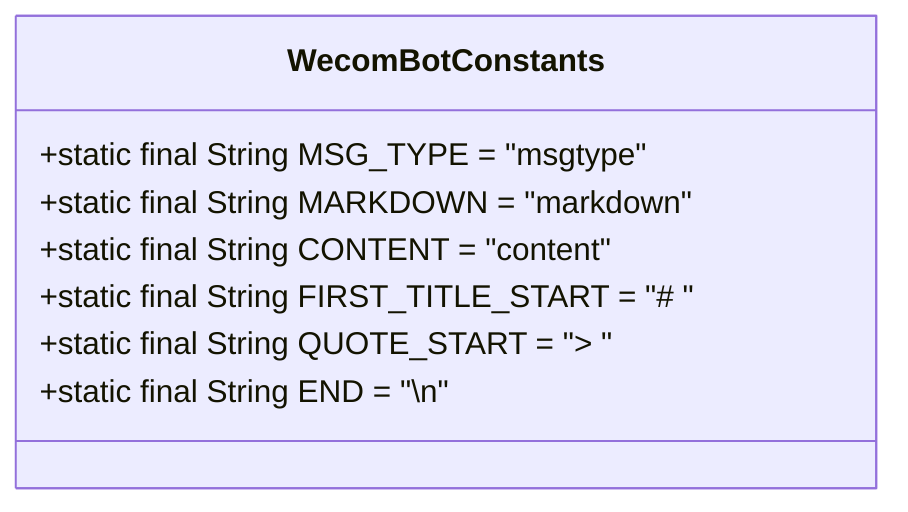
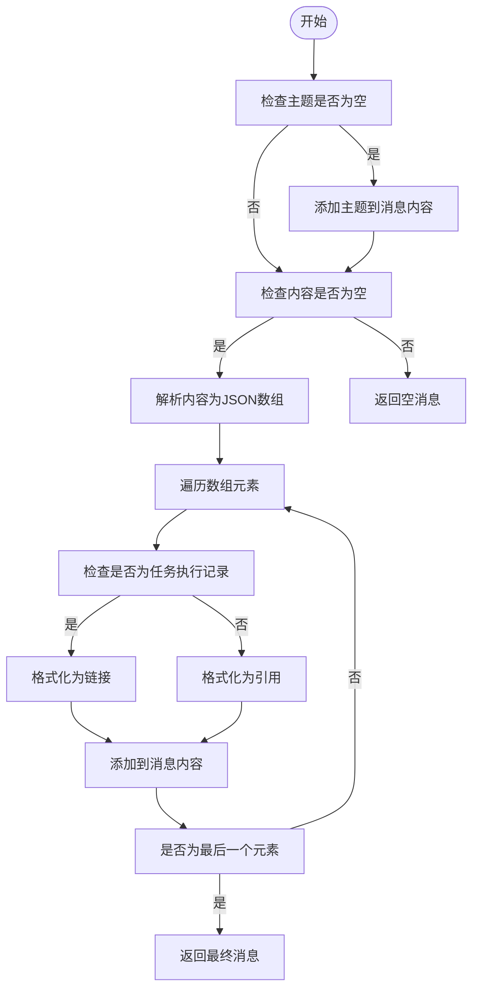
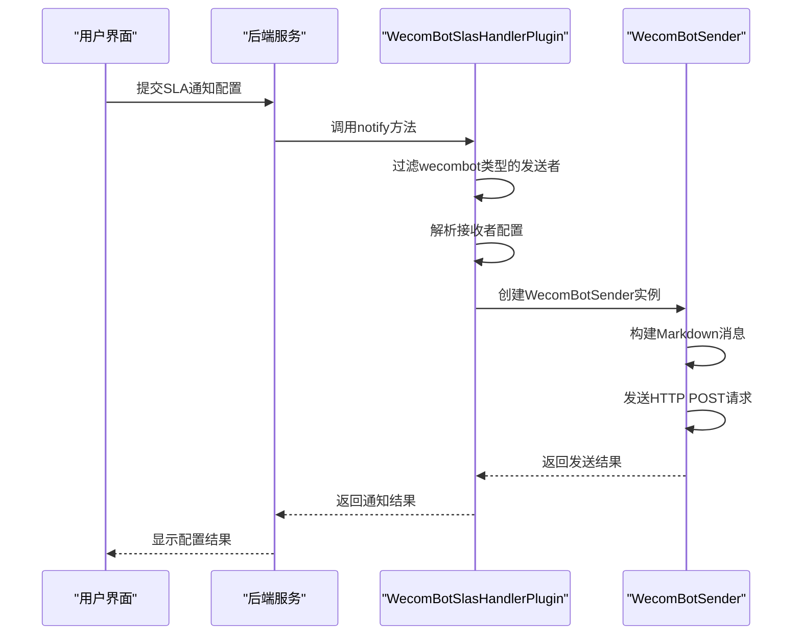
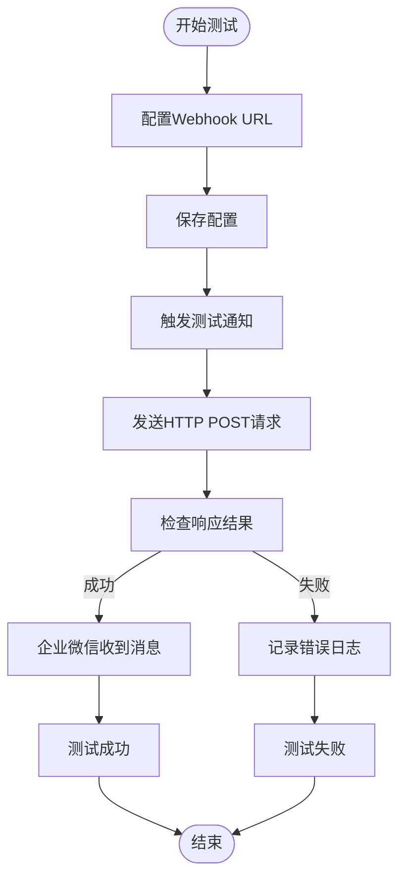
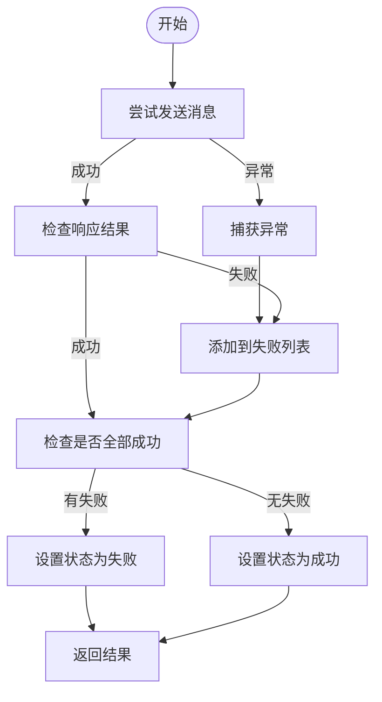
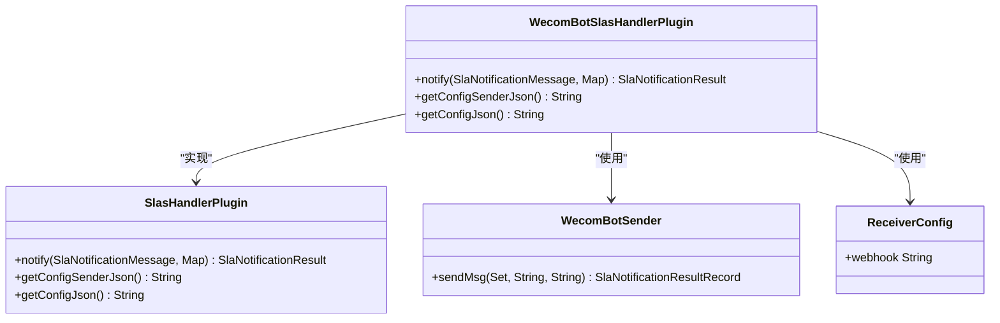
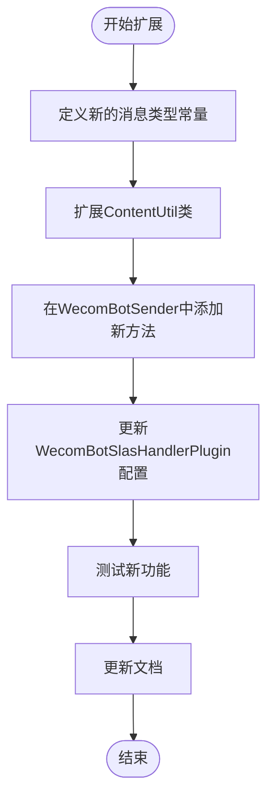

# 企业微信配置

<cite>
**本文档引用的文件**
- [WecomBotSlasHandlerPlugin.java](file://datavines-notification/datavines-notification-plugins/datavines-notification-plugin-wecombot/src/main/java/io/datavines/notification/plugin/wecombot/WecomBotSlasHandlerPlugin.java)
- [WecomBotSender.java](file://datavines-notification/datavines-notification-plugins/datavines-notification-plugin-wecombot/src/main/java/io/datavines/notification/plugin/wecombot/WecomBotSender.java)
- [ReceiverConfig.java](file://datavines-notification/datavines-notification-plugins/datavines-notification-plugin-wecombot/src/main/java/io/datavines/notification/plugin/wecombot/entity/ReceiverConfig.java)
- [WecomBotConstants.java](file://datavines-notification/datavines-notification-plugins/datavines-notification-plugin-wecombot/src/main/java/io/datavines/notification/plugin/wecombot/WecomBotConstants.java)
- [ContentUtil.java](file://datavines-notification/datavines-notification-plugins/datavines-notification-plugin-wecombot/src/main/java/io/datavines/notification/plugin/wecombot/utils/ContentUtil.java)
- [SlaNotificationMessage.java](file://datavines-notification/datavines-notification-api/src/main/java/io/datavines/notification/api/entity/SlaNotificationMessage.java)
- [SlaNotificationResult.java](file://datavines-notification/datavines-notification-api/src/main/java/io/datavines/notification/api/entity/SlaNotificationResult.java)
- [useNotificationFormModal.tsx](file://datavines-ui/src/view/Main/Warning/SLAsSetting/useNotificationFormModal.tsx)
</cite>

## 目录
1. [简介](#简介)
2. [企业微信机器人Webhook URL获取与配置](#企业微信机器人webhook-url获取与配置)
3. [消息类型支持](#消息类型支持)
4. [消息模板自定义](#消息模板自定义)
5. [部门/成员通知策略](#部门成员通知策略)
6. [测试方法](#测试方法)
7. [常见错误处理方案](#常见错误处理方案)
8. [WecomBotSlasHandlerPlugin实现机制](#wecombotslashandlerplugin实现机制)
9. [通过企业微信API实现更复杂的通知场景](#通过企业微信api实现更复杂的通知场景)

## 简介
DataVines是一个易于使用的数据质量服务平台，支持多种指标。该平台基于插件设计，其中通知渠道支持企业微信。本文档详细说明如何在DataVines中配置企业微信通知渠道，包括企业微信机器人Webhook URL的获取与配置、消息类型支持（文本、图文、Markdown）、消息模板的自定义、部门/成员通知策略。同时提供企业微信通知的测试方法和常见错误处理方案，并解释WecomBotSlasHandlerPlugin的实现机制，以及如何通过企业微信API实现更复杂的通知场景。

## 企业微信机器人Webhook URL获取与配置
在DataVines中配置企业微信通知渠道的第一步是获取企业微信机器人的Webhook URL。用户需要在企业微信中创建一个群聊机器人，并获取其Webhook地址。此Webhook地址将用于发送通知消息。

在DataVines系统中，企业微信通知的配置主要通过`WecomBotSlasHandlerPlugin`类来完成。该类实现了`SlasHandlerPlugin`接口，负责处理SLA（Service Level Agreement）相关的通知逻辑。在配置过程中，用户需要提供Webhook URL作为必填项，该配置项通过`InputParam`对象定义，并设置了`required=true`验证规则。

**图示来源**
- [WecomBotSlasHandlerPlugin.java](file://datavines-notification/datavines-notification-plugins/datavines-notification-plugin-wecombot/src/main/java/io/datavines/notification/plugin/wecombot/WecomBotSlasHandlerPlugin.java#L83-L85)

## 消息类型支持
DataVines的企业微信通知插件支持多种消息类型，主要包括文本、图文和Markdown格式。根据企业微信API的规范，当前实现主要使用Markdown消息类型进行通知。

在`WecomBotConstants`类中定义了消息类型相关的常量，其中`MARKDOWN`常量值为"markdown"，表示使用Markdown格式的消息。当发送通知时，系统会构建符合企业微信API要求的JSON格式消息体，其中包含`msgtype`字段，其值设置为`markdown`。

**图示来源**
- [WecomBotConstants.java](file://datavines-notification/datavines-notification-plugins/datavines-notification-plugin-wecombot/src/main/java/io/datavines/notification/plugin/wecombot/WecomBotConstants.java#L19-L26)

## 消息模板自定义
DataVines允许用户自定义企业微信通知的消息模板。消息模板的构建由`WecomBotSender`类的`getMarkdownMessage`方法完成。该方法接收主题(subject)和内容(content)两个参数，然后按照预定义的格式生成Markdown消息。

消息模板的结构如下：
- 主题部分以一级标题形式显示，前面加上`# `符号
- 内容部分每行前面加上`> `符号，表示引用格式
- 支持对特定类型的消息（如"任务执行记录"）进行特殊格式化处理，将其转换为可点击的链接

**图示来源**
- [WecomBotSender.java](file://datavines-notification/datavines-notification-plugins/datavines-notification-plugin-wecombot/src/main/java/io/datavines/notification/plugin/wecombot/WecomBotSender.java#L76-L94)

## 部门/成员通知策略
在DataVines中，企业微信通知的接收者通过`ReceiverConfig`类进行配置。该类包含一个`webhook`字段，用于存储企业微信机器人的Webhook URL。通过不同的Webhook URL，可以实现向不同部门或成员发送通知的策略。

通知策略的实现机制如下：
1. 在SLA配置中，用户可以选择通知类型为"wecombot"
2. 系统会收集所有类型为"wecombot"的发送者配置
3. 对于每个发送者，系统会解析其配置信息，创建`ReceiverConfig`对象
4. 将所有接收者配置添加到集合中，统一发送通知

**图示来源**
- [WecomBotSlasHandlerPlugin.java](file://datavines-notification/datavines-notification-plugins/datavines-notification-plugin-wecombot/src/main/java/io/datavines/notification/plugin/wecombot/WecomBotSlasHandlerPlugin.java#L36-L52)
- [WecomBotSender.java](file://datavines-notification/datavines-notification-plugins/datavines-notification-plugin-wecombot/src/main/java/io/datavines/notification/plugin/wecombot/WecomBotSender.java#L40-L73)

## 测试方法
为了确保企业微信通知配置的正确性，DataVines提供了相应的测试方法。测试过程主要包括以下步骤：

1. 在UI界面配置企业微信通知，填写正确的Webhook URL
2. 保存配置后，系统会调用`WecomBotSlasHandlerPlugin`的`notify`方法
3. 该方法会创建`WecomBotSender`实例，并调用其`sendMsg`方法发送测试消息
4. 如果发送成功，企业微信群聊中会收到格式化的通知消息；如果失败，系统会记录错误信息

测试时需要注意：
- 确保Webhook URL正确无误
- 检查网络连接是否正常
- 验证企业微信机器人是否已正确添加到目标群聊

**图示来源**
- [WecomBotSender.java](file://datavines-notification/datavines-notification-plugins/datavines-notification-plugin-wecombot/src/main/java/io/datavines/notification/plugin/wecombot/WecomBotSender.java#L54-L58)

## 常见错误处理方案
在配置和使用企业微信通知时，可能会遇到一些常见问题。以下是这些问题及其解决方案：

1. **Webhook URL错误**
   - 现象：发送通知失败，日志中显示"send to [webhook] fail"
   - 解决方案：检查Webhook URL是否正确，确保没有多余的空格或字符

2. **网络连接问题**
   - 现象：发送超时或连接被拒绝
   - 解决方案：检查服务器网络连接，确保可以访问企业微信API服务器

3. **消息格式错误**
   - 现象：企业微信返回错误码非0
   - 解决方案：检查消息内容是否符合Markdown语法，避免使用不支持的格式

4. **权限问题**
   - 现象：返回403错误
   - 解决方案：确认企业微信机器人是否有发送消息的权限

错误处理主要在`WecomBotSender`类的`sendMsg`方法中实现。该方法使用try-catch块捕获异常，并将失败的Webhook URL记录到`failToReceivers`集合中。如果存在发送失败的情况，最终结果的状态会被设置为false，并包含失败原因。

**图示来源**
- [WecomBotSender.java](file://datavines-notification/datavines-notification-plugins/datavines-notification-plugin-wecombot/src/main/java/io/datavines/notification/plugin/wecombot/WecomBotSender.java#L49-L72)

## WecomBotSlasHandlerPlugin实现机制
`WecomBotSlasHandlerPlugin`是DataVines中企业微信通知的核心实现类。它实现了`SlasHandlerPlugin`接口，负责处理SLA相关的通知逻辑。

该类的主要功能包括：
1. `notify`方法：处理通知请求，收集所有企业微信类型的发送者，逐个发送通知
2. `getConfigJson`方法：返回配置项的JSON字符串，定义了Webhook URL为必填项
3. `getConfigSenderJson`方法：返回发送者配置的JSON字符串

`notify`方法的执行流程如下：
1. 从配置中筛选出类型为"wecombot"的发送者
2. 为每个发送者创建`WecomBotSender`实例
3. 解析接收者配置，创建`ReceiverConfig`对象
4. 调用`WecomBotSender`的`sendMsg`方法发送消息
5. 收集所有发送结果，合并成最终结果返回

**图示来源**
- [WecomBotSlasHandlerPlugin.java](file://datavines-notification/datavines-notification-plugins/datavines-notification-plugin-wecombot/src/main/java/io/datavines/notification/plugin/wecombot/WecomBotSlasHandlerPlugin.java#L34-L62)

## 通过企业微信API实现更复杂的通知场景
虽然当前DataVines的企业微信通知插件主要支持基本的Markdown消息，但可以通过扩展`WecomBotSender`类来实现更复杂的通知场景。企业微信API支持多种消息类型，包括文本、图片、图文、文件、音频、视频等。

可能的扩展方向包括：
1. **图文消息支持**：通过添加`news`类型的消息支持，可以发送包含标题、描述、图片和链接的富媒体消息
2. **模板卡片支持**：使用模板卡片可以创建交互式的消息，支持按钮点击等操作
3. **消息卡片支持**：通过消息卡片可以展示更丰富的信息结构

要实现这些功能，需要：
1. 扩展`WecomBotConstants`类，添加新的消息类型常量
2. 修改`ContentUtil`类的`createParamMap`方法，支持构建更复杂的消息结构
3. 在`WecomBotSender`类中添加新的方法，用于构建和发送不同类型的消息
4. 更新`WecomBotSlasHandlerPlugin`的配置项，允许用户选择不同的消息类型

**图示来源**
- [ContentUtil.java](file://datavines-notification/datavines-notification-plugins/datavines-notification-plugin-wecombot/src/main/java/io/datavines/notification/plugin/wecombot/utils/ContentUtil.java#L23-L37)