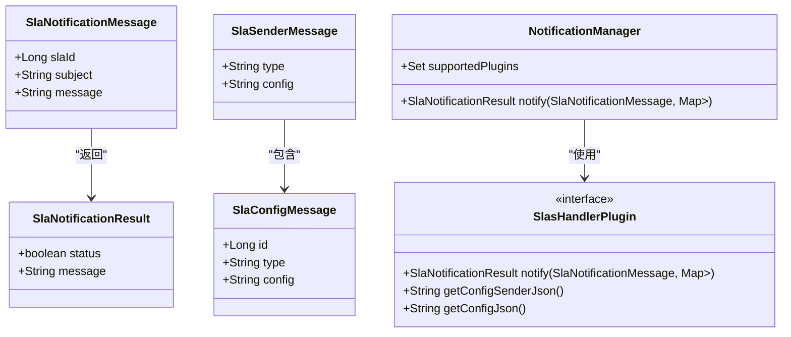

# 通知配置

<cite>
**本文档引用文件**  
- [NotificationManager.java](file://datavines-notification/datavines-notification-core/src/main/java/io/datavines/notification/core/NotificationManager.java)
- [SlasHandlerPlugin.java](file://datavines-notification/datavines-notification-api/src/main/java/io/datavines/notification/api/spi/SlasHandlerPlugin.java)
- [SlaNotificationMessage.java](file://datavines-notification/datavines-notification-api/src/main/java/io/datavines/notification/api/entity/SlaNotificationMessage.java)
- [SlaConfigMessage.java](file://datavines-notification/datavines-notification-api/src/main/java/io/datavines/notification/api/entity/SlaConfigMessage.java)
- [NotificationConstants.java](file://datavines-notification/datavines-notification-api/src/main/java/io/datavines/notification/api/constants/NotificationConstants.java)
- [DingTalkSender.java](file://datavines-notification/datavines-notification-plugins/datavines-notification-plugin-dingtalk/src/main/java/io/datavines/notification/plugin/dingtalk/DingTalkSender.java)
- [EMailSender.java](file://datavines-notification/datavines-notification-plugins/datavines-notification-plugin-email/src/main/java/io/datavines/notification/plugin/email/EMailSender.java)
- [LarkSender.java](file://datavines-notification/datavines-notification-plugins/datavines-notification-plugin-lark/src/main/java/io/datavines/notification/plugin/lark/LarkSender.java)
- [WecomBotSender.java](file://datavines-notification/datavines-notification-plugins/datavines-notification-plugin-wecombot/src/main/java/io/datavines/notification/plugin/wecombot/WecomBotSender.java)
- [ReceiverConfig.java](file://datavines-notification/datavines-notification-plugins/datavines-notification-plugin-dingtalk/src/main/java/io/datavines/notification/plugin/dingtalk/entity/ReceiverConfig.java)
- [NotificationConfig.java](file://datavines-notification/datavines-notification-plugins/datavines-notification-plugin-dingtalk/src/main/java/io/datavines/notification/plugin/dingtalk/entity/NotificationConfig.java)
</cite>

## 目录
1. [简介](#简介)
2. [通知渠道配置](#通知渠道配置)
3. [SLA告警规则与通知策略](#sla告警规则与通知策略)
4. [通知系统可靠性保障](#通知系统可靠性保障)
5. [自定义通知渠道集成](#自定义通知渠道集成)
6. [通过API发送通知](#通过api发送通知)

## 简介
DataVines 提供了灵活的通知系统，支持多种通知渠道，包括钉钉、邮件、飞书和企业微信。该系统允许用户配置SLA（服务等级协议）告警规则，并根据预设策略自动发送通知。本文档详细说明如何配置这些功能，确保数据质量监控的及时性和有效性。

## 通知渠道配置

### 钉钉通知配置
钉钉通知通过Webhook和密钥进行身份验证。用户需在钉钉群中添加自定义机器人，获取Webhook地址和安全密钥。配置项包括：
- **Webhook**: 机器人回调地址
- **Secret**: 安全密钥，用于生成签名
- **At Mobiles**: 需要@的手机号列表
- **At Dingtalk IDs**: 需要@的Dingtalk ID列表
- **Is At All**: 是否@所有人

配置信息以JSON格式存储，由`ReceiverConfig`类解析并用于构建请求。

### 邮件通知配置
邮件通知支持SMTP协议，需配置以下参数：
- **Server Host**: SMTP服务器地址
- **Server Port**: SMTP端口
- **Sender**: 发件人邮箱
- **User**: 登录用户名
- **Passwd**: 登录密码
- **Enable Smtp Auth**: 是否启用SMTP认证
- **Starttls Enable**: 是否启用STARTTLS
- **Ssl Enable**: 是否启用SSL
- **Smtp Ssl Trust**: SSL信任主机

邮件发送使用`HtmlEmail`组件，支持HTML格式内容，并通过`EMailSender`类封装发送逻辑。

### 飞书通知配置
飞书通知通过群组机器人Webhook实现。主要配置包括：
- **Webhook**: 机器人Webhook地址
- **Group Name**: 群组名称（用于日志记录）
- **At All**: 是否@所有人

消息以卡片形式发送，标题、颜色和内容可自定义，由`LarkSender`类处理发送流程。

### 企业微信通知配置
企业微信通知通过群机器人Webhook实现。配置项包括：
- **Webhook**: 机器人Webhook地址

消息以Markdown格式发送，支持链接和引用格式，由`WecomBotSender`类负责构建和发送消息。

**通知渠道通用配置结构**
```json
{
  "receiverType": "dingtalk|email|lark|wecombot",
  "config": {
    // 渠道特定配置
  }
}
```

**节来源**
- [ReceiverConfig.java](file://datavines-notification/datavines-notification-plugins/datavines-notification-plugin-dingtalk/src/main/java/io/datavines/notification/plugin/dingtalk/entity/ReceiverConfig.java)
- [NotificationConfig.java](file://datavines-notification/datavines-notification-plugins/datavines-notification-plugin-dingtalk/src/main/java/io/datavines/notification/plugin/dingtalk/entity/NotificationConfig.java)

## SLA告警规则与通知策略

### SLA告警规则配置
SLA告警规则定义了数据质量检查的阈值和触发条件。当数据质量指标违反SLA时，系统将生成告警消息。`SlaNotificationMessage`类包含以下字段：
- **slaId**: SLA规则ID
- **subject**: 告警主题
- **message**: 告警内容

告警内容通常包含任务执行记录、数据异常详情等信息。

### 通知策略
通知策略决定了告警消息的发送方式和接收人。系统支持多渠道、多接收人配置。`SlaConfigMessage`类定义了接收人配置：
- **id**: 配置ID
- **type**: 接收人类型（如email、dingtalk）
- **config**: 接收人具体配置（JSON字符串）

通知策略通过`NotificationManager`统一管理，根据配置调用相应的`SlasHandlerPlugin`实现发送。



**图来源**  
- [SlaNotificationMessage.java](file://datavines-notification/datavines-notification-api/src/main/java/io/datavines/notification/api/entity/SlaNotificationMessage.java)
- [SlaConfigMessage.java](file://datavines-notification/datavines-notification-api/src/main/java/io/datavines/notification/api/entity/SlaConfigMessage.java)
- [NotificationManager.java](file://datavines-notification/datavines-notification-core/src/main/java/io/datavines/notification/core/NotificationManager.java)
- [SlasHandlerPlugin.java](file://datavines-notification/datavines-notification-api/src/main/java/io/datavines/notification/api/spi/SlasHandlerPlugin.java)

**节来源**
- [SlaNotificationMessage.java](file://datavines-notification/datavines-notification-api/src/main/java/io/datavines/notification/api/entity/SlaNotificationMessage.java)
- [SlaConfigMessage.java](file://datavines-notification/datavines-notification-api/src/main/java/io/datavines/notification/api/entity/SlaConfigMessage.java)

## 通知系统可靠性保障

### 重试机制
当前通知系统在单次发送失败时会记录失败接收人，但未实现自动重试机制。建议在生产环境中结合外部监控系统实现重试逻辑。

### 失败告警
系统通过`SlaNotificationResult`记录发送结果：
- **status**: 发送状态（true/false）
- **message**: 失败详情（包含失败的接收人列表）

发送失败时，日志中会记录详细错误信息，便于排查问题。

### 可靠性增强建议
1. **引入消息队列**：将通知消息写入Kafka或RabbitMQ，实现异步发送和持久化。
2. **实现重试策略**：对失败通知进行指数退避重试。
3. **添加监控告警**：对通知发送失败率进行监控，超过阈值时触发二次告警。

**节来源**
- [SlaNotificationResult.java](file://datavines-notification/datavines-notification-api/src/main/java/io/datavines/notification/api/entity/SlaNotificationResult.java)
- [NotificationManager.java](file://datavines-notification/datavines-notification-core/src/main/java/io/datavines/notification/core/NotificationManager.java)

## 自定义通知渠道集成

### 扩展机制
DataVines采用SPI（Service Provider Interface）机制支持自定义通知渠道。开发者需实现`SlasHandlerPlugin`接口，并在`META-INF/plugins`目录下注册实现类。

### 实现步骤
1. 创建新模块，依赖`datavines-notification-api`
2. 实现`SlasHandlerPlugin`接口
3. 重写`notify`方法，实现具体发送逻辑
4. 提供`getConfigSenderJson`和`getConfigJson`方法，返回配置项JSON
5. 在`META-INF/plugins/io.datavines.notification.api.spi.SlasHandlerPlugin`文件中添加实现类全名

### 示例：自定义短信通知
```java
@SPI
public class SmsSlasHandlerPlugin implements SlasHandlerPlugin {
    @Override
    public SlaNotificationResult notify(SlaNotificationMessage message, Map<SlaSenderMessage, Set<SlaConfigMessage>> config) {
        // 实现短信发送逻辑
        return new SlaNotificationResult(true, "发送成功");
    }

    @Override
    public String getConfigSenderJson() {
        return "{\"serverUrl\":\"短信网关地址\",\"apiKey\":\"API密钥\"}";
    }

    @Override
    public String getConfigJson() {
        return "{\"phoneNumbers\":\"接收手机号\",\"templateId\":\"模板ID\"}";
    }
}
```

**节来源**
- [SlasHandlerPlugin.java](file://datavines-notification/datavines-notification-api/src/main/java/io/datavines/notification/api/spi/SlasHandlerPlugin.java)
- [NotificationManager.java](file://datavines-notification/datavines-notification-core/src/main/java/io/datavines/notification/core/NotificationManager.java)

## 通过API发送通知

### API调用流程
1. 构造`SlaNotificationMessage`对象，设置主题和内容
2. 构造`SlaSenderMessage`对象，设置渠道类型和配置
3. 构造`SlaConfigMessage`对象，设置接收人配置
4. 调用`NotificationManager.notify()`方法发送通知

### 代码示例
```java
// 创建通知消息
SlaNotificationMessage message = new SlaNotificationMessage();
message.setSubject("数据质量告警");
message.setMessage("[\"任务执行失败: http://localhost:8888/job/123\"]");

// 创建发送者配置
SlaSenderMessage sender = new SlaSenderMessage();
sender.setType("email");
sender.setConfig("{\"serverHost\":\"smtp.example.com\",\"serverPort\":\"587\",\"sender\":\"alert@example.com\",\"user\":\"alert\",\"passwd\":\"password\",\"enableSmtpAuth\":\"true\",\"starttlsEnable\":\"true\",\"sslEnable\":\"false\",\"smtpSslTrust\":\"*\"}");

// 创建接收人配置
SlaConfigMessage config = new SlaConfigMessage();
config.setType("email");
config.setConfig("[\"user1@example.com\",\"user2@example.com\"]");

// 调用通知管理器
Map<SlaSenderMessage, Set<SlaConfigMessage>> configMap = new HashMap<>();
configMap.put(sender, Collections.singleton(config));
SlaNotificationResult result = notificationManager.notify(message, configMap);
```

### 错误处理
- **渠道不支持**：抛出`DataVinesException`，提示"sender type not support"
- **配置缺失**：抛出`DataVinesException`，提示"message cannot be send without sender and receiver"
- **发送失败**：返回`SlaNotificationResult`，status为false，包含失败详情

**节来源**
- [NotificationManager.java](file://datavines-notification/datavines-notification-core/src/main/java/io/datavines/notification/core/NotificationManager.java)
- [SlasHandlerPlugin.java](file://datavines-notification/datavines-notification-api/src/main/java/io/datavines/notification/api/spi/SlasHandlerPlugin.java)
- [SlaNotificationMessage.java](file://datavines-notification/datavines-notification-api/src/main/java/io/datavines/notification/api/entity/SlaNotificationMessage.java)