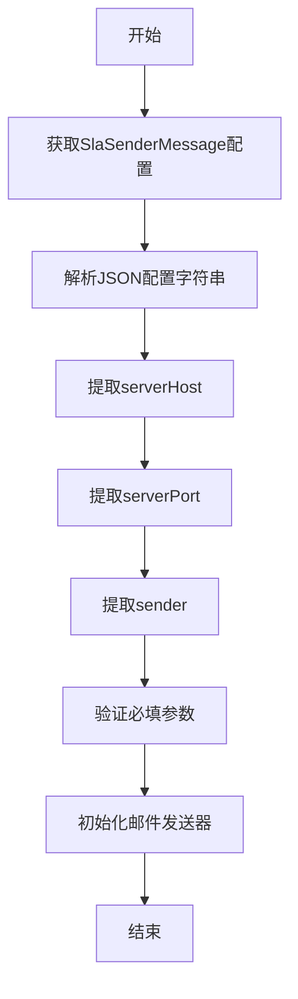
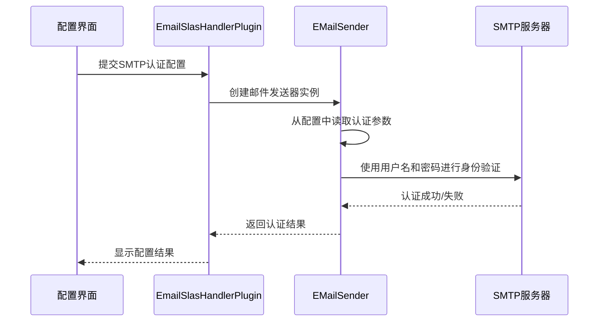
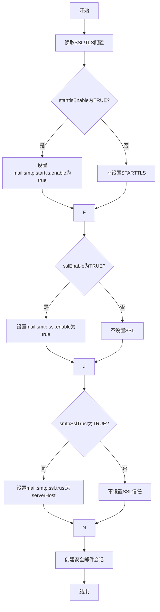
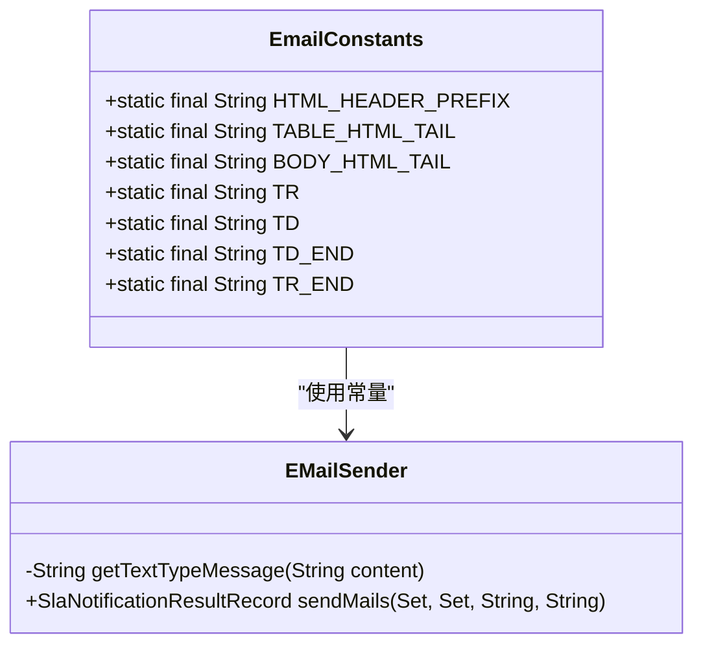
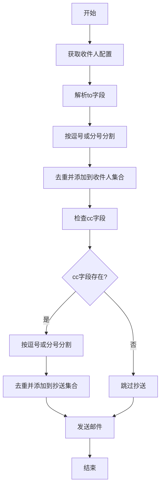
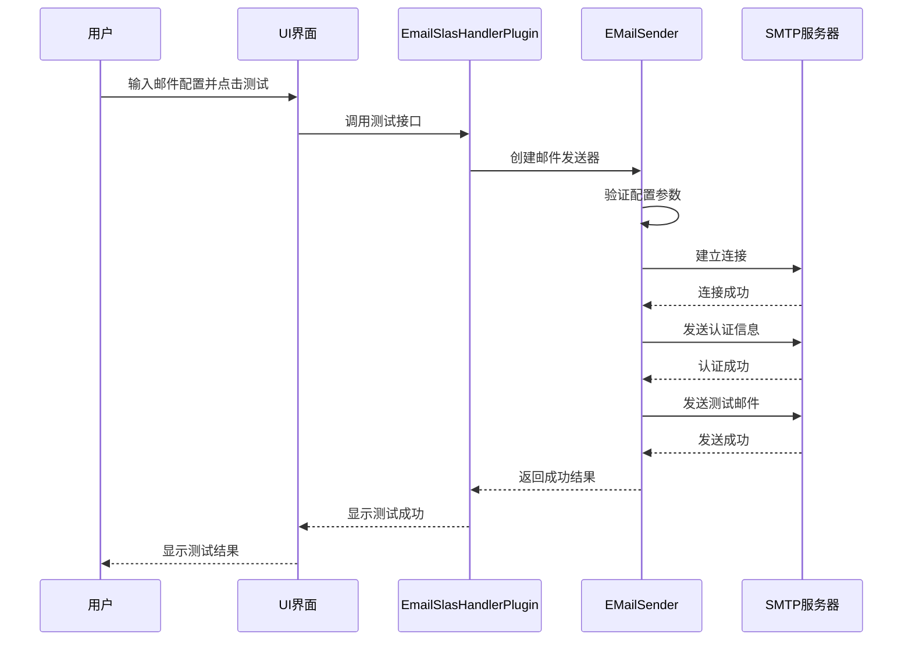
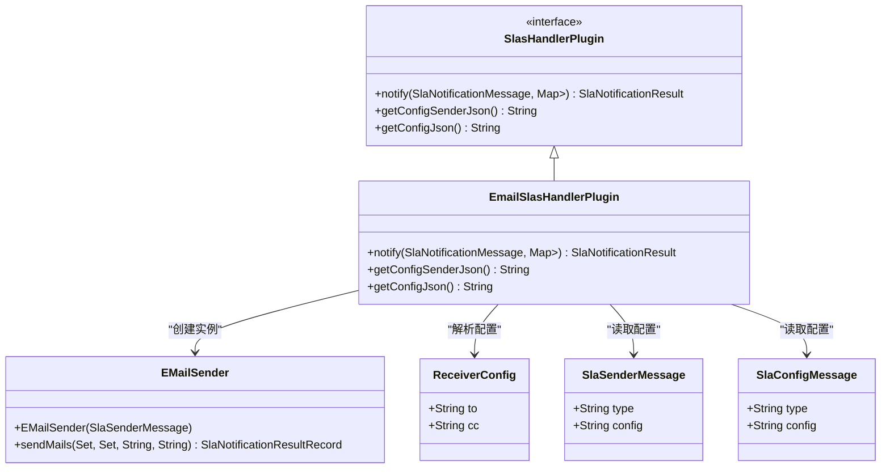
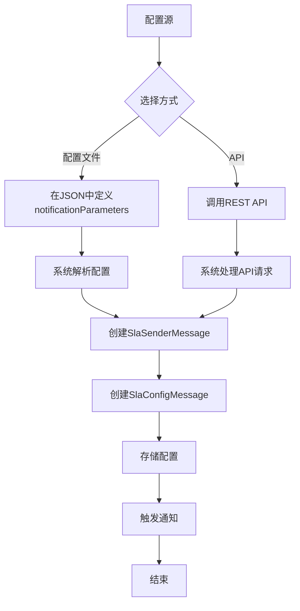

# 邮件配置

<cite>
**本文档引用的文件**   
- [EmailSlasHandlerPlugin.java](file://datavines-notification\datavines-notification-plugins\datavines-notification-plugin-email\src\main\java\io\datavines\notification\plugin\email\EmailSlasHandlerPlugin.java)
- [EMailSender.java](file://datavines-notification\datavines-notification-plugins\datavines-notification-plugin-email\src\main\java\io\datavines\notification\plugin\email\EMailSender.java)
- [ReceiverConfig.java](file://datavines-notification\datavines-notification-plugins\datavines-notification-plugin-email\src\main\java\io\datavines\notification\plugin\email\entity\ReceiverConfig.java)
- [SlaSenderMessage.java](file://datavines-notification\datavines-notification-api\src\main\java\io\datavines\notification\api\entity\SlaSenderMessage.java)
- [SlaConfigMessage.java](file://datavines-notification\datavines-notification-api\src\main\java\io\datavines\notification\api\entity\SlaConfigMessage.java)
- [application.yaml](file://datavines-server\src\main\resources\application.yaml)
- [EmailConstants.java](file://datavines-notification\datavines-notification-plugins\datavines-notification-plugin-email\src\main\java\io\datavines\notification\plugin\email\EmailConstants.java)
- [NotificationConstants.java](file://datavines-notification\datavines-notification-api\src\main\java\io\datavines\notification\api\constants\NotificationConstants.java)
</cite>

## 目录
1. [简介](#简介)
2. [SMTP服务器设置](#smtp服务器设置)
3. [发件人账户认证](#发件人账户认证)
4. [SSL/TLS加密配置](#ssltls加密配置)
5. [邮件模板定制](#邮件模板定制)
6. [收件人列表管理](#收件人列表管理)
7. [邮件通知测试方法](#邮件通知测试方法)
8. [常见问题解决方案](#常见问题解决方案)
9. [EmailSlasHandlerPlugin实现原理](#emailslashandlerplugin实现原理)
10. [通过配置文件或API管理邮件通知策略](#通过配置文件或api方式管理邮件通知策略)

## 简介
DataVines提供了一套完整的邮件通知系统，用于在数据质量检查、任务执行等场景下向相关人员发送通知。本文档详细说明了如何在DataVines中配置邮件通知渠道，包括SMTP服务器设置、发件人账户认证、SSL/TLS加密配置、邮件模板定制、收件人列表管理等方面的内容。同时，本文档还提供了邮件通知的测试方法和常见问题解决方案，并解释了EmailSlasHandlerPlugin的实现原理以及如何通过配置文件或API方式管理邮件通知策略。

## SMTP服务器设置
在DataVines中配置邮件通知时，首先需要设置SMTP服务器的相关参数。这些参数包括SMTP服务器地址、端口号、发件人邮箱等。根据代码分析，SMTP服务器的配置主要通过`EmailSlasHandlerPlugin`类中的`getConfigSenderJson`方法定义。

**SMTP服务器配置参数：**
- **serverHost**: SMTP服务器地址，为必填项
- **serverPort**: SMTP服务器端口号，默认值为25
- **sender**: 发件人邮箱地址，为必填项

这些配置参数在`EmailSlasHandlerPlugin`类中通过`InputParam`对象进行定义，并在创建邮件发送器时从配置中读取。例如，在`EMailSender`类的构造函数中，会从`SlaSenderMessage`对象的配置字符串中解析出这些参数：



**代码路径**
- [EmailSlasHandlerPlugin.java](file://datavines-notification\datavines-notification-plugins\datavines-notification-plugin-email\src\main\java\io\datavines\notification\plugin\email\EmailSlasHandlerPlugin.java#L101-L110)
- [EMailSender.java](file://datavines-notification\datavines-notification-plugins\datavines-notification-plugin-email\src\main\java\io\datavines\notification\plugin\email\EMailSender.java#L73-L80)

## 发件人账户认证
DataVines支持通过用户名和密码的方式对SMTP服务器进行身份验证。在配置邮件通知时，可以启用SMTP认证功能，并提供相应的用户名和密码。

**发件人账户认证配置：**
- **enableSmtpAuth**: 是否启用SMTP认证，可选值为"YES"/"TRUE"或"NO"/"FALSE"，默认值为"TRUE"
- **user**: SMTP认证用户名，当启用认证时为必填项
- **passwd**: SMTP认证密码，当启用认证时为必填项

在`EmailSlasHandlerPlugin`类中，这些参数通过`RadioParam`和`InputParam`对象进行定义。当创建`EMailSender`实例时，会从配置中读取这些参数，并在创建邮件会话时使用它们进行身份验证。



**代码路径**
- [EmailSlasHandlerPlugin.java](file://datavines-notification\datavines-notification-plugins\datavines-notification-plugin-email\src\main\java\io\datavines\notification\plugin\email\EmailSlasHandlerPlugin.java#L116-L129)
- [EMailSender.java](file://datavines-notification\datavines-notification-plugins\datavines-notification-plugin-email\src\main\java\io\datavines\notification\plugin\email\EMailSender.java#L82-L88)

## SSL/TLS加密配置
为了确保邮件传输的安全性，DataVines支持SSL和TLS加密协议。用户可以根据SMTP服务器的要求配置相应的加密选项。

**SSL/TLS加密配置参数：**
- **starttlsEnable**: 是否启用STARTTLS加密，可选值为"YES"/"TRUE"或"NO"/"FALSE"，默认值为"FALSE"
- **sslEnable**: 是否启用SSL加密，可选值为"YES"/"TRUE"或"NO"/"FALSE"，默认值为"FALSE"
- **smtpSslTrust**: 是否信任SSL证书，可选值为"YES"/"TRUE"或"NO"/"FALSE"，默认值为"FALSE"

这些加密配置在`EmailSlasHandlerPlugin`类中通过`RadioParam`对象进行定义，并在`EMailSender`类的`getSession`方法中应用到邮件会话的属性中。特别地，当`smtpSslTrust`设置为"TRUE"时，系统会将SMTP服务器地址添加到信任的SSL主机列表中。



**代码路径**
- [EmailSlasHandlerPlugin.java](file://datavines-notification\datavines-notification-plugins\datavines-notification-plugin-email\src\main\java\io\datavines\notification\plugin\email\EmailSlasHandlerPlugin.java#L131-L150)
- [EMailSender.java](file://datavines-notification\datavines-notification-plugins\datavines-notification-plugin-email\src\main\java\io\datavines\notification\plugin\email\EMailSender.java#L90-L97)

## 邮件模板定制
DataVines允许用户自定义邮件内容模板，以满足不同场景下的通知需求。邮件模板支持HTML格式，并包含预定义的样式和布局。

**邮件模板特性：**
- 使用HTML 4.01 Transitional DOCTYPE
- 包含标题、样式表和元信息
- 表格布局，边框为1px，单元格间距为5px
- 字体大小为15px
- 支持链接格式化，特别是任务执行记录的链接

在`EmailConstants`类中定义了邮件模板的各个组成部分，包括HTML头部、表格尾部、正文尾部等。`EMailSender`类的`getTextTypeMessage`方法负责将原始消息内容转换为格式化的HTML邮件内容。



**代码路径**
- [EmailConstants.java](file://datavines-notification\datavines-notification-plugins\datavines-notification-plugin-email\src\main\java\io\datavines\notification\plugin\email\EmailConstants.java#L56-L70)
- [EMailSender.java](file://datavines-notification\datavines-notification-plugins\datavines-notification-plugin-email\src\main\java\io\datavines\notification\plugin\email\EMailSender.java#L178-L196)

## 收件人列表管理
DataVines支持灵活的收件人管理机制，允许用户配置主要收件人（To）和抄送收件人（Cc）。收件人列表可以通过逗号或分号分隔多个邮箱地址。

**收件人配置参数：**
- **to**: 主要收件人邮箱列表，为必填项，支持多个邮箱地址，用逗号或分号分隔
- **cc**: 抄送收件人邮箱列表，为可选项，支持多个邮箱地址，用逗号或分号分隔

在`ReceiverConfig`类中定义了收件人配置的数据结构，包含`to`和`cc`两个字段。`EmailSlasHandlerPlugin`类的`notify`方法负责解析这些配置，并将收件人地址添加到邮件中。



**代码路径**
- [ReceiverConfig.java](file://datavines-notification\datavines-notification-plugins\datavines-notification-plugin-email\src\main\java\io\datavines\notification\plugin\email\entity\ReceiverConfig.java#L30-L33)
- [EmailSlasHandlerPlugin.java](file://datavines-notification\datavines-notification-plugins\datavines-notification-plugin-email\src\main\java\io\datavines\notification\plugin\email\EmailSlasHandlerPlugin.java#L63-L70)

## 邮件通知测试方法
DataVines提供了多种测试邮件通知配置的方法，确保配置正确无误后才能投入使用。

**测试方法：**
1. **配置验证测试**：在保存配置时，系统会验证所有必填字段是否已填写，如SMTP服务器地址、端口、发件人邮箱等。
2. **连接测试**：尝试与SMTP服务器建立连接，验证服务器地址和端口是否正确。
3. **认证测试**：如果启用了SMTP认证，系统会使用提供的用户名和密码进行登录测试。
4. **发送测试**：向指定的测试邮箱发送一封测试邮件，验证整个邮件发送流程是否正常。

测试过程中，系统会记录详细的日志信息，包括连接状态、认证结果和发送状态。如果测试失败，系统会返回具体的错误信息，帮助用户排查问题。



**代码路径**
- [EMailSender.java](file://datavines-notification\datavines-notification-plugins\datavines-notification-plugin-email\src\main\java\io\datavines\notification\plugin\email\EMailSender.java#L100-L141)
- [EmailSlasHandlerPlugin.java](file://datavines-notification\datavines-notification-plugins\datavines-notification-plugin-email\src\main\java\io\datavines\notification\plugin\email\EmailSlasHandlerPlugin.java#L46-L93)

## 常见问题解决方案
在配置和使用邮件通知功能时，可能会遇到一些常见问题。以下是这些问题的解决方案：

**1. 连接超时问题**
- **问题描述**：无法连接到SMTP服务器，出现连接超时错误。
- **解决方案**：
  - 检查SMTP服务器地址和端口是否正确
  - 确认网络连接是否正常，防火墙是否阻止了相应端口
  - 尝试使用telnet命令测试SMTP服务器端口是否开放

**2. 认证失败问题**
- **问题描述**：SMTP认证失败，返回用户名或密码错误。
- **解决方案**：
  - 确认用户名和密码是否正确
  - 检查是否需要使用应用专用密码而非账户密码
  - 确认SMTP服务器是否要求特定的认证方式

**3. SSL/TLS握手失败**
- **问题描述**：SSL/TLS握手失败，出现证书验证错误。
- **解决方案**：
  - 检查SSL/TLS配置是否与SMTP服务器要求匹配
  - 尝试启用或禁用`smtpSslTrust`选项
  - 确认服务器证书是否有效且受信任

**4. 邮件发送失败**
- **问题描述**：邮件发送失败，但没有具体错误信息。
- **解决方案**：
  - 启用邮件发送的调试模式，查看详细日志
  - 检查收件人邮箱地址格式是否正确
  - 确认发件人邮箱是否有发送限制

**代码路径**
- [EMailSender.java](file://datavines-notification\datavines-notification-plugins\datavines-notification-plugin-email\src\main\java\io\datavines\notification\plugin\email\EMailSender.java#L137-L140)
- [EmailSlasHandlerPlugin.java](file://datavines-notification\datavines-notification-plugins\datavines-notification-plugin-email\src\main\java\io\datavines\notification\plugin\email\EmailSlasHandlerPlugin.java#L74-L88)

## EmailSlasHandlerPlugin实现原理
`EmailSlasHandlerPlugin`是DataVines邮件通知功能的核心实现类，它实现了`SlasHandlerPlugin`接口，负责处理邮件通知的整个流程。

**核心组件关系：**
- `EmailSlasHandlerPlugin`：主控制器，负责协调整个邮件通知流程
- `EMailSender`：邮件发送器，负责实际的邮件发送操作
- `ReceiverConfig`：收件人配置，定义收件人信息的数据结构
- `SlaSenderMessage`：发件人消息，包含SMTP服务器配置信息
- `SlaConfigMessage`：通知配置消息，包含收件人配置信息

**工作流程：**
1. 接收`SlaNotificationMessage`对象，包含通知主题和内容
2. 从配置映射中筛选出类型为"email"的发送器配置
3. 为每个邮件发送器创建`EMailSender`实例
4. 解析收件人配置，提取主要收件人和抄送收件人
5. 调用`EMailSender`的`sendMails`方法发送邮件
6. 收集发送结果，合并成最终的通知结果



**代码路径**
- [EmailSlasHandlerPlugin.java](file://datavines-notification\datavines-notification-plugins\datavines-notification-plugin-email\src\main\java\io\datavines\notification\plugin\email\EmailSlasHandlerPlugin.java#L43-L93)
- [EMailSender.java](file://datavines-notification\datavines-notification-plugins\datavines-notification-plugin-email\src\main\java\io\datavines\notification\plugin\email\EMailSender.java#L44-L45)

## 通过配置文件或API方式管理邮件通知策略
DataVines支持通过配置文件和API两种方式管理邮件通知策略，为用户提供灵活的配置选项。

**配置文件方式：**
在作业提交的JSON配置文件中，可以通过`notificationParameters`字段定义邮件通知策略。例如：

```json
"notificationParameters": [
  {
    "type": "email",
    "config": {
      "serverHost": "smtp.qq.com",
      "serverPort": "25",
      "sender": "123456@qq.com",
      "enableSmtpAuth": "true",
      "user": "123456@qq.com",
      "passwd": "123456",
      "starttlsEnable": "false",
      "sslEnable": "false",
      "smtpSslTrust": "true"
    },
    "receiver": {
      "to": "123456@qq.com"
    }
  }
]
```

**API方式：**
通过DataVines提供的REST API，可以编程方式管理邮件通知策略。主要API包括：
- 创建通知配置：POST /api/sla/notification
- 更新通知配置：PUT /api/sla/notification
- 删除通知配置：DELETE /api/sla/notification/{id}
- 查询通知配置：GET /api/sla/notification/page

在`SlaController`类中定义了这些API端点，通过`slaNotificationService`服务处理具体的业务逻辑。



**代码路径**
- [submit_job_mysql_storage.json](file://datavines-runner\src\main\resources\submit_job_mysql_storage.json#L49-L67)
- [SlaController.java](file://datavines-server\src\main\java\io\datavines\server\api\controller\SlaController.java#L211-L232)