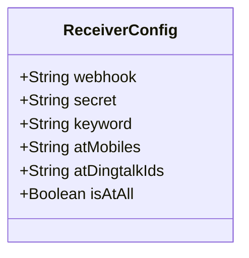
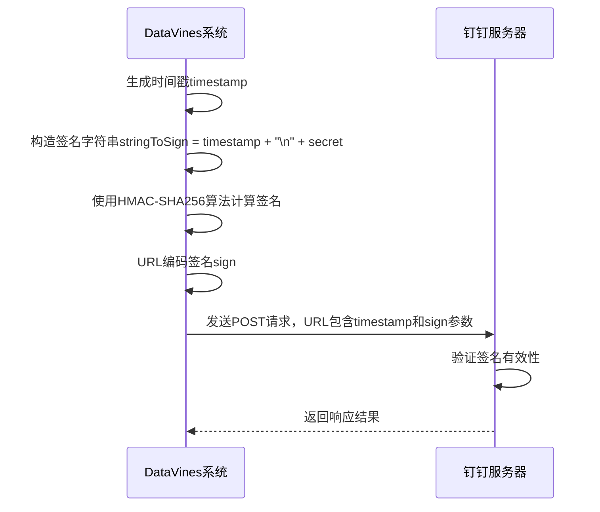
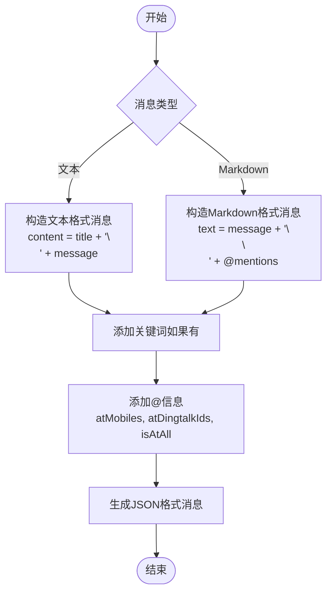
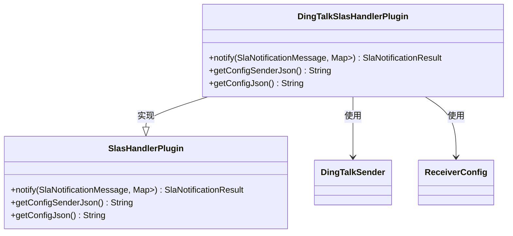
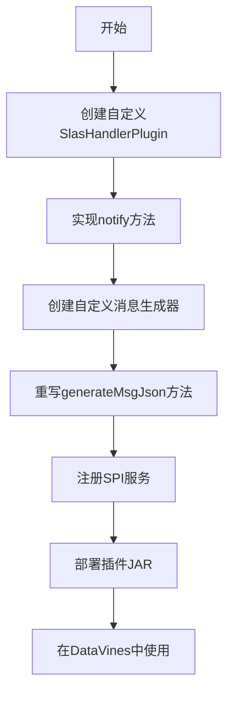

# 钉钉配置

<cite>
**本文档中引用的文件**  
- [DingTalkSlasHandlerPlugin.java](file://datavines-notification\datavines-notification-plugins\datavines-notification-plugin-dingtalk\src\main\java\io\datavines\notification\plugin\dingtalk\DingTalkSlasHandlerPlugin.java)
- [DingTalkSender.java](file://datavines-notification\datavines-notification-plugins\datavines-notification-plugin-dingtalk\src\main\java\io\datavines\notification\plugin\dingtalk\DingTalkSender.java)
- [ReceiverConfig.java](file://datavines-notification\datavines-notification-plugins\datavines-notification-plugin-dingtalk\src\main\java\io\datavines\notification\plugin\dingtalk\entity\ReceiverConfig.java)
- [DingTalkConstants.java](file://datavines-notification\datavines-notification-plugins\datavines-notification-plugin-dingtalk\src\main\java\io\datavines\notification\plugin\dingtalk\DingTalkConstants.java)
- [SlasHandlerPlugin.java](file://datavines-notification\datavines-notification-api\src\main\java\io\datavines\notification\api\spi\SlasHandlerPlugin.java)
- [SlaNotificationMessage.java](file://datavines-notification\datavines-notification-api\src\main\java\io\datavines\notification\api\entity\SlaNotificationMessage.java)
- [SlaConfigMessage.java](file://datavines-notification\datavines-notification-api\src\main\java\io\datavines\notification\api\entity\SlaConfigMessage.java)
- [NotificationConstants.java](file://datavines-notification\datavines-notification-api\src\main\java\io\datavines\notification\api\constants\NotificationConstants.java)
- [io.datavines.notification.api.spi.SlasHandlerPlugin](file://datavines-notification\datavines-notification-plugins\datavines-notification-plugin-dingtalk\src\main\resources\META-INF\plugins\io.datavines.notification.api.spi.SlasHandlerPlugin)
- [pom.xml](file://datavines-notification\datavines-notification-plugins\datavines-notification-plugin-dingtalk\pom.xml)
</cite>

## 目录
1. [简介](#简介)
2. [钉钉通知渠道配置](#钉钉通知渠道配置)
3. [安全验证配置](#安全验证配置)
4. [消息模板与通知分组](#消息模板与通知分组)
5. [钉钉通知测试方法](#钉钉通知测试方法)
6. [故障排查指南](#故障排查指南)
7. [DingTalkSlasHandlerPlugin实现机制](#dingtalkslashandlerplugin实现机制)
8. [自定义扩展点](#自定义扩展点)

## 简介
DataVines平台提供了钉钉通知功能，允许用户通过钉钉机器人接收数据质量监控告警和通知。本文档详细说明了如何在DataVines中配置钉钉通知渠道，包括钉钉机器人Webhook URL的获取与配置、安全验证方式的设置、消息模板的自定义、通知分组策略，以及测试方法和故障排查指南。同时，文档还解释了DingTalkSlasHandlerPlugin的实现机制和扩展点，为开发者提供通过代码自定义钉钉消息格式的指导。

## 钉钉通知渠道配置

在DataVines中配置钉钉通知渠道需要设置钉钉机器人的Webhook URL和其他相关参数。这些配置通过`ReceiverConfig`类进行管理，该类定义了钉钉通知所需的所有配置项。



**图表来源**  
- [ReceiverConfig.java](file://datavines-notification\datavines-notification-plugins\datavines-notification-plugin-dingtalk\src\main\java\io\datavines\notification\plugin\dingtalk\entity\ReceiverConfig.java#L28-L39)

**本节来源**  
- [ReceiverConfig.java](file://datavines-notification\datavines-notification-plugins\datavines-notification-plugin-dingtalk\src\main\java\io\datavines\notification\plugin\dingtalk\entity\ReceiverConfig.java#L1-L58)
- [DingTalkSlasHandlerPlugin.java](file://datavines-notification\datavines-notification-plugins\datavines-notification-plugin-dingtalk\src\main\java\io\datavines\notification\plugin\dingtalk\DingTalkSlasHandlerPlugin.java#L92-L119)

### Webhook URL获取与配置
要配置钉钉通知，首先需要在钉钉群中创建一个自定义机器人并获取Webhook URL：

1. 在钉钉群聊天界面，点击右上角的群设置图标
2. 选择"智能群助手" -> "添加机器人" -> "自定义"
3. 设置机器人名称和安全验证方式（见下文）
4. 复制生成的Webhook URL

在DataVines中配置Webhook URL时，需要在通知配置界面填写以下信息：
- **webhook**: 钉钉机器人Webhook URL，必填项
- **secret**: 加签密钥（如果启用了加签验证）
- **keyword**: 关键词（如果启用了关键词验证）
- **atMobiles**: 需要@的手机号码列表，多个号码用逗号分隔
- **atDingtalkIds**: 需要@的钉钉用户ID列表
- **isAtAll**: 是否@所有人，布尔值

## 安全验证配置

钉钉机器人提供了多种安全验证方式来防止未授权访问，DataVines支持以下三种安全验证方式：

### 加签验证
加签验证是通过HMAC-SHA256算法生成签名，确保请求来自可信来源。在DataVines中，加签验证的实现位于`DingTalkSender`类的`constructUrl`方法中。



**图表来源**  
- [DingTalkSender.java](file://datavines-notification\datavines-notification-plugins\datavines-notification-plugin-dingtalk\src\main\java\io\datavines\notification\plugin\dingtalk\DingTalkSender.java#L96-L109)

### 关键词验证
关键词验证要求在消息内容中包含预设的关键词。在DataVines中，关键词通过`ReceiverConfig`类的`keyword`字段配置，并在`generateMsgJson`方法中添加到消息内容中。

### IP白名单验证
IP白名单验证需要在钉钉机器人设置中指定允许访问的IP地址或IP段。DataVines服务器的IP地址需要添加到钉钉机器人的IP白名单中。

**本节来源**  
- [DingTalkSender.java](file://datavines-notification\datavines-notification-plugins\datavines-notification-plugin-dingtalk\src\main\java\io\datavines\notification\plugin\dingtalk\DingTalkSender.java#L96-L109)
- [DingTalkConstants.java](file://datavines-notification\datavines-notification-plugins\datavines-notification-plugin-dingtalk\src\main\java\io\datavines\notification\plugin\dingtalk\DingTalkConstants.java#L25-L27)
- [ReceiverConfig.java](file://datavines-notification\datavines-notification-plugins\datavines-notification-plugin-dingtalk\src\main\java\io\datavines\notification\plugin\dingtalk\entity\ReceiverConfig.java#L33)

## 消息模板与通知分组

DataVines支持自定义钉钉消息模板和通知分组策略，允许用户根据不同的业务需求定制通知内容和接收对象。

### 消息模板
DataVines支持两种消息类型：文本（text）和Markdown。消息模板的生成由`DingTalkSender`类的`generateMsgJson`方法实现。



**图表来源**  
- [DingTalkSender.java](file://datavines-notification\datavines-notification-plugins\datavines-notification-plugin-dingtalk\src\main\java\io\datavines\notification\plugin\dingtalk\DingTalkSender.java#L111-L176)

### 通知分组策略
通知分组策略允许将不同的通知发送给不同的接收组。在DataVines中，通知分组通过`SlaConfigMessage`类的`config`字段实现，该字段存储了`ReceiverConfig`对象的JSON序列化字符串。

**本节来源**  
- [DingTalkSender.java](file://datavines-notification\datavines-notification-plugins\datavines-notification-plugin-dingtalk\src\main\java\io\datavines\notification\plugin\dingtalk\DingTalkSender.java#L111-L176)
- [SlaConfigMessage.java](file://datavines-notification\datavines-notification-api\src\main\java\io\datavines\notification\api\entity\SlaConfigMessage.java#L42)
- [DingTalkSlasHandlerPlugin.java](file://datavines-notification\datavines-notification-plugins\datavines-notification-plugin-dingtalk\src\main\java\io\datavines\notification\plugin\dingtalk\DingTalkSlasHandlerPlugin.java#L55-L56)

## 钉钉通知测试方法

在配置完钉钉通知渠道后，建议进行测试以确保通知能够正常发送。以下是测试步骤：

1. 在DataVines管理界面创建一个测试通知配置
2. 填写正确的Webhook URL和安全验证信息
3. 选择一个测试消息模板
4. 点击"测试通知"按钮
5. 检查钉钉群中是否收到测试消息

如果测试失败，可以检查DataVines日志中的错误信息。`DingTalkSender`类的`sendCardMsg`方法包含了详细的日志记录，可以帮助诊断问题。

**本节来源**  
- [DingTalkSender.java](file://datavines-notification\datavines-notification-plugins\datavines-notification-plugin-dingtalk\src\main\java\io\datavines\notification\plugin\dingtalk\DingTalkSender.java#L55-L93)
- [DingTalkSlasHandlerPlugin.java](file://datavines-notification\datavines-notification-plugins\datavines-notification-plugin-dingtalk\src\main\java\io\datavines\notification\plugin\dingtalk\DingTalkSlasHandlerPlugin.java#L59)

## 故障排查指南

当钉钉通知无法正常工作时，可以按照以下步骤进行故障排查：

### 常见问题及解决方案
1. **错误代码310000**: 这通常是由于加签验证失败导致的。请检查`constructUrl`方法中生成的URL是否正确包含了`sign`和`timestamp`参数。
2. **消息发送失败**: 检查Webhook URL是否正确，以及网络连接是否正常。
3. **无法@指定人员**: 确认`atMobiles`或`atDingtalkIds`字段中的手机号码或用户ID是否正确，且这些用户在钉钉群中。

### 日志分析
查看DataVines的日志文件，重点关注`DingTalkSender`类中的日志输出。关键日志点包括：
- 消息发送前的JSON内容
- HTTP请求的响应结果
- 异常堆栈信息

**本节来源**  
- [DingTalkSender.java](file://datavines-notification\datavines-notification-plugins\datavines-notification-plugin-dingtalk\src\main\java\io\datavines\notification\plugin\dingtalk\DingTalkSender.java#L77-L81)
- [DingTalkSlasHandlerPlugin.java](file://datavines-notification\datavines-notification-plugins\datavines-notification-plugin-dingtalk\src\main\java\io\datavines\notification\plugin\dingtalk\DingTalkSlasHandlerPlugin.java#L80-L82)

## DingTalkSlasHandlerPlugin实现机制

`DingTalkSlasHandlerPlugin`是DataVines钉钉通知功能的核心实现类，它实现了`SlasHandlerPlugin`接口，负责处理SLA（Service Level Agreement）通知的发送。



**图表来源**  
- [DingTalkSlasHandlerPlugin.java](file://datavines-notification\datavines-notification-plugins\datavines-notification-plugin-dingtalk\src\main\java\io\datavines\notification\plugin\dingtalk\DingTalkSlasHandlerPlugin.java#L39)
- [SlasHandlerPlugin.java](file://datavines-notification\datavines-notification-api\src\main\java\io\datavines\notification\api\spi\SlasHandlerPlugin.java#L29)

### 核心方法
`DingTalkSlasHandlerPlugin`类实现了三个核心方法：
- `notify`: 处理通知消息的发送，遍历所有钉钉发送者配置，调用`DingTalkSender`发送消息
- `getConfigJson`: 返回钉钉通知配置的JSON格式，定义了配置界面的表单字段
- `getConfigSenderJson`: 返回发送者配置的JSON格式

**本节来源**  
- [DingTalkSlasHandlerPlugin.java](file://datavines-notification\datavines-notification-plugins\datavines-notification-plugin-dingtalk\src\main\java\io\datavines\notification\plugin\dingtalk\DingTalkSlasHandlerPlugin.java#L42-L132)
- [SlasHandlerPlugin.java](file://datavines-notification\datavines-notification-api\src\main\java\io\datavines\notification\api\spi\SlasHandlerPlugin.java#L36-L40)

## 自定义扩展点

DataVines的钉钉通知功能设计为可扩展的，开发者可以通过以下方式自定义钉钉消息格式：

### SPI机制
DataVines使用SPI（Service Provider Interface）机制加载通知插件。在`META-INF/plugins/io.datavines.notification.api.spi.SlasHandlerPlugin`文件中注册了钉钉插件：

```
dingtalk=io.datavines.notification.plugin.dingtalk.DingTalkSlasHandlerPlugin
```

### 自定义消息格式
要自定义钉钉消息格式，可以继承`DingTalkSender`类并重写`generateMsgJson`方法，或者创建一个新的`SlasHandlerPlugin`实现。



**图表来源**  
- [io.datavines.notification.api.spi.SlasHandlerPlugin](file://datavines-notification\datavines-notification-plugins\datavines-notification-plugin-dingtalk\src\main\resources\META-INF\plugins\io.datavines.notification.api.spi.SlasHandlerPlugin#L1)
- [pom.xml](file://datavines-notification\datavines-notification-plugins\datavines-notification-plugin-dingtalk\pom.xml#L30)

**本节来源**  
- [DingTalkSender.java](file://datavines-notification\datavines-notification-plugins\datavines-notification-plugin-dingtalk\src\main\java\io\datavines\notification\plugin\dingtalk\DingTalkSender.java#L111-L176)
- [DingTalkSlasHandlerPlugin.java](file://datavines-notification\datavines-notification-plugins\datavines-notification-plugin-dingtalk\src\main\java\io\datavines\notification\plugin\dingtalk\DingTalkSlasHandlerPlugin.java#L89-L132)
- [io.datavines.notification.api.spi.SlasHandlerPlugin](file://datavines-notification\datavines-notification-plugins\datavines-notification-plugin-dingtalk\src\main\resources\META-INF\plugins\io.datavines.notification.api.spi.SlasHandlerPlugin#L1)