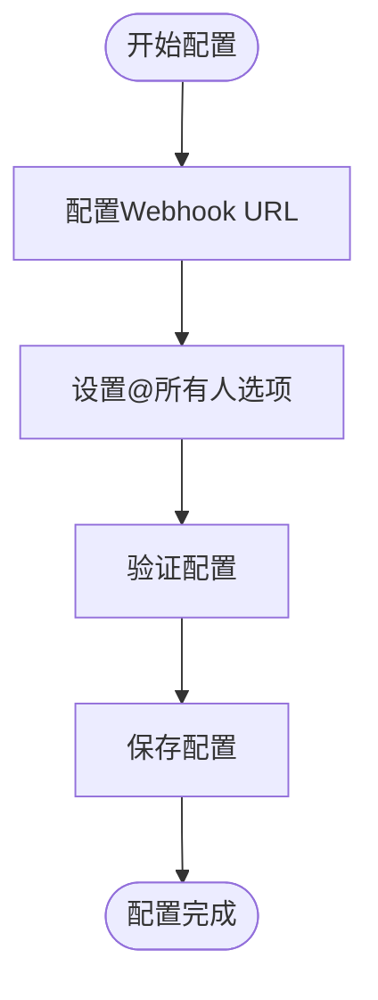
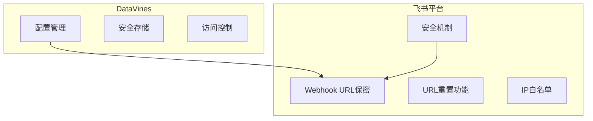
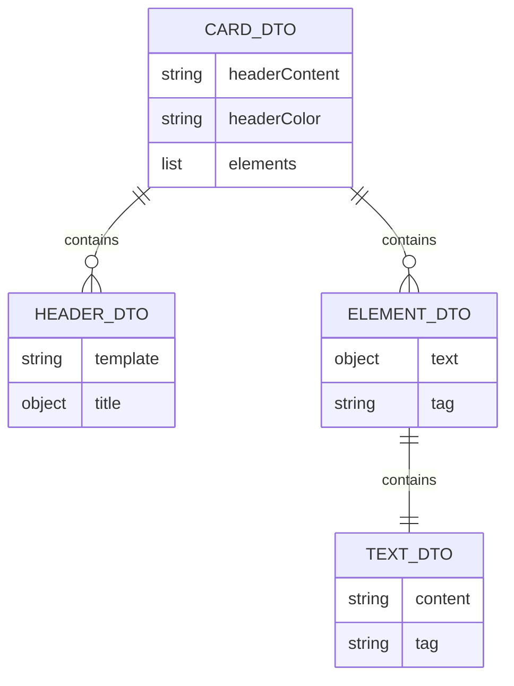
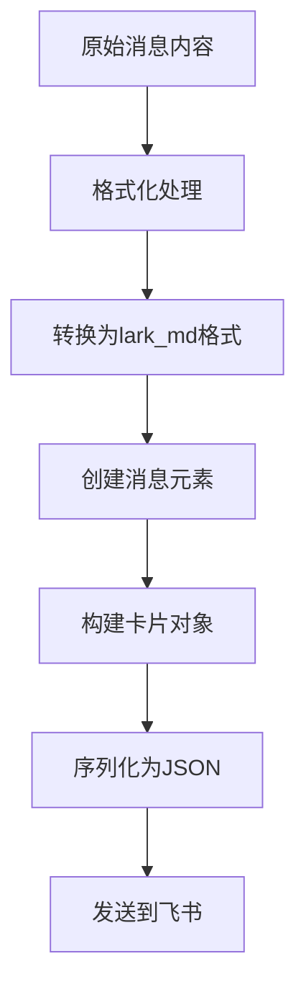
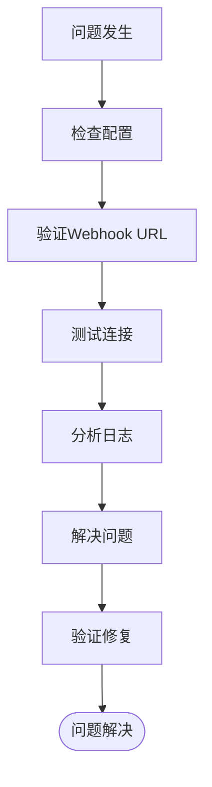
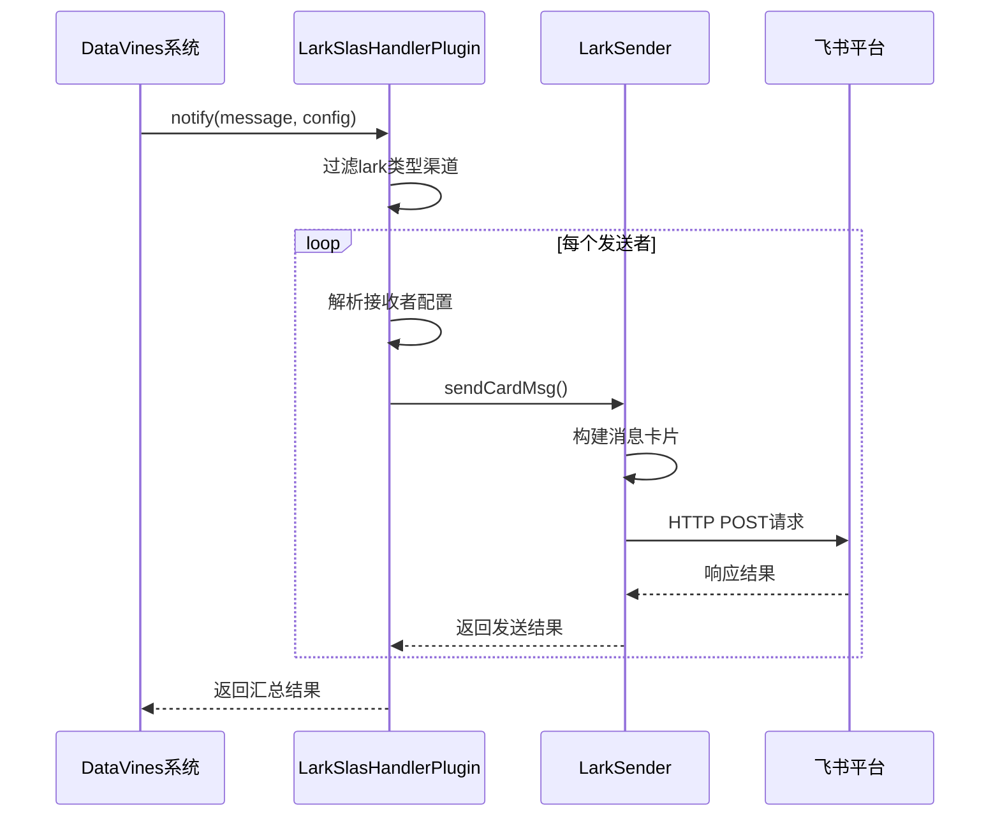
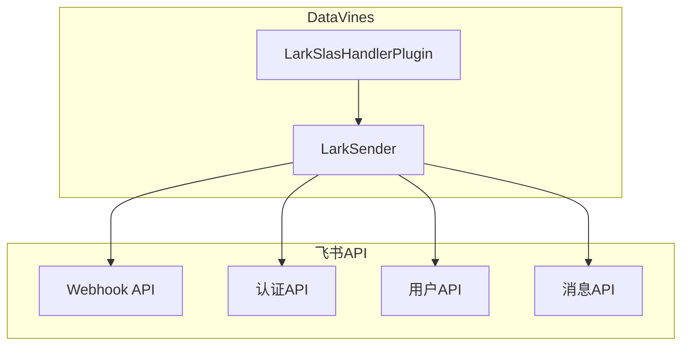

# 飞书配置

<cite>
**本文档中引用的文件**   
- [LarkSlasHandlerPlugin.java](file://datavines-notification\datavines-notification-plugins\datavines-notification-plugin-lark\src\main\java\io\datavines\notification\plugin\lark\LarkSlasHandlerPlugin.java)
- [LarkSender.java](file://datavines-notification\datavines-notification-plugins\datavines-notification-plugin-lark\src\main\java\io\datavines\notification\plugin\lark\LarkSender.java)
- [ReceiverConfig.java](file://datavines-notification\datavines-notification-plugins\datavines-notification-plugin-lark\src\main\java\io\datavines\notification\plugin\lark\entity\ReceiverConfig.java)
- [LarkConstants.java](file://datavines-notification\datavines-notification-plugins\datavines-notification-plugin-lark\src\main\java\io\datavines\notification\plugin\lark\LarkConstants.java)
- [CardDTO.java](file://datavines-notification\datavines-notification-plugins\datavines-notification-plugin-lark\src\main\java\io\datavines\notification\plugin\lark\entity\CardDTO.java)
- [GroupCardDTO.java](file://datavines-notification\datavines-notification-plugins\datavines-notification-plugin-lark\src\main\java\io\datavines\notification\plugin\lark\entity\GroupCardDTO.java)
- [MessageDTO.java](file://datavines-notification\datavines-notification-plugins\datavines-notification-plugin-lark\src\main\java\io\datavines\notification\plugin\lark\entity\MessageDTO.java)
- [NotificationManager.java](file://datavines-notification\datavines-notification-core\src\main\java\io\datavines\notification\core\NotificationManager.java)
</cite>

## 目录
1. [引言](#引言)
2. [飞书通知渠道配置](#飞书通知渠道配置)
3. [安全验证机制](#安全验证机制)
4. [消息卡片模板定制](#消息卡片模板定制)
5. [富文本消息格式支持](#富文本消息格式支持)
6. [测试流程和故障排查](#测试流程和故障排查)
7. [LarkSlasHandlerPlugin实现细节](#larkslashandlerplugin实现细节)
8. [高级消息交互功能](#高级消息交互功能)

## 引言
DataVines支持通过飞书机器人发送数据质量告警通知。本文档详细说明如何配置飞书通知渠道，包括Webhook URL配置、安全验证、消息模板定制和高级交互功能。飞书通知通过LarkSlasHandlerPlugin实现，利用飞书开放平台API发送交互式消息卡片。

## 飞书通知渠道配置
在DataVines中配置飞书通知渠道需要设置飞书机器人Webhook URL和相关参数。配置主要通过LarkSlasHandlerPlugin类实现，该插件定义了飞书通知所需的配置参数。

飞书通知配置包含以下关键参数：
- **webhook**: 飞书群机器人的Webhook URL，用于发送消息
- **atAll**: 布尔值，指示是否@所有人

配置过程通过getConfigJson方法定义表单参数，用户在DataVines UI中填写这些参数来完成配置。

**节来源**
- [LarkSlasHandlerPlugin.java](file://datavines-notification\datavines-notification-plugins\datavines-notification-plugin-lark\src\main\java\io\datavines\notification\plugin\lark\LarkSlasHandlerPlugin.java#L100-L131)

## 安全验证机制
DataVines的飞书通知实现中，安全验证主要依赖于飞书机器人Webhook URL的保密性。Webhook URL是飞书机器人与外部系统通信的唯一凭证，必须妥善保管。

飞书平台本身提供了以下安全机制：
1. Webhook URL包含唯一标识符，难以猜测
2. 可以在飞书管理后台随时重置Webhook URL
3. 支持IP白名单限制访问来源

在DataVines中，Webhook URL作为敏感信息存储，建议通过安全的配置管理方式维护。

**节来源**
- [ReceiverConfig.java](file://datavines-notification\datavines-notification-plugins\datavines-notification-plugin-lark\src\main\java\io\datavines\notification\plugin\lark\entity\ReceiverConfig.java#L26-L37)

## 消息卡片模板定制
DataVines使用飞书交互式卡片（Interactive Card）格式发送通知，提供了高度可定制的消息模板。消息卡片由CardDTO基类和GroupCardDTO子类实现。

消息卡片结构包括：
- **Header**: 卡片头部，包含标题和颜色
- **Elements**: 卡片元素列表，包含消息内容

默认消息模板包含以下字段：
- **摘要**: 告警主题
- **详情**: 告警详细信息
- **请留意**: 当@所有人时显示的提示

可以通过修改LarkSender类中的常量来自定义模板：

**节来源**
- [CardDTO.java](file://datavines-notification\datavines-notification-plugins\datavines-notification-plugin-lark\src\main\java\io\datavines\notification\plugin\lark\entity\CardDTO.java#L25-L49)
- [GroupCardDTO.java](file://datavines-notification\datavines-notification-plugins\datavines-notification-plugin-lark\src\main\java\io\datavines\notification\plugin\lark\entity\GroupCardDTO.java#L24-L36)

## 富文本消息格式支持
DataVines的飞书通知支持富文本格式，通过飞书的lark_md标签实现。消息内容使用Markdown语法，支持以下格式：

- **粗体**: 使用**文本**表示
- 换行: 使用\n表示
- @提及: 使用<at id=userId></at>语法

在LarkSender的sendCardMsg方法中，消息被格式化为包含多个MessageDTO对象的列表，每个对象代表卡片中的一个消息块。系统预定义了多种消息构建器：

- **routineBuilder**: 普通消息构建器
- **atAllBuilder**: @所有人消息构建器
- **atListBuilder**: @指定用户列表构建器

消息通过ContentUtil.createParamMap方法转换为飞书API所需的参数格式，其中包含消息类型和卡片内容。

**节来源**
- [LarkSender.java](file://datavines-notification\datavines-notification-plugins\datavines-notification-plugin-lark\src\main\java\io\datavines\notification\plugin\lark\LarkSender.java#L50-L84)
- [MessageDTO.java](file://datavines-notification\datavines-notification-plugins\datavines-notification-plugin-lark\src\main\java\io\datavines\notification\plugin\lark\entity\MessageDTO.java#L40-L56)

## 测试流程和故障排查
### 测试流程
1. 在飞书创建群机器人并获取Webhook URL
2. 在DataVines中配置飞书通知渠道
3. 触发数据质量检查规则
4. 验证飞书群组中是否收到告警消息

### 故障排查
常见问题及解决方案：

| 问题现象 | 可能原因 | 解决方案 |
|---------|---------|---------|
| 无法发送消息 | Webhook URL错误 | 验证Webhook URL是否正确 |
| 消息格式异常 | JSON序列化错误 | 检查CardDTO对象结构 |
| 部分接收者未收到 | 网络请求失败 | 检查网络连接和防火墙设置 |
| @所有人无效 | atAll参数未设置 | 确认atAll配置为true |

日志排查要点：
- 检查LarkSender中的错误日志
- 验证HttpUtils.post请求的返回结果
- 确认ReceiverConfig配置的完整性

**节来源**
- [LarkSender.java](file://datavines-notification\datavines-notification-plugins\datavines-notification-plugin-lark\src\main\java\io\datavines\notification\plugin\lark\LarkSender.java#L58-L78)
- [NotificationManager.java](file://datavines-notification\datavines-notification-core\src\main\java\io\datavines\notification\core\NotificationManager.java#L45-L68)

## LarkSlasHandlerPlugin实现细节
LarkSlasHandlerPlugin是飞书通知的核心实现类，实现了SlasHandlerPlugin接口。该插件负责处理飞书通知的配置和发送逻辑。

主要方法包括：
- **notify**: 发送通知的核心方法，处理SlaNotificationMessage并发送到配置的接收者
- **getConfigJson**: 返回飞书通知渠道的配置表单定义
- **getConfigSenderJson**: 返回发送者配置（当前为空）

notify方法的执行流程：
1. 过滤出类型为"lark"的通知渠道
2. 遍历每个飞书发送者配置
3. 解析接收者配置为ReceiverConfig对象
4. 调用LarkSender发送卡片消息
5. 收集发送结果并返回

插件通过Java SPI机制注册，在META-INF/plugins/io.datavines.notification.api.spi.SlasHandlerPlugin文件中声明。

**节来源**
- [LarkSlasHandlerPlugin.java](file://datavines-notification\datavines-notification-plugins\datavines-notification-plugin-lark\src\main\java\io\datavines\notification\plugin\lark\LarkSlasHandlerPlugin.java#L39-L75)

## 高级消息交互功能
DataVines通过飞书开放平台API实现了高级消息交互功能，主要基于交互式卡片（Interactive Card）实现。虽然当前实现主要侧重于消息发送，但飞书API支持以下高级功能：

### 潜在的高级功能扩展
1. **按钮交互**: 在卡片中添加操作按钮，如"确认已处理"、"查看详情"等
2. **多级菜单**: 提供更复杂的消息交互界面
3. **消息更新**: 更新已发送的消息内容
4. **用户身份验证**: 通过open_id识别用户身份

### API调用机制
系统通过以下API端点与飞书平台交互：
- **/bot/v2/hook/%s**: 发送群机器人消息
- **/auth/v3/tenant_access_token/internal**: 获取租户访问令牌
- **/contact/v3/users/batch_get_id**: 批量获取用户open_id
- **/im/v1/messages**: 发送单聊消息

当前实现使用Webhook方式发送消息，未来可扩展为使用访问令牌的API调用方式，以支持更丰富的交互功能。

**节来源**
- [LarkConstants.java](file://datavines-notification\datavines-notification-plugins\datavines-notification-plugin-lark\src\main\java\io\datavines\notification\plugin\lark\LarkConstants.java#L26-L35)
- [LarkSender.java](file://datavines-notification\datavines-notification-plugins\datavines-notification-plugin-lark\src\main\java\io\datavines\notification\plugin\lark\LarkSender.java#L66-L67)