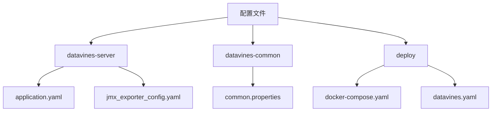
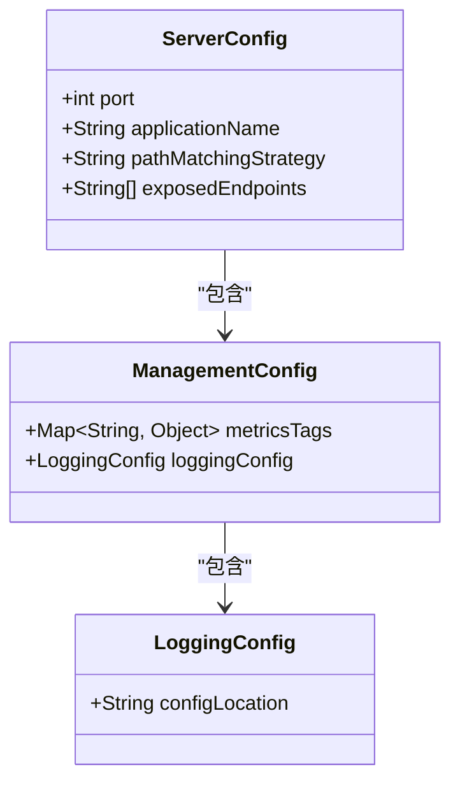
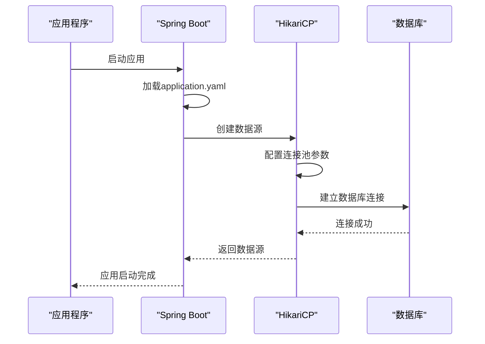
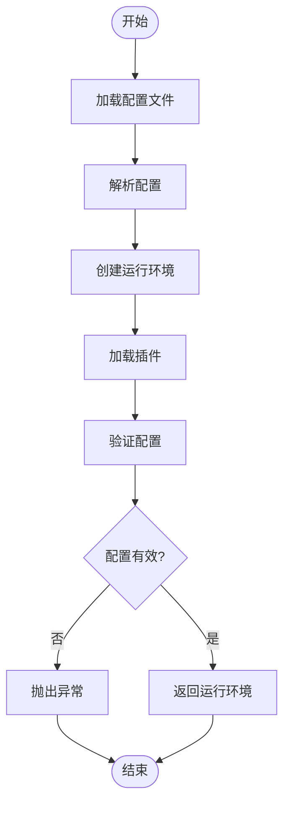
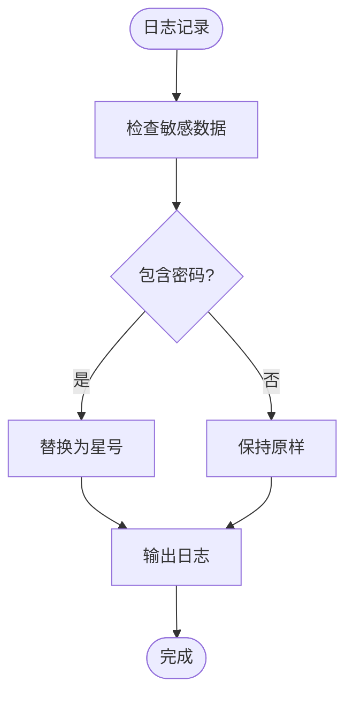
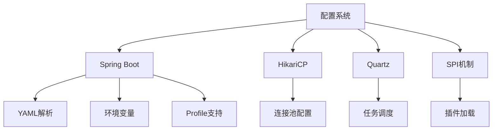

# 配置说明

<cite>
**本文档引用的文件**
- [application.yaml](file://datavines-server/src/main/resources/application.yaml)
- [common.properties](file://datavines-common/src/main/resources/common.properties)
- [docker-compose.yaml](file://deploy/compose/docker-compose.yaml)
- [datavines.yaml](file://deploy/k8s/datavines.yaml)
- [jmx_exporter_config.yaml](file://datavines-server/src/main/resources/jmx/jmx_exporter_config.yaml)
- [Config.java](file://datavines-common/src/main/java/io/datavines/common/config/Config.java)
- [DataVinesJobConfig.java](file://datavines-common/src/main/java/io/datavines/common/config/DataVinesJobConfig.java)
- [EnvConfig.java](file://datavines-common/src/main/java/io/datavines/common/config/EnvConfig.java)
- [CoreConfig.java](file://datavines-common/src/main/java/io/datavines/common/config/CoreConfig.java)
- [Configurations.java](file://datavines-common/src/main/java/io/datavines/common/config/Configurations.java)
- [SensitiveDataConverter.java](file://datavines-common/src/main/java/io/datavines/common/log/SensitiveDataConverter.java)
- [SensitiveLogUtils.java](file://datavines-common/src/main/java/io/datavines/common/utils/SensitiveLogUtils.java)
- [ConfigParser.java](file://datavines-engine/datavines-engine-core/src/main/java/io/datavines/engine/core/config/ConfigParser.java)
- [PluginLoader.java](file://datavines-spi/src/main/java/io/datavines/spi/PluginLoader.java)
</cite>

## 目录
1. [简介](#简介)
2. [项目结构](#项目结构)
3. [核心配置](#核心配置)
4. [架构概述](#架构概述)
5. [详细组件分析](#详细组件分析)
6. [依赖分析](#依赖分析)
7. [性能考虑](#性能考虑)
8. [故障排除指南](#故障排除指南)
9. [结论](#结论)
10. [附录](#附录)（如有必要）

## 简介
DataVines是一个数据质量监控和验证平台，提供全面的配置选项来满足不同环境和需求。本配置说明文档旨在全面介绍DataVines的所有配置选项，按模块组织包括服务器配置、数据库配置、执行引擎配置、通知配置等。文档将为每个配置项提供详细的说明，包括其作用、可选值、默认值和影响范围，解释配置文件的加载顺序和优先级规则，提供配置的最佳实践和常见配置模式，包含敏感信息（如密码）的安全存储建议，并为高级用户提供性能相关配置的调优指导。

## 项目结构
DataVines项目的配置文件分布在多个模块中，主要配置文件位于`datavines-server`模块的`src/main/resources`目录下。核心配置包括`application.yaml`（主配置文件）、`common.properties`（通用配置）和`jmx/jmx_exporter_config.yaml`（JMX监控配置）。部署相关的配置文件位于`deploy`目录下，包括`compose/docker-compose.yaml`（Docker部署配置）和`k8s/datavines.yaml`（Kubernetes部署配置）。配置相关的代码主要位于`datavines-common`模块的`config`包中。

**图源**
- [application.yaml](file://datavines-server/src/main/resources/application.yaml)
- [common.properties](file://datavines-common/src/main/resources/common.properties)
- [docker-compose.yaml](file://deploy/compose/docker-compose.yaml)
- [datavines.yaml](file://deploy/k8s/datavines.yaml)
- [jmx_exporter_config.yaml](file://datavines-server/src/main/resources/jmx/jmx_exporter_config.yaml)

**章节来源**
- [application.yaml](file://datavines-server/src/main/resources/application.yaml)
- [common.properties](file://datavines-common/src/main/resources/common.properties)
- [docker-compose.yaml](file://deploy/compose/docker-compose.yaml)
- [datavines.yaml](file://deploy/k8s/datavines.yaml)

## 核心配置
DataVines的核心配置主要分为服务器配置、数据库配置、执行引擎配置和通知配置等模块。`application.yaml`文件是主要的配置文件，使用Spring Boot的配置机制，支持多环境配置（如通过`---`分隔符定义的MySQL配置）。`common.properties`文件包含注册中心等通用配置。配置系统通过`Config`类和`Configurations`类提供统一的配置访问接口，支持字符串、整数、布尔值、浮点数和长整型等多种数据类型的获取。

**章节来源**
- [Config.java](file://datavines-common/src/main/java/io/datavines/common/config/Config.java)
- [Configurations.java](file://datavines-common/src/main/java/io/datavines/common/config/Configurations.java)
- [application.yaml](file://datavines-server/src/main/resources/application.yaml)
- [common.properties](file://datavines-common/src/main/resources/common.properties)

## 架构概述
DataVines的配置架构采用分层设计，从外部部署配置到内部代码配置形成完整的配置体系。外部部署通过Docker Compose或Kubernetes配置环境变量，这些变量可以覆盖`application.yaml`中的配置。`application.yaml`作为主配置文件，定义了服务器、数据库、Quartz调度等核心组件的配置。`common.properties`提供注册中心等跨模块的通用配置。代码层面，`Config`和`Configurations`类提供了统一的配置访问接口，而`PluginLoader`机制支持插件化配置的动态加载。

```mermaid
graph TD
A[外部部署配置] --> B[Docker/K8s环境变量]
B --> C[application.yaml]
C --> D[common.properties]
D --> E[代码配置]
E --> F[Config类]
E --> G[Configurations类]
E --> H[PluginLoader]
F --> I[配置访问接口]
G --> I
H --> J[插件配置]
```

**图源**
- [application.yaml](file://datavines-server/src/main/resources/application.yaml)
- [common.properties](file://datavines-common/src/main/resources/common.properties)
- [docker-compose.yaml](file://deploy/compose/docker-compose.yaml)
- [datavines.yaml](file://deploy/k8s/datavines.yaml)
- [Config.java](file://datavines-common/src/main/java/io/datavines/common/config/Config.java)
- [Configurations.java](file://datavines-common/src/main/java/io/datavines/common/config/Configurations.java)
- [PluginLoader.java](file://datavines-spi/src/main/java/io/datavines/spi/PluginLoader.java)

## 详细组件分析
### 服务器配置分析
服务器配置主要在`application.yaml`文件中定义，包括端口、应用名称、MVC路径匹配策略等。服务器端口通过`server.port`配置，默认值为5600。应用名称通过`spring.application.name`配置，用于服务注册和监控。MVC路径匹配策略通过`spring.mvc.pathmatch.matching-strategy`配置，使用`ant_path_matcher`策略。管理端点通过`management.endpoints.web.exposure.include`配置，暴露所有端点以便监控。

#### 服务器配置类图

**图源**
- [application.yaml](file://datavines-server/src/main/resources/application.yaml)

**章节来源**
- [application.yaml](file://datavines-server/src/main/resources/application.yaml)

### 数据库配置分析
数据库配置是DataVines的核心配置之一，支持多种数据库类型。主配置文件`application.yaml`中定义了数据源的驱动类名、URL、用户名和密码，以及Hikari连接池的详细配置。通过Spring Profiles支持多环境配置，如PostgreSQL和MySQL的切换。Quartz调度器的数据库配置也在此定义，支持JDBC存储类型和集群模式。

#### 数据库配置序列图

**图源**
- [application.yaml](file://datavines-server/src/main/resources/application.yaml)

**章节来源**
- [application.yaml](file://datavines-server/src/main/resources/application.yaml)

### 执行引擎配置分析
执行引擎配置通过`EnvConfig`类和`DataVinesJobConfig`类实现，支持批处理和流处理模式。`EnvConfig`定义了执行引擎的类型和具体配置，而`DataVinesJobConfig`则包含了作业的名称、环境配置、数据源、转换和接收器等完整配置。配置解析通过`ConfigParser`类完成，使用`PluginLoader`机制动态加载执行环境。

#### 执行引擎配置流程图

**图源**
- [DataVinesJobConfig.java](file://datavines-common/src/main/java/io/datavines/common/config/DataVinesJobConfig.java)
- [EnvConfig.java](file://datavines-common/src/main/java/io/datavines/common/config/EnvConfig.java)
- [ConfigParser.java](file://datavines-engine/datavines-engine-core/src/main/java/io/datavines/engine/core/config/ConfigParser.java)
- [PluginLoader.java](file://datavines-spi/src/main/java/io/datavines/spi/PluginLoader.java)

**章节来源**
- [DataVinesJobConfig.java](file://datavines-common/src/main/java/io/datavines/common/config/DataVinesJobConfig.java)
- [EnvConfig.java](file://datavines-common/src/main/java/io/datavines/common/config/EnvConfig.java)
- [ConfigParser.java](file://datavines-engine/datavines-engine-core/src/main/java/io/datavines/engine/core/config/ConfigParser.java)

### 通知配置分析
通知配置通过插件化机制实现，支持多种通知渠道如钉钉、邮件、飞书和企业微信。配置主要在`datavines-notification-plugins`模块中定义，通过SPI机制动态加载。通知配置的加载和管理由`NotificationManager`类负责，确保通知服务的可扩展性和灵活性。

**章节来源**
- [datavines-notification-plugins](file://datavines-notification/datavines-notification-plugins)

### 敏感信息安全管理
DataVines对敏感信息如数据库密码提供了专门的安全管理机制。`SensitiveDataConverter`类和`SensitiveLogUtils`类负责在日志输出时对敏感数据进行脱敏处理，使用正则表达式匹配密码字段并将其替换为星号。这种机制确保了敏感信息不会在日志中明文显示，提高了系统的安全性。

#### 敏感信息处理流程图

**图源**
- [SensitiveDataConverter.java](file://datavines-common/src/main/java/io/datavines/common/log/SensitiveDataConverter.java)
- [SensitiveLogUtils.java](file://datavines-common/src/main/java/io/datavines/common/utils/SensitiveLogUtils.java)

**章节来源**
- [SensitiveDataConverter.java](file://datavines-common/src/main/java/io/datavines/common/log/SensitiveDataConverter.java)
- [SensitiveLogUtils.java](file://datavines-common/src/main/java/io/datavines/common/utils/SensitiveLogUtils.java)

## 依赖分析
DataVines的配置系统依赖于多个核心组件和外部库。Spring Boot框架提供了基础的配置管理能力，包括YAML配置文件解析、环境变量支持和Profile机制。HikariCP作为高性能的数据库连接池，其配置参数直接影响数据库性能。Quartz调度器的配置依赖于数据库存储，支持集群模式下的任务调度。SPI机制（`PluginLoader`）实现了插件化配置的动态加载，提高了系统的可扩展性。

**图源**
- [application.yaml](file://datavines-server/src/main/resources/application.yaml)
- [PluginLoader.java](file://datavines-spi/src/main/java/io/datavines/spi/PluginLoader.java)

**章节来源**
- [application.yaml](file://datavines-server/src/main/resources/application.yaml)
- [PluginLoader.java](file://datavines-spi/src/main/java/io/datavines/spi/PluginLoader.java)

## 性能考虑
在配置方面，DataVines提供了多个性能相关的配置选项。数据库连接池的配置（如`maximum-pool-size`、`minimum-idle`）直接影响数据库访问性能。Quartz调度器的线程池大小（`org.quartz.threadPool.threadCount`）影响任务调度的并发能力。日志配置中的`log.cache.row.num`和`log.flush.interval`参数影响日志输出性能。对于高级用户，建议根据实际负载调整这些参数以优化系统性能。

**章节来源**
- [application.yaml](file://datavines-server/src/main/resources/application.yaml)
- [CoreConfig.java](file://datavines-common/src/main/java/io/datavines/common/config/CoreConfig.java)

## 故障排除指南
配置相关的问题通常表现为应用启动失败、数据库连接异常或任务执行错误。检查`application.yaml`文件的语法是否正确，特别是缩进和冒号的使用。验证数据库连接参数是否正确，包括URL、用户名和密码。确认Spring Profile是否正确激活，特别是在使用Docker或Kubernetes部署时。查看日志文件中的错误信息，通常会提供具体的配置错误原因。

**章节来源**
- [application.yaml](file://datavines-server/src/main/resources/application.yaml)
- [ConfigParser.java](file://datavines-engine/datavines-engine-core/src/main/java/io/datavines/engine/core/config/ConfigParser.java)

## 结论
DataVines提供了一套完整且灵活的配置系统，支持从服务器设置到执行引擎的全面配置。通过分层的配置架构和插件化机制，系统能够适应不同的部署环境和业务需求。合理的配置不仅能够确保系统稳定运行，还能优化性能和安全性。用户应根据具体需求仔细配置各项参数，并遵循最佳实践来管理配置文件。

## 附录
### 配置项参考表
| 配置项 | 作用 | 可选值 | 默认值 | 影响范围 |
|-------|------|-------|-------|--------|
| server.port | 服务器端口 | 1-65535 | 5600 | 服务器 |
| spring.datasource.url | 数据库连接URL | JDBC URL | jdbc:postgresql://127.0.0.1:5432/datavines | 数据库 |
| spring.datasource.maximum-pool-size | 连接池最大大小 | 正整数 | 50 | 数据库性能 |
| org.quartz.threadPool.threadCount | 调度器线程数 | 正整数 | 25 | 任务调度性能 |
| log.cache.row.num | 日志缓存行数 | 正整数 | 64 | 日志性能 |

**章节来源**
- [application.yaml](file://datavines-server/src/main/resources/application.yaml)
- [CoreConfig.java](file://datavines-common/src/main/java/io/datavines/common/config/CoreConfig.java)