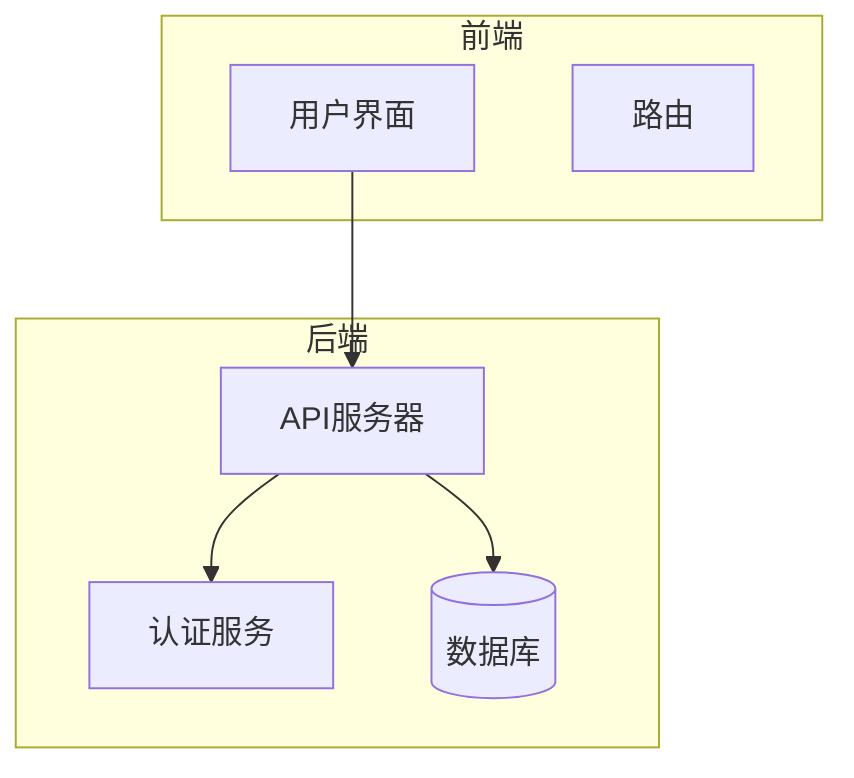
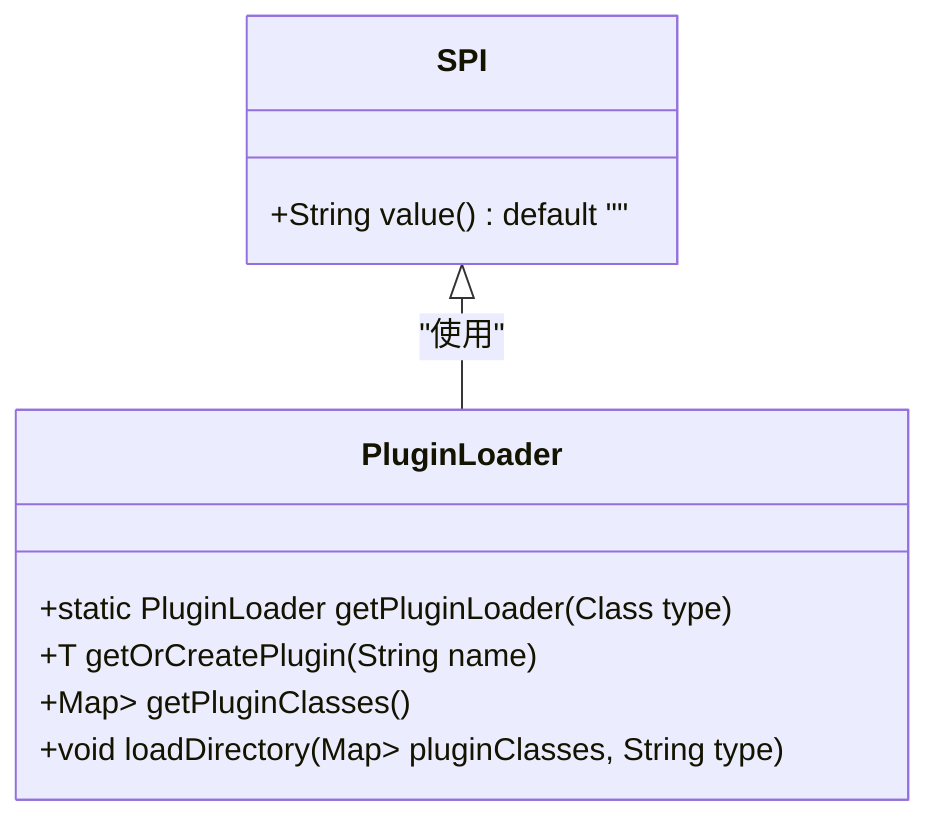

# 项目概述

<cite>
**本文档中引用的文件**  
- [README.md](file://README.md)
- [pom.xml](file://pom.xml)
- [DataVinesServer.java](file://datavines-server/src/main/java/io/datavines/server/DataVinesServer.java)
- [CommonConstants.java](file://datavines-common/src/main/java/io/datavines/common/CommonConstants.java)
- [SPI.java](file://datavines-spi/src/main/java/io/datavines/spi/SPI.java)
- [PluginLoader.java](file://datavines-spi/src/main/java/io/datavines/spi/PluginLoader.java)
- [datavines-mysql.sql](file://scripts/sql/datavines-mysql.sql)
- [MetricDimension.java](file://datavines-metric/datavines-metric-api/src/main/java/io/datavines/metric/api/MetricDimension.java)
- [MetricValidator.java](file://datavines-metric/datavines-metric-api/src/main/java/io/datavines/metric/api/MetricValidator.java)
</cite>

## 目录
1. [引言](#引言)
2. [项目背景与设计目标](#项目背景与设计目标)
3. [核心功能特性](#核心功能特性)
4. [系统架构设计](#系统架构设计)
5. [技术栈与组件](#技术栈与组件)
6. [微内核与SPI插件机制](#微内核与spi插件机制)
7. [与其他数据质量管理工具的对比](#与其他数据质量管理工具的对比)
8. [适用场景](#适用场景)
9. [结论](#结论)

## 引言

DataVines是一个易于使用的数据质量服务平台，旨在确保数据在集成和处理过程中的准确性，是DataOps的核心组件。该平台支持多种度量标准，提供全面的数据质量管理解决方案，包括数据目录、数据质量检查、数据画像等功能。通过插件化设计和灵活的执行模式，DataVines能够适应各种复杂的数据环境，为用户提供高效、可靠的数据质量保障。

**Section sources**
- [README.md](file://README.md#L24-L25)

## 项目背景与设计目标

随着大数据技术的发展，数据质量成为企业数字化转型中的关键问题。低质量的数据可能导致决策失误、业务损失和客户信任度下降。传统的数据质量管理工具往往功能单一、扩展性差，难以满足现代企业对数据质量的高要求。DataVines应运而生，旨在解决这些问题，提供一个全面、灵活、易用的数据质量服务平台。

DataVines的设计目标包括：
- **易用性**：提供直观的Web界面，用户可以轻松配置和管理数据质量检查任务。
- **灵活性**：支持多种数据源和执行引擎，用户可以根据需求选择合适的配置。
- **可扩展性**：采用微内核架构和SPI插件机制，方便用户自定义扩展功能。
- **高可用性**：支持水平扩展和自动故障转移，确保系统的稳定性和可靠性。
- **高性能**：优化数据处理流程，提高数据质量检查的效率。

**Section sources**
- [README.md](file://README.md#L24-L25)

## 核心功能特性

### 数据目录

DataVines的数据目录功能定期获取数据源的元数据，构建数据目录，并监控元数据的变化。用户可以通过标签管理功能对元数据进行分类和标注，便于数据的查找和管理。

- **定期获取数据源元数据**，构建数据目录
- **定期监控元数据变化**
- **支持标签管理**，便于元数据的分类和标注

**Section sources**
- [README.md](file://README.md#L37-L42)

### 数据质量

DataVines内置了27种数据质量检查规则，支持4种数据质量检查规则类型，包括单表列检查、单表自定义SQL检查、跨表准确性检查和两表值比较检查。用户可以设置定时任务进行数据质量检查，并通过SLA（服务水平协议）对检查结果进行告警。

- **内置27种数据质量检查规则**
- **支持4种数据质量检查规则类型**
  - 单表列检查
  - 单表自定义SQL检查
  - 跨表准确性检查
  - 两表值比较检查
- **支持定时任务**，定期执行数据质量检查
- **支持SLA**，对检查结果进行告警

**Section sources**
- [README.md](file://README.md#L47-L54)

### 数据画像

DataVines支持定时执行数据检测，生成数据画像报告。平台能够自动识别列类型，匹配相应的数据画像指标，支持表行数趋势监控和数据分布视图。

- **支持定时执行数据检测**，生成数据画像报告
- **支持自动识别列类型**，匹配相应的数据画像指标
- **支持表行数趋势监控**
- **支持数据分布视图**

**Section sources**
- [README.md](file://README.md#L58-L63)

### 插件设计

DataVines基于插件化设计，多个模块支持用户自定义插件扩展，包括数据源、检查规则、作业执行引擎、告警通道、错误数据存储和注册中心。

- **数据源**：已支持MySQL、Impala、StarRocks、Doris、Presto、Trino、ClickHouse、PostgreSQL等
- **检查规则**：内置27种检查规则，如空值检查、非空检查、枚举检查等
- **作业执行引擎**：支持Spark和Local两种执行引擎，Spark引擎目前仅支持Spark 2.4版本，Local引擎基于JDBC开发，无需依赖其他执行引擎
- **告警通道**：支持Email
- **错误数据存储**：支持MySQL和本地文件（仅Local执行引擎支持）
- **注册中心**：支持MySQL、PostgreSQL和ZooKeeper

**Section sources**
- [README.md](file://README.md#L67-L76)

### 多种执行模式

DataVines提供Web页面配置检查任务，运行任务，查看任务执行日志、错误数据和检查结果。同时支持在线生成任务运行脚本，通过`datavines-submit.sh`提交任务，可与调度系统结合使用。

- **提供Web页面**，配置和管理检查任务
- **支持在线生成任务运行脚本**，通过`datavines-submit.sh`提交任务
- **可与调度系统结合使用**

**Section sources**
- [README.md](file://README.md#L78-L82)

### 易于部署与高可用

DataVines依赖较少，易于部署。最小化部署仅需依赖MySQL即可启动项目，完成数据质量检查操作。支持水平扩展和自动故障转移，确保任务不丢失或重复。

- **依赖较少**，易于部署
- **最小化部署仅需依赖MySQL**
- **支持水平扩展**，自动故障转移
- **去中心化设计**，Server节点支持水平扩展以提高性能
- **任务自动故障转移**，确保任务不丢失或重复

**Section sources**
- [README.md](file://README.md#L85-L91)

## 系统架构设计

DataVines的系统架构设计遵循微内核原则，核心组件包括数据目录、数据质量检查、数据画像、插件管理、任务调度和注册中心。各组件通过插件化设计实现高度解耦，支持灵活扩展。

**Diagram sources**
- [README.md](file://README.md#L27)
- [DataVinesServer.java](file://datavines-server/src/main/java/io/datavines/server/DataVinesServer.java#L48-L50)

## 技术栈与组件

### 后端技术栈

DataVines后端采用Spring Boot框架，结合MyBatis-Plus进行数据库操作，使用Swagger生成API文档。核心组件包括数据目录、数据质量检查、数据画像、插件管理、任务调度和注册中心。

- **Spring Boot**：提供快速开发和部署能力
- **MyBatis-Plus**：简化数据库操作
- **Swagger**：生成API文档
- **HikariCP**：高性能数据库连接池
- **Quartz**：任务调度
- **Druid**：数据库监控

**Section sources**
- [pom.xml](file://pom.xml#L87-L88)
- [DataVinesServer.java](file://datavines-server/src/main/java/io/datavines/server/DataVinesServer.java#L48-L50)

### 前端技术栈

DataVines前端采用React框架，结合Ant Design UI库，提供丰富的用户界面组件。使用Redux进行状态管理，Axios进行HTTP请求，Webpack进行构建。

- **React**：构建用户界面
- **Ant Design**：提供丰富的UI组件
- **Redux**：状态管理
- **Axios**：HTTP请求
- **Webpack**：构建工具

**Section sources**
- [package.json](file://datavines-ui/package.json)
- [webpack.common.js](file://datavines-ui/build/webpack.common.js#L130-L137)

### 计算引擎支持

DataVines支持多种计算引擎，包括Spark和Flink。用户可以根据需求选择合适的计算引擎，提高数据处理的效率。

- **Spark**：支持Spark 2.4版本
- **Flink**：支持Flink引擎

**Section sources**
- [README.md](file://README.md#L73-L74)

## 微内核与SPI插件机制

### 微内核架构

DataVines采用微内核架构，核心组件负责基本功能，扩展功能通过插件实现。这种设计使得系统更加灵活，易于维护和扩展。

- **核心组件**：负责基本功能，如数据目录、数据质量检查、数据画像等
- **插件组件**：负责扩展功能，如数据源、检查规则、作业执行引擎等

**Section sources**
- [README.md](file://README.md#L67-L76)

### SPI插件机制

DataVines使用SPI（Service Provider Interface）插件机制，通过`@SPI`注解定义插件接口，`PluginLoader`类负责加载和管理插件实例。插件配置文件位于`META-INF/plugins`目录下，按接口全名命名。

**Diagram sources**
- [SPI.java](file://datavines-spi/src/main/java/io/datavines/spi/SPI.java#L28-L31)
- [PluginLoader.java](file://datavines-spi/src/main/java/io/datavines/spi/PluginLoader.java#L75-L407)

### 插件加载流程

1. **定义插件接口**：使用`@SPI`注解标记接口
2. **实现插件**：实现插件接口的具体类
3. **配置插件**：在`META-INF/plugins`目录下创建配置文件，格式为`接口全名=插件实现类全名`
4. **加载插件**：通过`PluginLoader`类加载插件实例

**Section sources**
- [SPI.java](file://datavines-spi/src/main/java/io/datavines/spi/SPI.java#L28-L31)
- [PluginLoader.java](file://datavines-spi/src/main/java/io/datavines/spi/PluginLoader.java#L75-L407)

## 与其他数据质量管理工具的对比

| 特性 | DataVines | 其他工具A | 其他工具B |
| --- | --- | --- | --- |
| **易用性** | 提供直观的Web界面，易于配置和管理 | 界面复杂，学习成本高 | 界面简洁，但功能有限 |
| **灵活性** | 支持多种数据源和执行引擎，插件化设计 | 固定数据源，扩展性差 | 支持部分数据源，扩展性一般 |
| **可扩展性** | 微内核架构，SPI插件机制 | 无插件机制，难以扩展 | 插件机制简单，扩展性有限 |
| **高可用性** | 支持水平扩展和自动故障转移 | 单点故障，可靠性低 | 支持集群，但故障转移机制不完善 |
| **高性能** | 优化数据处理流程，提高检查效率 | 处理速度慢，资源消耗大 | 处理速度较快，但资源消耗较高 |

**Section sources**
- [README.md](file://README.md#L24-L91)

## 适用场景

### 企业数据治理

DataVines适用于企业数据治理，帮助企业在数据集成和处理过程中确保数据的准确性。通过数据目录、数据质量检查和数据画像功能，企业可以全面了解和管理数据资产，提高数据质量。

### 数据仓库建设

在数据仓库建设过程中，DataVines可以作为数据质量检查工具，确保数据仓库中的数据符合预期标准。通过定时任务和SLA告警，及时发现和修复数据质量问题。

### 数据湖管理

DataVines支持多种数据源，适用于数据湖管理。通过插件化设计，可以轻松集成新的数据源，确保数据湖中的数据质量。

### 实时数据处理

DataVines支持Spark和Flink等实时计算引擎，适用于实时数据处理场景。通过实时数据质量检查，确保实时数据的准确性和一致性。

**Section sources**
- [README.md](file://README.md#L24-L91)

## 结论

DataVines作为一个全面的数据质量服务平台，通过微内核架构和SPI插件机制，提供了高度的灵活性和可扩展性。其核心功能包括数据目录、数据质量检查、数据画像等，支持多种数据源和计算引擎，适用于企业数据治理、数据仓库建设、数据湖管理和实时数据处理等多种场景。通过与其他数据质量管理工具的对比，可以看出DataVines在易用性、灵活性、可扩展性、高可用性和高性能方面具有明显优势。未来，DataVines将继续优化现有功能，增加更多数据源和计算引擎的支持，为用户提供更加全面和高效的数据质量解决方案。

**Section sources**
- [README.md](file://README.md#L24-L91)
- [pom.xml](file://pom.xml#L26-L29)
- [DataVinesServer.java](file://datavines-server/src/main/java/io/datavines/server/DataVinesServer.java#L48-L50)