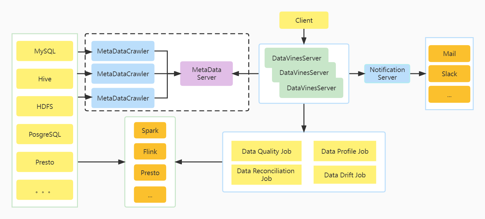

# DataVines

[](README.md)
[](README.zh-CN.md)

---

数据质量是用于保证数据在集成、处理过程中的数据准确性，也是`DataOps`的核心组成部分。`DataVines` 是一个简单易用、支持多种`Metric`检查的数据质量服务平台。

## 架构设计

## 安装

使用`Maven3.6.1`以及以上版本
```sh
$ mvn clean package -Prelease
```
## DataVines 的特性

* 简单易用
* 内置多种类型如`Metric`、`ExpectedType`、`ResultFormula`插件
    * [Metric 插件列表](docs/plugin/zh-CN/metric/index.md)
    * [ExpectedType 插件列表](docs/plugin/zh-CN/expected-value/index.md)
    * [ResultFormula 插件列表](docs/plugin/zh-CN/result-formula/index.md)
* 模块化和插件化，易于扩展
    * [Engine 插件列表](docs/plugin/zh-CN/engine/index.md)
    * [Connector 插件列表](docs/plugin/zh-CN/connector/index.md)
    * [Register 插件列表](docs/plugin/zh-CN/register/index.md)
    * [Notification 插件列表](docs/plugin/zh-CN/notification/index.md)
* 支持 `Spark 2.x`、`JDBC` 执行引擎

## 环境依赖

1. `Java` 运行环境，`Java >= 8`
2. `DataVines` 支持 `JDBC` 引擎，如果你的数据量较小或者只是想做功能验证，可以使用 `JDBC` 引擎
3. 如果您要想要基于 `Spark` 来运行 `DataVines` ，那么需要保证你的服务器具有运行 `Spark` 应用程序的条件

## 快速入门

请参考官方文档：[快速入门指南](docs/document/zh-CN/quick-start.md)

## 开发指南
请参考官方文档：[开发指南](docs/development/zh-CN/index.md)

## 如何贡献

如果你想要参与贡献, 请参考官方文档: [贡献指南](docs/community/zh-CN/index.md)

## 项目计划
[V1.0.0 RoadMap](docs/roadmap/zh-CN/roadmap-1.0.0.md)

## 欢迎联系
datavines@gmail.com

## License
`DataVines` 基于 [Apache License 2.0](LICENSE) 协议。`DataVines` 依赖了一些第三方组件，它们的开源协议也为 `Apache License 2.0` 或者兼容 `Apache License 2.0`， 此外 `DataVines` 也直接引用或者修改了 `Apache DolphinScheduler`、`SeaTunnel` 以及 `Dubbo` 中的一些代码，均为 `Apache License 2.0` 协议的，感谢这些项目的贡献。