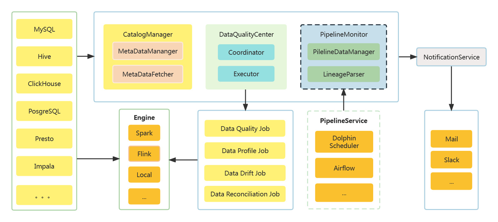

# DataVines

[](README.md)
[](README.zh-CN.md)

---

数据质量是用于保证数据在集成、处理过程中的数据准确性，也是`DataOps`的核心组成部分。DataVines 是一个简单易用、支持多种`Metric`检查的数据质量服务平台。

## 架构设计

## 安装

使用Maven3.6.1以及以上版本
```sh
$ mvn clean package -Prelease
```
## DataVines 的特性

* 简单易用
* 内置多种类型如Metric、ExpectedType、ResultFormula插件
    * [Metric 插件列表](docs/plugin/zh-CN/metric/index.md)
    * [ExpectedType 插件列表](docs/plugin/zh-CN/expected-value/index.md)
    * [ResultFormula 插件列表](docs/plugin/zh-CN/result-formula/index.md)
* 模块化和插件化，易于扩展
    * [Engine 插件列表](docs/plugin/zh-CN/engine/index.md)
    * [Connector 插件列表](docs/plugin/zh-CN/connector/index.md)
    * [Register 插件列表](docs/plugin/zh-CN/register/index.md)
    * [Notification 插件列表](docs/plugin/zh-CN/notification/index.md)
* 支持 Spark 2.x、JDBC 执行引擎

## 环境依赖

1. Java 运行环境，Java >= 8
2. DataVines 支持 JDBC 引擎，如果你的数据量较小或者只是想做功能验证，可以使用 JDBC 引擎
3. 如果您要想要基于 Spark 来运行 DataVines ，那么需要保证你的服务器具有运行 Spark 应用程序的条件

## 快速入门

请参考官方文档：[快速入门指南](docs/document/zh-CN/quick-start.md)

## 开发指南
请参考官方文档：[开发指南](docs/development/zh-CN/index.md)

## 如何贡献

## 欢迎联系
datavines@gmail.com
## License
[Apache 2.0 License.](LICENSE)