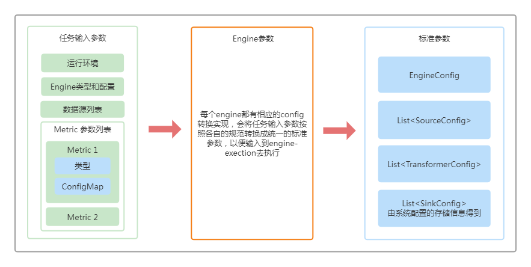

# 整体架构

DataVines 是一个数据可观测性系统，旨在帮助企业减少“数据宕机时间”，帮助企业能够在数据错误导致损失之前及时发现数据错误，它具有数据目录管理、数据质量监控和SLAs等功能。下面是它的架构设计图：

# 组件详解
## DatavinesServer
DatavinesServer是DataVines平台核心服务，采用无中心化设计，支持无限扩展。主要负责对外提供API、调度各种数据监控任务并执行。

### 主要功能
- Api 服务
- 平台数据存储
- 数据源管理
- Job调度和执行
- Metric 管理
- Issue 管理
- SLAs 管理

### 高可用设计
- DatavinesServer采用无中心化设计，支持动态增容扩展。集群中所有节点都能对外提供服务，节点之间通过竞争分布式锁获取Job来进行调度和执行

##MetaDataServer
MetaDataServer是元数据管理中心，主要负责数据目录，元数据模型、元数据存储、查询等元数据相关的功能。

## MetaDataFetcher
MetaDataFetcher 主要负责定时去抓取指定数据源的元数据信息，然后更新到元数据存储引擎中

## NotificationServer
NotificationServer主要负责告警，用户在平台上配置告警规则，一旦数据监控任务触发告警，那么NotificationServer就会将报错信息发送到指定的平台上，例如邮箱，企业微信等

# 核心设计
## 插件化设计
### Connector插件化设计
- Connector模块中定义了包括不仅限于连接参数相关、元数据信息获取相关、数据源执行脚本相关等接口，用于实现连接数据源、获取元数据信息以及执行相应脚本等功能。
- 插件化设计允许用户实现Connector模块的相应接口来实现添加自定义数据源
### Metric插件化设计
- Metric是平台中非常重要的组成部分，主要用在各种数据监控任务中，Metric的丰富性使得平台的监控和检查手段更加丰富。本平台会内置多种Metric让用户可以开箱即用，同时也支持用户实现Metric相关接口来新增用户个性化的Metric。
### Engine插件化设计
- Engine是平台核心组成部分，是定义数据监控任务在计算引擎中的执行逻辑，不同的Engine对应不同的执行引擎，例如Spark、Flink、Presto等。执行逻辑主要由Sources、Transformers和Sinks组成，由Source来执行数据源的连接和数据读取，由Transformer来执行各种聚合统计处理，由Sink来执行执行结果的输出。不同的计算引擎实现方式有所不同，但是核心的流程就是读取数据，执行统计和输出数据。插件化设计允许用户自定义Engine来增加新的计算引擎。
# 流程设计
## 任务执行流程

## 数据监控参数生成流程

