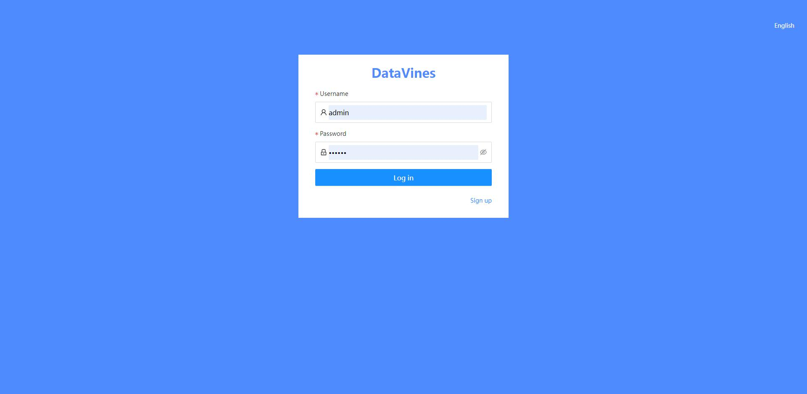

# 快速上手
## 环境准备

在安装`DataVines`之前请确保你的服务器上已经安装下面软件
- `Git`，确保 `git clone`的顺利执行
- `JDK`，确保 `jdk >= 8`
- `Maven`, 确保项目的顺利打包（当然你也可以在本地打包以后上传至服务器）

## 下载代码
```shell
git clone https://github.com/datavines-ops/datavines.git
cd datavines
```

## 数据库准备
`DataVines` 的元数据是存储在关系型数据库中，目前支持 `MySQL` 和 `PostgreSQL` ，默认使用 `PostgreSQL` ，下面以`MySQL`为例说明安装步骤：
- 创建数据库 `datavines`
- 执行 `script/sql/datavines-mysql.sql` 脚本进行数据库的初始化

> 下面的项目构建也是以`MySQL`为例


### 项目构建

打包并解压

```shell
mvn clean package -Prelease
cd datavines-dist/target
tar -zxvf datavines-1.0.0-SNAPSHOT-bin.tar.gz
```

解压完成以后进入目录
```
cd datavines-1.0.0-SNAPSHOT-bin
```
修改配置信息
```
cd conf
vi application.yaml
```
主要是修改数据库信息
```
spring:
 datasource:
   driver-class-name: com.mysql.cj.jdbc.Driver
   url: jdbc:mysql://127.0.0.1:3306/datavines?useUnicode=true&characterEncoding=UTF-8
   username: root
   password: 123456
```
如果你是使用Spark做为执行引擎，并且是提交到Yarn上面去执行的，那么需要在common.properties中配置yarn相关的信息
- standalone 模式
```
yarn.mode=standalone
yarn.application.status.address=http://%s:%s/ws/v1/cluster/apps/%s #第一个%s需要被替换成yarn的ip地址
yarn.resource.manager.http.address.port=8088
```
- ha 模式
```
yarn.mode=ha
yarn.application.status.address=http://%s:%s/ws/v1/cluster/apps/%s
yarn.resource.manager.http.address.port=8088
yarn.resource.manager.ha.ids=192.168.0.1,192.168.0.2
```

## 启动服务

```
cd bin
sh datavines-daemon.sh start mysql
```

查看日志，如果日志里面没有报错信息，并且能看到`[INFO] 2022-04-10 12:29:05.447 io.datavines.server.DataVinesServer:[61] - Started DataVinesServer in 3.97 seconds (JVM running for 4.69)`的时候，证明服务已经成功启动

### 访问前端页面
在浏览器输入：localhost:5600，就会跳转至登录界面，输入账号密码 admin/123456

